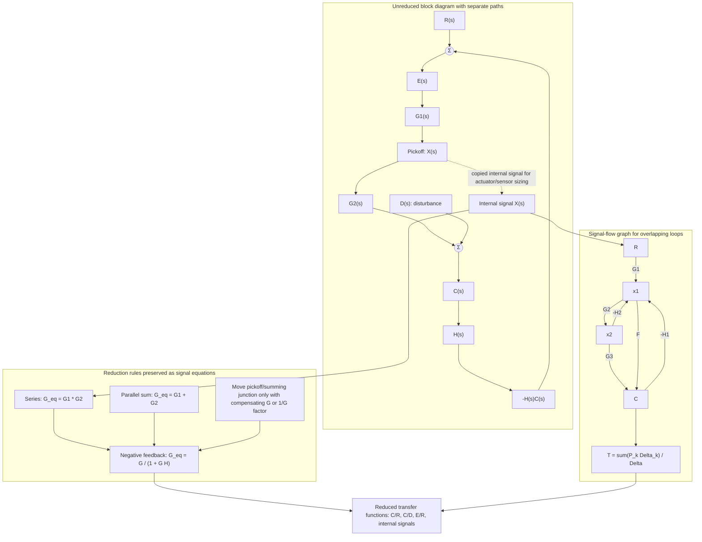

# Block Diagrams, Signal Flow, and Mason Rule

Real control systems are built from interconnected subsystems. Nise's reduction chapter shows how to collapse block diagrams and signal-flow graphs into equivalent transfer functions, so that the response and stability tools from earlier chapters can be applied. This is where modeling becomes system analysis: motors, sensors, amplifiers, loads, and feedback paths become one closed-loop expression.

The methods here are algebraic, but they are also organizational. A clean block diagram exposes where disturbances enter, where sensor dynamics sit, and which signals are internal. Signal-flow graphs provide a compact alternative when many loops interact. Mason's gain formula is especially useful when block-diagram reduction becomes visually messy.

## Definitions

A **block diagram** represents subsystem transfer functions as directed blocks connected by signals. A **summing junction** forms a signed algebraic sum. A **pickoff point** copies a signal without changing it.

For blocks in series,

$$
G_{\text{eq}}(s)=G_1(s)G_2(s).
$$

For blocks in parallel,

$$
G_{\text{eq}}(s)=G_1(s)+G_2(s)
$$

when their outputs are added.

For a single negative-feedback loop,

$$
G_{\text{eq}}(s)=\frac{G(s)}{1+G(s)H(s)}.
$$

For positive feedback, the denominator becomes $1-G(s)H(s)$.

A **signal-flow graph** has nodes representing signals and directed branches representing gains. A **forward path** is a path from input node to output node that does not touch any node more than once. A **loop** is a closed path that starts and ends at the same node without touching another node more than once. Non-touching loops share no nodes.

Mason's gain formula gives the overall transfer function:

$$
T=\frac{\sum_{k=1}^N P_k\Delta_k}{\Delta},
$$

where $P_k$ is the gain of the $k$th forward path,

$$
\Delta=1-\sum L_i+\sum L_iL_j-\sum L_iL_jL_m+\cdots
$$

with products taken over non-touching loops, and $\Delta_k$ is $\Delta$ with all loops touching the $k$th forward path removed.

## Key results

Moving summing junctions and pickoff points changes local block labels but must preserve every signal equation. Two common transformations are:

| Move | Required change |
|---|---|
| Move pickoff before a block $G$ to after it | add $1/G$ in copied branch |
| Move pickoff after a block $G$ to before it | add $G$ in copied branch |
| Move summing junction before a block $G$ to after it | multiply side input by $G$ |
| Move summing junction after a block $G$ to before it | divide side input by $G$ |

Closed-loop block diagrams are usually reduced from inner loops outward. If a diagram has nested loops, reduce the innermost loop first, then combine series and parallel blocks. If loops overlap heavily, construct a signal-flow graph and use Mason's formula.

For nonunity feedback with forward path $G(s)$ and feedback path $H(s)$, the closed-loop transfer function from reference to output is

$$
T(s)=\frac{G(s)}{1+G(s)H(s)}.
$$

The error signal at the summing junction is not necessarily $R(s)-C(s)$; it is $R(s)-H(s)C(s)$. This distinction matters when computing steady-state error or interpreting sensor scaling.

State equations can also be represented by signal-flow graphs. Each integrator output is a state variable, and branches correspond to matrix coefficients. This creates a bridge between transfer-function diagrams and state-space models.

A useful reduction habit is to write the signal equations before moving blocks. For example, if $X=G(R-HY)$ and $Y=PX$, the algebra is unambiguous even when the diagram is visually crowded. After the equations are written, reduction is just substitution. This is often safer than memorizing many diagram moves, especially when disturbances and sensor noise enter at multiple points.

Disturbance paths should be kept separate from reference paths until the end. A closed-loop system has different transfer functions from reference to output, disturbance to output, sensor noise to output, and reference to error. Collapsing the whole diagram into one block too early can hide these distinctions. In design, a controller may improve reference tracking while worsening noise transmission, so separate transfer functions are needed to see the trade-off.

Mason's formula is most helpful when loops overlap. In a graph with several feedback paths, a brute-force block reduction may require repeated movement of summing junctions and pickoff points. Signal-flow graphs instead count forward paths, loops, and non-touching loop products. The price is careful bookkeeping: missing one non-touching loop product changes the determinant $\Delta$ and therefore the final transfer function.

Internal stability is not guaranteed by a pleasant reduced transfer function. If an unstable pole is exactly cancelled by a zero in the algebra, the input-output transfer function may look stable even though an internal signal can grow. Physical systems rarely achieve exact cancellation under parameter uncertainty. For control design, exact cancellation of unstable or lightly damped modes is normally avoided unless a deeper robust-control argument supports it.

Block diagrams also encode units. A summing junction is meaningful only when the incoming signals share compatible units or have already been scaled by transducers. Adding an angle command in radians directly to a voltage feedback signal is physically wrong unless a potentiometer or sensor gain has converted one into the other's units. Many errors in feedback modeling are unit errors disguised as algebra errors.

Reduction should preserve the question being asked. If the task is to find $C(s)/R(s)$, internal error signals may disappear from the final expression. If the task is to size an amplifier, compute actuator effort, or check sensor noise, those internal signals must be retained or recovered after reduction. A single equivalent block is useful for pole and output-response analysis, but engineering design often needs several transfer functions from different inputs to different internal and external signals.

In large diagrams, it is often better to name intermediate transfer functions than to force one enormous expression immediately. For example, reduce an actuator-motor-load group to $G_p(s)$, a sensor-filter group to $H(s)$, and a compensator to $G_c(s)$, then form $G_cG_p/(1+G_cG_pH)$. This keeps algebra readable and makes later design changes localized.

For documentation, include both the original unreduced diagram and the reduced result. The unreduced diagram explains the physical architecture; the reduced transfer function supports calculation. Keeping both prevents later readers from losing the connection between mathematical poles and actual components.

This also makes audits and later redesigns much easier.

It preserves design intent.

It also supports maintenance.

## Visual



This diagram keeps the unreduced control architecture, the algebraic reduction rules, and the Mason signal-flow alternative visible at the same time. The disturbance and internal pickoff paths show why a single collapsed `C(s)/R(s)` block is not enough when the design question involves disturbance rejection, sensor noise, actuator effort, or internal stability.

| Interconnection | Formula | Stability denominator |
|---|---|---|
| series | $G_1G_2$ | product of denominators before cancellation |
| parallel sum | $G_1+G_2$ | common denominator after addition |
| negative feedback | $G/(1+GH)$ | $1+GH=0$ after clearing fractions |
| positive feedback | $G/(1-GH)$ | $1-GH=0$ after clearing fractions |
| Mason graph | $\sum P_k\Delta_k/\Delta$ | $\Delta=0$ |

## Worked example 1: nested block reduction

Problem: A forward path contains $G_1(s)=2$ followed by an inner negative-feedback loop with $G_2(s)=5/(s+1)$ and $H_2(s)=0.4$. The result is followed by $G_3(s)=1/(s+3)$ with outer unity negative feedback. Find the closed-loop transfer function.

Method:

1. Reduce the inner loop:

$$
G_{2,\text{cl}}=\frac{G_2}{1+G_2H_2}.
$$

2. Substitute:

$$
G_{2,\text{cl}}
=\frac{\frac{5}{s+1}}{1+\frac{5}{s+1}(0.4)}
=\frac{5}{s+1+2}
=\frac{5}{s+3}.
$$

3. Combine the forward path:

$$
G_{\text{forward}}=G_1G_{2,\text{cl}}G_3
=2\cdot\frac{5}{s+3}\cdot\frac{1}{s+3}
=\frac{10}{(s+3)^2}.
$$

4. Apply outer unity feedback:

$$
T(s)=\frac{G_{\text{forward}}}{1+G_{\text{forward}}}
=\frac{\frac{10}{(s+3)^2}}{1+\frac{10}{(s+3)^2}}.
$$

5. Clear the fraction:

$$
T(s)=\frac{10}{(s+3)^2+10}
=\frac{10}{s^2+6s+19}.
$$

Checked answer: $T(s)=10/(s^2+6s+19)$.

## Worked example 2: Mason gain formula

Problem: A signal-flow graph has one input-output forward path $P_1=G_1G_2G_3$. It has two loops: $L_1=-G_2H_1$ touching the forward path and $L_2=-G_3H_2$ also touching the forward path. The two loops do not touch each other. Find $T$.

Method:

1. Write the determinant:

$$
\Delta=1-\sum L_i+\sum L_iL_j.
$$

2. Substitute the loops:

$$
\Delta=1-(L_1+L_2)+L_1L_2.
$$

3. Replace $L_1$ and $L_2$:

$$
\begin{aligned}
\Delta
&=1-\left(-G_2H_1-G_3H_2\right)+(-G_2H_1)(-G_3H_2)\\
&=1+G_2H_1+G_3H_2+G_2G_3H_1H_2.
\end{aligned}
$$

4. Since both loops touch the only forward path, no loops remain for $\Delta_1$:

$$
\Delta_1=1.
$$

5. Apply Mason:

$$
T=\frac{P_1\Delta_1}{\Delta}
=\frac{G_1G_2G_3}{1+G_2H_1+G_3H_2+G_2G_3H_1H_2}.
$$

Checked answer: The determinant factors as $(1+G_2H_1)(1+G_3H_2)$ because the loops are non-touching.

## Code

```python
import sympy as sp

s = sp.symbols("s")
G1 = 2
G2 = 5 / (s + 1)
H2 = sp.Rational(2, 5)
G3 = 1 / (s + 3)

inner = sp.simplify(G2 / (1 + G2 * H2))
forward = sp.simplify(G1 * inner * G3)
closed = sp.simplify(forward / (1 + forward))

print("inner loop:", sp.factor(inner))
print("forward path:", sp.factor(forward))
print("closed-loop T:", sp.factor(closed))
```

## Common pitfalls

- Reducing a feedback loop before checking the sign at the summing junction.
- Treating nonunity feedback as if the summing-junction error were $R-C$.
- Moving pickoff points across blocks without compensating by $G$ or $1/G$.
- Cancelling pole-zero factors too early. A cancelled unstable internal mode may still matter physically if the realization is not exact.
- Missing non-touching loop products in Mason's determinant.
- Forgetting that disturbance transfer functions differ depending on where the disturbance enters.

## Connections

- [Introduction to feedback](/cs/control-engineering/introduction-to-feedback-control) introduces the closed-loop formula.
- [Physical system modeling](/cs/control-engineering/physical-system-modeling-frequency-domain) supplies subsystem blocks.
- [Steady-state errors](/cs/control-engineering/steady-state-errors-and-sensitivity) rely on correctly reduced error transfer functions.
- [Root locus](/cs/control-engineering/root-locus-sketching-and-analysis) starts from the characteristic equation found after reduction.
- [Digital control](/cs/control-engineering/digital-control-sampling-z-transform-design) repeats many reduction ideas in the $z$-domain.
