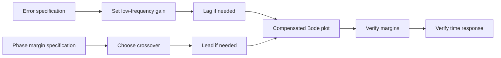

# Frequency-Response Compensator Design

Frequency-response design uses Bode and Nyquist information to shape loop gain, bandwidth, and stability margins. Nise's design chapter parallels root-locus compensation, but the viewpoint changes: instead of placing dominant poles directly in the $s$-plane, the designer adjusts magnitude and phase near crossover while preserving low-frequency accuracy and high-frequency noise attenuation.


*Figure: Bode plots connect frequency-response calculations to a standard engineering visualization. Image: [Wikimedia Commons](https://commons.wikimedia.org/wiki/File:Bodeplot.png), Stw and Vukg, public domain.*

This method is especially practical when plant frequency response is measured experimentally. Even if a precise transfer function is uncertain, gain crossover, phase lag, resonant peaks, and delay effects can be observed. Lead compensation adds phase near crossover; lag compensation raises low-frequency gain while trying not to damage phase margin; lag-lead combines both.

## Definitions

Let

$$
L(s)=G_c(s)G_p(s)H(s)
$$

be the loop transfer function. The frequency-response design target usually includes a desired phase margin, gain margin, steady-state error constant, and sometimes bandwidth.

A first-order lead compensator can be written

$$
G_{\text{lead}}(s)=K\frac{1+Ts}{1+\alpha Ts},\qquad 0<\alpha<1.
$$

Its maximum phase lead is

$$
\phi_{\max}=\sin^{-1}\left(\frac{1-\alpha}{1+\alpha}\right).
$$

The frequency where maximum phase occurs is

$$
\omega_m=\frac{1}{T\sqrt{\alpha}}.
$$

A lag compensator can be written

$$
G_{\text{lag}}(s)=K\frac{1+Ts}{1+\beta Ts},\qquad \beta>1.
$$

It increases low-frequency gain relative to high-frequency gain by approximately $\beta$, depending on how $K$ is assigned.

Bandwidth is the approximate frequency range over which the closed-loop system follows inputs. In many classical designs, higher crossover frequency means faster response, but also greater sensitivity to noise and unmodeled dynamics.

## Key results

Frequency-response lead design often follows:

1. Determine required steady-state gain.
2. Plot or compute uncompensated Bode response.
3. Find additional phase needed to meet desired phase margin, including a safety allowance.
4. Compute $\alpha$ from $\phi_{\max}$.
5. Place $\omega_m$ near the desired new gain crossover.
6. Set $T=1/(\omega_m\sqrt{\alpha})$.
7. Recompute margins and iterate.

Lag design often follows:

1. Set gain to meet transient or crossover requirements.
2. Determine low-frequency gain increase needed for error constants.
3. Choose $\beta$ equal to the needed improvement factor.
4. Place the lag zero about one decade below crossover and the lag pole lower by factor $\beta$.
5. Verify phase margin because lag still adds negative phase.

The table below summarizes the Bode effect:

| Compensator | Magnitude effect | Phase effect | Primary use |
|---|---|---|---|
| lead | raises magnitude near and above zero | positive phase bump | increase phase margin and speed |
| lag | raises low-frequency gain relative to crossover | small negative phase if placed low | improve steady-state error |
| lag-lead | combines both | positive near crossover, low-frequency boost | meet accuracy and margin |

The most common lead-design mistake is underestimating the required phase. Adding a lead network increases magnitude around its phase-boost region, which usually moves the gain crossover to a higher frequency. The uncompensated plant phase at that higher frequency is often more negative than at the old crossover. Designers therefore add a safety allowance, often several degrees, to the nominal phase deficiency before computing $\alpha$.

Lag design has the opposite personality. It tries to alter low-frequency gain while leaving crossover nearly where it was. Placing the lag zero about a decade below crossover makes the lag network's phase lag small at crossover. The pole is then placed below the zero by the desired improvement factor. If the pole and zero are too close to crossover, the phase margin can deteriorate enough to undo the intended design.

Loop shaping should include high-frequency behavior. A lead compensator can improve phase margin but may raise gain at frequencies where sensor noise, flexible modes, or unmodeled actuator dynamics live. A controller that looks excellent on a low-order plant model can excite neglected resonances. Practical frequency-response design therefore includes a high-frequency rolloff check and often adds filtering beyond the basic lead or PID form.

The design target should also reflect the closed-loop task. A tracking servo may need bandwidth and phase margin. A regulator rejecting constant load disturbances may mainly need large low-frequency loop gain. A measurement-noise-limited system may deliberately accept slower response to reduce high-frequency complementary sensitivity. The same plant can receive different compensators depending on whether command following, disturbance rejection, or noise attenuation is most important.

Frequency-response design is iterative. The procedure formulas supply an initial compensator, not a final certificate. After each lag or lead element is added, the designer recomputes crossover, phase margin, gain margin, static error constants, and closed-loop time response. If one specification improves while another fails, the pole-zero locations or gain are adjusted. This iteration is the frequency-domain version of Nise's broader analyze-design-test loop.

A useful design separation is to decide what each frequency band is supposed to do. At very low frequency, the loop should usually have enough gain to enforce accuracy and reject constant or slowly varying disturbances. Near crossover, the loop should have enough phase margin to avoid excessive oscillation. At high frequency, the loop should stop trying to control because measurements are noisy and the plant model is less reliable. Lead and lag compensation are simple tools for shaping those bands.

The desired phase margin should not be chosen in isolation. A very large phase margin with very low crossover can produce a sluggish but well-damped response. A moderate phase margin with higher crossover can be faster but more sensitive to delay and unmodeled poles. Nise's time-response discussion remains relevant: after frequency design, step and disturbance responses should still be checked.

When a plant has right-half-plane zeros or significant delay, aggressive loop shaping becomes fundamentally limited. Extra gain at crossover cannot remove the phase penalty. The correct response is usually to accept lower bandwidth, redesign the plant or actuator, or use a more advanced control architecture. Classical compensators work best when the plant is minimum phase and reasonably well modeled over the intended bandwidth.

After a compensator is selected, disturbance and noise transfer functions should be inspected separately. A loop shape that improves command tracking can still transmit sensor noise or demand excessive control effort. Frequency-response design is strongest when it evaluates all major closed-loop paths.

Those paths often set the real design limits.

Check them before approval.

Document the trade-offs.

## Visual



| Design target | Frequency-domain handle |
|---|---|
| smaller step/ramp error | increase low-frequency loop gain |
| faster response | increase crossover or bandwidth |
| less overshoot | increase phase margin |
| less sensor noise | reduce high-frequency loop gain |
| robustness to delay | preserve phase margin |

## Worked example 1: lead parameter from required phase

Problem: A loop needs about $35^\circ$ of additional phase lead at crossover. Find $\alpha$ for a lead compensator.

Method:

1. Use

$$
\phi_{\max}=\sin^{-1}\left(\frac{1-\alpha}{1+\alpha}\right).
$$

2. Let $\phi_{\max}=35^\circ$. Then

$$
\sin 35^\circ=\frac{1-\alpha}{1+\alpha}.
$$

3. Compute $\sin35^\circ\approx0.5736$:

$$
0.5736(1+\alpha)=1-\alpha.
$$

4. Expand:

$$
0.5736+0.5736\alpha=1-\alpha.
$$

5. Collect terms:

$$
1.5736\alpha=0.4264.
$$

6. Solve:

$$
\alpha=0.271.
$$

Checked answer: choose $\alpha\approx0.27$. In practice the designer may ask for a little more phase to compensate for crossover shift.

## Worked example 2: lag pole-zero placement

Problem: A compensated loop needs a factor of $10$ improvement in velocity constant, and the desired gain crossover is $\omega_{gc}=5$ rad/s. Choose a lag zero and pole using the one-decade rule.

Method:

1. Improvement factor:

$$
\beta=10.
$$

2. Place lag zero one decade below crossover:

$$
\omega_z=\frac{\omega_{gc}}{10}=\frac{5}{10}=0.5\ \text{rad/s}.
$$

3. Place lag pole lower by factor $\beta$:

$$
\omega_p=\frac{\omega_z}{\beta}=\frac{0.5}{10}=0.05\ \text{rad/s}.
$$

4. A lag compensator can be written

$$
G_{\text{lag}}(s)=\frac{s+0.5}{s+0.05}
$$

with gain adjusted separately if needed.

5. Its dc ratio is

$$
\frac{0.5}{0.05}=10.
$$

Checked answer: choose zero at $-0.5$ and pole at $-0.05$ rad/s, then verify margin and time response.

## Code

```python
import numpy as np

phi_deg = 35
sin_phi = np.sin(np.deg2rad(phi_deg))
alpha = (1 - sin_phi) / (1 + sin_phi)
print("lead alpha:", alpha)

omega_m = 5.0
T = 1 / (omega_m * np.sqrt(alpha))
zero = 1 / T
pole = 1 / (alpha * T)
print("lead zero frequency:", zero)
print("lead pole frequency:", pole)

beta = 10
omega_gc = 5
lag_zero = omega_gc / 10
lag_pole = lag_zero / beta
print("lag zero:", lag_zero, "lag pole:", lag_pole)
```

## Common pitfalls

- Forgetting that adding lead shifts the gain crossover frequency; design usually needs iteration.
- Placing a lag zero too close to crossover, reducing phase margin more than expected.
- Increasing low-frequency gain without checking actuator effort for persistent errors.
- Designing only from Bode margins and never checking time response.
- Ignoring high-frequency rolloff. Lead compensation can amplify sensor noise.
- Treating measured frequency response as noise-free; experimental transfer functions need uncertainty margins.

## Connections

- [Bode plots](/cs/control-engineering/bode-plots-and-frequency-response) supply the plot mechanics.
- [Nyquist margins](/cs/control-engineering/nyquist-and-frequency-stability-margins) explain why gain and phase margins matter.
- [PID and compensators](/cs/control-engineering/pid-lead-lag-and-lag-lead-compensators) compares controller structures.
- [Root-locus design](/cs/control-engineering/root-locus-design-and-classical-compensation) is the pole-location counterpart.
- [Simulation](/physics/simulation/) helps validate compensated responses beyond asymptotic sketches.
