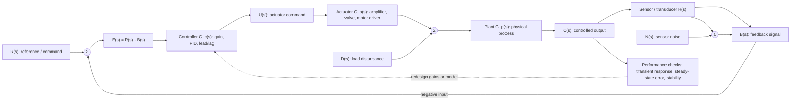

# Introduction to Feedback Control

Control systems engineering studies how to make a dynamic system behave in a desired way despite uncertainty, disturbances, and imperfect components. Nise's opening chapter frames the subject as a design loop: translate requirements into a physical system, draw the functional block diagram, derive a mathematical model, reduce interconnected subsystems, then analyze and redesign until transient response, steady-state error, and stability meet specifications.


*Figure: The cart-pendulum is a concrete plant for modeling, stabilization, and control design. Image: [Wikimedia Commons](https://commons.wikimedia.org/wiki/File:Cart-pendulum.svg), Krishnavedala, CC0.*

The central idea is feedback. In an open-loop system the command passes forward to the plant without measuring the result. In a closed-loop system the output is sensed and compared with the reference, producing an error signal that drives correction. The price of feedback is extra hardware, modeling effort, and possible instability; the benefit is accuracy, disturbance rejection, and tunable dynamics. This page sets the vocabulary used by the modeling, response, stability, and design pages that follow.

## Definitions

A **control system** is an interconnection of components whose purpose is to cause an output, often called the controlled variable, to follow or regulate against an input, often called the reference or command. A **plant** or **process** is the physical subsystem being controlled: a motor-load assembly, furnace, aircraft attitude channel, chemical reactor, disk-drive head, or antenna. A **controller** produces the actuator signal that drives the plant.

An **open-loop system** has no measurement of the controlled output in the decision path. If the input is $r(t)$ and the plant output is $c(t)$, the command is processed according to a designed chain, but the actual $c(t)$ is not compared with $r(t)$. Open-loop control is simple and cheap, but it cannot correct for unmodeled disturbances or parameter drift.

A **closed-loop** or **feedback** system measures the output and returns a signal through a sensor or output transducer. For negative feedback, the comparator forms

$$
e(t)=r(t)-b(t),
$$

where $b(t)$ is the feedback signal. If the sensor has unity gain, $b(t)=c(t)$ and $e(t)$ is the tracking error. With controller $G_c(s)$, plant $G_p(s)$, and feedback $H(s)$, the closed-loop transfer function is

$$
T(s)=\frac{C(s)}{R(s)}=\frac{G_c(s)G_p(s)}{1+G_c(s)G_p(s)H(s)}
$$

for negative feedback, assuming zero initial conditions and linear time-invariant models.

Nise emphasizes three major performance objectives. **Transient response** describes the part of the output before the long-term behavior is reached: speed, overshoot, ringing, and settling. **Steady-state error** is the final mismatch between command and output after transients die out. **Stability** asks whether the natural response decays, persists as a bounded oscillation, or grows without bound.

Standard test inputs include the impulse $\delta(t)$, step $u(t)$, ramp $t u(t)$, parabolic input $\frac{1}{2}t^2u(t)$, and sinusoid $\sin \omega t$. They are not arbitrary classroom choices: they expose different control properties. A step reveals transient behavior and position accuracy, a ramp reveals velocity tracking error, and sinusoids support frequency-response analysis.

## Key results

The basic negative-feedback relation follows from the summing junction and block equations. Let the forward path be $G(s)=G_c(s)G_p(s)$ and the feedback path be $H(s)$. Then

$$
\begin{aligned}
E(s)&=R(s)-H(s)C(s)\\
C(s)&=G(s)E(s)\\
C(s)&=G(s)\left[R(s)-H(s)C(s)\right]\\
C(s)\left[1+G(s)H(s)\right]&=G(s)R(s),
\end{aligned}
$$

so

$$
T(s)=\frac{G(s)}{1+G(s)H(s)}.
$$

This formula already shows why feedback can be helpful and dangerous. Large loop gain $G(s)H(s)$ can reduce sensitivity to plant gain changes and disturbances entering after the controller, but the same denominator $1+G(s)H(s)$ determines closed-loop poles. If those poles move into the right half of the $s$-plane, the controlled system becomes unstable even when the open-loop plant is individually stable.

For unity feedback, the error transfer function is

$$
\frac{E(s)}{R(s)}=\frac{1}{1+G(s)}.
$$

Thus increasing low-frequency loop gain tends to reduce tracking error for slowly varying inputs. This is the intuitive basis for proportional gain, integral action, lag compensation, and high-gain designs. It is also why Nise repeatedly returns to trade-offs: gain that improves error may worsen overshoot or reduce stability margin.

The design process can be written as an engineering loop:

1. Convert requirements into performance specifications.
2. Choose a physical configuration and draw a functional block diagram.
3. Derive a schematic and identify simplifying assumptions.
4. Obtain a transfer-function, signal-flow, or state-space model.
5. Reduce the model to a form suitable for analysis.
6. Analyze, design, simulate, test, and revise.

This sequence is not strictly one pass. If testing shows that a neglected effect matters, the model is updated. If specifications conflict, the requirements must be renegotiated or a new controller structure introduced.

The first modeling judgment is where to draw the system boundary. A cruise-control problem may treat the engine and drivetrain as the plant, or it may include throttle actuator dynamics, tire slip, road grade, and sensor filtering. A temperature-control problem may treat the room as a single thermal capacitance, or it may include walls, vents, heater delay, and outdoor temperature. The boundary should include the dynamics that materially affect the specifications being claimed. Leaving out a fast amplifier may be harmless for a slow antenna, while leaving out a slow valve can invalidate a process-control design.

The second judgment is how to name signals. Good signal naming prevents mathematical mistakes later. The reference $r(t)$ is the desired behavior expressed in controller-compatible units. The measured output may be $b(t)=H(s)c(t)$ rather than the physical output $c(t)$. The controller output may be a voltage, duty cycle, commanded torque, or valve position. Disturbances should be shown at their real entry points because feedback suppresses a load disturbance differently from sensor noise.

The third judgment is how to interpret specifications. "Fast" must become a settling-time, rise-time, or bandwidth requirement. "Accurate" must become a steady-state error limit for a specific class of inputs. "Not oscillatory" must become a damping-ratio, overshoot, or phase-margin target. "Robust" must be tied to gain variation, delay, disturbance rejection, or unmodeled high-frequency dynamics. Control design becomes tractable only after qualitative requirements are translated into measurable quantities.

Feedback also changes the economics of a design. A higher-quality sensor may reduce the burden on the controller. A larger actuator may allow faster response but increase cost and saturation risk. A more complex compensator may meet specifications but become harder to implement, tune, and maintain. Nise's design loop is therefore not purely mathematical: it repeatedly converts between physical choices, model assumptions, performance calculations, and implementation limits.

Finally, a control diagram should be read as a hypothesis. The arrows and transfer functions assert what affects what, which effects are linear, and which dynamics are negligible. Simulation and laboratory testing are not afterthoughts; they are the checks that decide whether the hypothesis is good enough. When the measured response disagrees with the model, the right response is not to force the data into the old block diagram, but to revisit assumptions such as friction, saturation, sensor delay, backlash, and parameter uncertainty.

## Visual



This diagram shows the classical feedback architecture with explicit reference `R(s)`, error `E(s)`, controller `G_c(s)`, actuator, plant `G_p(s)`, feedback sensor `H(s)`, output `C(s)`, disturbance, and sensor-noise entry points. The dotted redesign path emphasizes that feedback design iterates when measured transient response, steady-state error, or stability does not match the model.

| Feature | Open-loop control | Closed-loop control |
|---|---|---|
| Uses output measurement | No | Yes |
| Corrects disturbances | Only if modeled ahead of time | Yes, within bandwidth and actuator limits |
| Cost and complexity | Lower | Higher |
| Stability risk from feedback | None from feedback itself | Possible if closed-loop poles move to unstable region |
| Typical examples | toaster timer, fixed motor drive | thermostat, antenna positioning, cruise control |
| Main design variables | calibration and feedforward command | gain, compensator dynamics, sensor dynamics |

## Worked example 1: closed-loop transfer function

Problem: A unity-feedback system has controller $G_c(s)=K$ and plant

$$
G_p(s)=\frac{10}{s(s+2)}.
$$

Find the closed-loop transfer function and determine the characteristic equation.

Method:

1. Form the forward path:

$$
G(s)=G_c(s)G_p(s)=\frac{10K}{s(s+2)}.
$$

2. Use the unity-feedback formula:

$$
T(s)=\frac{G(s)}{1+G(s)}.
$$

3. Substitute and clear the complex fraction:

$$
\begin{aligned}
T(s)
&=\frac{\frac{10K}{s(s+2)}}{1+\frac{10K}{s(s+2)}}\\
&=\frac{10K}{s(s+2)+10K}\\
&=\frac{10K}{s^2+2s+10K}.
\end{aligned}
$$

4. The characteristic equation is the denominator set to zero:

$$
s^2+2s+10K=0.
$$

Checked answer: $T(s)=10K/(s^2+2s+10K)$. For $K\gt 0$, the second-order denominator has positive coefficients, but later Routh-Hurwitz analysis will give the more general stability test. Here the roots have real part $-1$ for all positive $K$, so the system is stable for $K\gt 0$.

## Worked example 2: disturbance rejection comparison

Problem: A plant output is affected by an additive constant disturbance $D(s)$ after the plant. The forward path is $G(s)=20/(s+4)$ with unity feedback. Compare the output due to a unit-step disturbance for open-loop and closed-loop operation when the reference is zero.

Method:

Open loop has no correction. If the disturbance is added directly at the output,

$$
C_{\text{open}}(s)=D(s)=\frac{1}{s}.
$$

The final value is

$$
c_{\text{open}}(\infty)=\lim_{s\to 0}sC_{\text{open}}(s)=1.
$$

For closed-loop operation with $R(s)=0$, write the output equation:

$$
C(s)=G(s)E(s)+D(s).
$$

With unity negative feedback and zero reference,

$$
E(s)=0-C(s)=-C(s).
$$

Therefore

$$
\begin{aligned}
C(s)&=-G(s)C(s)+D(s)\\
C(s)\left[1+G(s)\right]&=D(s)\\
\frac{C(s)}{D(s)}&=\frac{1}{1+G(s)}.
\end{aligned}
$$

Substitute $G(s)=20/(s+4)$:

$$
\frac{C(s)}{D(s)}=\frac{1}{1+\frac{20}{s+4}}=\frac{s+4}{s+24}.
$$

With $D(s)=1/s$,

$$
C(s)=\frac{s+4}{s(s+24)}.
$$

The final value is

$$
c(\infty)=\lim_{s\to 0}sC(s)=\frac{4}{24}=\frac{1}{6}.
$$

Checked answer: feedback reduces the steady disturbance effect from $1$ to $1/6$. The disturbance is not eliminated because the loop has finite dc gain $G(0)=5$.

## Code

```python
import numpy as np
from scipy import signal

K = 2.0
num = [10 * K]
den = [1, 2, 10 * K]
sys = signal.TransferFunction(num, den)

t = np.linspace(0, 8, 500)
t, y = signal.step(sys, T=t)

overshoot = (np.max(y) - y[-1]) / y[-1] * 100
settled_value = y[-1]
print(f"final value approx: {settled_value:.3f}")
print(f"percent overshoot approx: {overshoot:.1f}")
print(f"closed-loop poles: {np.roots(den)}")
```

## Common pitfalls

- Treating feedback as automatically beneficial. Feedback changes the denominator of the closed-loop transfer function; it can create instability.
- Calling every summing-junction output an error. It is exactly the physical error only when the reference and feedback signals are in comparable units and sensor scaling is unity.
- Ignoring sensor dynamics. A slow or noisy sensor is part of the loop, not an afterthought.
- Confusing transient response with natural response. The visible transient is the portion of the total response before steady behavior dominates; the natural response is the system-dependent homogeneous component.
- Using only a step input. Different specifications require different tests: ramps for velocity error, sinusoids for frequency response, and impulses for natural dynamics.

## Connections

- [Laplace transfer functions](/cs/control-engineering/laplace-transfer-functions-and-linearization) develop the algebra behind block diagrams.
- [Time response](/cs/control-engineering/time-response-first-and-second-order) defines the transient specifications used in design.
- [Routh-Hurwitz stability](/cs/control-engineering/routh-hurwitz-stability) tests whether the feedback denominator is stable.
- [Steady-state error](/cs/control-engineering/steady-state-errors-and-sensitivity) quantifies the final tracking mismatch.
- [Applied vehicle control](/cs/autonomous-driving/control-pid-mpc-pure-pursuit-stanley) uses the same feedback ideas in path tracking.
