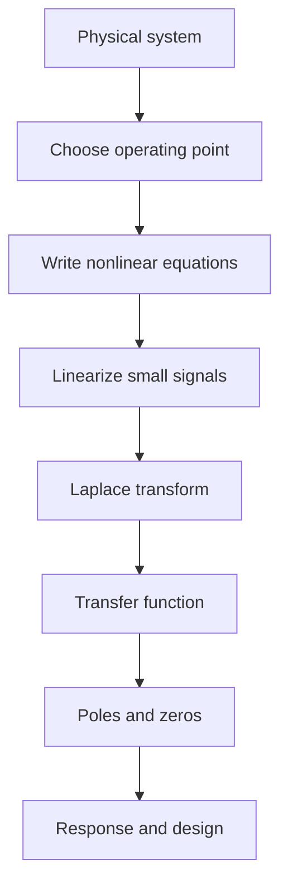

# Laplace Transfer Functions and Linearization

Transfer functions are the main algebraic language of classical control. Nise introduces them after a Laplace-transform refresher because the transform converts constant-coefficient differential equations into polynomial equations in $s$. Once inputs and outputs are expressed in the same domain, subsystems can be multiplied, divided, and connected with block-diagram rules.


*Figure: The standard feedback loop keeps control pages tied to the plant-controller interface. Image: [Wikimedia Commons](https://commons.wikimedia.org/wiki/File:Control_System.svg), Inductiveload, public domain.*

This page combines the frequency-domain modeling foundation with the small-signal linearization step needed before transfer functions are valid. The unspoken discipline is important: a transfer function is not the physical system itself. It is a linear, time-invariant, zero-initial-condition input-output model that is useful only over the operating range where the assumptions are defensible.

## Definitions

The one-sided Laplace transform of a causal signal $x(t)$ is

$$
X(s)=\int_0^\infty x(t)e^{-st}\,dt.
$$

For linear time-invariant systems described by a differential equation,

$$
a_n\frac{d^n c}{dt^n}+\cdots+a_1\frac{dc}{dt}+a_0c
=b_m\frac{d^m r}{dt^m}+\cdots+b_1\frac{dr}{dt}+b_0r,
$$

the **transfer function** is the ratio of the Laplace transform of the output to the Laplace transform of the input under zero initial conditions:

$$
G(s)=\frac{C(s)}{R(s)}
=\frac{b_ms^m+\cdots+b_1s+b_0}{a_ns^n+\cdots+a_1s+a_0}
=\frac{N(s)}{D(s)}.
$$

Roots of $D(s)$ are **poles** and roots of $N(s)$ are **zeros**. Poles determine the modes available in the natural response. Zeros shape how the input excites and combines those modes.

A system is **linear** if it satisfies superposition and homogeneity. Superposition means the response to $r_1(t)+r_2(t)$ is the sum of the separate responses. Homogeneity means the response to $Ar(t)$ is $A$ times the response to $r(t)$. Real components often violate linearity through saturation, dead zone, backlash, Coulomb friction, or geometric nonlinearities.

**Linearization** replaces a nonlinear relation with its first-order Taylor approximation about an operating point $x_0$:

$$
f(x)\approx f(x_0)+\left.\frac{df}{dx}\right|_{x=x_0}(x-x_0).
$$

If $\Delta x=x-x_0$ and $\Delta f=f(x)-f(x_0)$, then

$$
\Delta f\approx \left.\frac{df}{dx}\right|_{x=x_0}\Delta x.
$$

## Key results

The transform derivative property explains why Laplace methods simplify modeling. For zero initial conditions,

$$
\mathcal{L}\left\{\frac{d^n x}{dt^n}\right\}=s^nX(s).
$$

Thus each derivative becomes multiplication by $s$. A differential equation becomes an algebraic equation, and an input-output relation becomes a rational function.

Common transform pairs used throughout control include:

| Time signal | Laplace transform | Control use |
|---|---:|---|
| $\delta(t)$ | $1$ | impulse response, natural modes |
| $u(t)$ | $1/s$ | step commands |
| $t u(t)$ | $1/s^2$ | ramp tracking |
| $e^{-at}u(t)$ | $1/(s+a)$ | first-order decay |
| $\sin \omega t$ | $\omega/(s^2+\omega^2)$ | frequency response |
| $\cos \omega t$ | $s/(s^2+\omega^2)$ | sinusoidal testing |

For physical modeling, the transfer-function procedure is:

1. Choose input and output variables.
2. Write the governing differential equation using physical laws.
3. Take the Laplace transform with zero initial conditions.
4. Solve algebraically for $C(s)/R(s)$.
5. Factor or inspect the numerator and denominator to identify poles and zeros.

For nonlinear systems, insert a preliminary step: choose the equilibrium or nominal operating point and express variables as nominal values plus small deviations. Only the deviation variables belong in the transfer function. For example, if $v(t)=V_0+\tilde v(t)$ and $i(t)=I_0+\tilde i(t)$, the small-signal transfer function relates $\tilde V(s)$ and $\tilde I(s)$, not the total variables.

Linearization can change stability conclusions depending on the operating point. A pendulum near the downward equilibrium behaves like a stable small-angle oscillator, while a pendulum near the upright equilibrium has a locally unstable linear model. The same nonlinear system can therefore yield different transfer functions around different equilibria.

A transfer function also hides initial-condition effects by definition. If a capacitor begins charged, or a mass begins with nonzero velocity, the Laplace-transformed differential equation contains extra terms. Those terms act like additional inputs to the same zero-state model, but they are not part of $G(s)$. This distinction matters in experiments: an impulse-like test may be used to excite natural modes, while a transfer-function calculation from command to output assumes the stored energy is initially zero.

Properness is another important modeling check. A physically realizable causal transfer function normally has denominator degree at least numerator degree. If the numerator degree is larger, the model differentiates the input more times than the plant dynamics can support, which usually indicates that the chosen idealization is too aggressive. A differentiator may appear as part of a controller design, but real implementations filter it because high-frequency noise would otherwise be amplified without bound.

Pole-zero cancellation should be treated carefully. Algebra may simplify $(s+2)/(s+2)(s+5)$ to $1/(s+5)$, but a physical cancellation requires exact matching of dynamics. If the cancelled pole is stable and far from the dominant response, the simplification may be useful. If the cancelled pole is unstable, cancellation hides an internal mode that can grow even though the simplified input-output transfer function looks stable. This is one reason state-space realizations and robustness checks remain important.

Linearization with several variables uses partial derivatives. For a nonlinear relation $f(x,u)$ near $(x_0,u_0)$, the small-signal approximation is

$$
\Delta f\approx
\left.\frac{\partial f}{\partial x}\right|_0\Delta x+
\left.\frac{\partial f}{\partial u}\right|_0\Delta u.
$$

The coefficients are slopes evaluated at the operating point. They are not universal constants. For example, aerodynamic drag proportional to $v^2$ has small-signal slope $2cv_0$ around speed $v_0$, so the linear damping changes with operating speed.

When using a transfer function in design, always keep three questions attached to it: what input and output does it relate, what operating point and amplitude range justify it, and what dynamics were intentionally neglected? These questions prevent the common mistake of treating $G(s)$ as a timeless property of the hardware rather than as a scoped model created for a particular analysis.

A final check is dimensional consistency. The variable $s$ has units of inverse time, so polynomial coefficients carry units that make each term compatible. Normalizing a denominator into standard form is fine, but the resulting constants still represent time constants, natural frequencies, or gains with physical dimensions. Unit mistakes often show up as impossible pole locations or gains that cannot match measured hardware.

## Visual



| Nonlinearity | Physical example | Small-signal handling |
|---|---|---|
| Saturation | amplifier rail limit | linear only below the rail |
| Dead zone | motor static friction | invalid for commands inside the dead band |
| Backlash | loose gears | approximate only for one contact direction or very small range |
| Trigonometric geometry | pendulum torque $mgL\sin\theta$ | use slope at the operating angle |
| Product terms | fluid or aerodynamic force | linearize partial derivatives around nominal flow |

## Worked example 1: transfer function from a differential equation

Problem: A system is governed by

$$
\frac{d^2 c}{dt^2}+5\frac{dc}{dt}+6c=2\frac{dr}{dt}+8r.
$$

Find $G(s)=C(s)/R(s)$ under zero initial conditions and identify poles and zeros.

Method:

1. Apply the Laplace transform to each derivative:

$$
\mathcal{L}\left\{\frac{d^2c}{dt^2}\right\}=s^2C(s),\quad
\mathcal{L}\left\{\frac{dc}{dt}\right\}=sC(s),\quad
\mathcal{L}\left\{\frac{dr}{dt}\right\}=sR(s).
$$

2. Transform the differential equation:

$$
s^2C(s)+5sC(s)+6C(s)=2sR(s)+8R(s).
$$

3. Factor $C(s)$ and $R(s)$:

$$
C(s)(s^2+5s+6)=R(s)(2s+8).
$$

4. Divide by $R(s)(s^2+5s+6)$:

$$
G(s)=\frac{C(s)}{R(s)}=\frac{2s+8}{s^2+5s+6}.
$$

5. Factor:

$$
G(s)=\frac{2(s+4)}{(s+2)(s+3)}.
$$

Checked answer: the zero is at $s=-4$ and the poles are at $s=-2$ and $s=-3$. The poles are in the left half-plane, so this standalone transfer function is stable.

## Worked example 2: linearizing a nonlinear spring

Problem: A mass is attached to a nonlinear spring whose force is

$$
f_s(x)=3x^2+2x.
$$

The operating displacement is $x_0=1$ m. Find the small-signal spring stiffness and write the linearized force relation.

Method:

1. Evaluate the force at the operating point:

$$
f_s(1)=3(1)^2+2(1)=5\ \text{N}.
$$

2. Differentiate with respect to $x$:

$$
\frac{df_s}{dx}=6x+2.
$$

3. Evaluate the slope at $x_0=1$:

$$
k_{\text{small}}=\left.\frac{df_s}{dx}\right|_{x=1}=6(1)+2=8\ \text{N/m}.
$$

4. Let $x=1+\tilde x$ and $f_s=5+\tilde f_s$. The first-order approximation is

$$
\tilde f_s\approx 8\tilde x.
$$

Checked answer: the nonlinear spring behaves locally like an $8$ N/m spring around $x=1$ m. The total approximate force is $f_s(x)\approx 5+8(x-1)$, valid only for small excursions around $1$ m.

## Code

```python
import sympy as sp

s, x = sp.symbols("s x")
G = (2*s + 8) / (s**2 + 5*s + 6)
print("factored transfer function:", sp.factor(G))
print("poles:", sp.solve(sp.denom(G), s))
print("zeros:", sp.solve(sp.numer(G), s))

f = 3*x**2 + 2*x
x0 = 1
k_small = sp.diff(f, x).subs(x, x0)
linearized = f.subs(x, x0) + k_small * (x - x0)
print("small-signal stiffness:", k_small)
print("linearized force:", sp.expand(linearized))
```

## Common pitfalls

- Forgetting the zero-initial-condition assumption. Nonzero initial energy appears as additional terms, not in the transfer function itself.
- Treating $G(s)$ as valid for every amplitude. Transfer functions from linearization apply near the chosen operating point.
- Linearizing the total variable but then interpreting the result as a large-signal model.
- Dropping numerator dynamics. Zeros can strongly affect overshoot and inverse response even though poles dominate stability.
- Mixing one-sided and two-sided transform conventions without checking initial-condition terms.
- Assuming all positive coefficients imply stability for high-order systems. Routh-Hurwitz is needed beyond simple cases.

## Connections

- [Engineering math Laplace transform](/math/engineering-math/laplace-transform) gives the broader transform toolkit.
- [Complex functions and analyticity](/math/engineering-math/complex-functions-and-analyticity) supports the $s$-plane viewpoint.
- [Physical system modeling](/cs/control-engineering/physical-system-modeling-frequency-domain) applies these ideas to electrical, mechanical, and motor systems.
- [State-space modeling](/cs/control-engineering/state-space-modeling-and-conversions) provides an alternative model form when internal variables matter.
- [Signals and systems](/physics/signals-systems/) studies the same transforms with a signal-processing emphasis.
