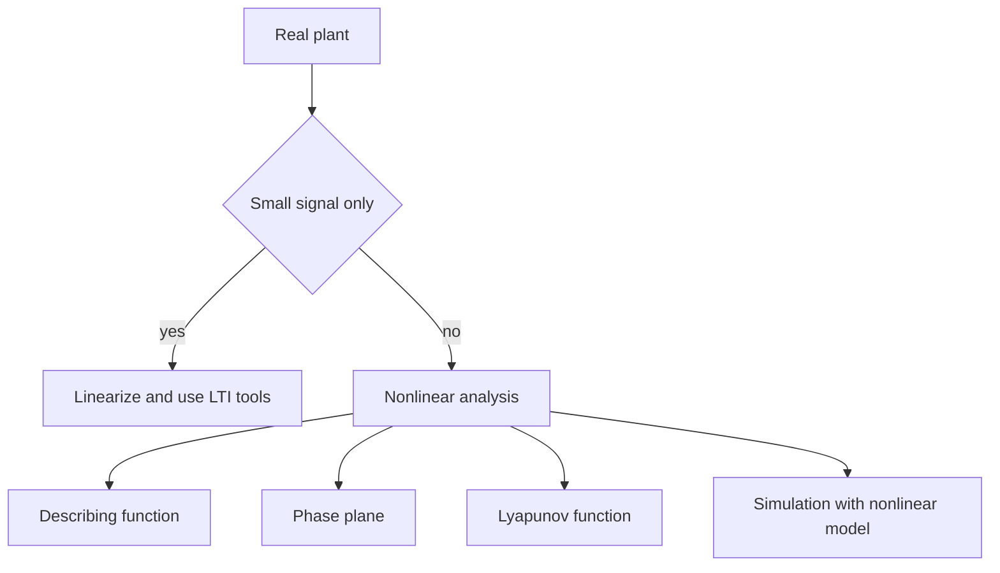

# Nonlinear Control Basics

Nise's main development is linear control, but the book repeatedly notes nonlinear effects such as saturation, dead zone, backlash, and small-signal linearization. This page is a short supplementary bridge into nonlinear control ideas that commonly follow an undergraduate linear-control course: describing functions, phase-plane analysis, and Lyapunov stability. It stays light because these topics are not the central scope of Nise's text.


*Figure: The cart-pendulum is a concrete plant for modeling, stabilization, and control design. Image: [Wikimedia Commons](https://commons.wikimedia.org/wiki/File:Cart-pendulum.svg), Krishnavedala, CC0.*

The practical lesson is that every real control system is nonlinear somewhere. Linear design is valuable because it works near an operating point and gives strong intuition, but actuator limits, friction, geometry, quantization, and switching logic can dominate behavior when signals become large. Nonlinear analysis asks what remains true outside the small-signal model.

## Definitions

A nonlinear system violates superposition or homogeneity. A state-space nonlinear model has the form

$$
\dot{\mathbf x}=\mathbf f(\mathbf x,\mathbf u,t),
\qquad
\mathbf y=\mathbf h(\mathbf x,\mathbf u,t).
$$

An **equilibrium point** for constant input $\mathbf u_0$ is a state $\mathbf x_0$ such that

$$
\mathbf f(\mathbf x_0,\mathbf u_0)=0.
$$

Linearization around the equilibrium uses Jacobians:

$$
A=\left.\frac{\partial \mathbf f}{\partial \mathbf x}\right|_{\mathbf x_0,\mathbf u_0},
\qquad
B=\left.\frac{\partial \mathbf f}{\partial \mathbf u}\right|_{\mathbf x_0,\mathbf u_0}.
$$

A **describing function** approximates a static nonlinearity driven by a sinusoid by retaining only the fundamental harmonic. It produces an amplitude-dependent complex gain $N(A)$. This is an approximate method for predicting limit cycles in systems with one dominant nonlinearity.

A **phase plane** plots trajectories for a second-order autonomous system using state coordinates, often $x_1$ and $x_2=\dot x_1$. Instead of showing response versus time, it shows how the state moves in state space.

A **Lyapunov function** is a scalar energy-like function $V(\mathbf x)$ used to prove stability without solving the differential equation. Around an equilibrium at the origin, if

$$
V(\mathbf x)>0\quad \text{for } \mathbf x\ne0,
$$

and

$$
\dot V(\mathbf x)\le0,
$$

then the equilibrium is stable under standard Lyapunov conditions. If $\dot V\lt 0$ for $\mathbf x\ne0$, asymptotic stability can often be concluded.

## Key results

Common nonlinearities in control systems:

| Nonlinearity | Model idea | Typical effect |
|---|---|---|
| saturation | output limited to maximum magnitude | windup, reduced effective gain |
| dead zone | no output for small input | steady error, limit cycles |
| backlash | output does not move until gap closes | oscillation and lost motion |
| Coulomb friction | force changes sign with velocity | stick-slip motion |
| relay | output switches between levels | sustained oscillations |
| geometric sine terms | pendulum and attitude dynamics | operating-point-dependent stability |

Describing-function limit-cycle prediction uses the approximate condition

$$
G(j\omega)N(A)=-1.
$$

This resembles the Nyquist critical-point condition but includes amplitude $A$. Because higher harmonics are ignored, the result is an approximation, not a proof.

Phase-plane analysis classifies equilibrium behavior by trajectory patterns. Linearized eigenvalues provide local hints: stable nodes, saddles, spirals, and centers. Nonlinear trajectories can reveal features that linearization misses, such as finite escape, multiple equilibria, or large-amplitude cycles.

Lyapunov analysis provides conservative but rigorous stability statements. For a damped mechanical system, total energy is a natural Lyapunov candidate:

$$
V=\frac{1}{2}M\dot x^2+\frac{1}{2}Kx^2.
$$

If damping dissipates energy, $\dot V$ is negative semidefinite or negative definite, proving stability properties without solving for $x(t)$ explicitly.

Local linearization remains the first tool for many nonlinear systems because it gives immediate information near an equilibrium. If the linearized system has all eigenvalues in the open left half-plane, the nonlinear equilibrium is locally asymptotically stable under standard smoothness assumptions. If the linearized system has an eigenvalue in the right half-plane, the nonlinear equilibrium is locally unstable. If eigenvalues lie on the imaginary axis, linearization may be inconclusive and nonlinear terms must be examined.

Saturation is the nonlinearity most likely to surprise a linear design. A linear controller may request a torque, voltage, or valve opening that the actuator cannot deliver. While saturated, the effective loop gain is lower and the controller's integrator may wind up. The response can overshoot badly even though the unsaturated linear model has comfortable damping. Anti-windup, command limiting, and actuator sizing are therefore nonlinear design issues.

Dead zones and backlash are especially damaging near zero error. A linear model predicts ever-smaller corrective action as the error shrinks, but a dead zone may produce no actuator response until the error grows enough. Backlash can make the output lag behind input reversals, creating chatter or limit cycles. These effects are often handled by mechanical design, preload, dither, compensation logic, or accepting a finite accuracy band.

Describing functions are useful when a relay, saturation, or dead zone sits in an otherwise linear loop and the dominant behavior is nearly sinusoidal. The method predicts possible oscillation amplitude and frequency by solving $G(j\omega)N(A)=-1$. Because higher harmonics are neglected, the result should be verified by nonlinear simulation. It is a design warning and approximation, not a rigorous proof of a limit cycle.

Lyapunov methods generalize the energy intuition behind stable mechanical systems. The difficult part is finding a suitable $V(\mathbf x)$. Once found, the method can prove stability over a region rather than only along one simulated trajectory. This makes Lyapunov analysis central in advanced nonlinear, adaptive, and robotic control, even though Nise's undergraduate linear sequence only gestures toward the topic.

Nonlinear systems may have multiple equilibria. A pendulum has a downward equilibrium and an upright equilibrium; one is locally stable without control, while the other is unstable unless actively balanced. A linear transfer function around one equilibrium says little about behavior near another. This is why nonlinear analysis often talks about regions of attraction: the set of initial states from which the system returns to a chosen equilibrium.

Simulation is indispensable but not conclusive. A nonlinear simulation can reveal saturation recovery, limit cycles, and large-signal failure modes, but it samples only the initial conditions and parameter values that were tried. Lyapunov analysis, invariant-set reasoning, and conservative bounds complement simulation by proving statements over sets. A serious nonlinear design usually uses both: simulation for insight and proof techniques for guarantees where they are needed.

## Visual



```text
Saturation nonlinearity

output
  ^
M |        _______
  |       /
  |      /
  |_____/
  |    /
  |   /
-M|__/____________> input
```

## Worked example 1: small-angle pendulum linearization

Problem: A simple pendulum without damping satisfies

$$
\ddot\theta+\frac{g}{L}\sin\theta=0.
$$

Linearize about the downward equilibrium $\theta_0=0$.

Method:

1. Identify the nonlinear term:

$$
f(\theta)=\sin\theta.
$$

2. Use Taylor expansion around $\theta_0=0$:

$$
\sin\theta\approx \sin0+\cos0(\theta-0).
$$

3. Evaluate:

$$
\sin0=0,\qquad \cos0=1.
$$

Thus

$$
\sin\theta\approx\theta.
$$

4. Substitute into the pendulum equation:

$$
\ddot\theta+\frac{g}{L}\theta=0.
$$

5. The characteristic equation is

$$
s^2+\frac{g}{L}=0,
$$

with poles

$$
s=\pm j\sqrt{\frac{g}{L}}.
$$

Checked answer: the small-angle undamped pendulum is marginally stable in the linear natural-response sense, oscillating at $\omega_n=\sqrt{g/L}$.

## Worked example 2: Lyapunov energy for a damped mass-spring system

Problem: Show stability of

$$
M\ddot x+D\dot x+Kx=0
$$

for $M\gt 0$, $D\gt 0$, $K\gt 0$ using an energy function.

Method:

1. Choose state variables:

$$
x_1=x,\qquad x_2=\dot x.
$$

2. Candidate Lyapunov function:

$$
V(x_1,x_2)=\frac{1}{2}Kx_1^2+\frac{1}{2}Mx_2^2.
$$

This is positive definite because $K\gt 0$ and $M\gt 0$.

3. Differentiate:

$$
\dot V=Kx_1\dot x_1+Mx_2\dot x_2.
$$

4. Substitute $\dot x_1=x_2$:

$$
\dot V=Kx_1x_2+Mx_2\ddot x.
$$

5. From the equation of motion:

$$
M\ddot x=-D\dot x-Kx=-Dx_2-Kx_1.
$$

6. Substitute:

$$
\dot V=Kx_1x_2+x_2(-Dx_2-Kx_1).
$$

7. Cancel terms:

$$
\dot V=-Dx_2^2\le0.
$$

Checked answer: energy never increases. With additional invariance reasoning, the damped mass-spring equilibrium is asymptotically stable because the only trajectory that can keep $\dot V=0$ is the origin.

## Code

```python
import numpy as np
from scipy.integrate import solve_ivp

def saturated_mass_spring(t, state, M=1.0, D=0.4, K=2.0, umax=1.0):
    x, v = state
    u_linear = -3.0 * x - 1.0 * v
    u = np.clip(u_linear, -umax, umax)
    a = (u - D * v - K * x) / M
    return [v, a]

sol = solve_ivp(
    saturated_mass_spring,
    [0, 20],
    [2.0, 0.0],
    t_eval=np.linspace(0, 20, 500),
)

energy = 0.5 * 2.0 * sol.y[0] ** 2 + 0.5 * 1.0 * sol.y[1] ** 2
print("initial energy:", energy[0])
print("final energy:", energy[-1])
print("final state:", sol.y[:, -1])
```

## Common pitfalls

- Assuming a linearized stable model proves global nonlinear stability. Linearization is local.
- Ignoring actuator saturation in simulations of aggressive controllers.
- Treating describing-function predictions as exact. They are harmonic-balance approximations.
- Using a Lyapunov candidate that is not positive definite around the equilibrium.
- Forgetting that $\dot V\le0$ may prove stability but not automatically asymptotic stability without additional arguments.
- Simulating nonlinear systems from only one initial condition and assuming the result generalizes.

## Connections

- [Linearization and transfer functions](/cs/control-engineering/laplace-transfer-functions-and-linearization) gives the small-signal bridge from nonlinear equations to LTI models.
- [Time response](/cs/control-engineering/time-response-first-and-second-order) explains local pole-based behavior after linearization.
- [PID and compensators](/cs/control-engineering/pid-lead-lag-and-lag-lead-compensators) must be checked against saturation and windup.
- [Simulation](/physics/simulation/) is essential for nonlinear behavior outside analytic approximations.
- [Autonomous driving control](/cs/autonomous-driving/control-pid-mpc-pure-pursuit-stanley) contains applied nonlinear and constrained-control examples.
