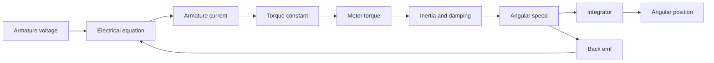

# Physical System Modeling in the Frequency Domain

After introducing transfer functions, Nise spends substantial effort deriving them from real components: electrical networks, translational and rotational mechanical systems, gears, and electromechanical motors. The goal is not to memorize isolated formulas. It is to recognize a modeling pattern: identify energy-storage and dissipative elements, write physical laws, transform to the $s$-domain, and solve for the chosen input-output ratio.


*Figure: Bode plots connect frequency-response calculations to a standard engineering visualization. Image: [Wikimedia Commons](https://commons.wikimedia.org/wiki/File:Bodeplot.png), Stw and Vukg, public domain.*

This page collects the modeling rules most often needed before response and design. The same physical device can produce different transfer functions depending on the selected input and output. A motor can be modeled from armature voltage to angular speed, armature voltage to position, or torque command to load displacement. Always state the variables before writing equations.

## Definitions

For electrical networks, impedance in the $s$-domain is used under zero initial conditions:

| Component | Time relation | $s$-domain impedance |
|---|---|---|
| resistor | $v=Ri$ | $R$ |
| inductor | $v=L\,di/dt$ | $Ls$ |
| capacitor | $i=C\,dv/dt$ | $1/(Cs)$ |

Kirchhoff's voltage law says the signed sum of voltages around a closed loop is zero. Kirchhoff's current law says the signed sum of currents at a node is zero. These laws produce algebraic equations after transformation.

For translational mechanical systems, force balance with D'Alembert's convention gives

$$
\sum F=0
$$

after inertial forces are included. A mass, viscous damper, and spring have force relations

$$
F_M=M\ddot x,\quad F_D=D\dot x,\quad F_K=Kx.
$$

For rotational systems,

$$
T_J=J\ddot\theta,\quad T_D=D\dot\theta,\quad T_K=K\theta.
$$

Gear trains transform torque and displacement. For two ideal gears with tooth counts $N_1$ and $N_2$,

$$
\theta_2=-\frac{N_1}{N_2}\theta_1,\qquad
T_2=-\frac{N_2}{N_1}T_1
$$

with sign depending on rotation direction convention.

A common armature-controlled dc motor model uses armature resistance $R_a$, back-emf constant $K_b$, torque constant $K_t$, equivalent inertia $J$, and equivalent damping $D$. With armature inductance neglected,

$$
e_a(t)=R_ai_a(t)+K_b\dot\theta_m(t),\qquad
J\ddot\theta_m(t)+D\dot\theta_m(t)=K_t i_a(t).
$$

## Key results

For a single translational mass-spring-damper driven by force $f(t)$,

$$
M\ddot x+D\dot x+Kx=f(t).
$$

Taking the Laplace transform gives

$$
(Ms^2+Ds+K)X(s)=F(s),
$$

so

$$
\frac{X(s)}{F(s)}=\frac{1}{Ms^2+Ds+K}.
$$

For a rotational inertia-damper-spring driven by torque $T(t)$,

$$
\frac{\Theta(s)}{T(s)}=\frac{1}{Js^2+Ds+K}.
$$

The forms are identical because displacement/rotation, force/torque, mass/inertia, damping/rotational damping, and spring/torsional spring are analogous variables.

For the simplified dc motor above, eliminate $i_a(t)$:

$$
i_a(t)=\frac{e_a(t)-K_b\dot\theta_m(t)}{R_a}.
$$

Substitute into the mechanical equation:

$$
J\ddot\theta_m+D\dot\theta_m
=\frac{K_t}{R_a}e_a-\frac{K_tK_b}{R_a}\dot\theta_m.
$$

Therefore

$$
J\ddot\theta_m+\left(D+\frac{K_tK_b}{R_a}\right)\dot\theta_m
=\frac{K_t}{R_a}e_a.
$$

The voltage-to-position transfer function is

$$
\frac{\Theta_m(s)}{E_a(s)}
=\frac{K_t/R_a}{s\left[Js+D+\frac{K_tK_b}{R_a}\right]}.
$$

The extra pole at the origin appears because position is the integral of speed.

Multi-degree-of-freedom mechanical systems require special care because forces in coupling elements depend on relative motion. A spring between masses at $x_1$ and $x_2$ exerts a force proportional to $x_1-x_2$ on one mass and $x_2-x_1$ on the other. A damper between moving bodies behaves the same way with velocities. Writing every element force in terms of relative displacement or relative velocity before summing forces is the most reliable way to avoid sign errors.

Gear modeling introduces another recurring pattern: reflect quantities to one shaft before writing equations. If a load inertia $J_L$ is seen through an ideal gear ratio $N_1/N_2$, the equivalent inertia at the motor shaft scales by the square of the speed ratio. This squared scaling surprises many students because torque and displacement scale reciprocally, but energy must be preserved. The same idea applies to reflected damping and torsional stiffness when simplifying motor-load systems.

Electromechanical coupling also creates damping-like behavior. In the simplified dc motor model, back emf is proportional to speed. As speed rises, back emf subtracts from the applied armature voltage, reducing current and torque. Algebraically this appears as the added damping term $K_tK_b/R_a$. Physically it is electrical feedback inside the motor itself. Ignoring this term can make a motor model look far more responsive than the real device.

Analogies between electrical and mechanical systems are useful but should not be memorized blindly. In a force-voltage analogy, force corresponds to voltage and velocity corresponds to current, so mass corresponds to inductance, damping to resistance, and spring compliance to capacitance. In a force-current analogy, the mapping changes. Nise uses analogies to show common mathematical structure, not to suggest that every mechanical system must be redrawn as a circuit before it can be modeled.

Model order should match the purpose. A motor-position loop might begin with a second-order or third-order model that neglects armature inductance, gear flexibility, amplifier dynamics, and sensor inertia. If measured response shows high-frequency oscillation, excessive delay, or current-loop limitations, those neglected dynamics must be restored. A low-order model is valuable because it gives insight, but it is not a license to ignore evidence from the physical system.

Parameter identification is often part of modeling. Some constants can be read from datasheets, such as resistance or nominal torque constant. Others, such as viscous damping, friction, load inertia, or effective stiffness, may require experiments. A step test, frequency sweep, or free-decay measurement can estimate the parameters that make the transfer function match reality. The model should record whether parameters are measured, calculated, assumed, or fitted.

Loading effects also matter. Connecting a sensor, amplifier, or mechanical load can change the subsystem being modeled. An ideal op-amp or ideal gear assumption removes these interactions for simplicity, but real hardware has finite impedance, compliance, backlash, and bandwidth. If a subsystem model was derived in isolation, verify that interconnection does not invalidate it.

Every model should specify sign conventions for positive displacement, rotation, voltage, current, force, and torque. Consistent signs make feedback polarity clear and prevent accidental conversion of negative feedback into positive feedback during block-diagram assembly.

Write the conventions next to the schematic.

## Visual



| Domain | Through variable | Across variable | Storage element | Dissipative element |
|---|---|---|---|---|
| Electrical | current $i$ | voltage $v$ | $L$, $C$ | $R$ |
| Translational | force $F$ | velocity $\dot x$ | $M$, $K$ | $D$ |
| Rotational | torque $T$ | angular velocity $\dot\theta$ | $J$, $K$ | $D$ |
| Motor coupling | current $i_a$ | angular velocity $\dot\theta$ | electromechanical conversion | winding resistance and damping |

## Worked example 1: mass-spring-damper transfer function

Problem: A $2$ kg mass is connected to ground by a $6$ N-s/m damper and an $18$ N/m spring. A force $f(t)$ is applied to the mass. Find $X(s)/F(s)$ and identify the standard second-order parameters.

Method:

1. Write force balance:

$$
2\ddot x+6\dot x+18x=f(t).
$$

2. Transform with zero initial conditions:

$$
(2s^2+6s+18)X(s)=F(s).
$$

3. Divide:

$$
\frac{X(s)}{F(s)}=\frac{1}{2s^2+6s+18}
=\frac{1/2}{s^2+3s+9}.
$$

4. Compare the denominator with

$$
s^2+2\zeta\omega_n s+\omega_n^2.
$$

Thus

$$
\omega_n^2=9\Rightarrow \omega_n=3\ \text{rad/s},
$$

and

$$
2\zeta\omega_n=3\Rightarrow 2\zeta(3)=3\Rightarrow \zeta=0.5.
$$

Checked answer: $X(s)/F(s)=1/(2s^2+6s+18)$, with $\omega_n=3$ rad/s and $\zeta=0.5$.

## Worked example 2: dc motor voltage-to-position model

Problem: A dc motor has $R_a=2\ \Omega$, $K_t=0.4$ N-m/A, $K_b=0.4$ V-s/rad, $J=0.02$ kg-m$^2$, and $D=0.04$ N-m-s/rad. Neglect armature inductance. Find $\Theta_m(s)/E_a(s)$.

Method:

1. Start from the simplified result:

$$
\frac{\Theta_m(s)}{E_a(s)}
=\frac{K_t/R_a}{s\left[Js+D+\frac{K_tK_b}{R_a}\right]}.
$$

2. Compute the torque gain term:

$$
\frac{K_t}{R_a}=\frac{0.4}{2}=0.2.
$$

3. Compute the electrical damping contribution:

$$
\frac{K_tK_b}{R_a}=\frac{0.4(0.4)}{2}=0.08.
$$

4. Add mechanical damping:

$$
D+\frac{K_tK_b}{R_a}=0.04+0.08=0.12.
$$

5. Substitute:

$$
\frac{\Theta_m(s)}{E_a(s)}
=\frac{0.2}{s(0.02s+0.12)}.
$$

6. Factor $0.02$ from the bracket:

$$
\frac{0.2}{0.02s(s+6)}=\frac{10}{s(s+6)}.
$$

Checked answer: $\Theta_m(s)/E_a(s)=10/[s(s+6)]$. The motor has an integrator for position and a real pole at $s=-6$ rad/s.

## Code

```python
import numpy as np
from scipy import signal

M, D, K = 2.0, 6.0, 18.0
mass_sys = signal.TransferFunction([1.0], [M, D, K])
print("mass-spring-damper poles:", np.roots([M, D, K]))

Ra, Kt, Kb = 2.0, 0.4, 0.4
J, Dm = 0.02, 0.04
num = [Kt / Ra]
den = [J, Dm + Kt * Kb / Ra, 0.0]
motor_sys = signal.TransferFunction(num, den)
print("motor transfer function numerator:", motor_sys.num)
print("motor transfer function denominator:", motor_sys.den)
print("motor poles:", np.roots(den))
```

## Common pitfalls

- Selecting coordinates inconsistently. A spring between two moving bodies depends on relative displacement, not either displacement alone.
- Forgetting reflected inertia or damping through gears. Gear ratios square when reflecting inertias to another shaft.
- Mixing speed and position transfer functions. Motor voltage-to-speed removes one integrator compared with voltage-to-position.
- Neglecting armature inductance without checking time scales. Nise often does this for simpler models, but the assumption should be justified.
- Losing sign conventions in gears. Opposite rotation can introduce a minus sign that matters in feedback interconnections.
- Treating static component gains and dynamic transfer functions as interchangeable. A potentiometer may be modeled as static gain only when its mechanical dynamics are negligible.

## Connections

- [Laplace transfer functions](/cs/control-engineering/laplace-transfer-functions-and-linearization) give the transform rules used here.
- [Block-diagram reduction](/cs/control-engineering/block-diagrams-signal-flow-and-mason) connects component models into complete systems.
- [Time response](/cs/control-engineering/time-response-first-and-second-order) interprets the poles of these models.
- [Simulation](/physics/simulation/) extends these models into numerical and Simulink-style experiments.
- [Embedded control](/cs/embedded/) matters when these continuous models are implemented on real hardware.
