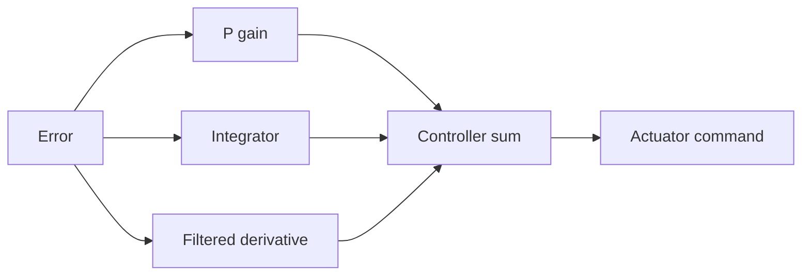

# PID, Lead, Lag, and Lag-Lead Compensators

Classical controllers add simple dynamics to reshape steady-state error, transient response, and robustness. Nise discusses compensation primarily through root locus and frequency response. The familiar PI, PD, and PID actions fit naturally into that framework: proportional gain moves poles along an existing locus, integral action adds low-frequency gain, and derivative action adds phase lead.

This page emphasizes what each compensator changes structurally. A controller is not chosen because its name is familiar; it is chosen because the plant's deficiencies are clear. If the system is too slow, lacks damping, or has inadequate phase margin, lead or derivative action may help. If tracking error is too large, integral or lag action may help. If both are inadequate, combined compensation is needed.


*Figure: Feedback loop block diagram in control theory. Image: [Wikimedia Commons](https://commons.wikimedia.org/wiki/File:Feedback_Loop.svg), Inductiveload, public domain.*

## Definitions

The ideal PID controller is

$$
G_c(s)=K_p+\frac{K_i}{s}+K_d s
=\frac{K_ds^2+K_ps+K_i}{s}.
$$

The proportional term acts on present error, the integral term accumulates error, and the derivative term reacts to the error slope. In physical implementations, derivative action is usually filtered:

$$
G_D(s)=\frac{K_d s}{\tau_d s+1}
$$

to avoid excessive noise amplification.

A PI controller is

$$
G_{PI}(s)=K_p+\frac{K_i}{s}
=K_p\frac{s+K_i/K_p}{s}.
$$

It adds one pole at the origin and one zero on the real axis. The pole increases system type and improves steady-state tracking; the zero partly restores phase.

A PD controller is

$$
G_{PD}(s)=K_p+K_d s=K_d(s+K_p/K_d).
$$

It adds a zero and can improve damping and speed, but it does not increase system type.

Lead, lag, and lag-lead forms are

$$
G_{\text{lead}}(s)=K\frac{s+z}{s+p},\quad |z|<|p|,
$$

$$
G_{\text{lag}}(s)=K\frac{s+z}{s+p},\quad |p|<|z|,
$$

and products of these factors for lag-lead compensation.

## Key results

The compensator effects can be summarized:

| Controller | Adds | Main benefit | Main concern |
|---|---|---|---|
| P | gain | simple speed/error adjustment | overshoot and margin loss |
| PI | integrator and zero | zero step error for Type 0 plants | slower response, windup |
| PD | zero | damping and phase lead | noise sensitivity |
| PID | integrator plus two zeros | error and transient shaping | tuning and saturation |
| lead | LHP zero and farther LHP pole | phase margin, faster response | high-frequency gain |
| lag | near-origin pole-zero pair | low-frequency gain | slow tail |
| lag-lead | lag times lead | combined accuracy and transient improvement | complexity |

Integral action changes the low-frequency behavior by adding a pole at the origin. For unity feedback, this can turn a Type 0 system into Type 1 and eliminate steady-state error to a step. It also adds $-90^\circ$ phase, so uncompensated integral action can reduce stability margin.

Derivative or lead action contributes positive phase over a frequency band. In root-locus terms, a zero can attract the locus toward a better damping region. In frequency-response terms, lead compensation raises phase margin near crossover.

Practical PID control includes saturation handling. When an actuator saturates, the integral state can continue accumulating, producing **integrator windup**. Anti-windup logic limits or back-calculates the integrator so the controller recovers cleanly when the actuator leaves saturation.

The three PID terms can be viewed through the same pole-zero language as lead and lag compensation. PI adds a pole at the origin and a finite zero. The pole increases type; the zero helps recover phase lost by the integrator. PD adds a finite zero and therefore resembles an ideal lead element without the high-frequency pole needed for physical filtering. PID combines an integrator with two zeros, allowing one zero to improve transient response while the integrator improves low-frequency accuracy.

Setpoint weighting is a practical refinement. In many industrial controllers, proportional and derivative actions are not applied to the reference in exactly the same way they are applied to the measured output. This prevents a sudden setpoint step from creating an unnecessarily large derivative kick or proportional jump. The linear transfer-function framework can still represent these choices, but the block diagram must distinguish reference paths from feedback paths.

Derivative action should almost always be taken on the measured output rather than on the error when references change abruptly. If $e=r-y$, then a step in $r$ has an impulse-like derivative. A derivative kick can saturate the actuator even though the plant has not yet moved. Filtering derivative action and applying it to $-y$ reduces this issue while retaining damping against rapid output motion.

PI control is common in process control because many thermal, fluid, and chemical systems need zero steady offset more than aggressive speed. PD or lead-like control is common in motion control because damping and phase lead are often needed for inertial plants. PID appears when both requirements matter. These are tendencies, not rules; the plant dynamics and specifications should choose the controller.

Tuning methods such as trial-and-error, Ziegler-Nichols-style rules, root locus, and frequency-response design all produce candidate gains. None remove the need to check closed-loop stability, actuator saturation, noise sensitivity, and disturbance rejection. A PID controller is simple enough to tune casually, but important systems still require the same rigor as any other feedback design.

Controller form also matters. The "parallel" PID form $K_p+K_i/s+K_ds$ and the "series" or "interacting" form built from first-order factors do not use the same numerical parameters. Commercial controllers may define reset time, rate time, derivative filter ratio, setpoint weights, and output limits differently. Before transferring gains between software, hardware, or a textbook calculation, convert the controller form explicitly.

Derivative filtering and anti-windup are not optional embellishments in most real systems. They determine how the controller behaves under noisy measurement and saturation, exactly where ideal linear PID assumptions are weakest. A good implementation document states the filter time constant, saturation limits, integral clamping or back-calculation rule, and sample time for digital PID.

The best PID settings are plant-specific.

## Visual



| Frequency region | Lag action | Lead action |
|---|---|---|
| low frequency | increases gain | approximately unchanged or modest change |
| crossover | usually little phase change if placed low | adds positive phase |
| high frequency | gain returns lower | may increase noise gain |
| root-locus view | near-origin pole-zero pair | zero-pole pair supplies angle |

## Worked example 1: PI controller and system type

Problem: A plant is

$$
G_p(s)=\frac{10}{s+5}
$$

with unity feedback. Compare the steady-state step error using proportional gain $K_p=2$ alone and using

$$
G_{PI}(s)=2+\frac{4}{s}.
$$

Method:

Proportional control:

1. Forward path:

$$
G(s)=2\frac{10}{s+5}=\frac{20}{s+5}.
$$

2. Position constant:

$$
K_p^{\text{static}}=\lim_{s\to0}G(s)=\frac{20}{5}=4.
$$

3. Step error:

$$
e_{ss}=\frac{1}{1+4}=0.2.
$$

PI control:

1. Rewrite controller:

$$
G_{PI}(s)=\frac{2s+4}{s}=2\frac{s+2}{s}.
$$

2. Forward path:

$$
G(s)=2\frac{s+2}{s}\frac{10}{s+5}
=\frac{20(s+2)}{s(s+5)}.
$$

3. The forward path has one pole at the origin, so it is Type 1.

4. For a unit step, Type 1 gives

$$
K_p^{\text{static}}=\infty,\qquad e_{ss}=0.
$$

Checked answer: proportional control gives step error $0.2$; PI control eliminates step error, assuming the closed loop remains stable.

## Worked example 2: derivative zero placement

Problem: A PD controller has

$$
G_{PD}(s)=K_d(s+z).
$$

Choose $z$ so the zero is at $s=-4$. If $K_d=0.5$, find the equivalent $K_p+K_ds$ form.

Method:

1. A zero at $s=-4$ means the factor is

$$
s+4.
$$

Thus

$$
z=4.
$$

2. Substitute $K_d=0.5$:

$$
G_{PD}(s)=0.5(s+4).
$$

3. Expand:

$$
G_{PD}(s)=0.5s+2.
$$

4. Match to

$$
K_p+K_ds.
$$

Therefore

$$
K_d=0.5,\qquad K_p=2.
$$

Checked answer: the controller is $G_{PD}(s)=2+0.5s$, with zero at $-K_p/K_d=-4$.

## Code

```python
import numpy as np
from scipy import signal

# Plant: 10/(s+5)
plant_num = [10]
plant_den = [1, 5]

# P controller Kp = 2
L_p_num = np.polymul([2], plant_num)
L_p_den = plant_den
T_p_num = L_p_num
T_p_den = np.polyadd(L_p_den, L_p_num)

# PI controller: (2s + 4)/s
pi_num = [2, 4]
pi_den = [1, 0]
L_pi_num = np.polymul(pi_num, plant_num)
L_pi_den = np.polymul(pi_den, plant_den)
T_pi_den = np.polyadd(L_pi_den, L_pi_num)

print("P closed-loop poles:", np.roots(T_p_den))
print("PI closed-loop poles:", np.roots(T_pi_den))

t = np.linspace(0, 8, 400)
_, y_p = signal.step(signal.TransferFunction(T_p_num, T_p_den), T=t)
_, y_pi = signal.step(signal.TransferFunction(L_pi_num, T_pi_den), T=t)
print("P final value:", y_p[-1])
print("PI final value:", y_pi[-1])
```

## Common pitfalls

- Using ideal derivative action without filtering in a noisy measurement loop.
- Adding integral action without checking stability margins or actuator saturation.
- Confusing a lag compensator with a PI controller. Both improve low-frequency behavior, but PI has a pole exactly at the origin.
- Assuming PID tuning can fix an inadequate actuator or sensor.
- Placing compensator zeros to cancel unstable plant poles. Exact cancellation is not robust and can hide dangerous internal dynamics.
- Ignoring units. $K_p$, $K_i$, and $K_d$ have different dimensions.

## Connections

- [Steady-state errors](/cs/control-engineering/steady-state-errors-and-sensitivity) explains why integral and lag action reduce final error.
- [Root-locus design](/cs/control-engineering/root-locus-design-and-classical-compensation) designs compensator pole-zero locations in the $s$-plane.
- [Bode plots](/cs/control-engineering/bode-plots-and-frequency-response) show the phase and gain effects of lead and lag.
- [Frequency-response design](/cs/control-engineering/frequency-response-compensator-design) tunes lead and lag by margins.
- [Applied vehicle control](/cs/autonomous-driving/control-pid-mpc-pure-pursuit-stanley) uses PID alongside geometric and optimization-based controllers.
