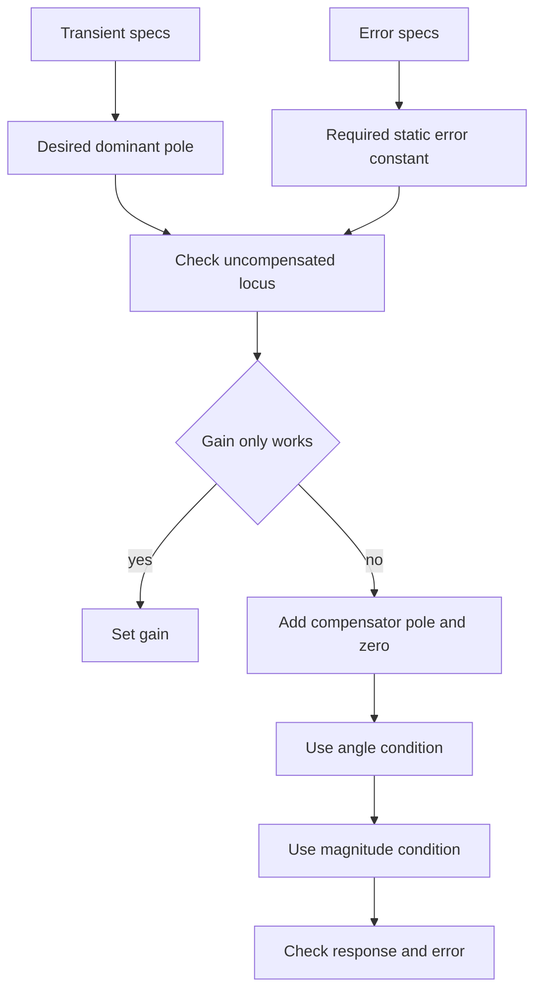

# Root Locus Design and Classical Compensation

Root-locus design asks whether the existing closed-loop pole paths can meet specifications. If simple gain adjustment is enough, the design is economical. If the root locus misses the desired region or creates an unacceptable steady-state error trade-off, the controller must add dynamics. Nise's design chapter develops cascade compensation for improving steady-state error, transient response, or both.

The engineering pattern is consistent: translate specifications into desired dominant pole locations and error constants, inspect the uncompensated root locus, then add poles and zeros to reshape the locus and low-frequency gain. The compensator is not a mathematical decoration. It represents hardware or software that must be physically realized and must not demand impossible actuator behavior.

## Definitions

A **cascade compensator** is placed in series with the plant:

$$
G_{\text{new}}(s)=G_c(s)G_p(s).
$$

Common first-order compensator forms are

$$
G_c(s)=K_c\frac{s+z_c}{s+p_c}.
$$

A **lead compensator** has its zero closer to the origin than its pole in the usual left-half-plane notation:

$$
|z_c|<|p_c|.
$$

It contributes positive phase near the desired pole location and tends to improve transient response by pulling the root locus left.

A **lag compensator** has its pole closer to the origin than its zero:

$$
|p_c|<|z_c|.
$$

It mainly increases low-frequency gain and improves steady-state error while trying to leave dominant transient poles nearly unchanged.

A **lag-lead compensator** combines both effects: the lead part improves transient response and stability geometry, while the lag part improves static error constants.

Dominant pole design chooses desired poles from transient specifications. For example, from percent overshoot one obtains $\zeta$; from settling time one obtains $\zeta\omega_n$; the desired pole is

$$
s_d=-\zeta\omega_n+j\omega_n\sqrt{1-\zeta^2}.
$$

## Key results

Root-locus compensation uses the angle deficiency. Suppose the desired pole $s_d$ does not lie on the uncompensated root locus. Compute

$$
\phi_{\text{plant}}=\angle G_p(s_d)H(s_d).
$$

For negative feedback, the total angle must be an odd multiple of $180^\circ$. The compensator must supply

$$
\phi_c=(2k+1)180^\circ-\phi_{\text{plant}}.
$$

A lead compensator supplies positive phase by placing a zero and pole so that

$$
\angle(s_d+z_c)-\angle(s_d+p_c)=\phi_c.
$$

After the angle condition is satisfied, the gain is set by the magnitude condition:

$$
K=\frac{1}{|G_c(s_d)G_p(s_d)H(s_d)|}.
$$

For lag compensation, the pole-zero pair is often placed near the origin and close together. At the desired dominant pole, their angle contribution is small, so the transient locus changes little. At low frequency, however,

$$
G_c(0)=K_c\frac{z_c}{p_c},
$$

which can increase the relevant static error constant by approximately $z_c/p_c$ if $z_c\gt p_c$ in positive magnitudes.

The design trade-off is that every compensator adds dynamics. A lead pole too far left may demand high-frequency gain and amplify noise. A lag pole too close to the origin can slow settling through a long tail. A lag-lead design can meet both transient and steady-state goals but is more complex.

Gain-only design should be checked first because it is the simplest possible controller change. If the uncompensated root locus passes through the desired transient region and the resulting static error constant is acceptable, adding a compensator only increases complexity. Nise's design philosophy is conservative in that sense: compensate when a specific deficiency has been identified, not because compensation is fashionable.

Lead compensation is often interpreted geometrically. The desired pole is short of the angle condition by some amount. A lead zero is placed so it contributes a helpful positive angle, and the lead pole is placed farther left so its negative angle is smaller at the desired point. The separation between pole and zero controls the amount of phase lead. The pole cannot be moved arbitrarily far left without increasing high-frequency gain and implementation burden.

Lag compensation is deliberately subtle at the dominant poles. The lag pole and zero are placed near the origin so their angles at the desired dominant pole nearly cancel. Their magnitudes at low frequency do not cancel, however, so the static error constant improves. This is why lag design is usually described as improving steady-state error while approximately preserving transient response. The word "approximately" matters; the added slow pole may still be visible.

Lag-lead design is not just "lag plus lead" in any order. The lead portion is normally selected to satisfy transient requirements and phase or angle deficiency. The lag portion is then selected to meet the error constant while disturbing the chosen dominant poles as little as possible. The final gain is recomputed after both pieces are included, and the full closed-loop response is checked for extra modes introduced by the compensator.

Physical realization closes the loop between algebra and hardware. An analog lead or lag network can be implemented with resistors, capacitors, and operational amplifiers; a digital compensator implements the same transfer function as a difference equation. Component tolerances, finite sampling, quantization, saturation, and noise all change the ideal design. A compensator that meets a pencil-and-paper specification but cannot be implemented robustly is not a finished controller.

A useful final check is sensitivity to compensator placement. If a design works only when a compensator zero exactly cancels a plant pole or when a pole is placed at a finely tuned location, it may be fragile. Shifting compensator poles and zeros by realistic tolerances should not destroy stability or violate the main specification. This tolerance check is the root-locus counterpart of gain and phase margin in frequency design.

Designs should also be checked against the full characteristic equation, not only the intended dominant poles. Additional compensator poles can introduce slow modes or lightly damped modes. If those modes are not sufficiently far left or have large residues, the actual response will not match the dominant second-order prediction.

## Visual



| Compensator | Root-locus purpose | Steady-state effect | Risk |
|---|---|---|---|
| gain $K$ | move poles along existing locus | changes finite error constants | transient-error trade-off |
| lead | move locus toward desired transient region | may modestly change error | noise amplification |
| lag | increase low-frequency gain | strong improvement | slow pole tail |
| lag-lead | satisfy both transient and error specs | strong improvement | more tuning complexity |

## Worked example 1: desired pole from overshoot and settling time

Problem: A design requires percent overshoot $\%OS=10\%$ and $2\%$ settling time $T_s=2$ s. Find the desired dominant pole location using standard second-order approximations.

Method:

1. Use the overshoot formula:

$$
0.10=e^{-\zeta\pi/\sqrt{1-\zeta^2}}.
$$

2. Take the natural log:

$$
\ln(0.10)=-\frac{\zeta\pi}{\sqrt{1-\zeta^2}}.
$$

Since $\ln(0.10)=-2.3026$,

$$
2.3026=\frac{\zeta\pi}{\sqrt{1-\zeta^2}}.
$$

3. Solve using the standard rearrangement:

$$
\zeta=\frac{-\ln(0.10)}{\sqrt{\pi^2+\ln^2(0.10)}}.
$$

Thus

$$
\zeta=\frac{2.3026}{\sqrt{9.8696+5.3019}}=\frac{2.3026}{3.895}=0.591.
$$

4. Use settling time:

$$
T_s\approx\frac{4}{\zeta\omega_n}=2.
$$

Therefore

$$
\zeta\omega_n=2.
$$

5. The real part is $-2$. Find $\omega_n$:

$$
\omega_n=\frac{2}{0.591}=3.384.
$$

6. Imaginary part:

$$
\omega_d=\omega_n\sqrt{1-\zeta^2}
=3.384\sqrt{1-0.591^2}.
$$

Since $\sqrt{1-0.349}=0.807$,

$$
\omega_d=2.73.
$$

Checked answer: desired dominant poles are approximately $s=-2\pm j2.73$.

## Worked example 2: lag ratio for error improvement

Problem: A Type 1 unity-feedback system has $K_v=4$, but the specification requires ramp error no larger than $0.05$. Estimate the low-frequency lag compensation ratio needed if the transient pole location should remain nearly unchanged.

Method:

1. Ramp error for Type 1 is

$$
e_{ss}=\frac{1}{K_v}.
$$

2. Required error:

$$
e_{ss}\le0.05.
$$

Therefore

$$
K_v^{\text{required}}\ge\frac{1}{0.05}=20.
$$

3. Existing $K_v=4$. Improvement factor:

$$
\beta=\frac{20}{4}=5.
$$

4. A lag compensator with dc gain ratio approximately

$$
\frac{z_c}{p_c}=5
$$

can raise $K_v$ by this factor if the pole-zero pair is placed near the origin and close enough to avoid large angle change at the dominant poles.

5. Example choice:

$$
z_c=0.1,\qquad p_c=0.02.
$$

Then

$$
\frac{z_c}{p_c}=5.
$$

Checked answer: a lag ratio of about $5$ is required. The exact design must still verify transient response because the added pole can introduce a slow mode.

## Code

```python
import numpy as np

percent_overshoot = 10.0
Ts = 2.0
os_fraction = percent_overshoot / 100

zeta = -np.log(os_fraction) / np.sqrt(np.pi**2 + np.log(os_fraction)**2)
sigma = 4 / Ts
wn = sigma / zeta
wd = wn * np.sqrt(1 - zeta**2)
sd = -sigma + 1j * wd

print(f"zeta: {zeta:.3f}")
print(f"desired pole: {sd.real:.3f} + j{sd.imag:.3f}")

Kv_old = 4.0
ess_required = 0.05
Kv_required = 1 / ess_required
lag_ratio = Kv_required / Kv_old
print("lag ratio:", lag_ratio)
```

## Common pitfalls

- Designing a compensator before translating specifications into pole and error targets.
- Assuming a lag compensator never changes transients. It should be checked because its pole may add a slow mode.
- Placing a lead pole and zero without satisfying the angle condition at the desired pole.
- Forgetting to recompute gain after adding compensator dynamics.
- Meeting dominant pole specs while ignoring closed-loop zeros and nondominant poles.
- Treating physical realization as automatic. Analog circuits, digital filters, and actuators impose constraints.

## Connections

- [Root-locus sketching](/cs/control-engineering/root-locus-sketching-and-analysis) gives the angle and magnitude conditions.
- [Steady-state errors](/cs/control-engineering/steady-state-errors-and-sensitivity) supplies $K_p$, $K_v$, and $K_a$ targets.
- [PID and compensators](/cs/control-engineering/pid-lead-lag-and-lag-lead-compensators) compares classical controller structures.
- [Frequency-response design](/cs/control-engineering/frequency-response-compensator-design) designs similar compensators using phase and gain margins.
- [Applied vehicle control](/cs/autonomous-driving/control-pid-mpc-pure-pursuit-stanley) uses related compensation ideas in motion control.
