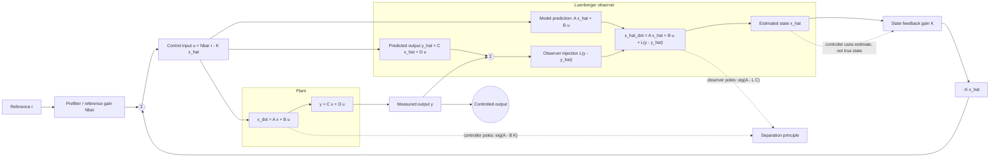

# State-Space Controller and Observer Design

State-space design moves beyond shaping transfer-function plots and directly assigns the dynamics of internal state equations. Nise's state-space design chapter develops controllability, pole placement, Ackermann's formula, observer design, observability, and integral control for steady-state error. This page also adds a short supplementary LQR overview because it is the standard modern extension of the same framework.


*Figure: The cart-pendulum is a concrete plant for modeling, stabilization, and control design. Image: [Wikimedia Commons](https://commons.wikimedia.org/wiki/File:Cart-pendulum.svg), Krishnavedala, CC0.*

The state-space viewpoint is powerful because it separates what can be controlled from what can be measured. A plant may have states that are not directly sensed, so an observer estimates them. A plant may have modes that an input cannot influence, so pole placement cannot move them. These structural questions must be answered before choosing gains.

## Definitions

For a single-input system

$$
\dot{\mathbf x}=A\mathbf x+B u,
\qquad y=C\mathbf x,
$$

state feedback uses

$$
u=-K\mathbf x+r
$$

or a scaled reference variant. The closed-loop state matrix is

$$
A_{\text{cl}}=A-BK.
$$

The system is **controllable** if the input can move the state from any initial condition to any final condition in finite time. For an $n$th-order single-input system, the controllability matrix is

$$
\mathcal C=\begin{bmatrix}B&AB&A^2B&\cdots&A^{n-1}B\end{bmatrix}.
$$

The system is controllable if

$$
\operatorname{rank}(\mathcal C)=n.
$$

The system is **observable** if the initial state can be determined from the input-output history. The observability matrix is

$$
\mathcal O=
\begin{bmatrix}
C\\
CA\\
CA^2\\
\vdots\\
CA^{n-1}
\end{bmatrix},
$$

with observability requiring rank $n$.

A full-order observer has the form

$$
\dot{\hat{\mathbf x}}=A\hat{\mathbf x}+Bu+L(y-C\hat{\mathbf x}).
$$

The estimation error $\mathbf e=\mathbf x-\hat{\mathbf x}$ evolves as

$$
\dot{\mathbf e}=(A-LC)\mathbf e.
$$

## Key results

If $(A,B)$ is controllable, state feedback can assign the eigenvalues of $A-BK$ arbitrarily, within real-coefficient conjugate-pair constraints. Ackermann's formula gives a direct single-input gain:

$$
K=\begin{bmatrix}0&0&\cdots&1\end{bmatrix}\mathcal C^{-1}\phi_d(A),
$$

where $\phi_d(s)$ is the desired characteristic polynomial.

If $(A,C)$ is observable, observer gain $L$ can assign eigenvalues of $A-LC$. Observer poles are usually placed faster than controller poles so estimation error decays quickly, but not so fast that measurement noise is excessively amplified.

Integral control can be added by augmenting the state with an integral of tracking error:

$$
x_i=\int(r-y)\,dt.
$$

The augmented system can then be controlled with

$$
u=-K_x\mathbf x+K_i x_i.
$$

This brings the steady-state error benefits of integral action into state-space design.

Supplementary LQR overview: Linear Quadratic Regulator design chooses $K$ to minimize

$$
J=\int_0^\infty \left(\mathbf x^TQ\mathbf x+u^TRu\right)dt,
$$

where $Q\succeq0$ penalizes state deviation and $R\succ0$ penalizes control effort. LQR does not place poles manually; it finds a gain from a trade-off. This is beyond Nise's main undergraduate development but is the standard next step after pole placement.

Pole placement provides exact algebraic control over eigenvalues, but it does not directly specify control effort or sensitivity. Placing poles very far left makes the nominal response fast, yet it can require large actuator commands and amplify measurement noise when implemented with an observer. The resulting system may saturate, excite neglected dynamics, or become fragile under parameter uncertainty. This is why pole locations are design variables, not trophies.

Reference tracking with state feedback usually needs an additional feedforward gain. The law $u=-Kx$ drives the state to the origin. If the desired output is a nonzero constant reference, one may use $u=-Kx+N_rr$ and choose $N_r$ so the steady output equals $r$. Integral augmentation is another approach, and it is more robust to constant disturbances or plant gain errors because it drives accumulated error toward zero.

The separation principle is the key reason observer-based control is manageable for linear systems. Under standard controllability and observability assumptions, the state-feedback gain $K$ and observer gain $L$ can be designed separately. The combined closed-loop poles are the controller poles together with the observer error poles. This does not mean the designs are independent in practice: fast observer poles can inject noise into the control input, and slow observer poles can make the controller act on poor estimates.

Observability depends on sensors, not only on the plant. A mechanical system with position measurement may be observable because velocity can be inferred from position history through the dynamics. A system with an unfortunate sensor location may hide an important vibration mode. Adding a sensor, changing the measured output, or estimating a disturbance as an augmented state can change the design problem fundamentally.

LQR adds a more systematic way to trade state error against input effort. Large entries in $Q$ tell the design that certain states are expensive; large entries in $R$ tell it that control effort is expensive. The resulting poles often move in sensible ways without being hand assigned. LQR still requires engineering judgment: the weights must reflect units, safety limits, and performance priorities, and the resulting response must be checked just like a pole-placement design.

Integral augmentation changes controllability requirements. Adding an integral-of-error state creates a larger augmented matrix. The augmented pair must be controllable for arbitrary pole placement of the combined plant and integrator dynamics. If the plant has a zero at the origin or cannot influence the measured output in steady state, adding an integrator may not solve the tracking problem and can instead create instability.

Observer-based control should be validated with model error. If $A$, $B$, or $C$ differ from the real plant, the observer may converge to a biased estimate. Constant disturbances can be handled by augmenting the observer with disturbance states, but only when the augmented system remains observable. This is a common bridge from Nise's observer design to practical estimators and Kalman filters.

State-space design is also sensitive to scaling. A state measured in millimeters and another measured in radians per second may have very different numerical magnitudes. Poor scaling can make rank tests, pole placement, and LQR calculations ill-conditioned. Before blaming an algorithm, check units and consider nondimensionalization or physically meaningful scaling.

Simulation should include both the true state and the estimated state when observers are used. Plotting the estimation error directly reveals whether poor output response is caused by controller poles, observer transients, measurement noise, or model mismatch.

This plot is often the fastest diagnostic.

## Visual



This diagram shows the separation-principle architecture: the controller places the poles of `A - B K` using the estimated state, while the observer drives estimation error through the innovation `y - y_hat` and poles of `A - L C`. The plant, observer model, reference prefilter, and feedback path are separate blocks so the I/O contract is clear even when not all states are measured.

| Concept | Matrix test | Design implication |
|---|---|---|
| controllability | rank $\mathcal C=n$ | state feedback can place poles |
| observability | rank $\mathcal O=n$ | observer can estimate states |
| state feedback | eigenvalues of $A-BK$ | controls plant dynamics |
| observer | eigenvalues of $A-LC$ | controls estimation error |
| integral augmentation | add error-integral state | improves tracking accuracy |

## Worked example 1: controllability and pole placement

Problem: For

$$
A=\begin{bmatrix}0&1\\-2&-3\end{bmatrix},
\qquad
B=\begin{bmatrix}0\\1\end{bmatrix},
$$

find $K=\begin{bmatrix}k_1&k_2\end{bmatrix}$ so the closed-loop poles are at $-4$ and $-5$.

Method:

1. Check controllability:

$$
AB=
\begin{bmatrix}0&1\\-2&-3\end{bmatrix}
\begin{bmatrix}0\\1\end{bmatrix}
=\begin{bmatrix}1\\-3\end{bmatrix}.
$$

Thus

$$
\mathcal C=
\begin{bmatrix}
0&1\\
1&-3
\end{bmatrix}.
$$

The determinant is

$$
0(-3)-1(1)=-1\ne0,
$$

so the system is controllable.

2. Closed-loop matrix:

$$
A-BK=
\begin{bmatrix}0&1\\-2&-3\end{bmatrix}
-\begin{bmatrix}0\\1\end{bmatrix}
\begin{bmatrix}k_1&k_2\end{bmatrix}
=
\begin{bmatrix}
0&1\\
-2-k_1&-3-k_2
\end{bmatrix}.
$$

3. Characteristic polynomial:

$$
\det(sI-(A-BK))=s^2+(3+k_2)s+(2+k_1).
$$

4. Desired polynomial:

$$
(s+4)(s+5)=s^2+9s+20.
$$

5. Match coefficients:

$$
3+k_2=9\Rightarrow k_2=6,
$$

$$
2+k_1=20\Rightarrow k_1=18.
$$

Checked answer: $K=\begin{bmatrix}18&6\end{bmatrix}$.

## Worked example 2: observability and observer gain

Problem: For the same $A$ but with

$$
C=\begin{bmatrix}1&0\end{bmatrix},
$$

find $L=\begin{bmatrix}l_1\\l_2\end{bmatrix}$ so observer error poles are at $-6$ and $-7$.

Method:

1. Observability matrix:

$$
CA=\begin{bmatrix}1&0\end{bmatrix}
\begin{bmatrix}0&1\\-2&-3\end{bmatrix}
=\begin{bmatrix}0&1\end{bmatrix}.
$$

Thus

$$
\mathcal O=
\begin{bmatrix}
1&0\\
0&1
\end{bmatrix},
$$

rank $2$, so the system is observable.

2. Observer error matrix:

$$
A-LC=
\begin{bmatrix}0&1\\-2&-3\end{bmatrix}
-\begin{bmatrix}l_1\\l_2\end{bmatrix}
\begin{bmatrix}1&0\end{bmatrix}
=
\begin{bmatrix}
-l_1&1\\
-2-l_2&-3
\end{bmatrix}.
$$

3. Characteristic polynomial:

$$
\det\begin{bmatrix}
s+l_1&-1\\
2+l_2&s+3
\end{bmatrix}
=(s+l_1)(s+3)+(2+l_2).
$$

Expand:

$$
s^2+(3+l_1)s+(3l_1+2+l_2).
$$

4. Desired polynomial:

$$
(s+6)(s+7)=s^2+13s+42.
$$

5. Match:

$$
3+l_1=13\Rightarrow l_1=10.
$$

$$
3l_1+2+l_2=42\Rightarrow 30+2+l_2=42\Rightarrow l_2=10.
$$

Checked answer: $L=\begin{bmatrix}10\\10\end{bmatrix}$.

## Code

```python
import numpy as np
from scipy.signal import place_poles

A = np.array([[0.0, 1.0], [-2.0, -3.0]])
B = np.array([[0.0], [1.0]])
C = np.array([[1.0, 0.0]])

Ctrb = np.column_stack([B, A @ B])
Obsv = np.vstack([C, C @ A])
print("controllability rank:", np.linalg.matrix_rank(Ctrb))
print("observability rank:", np.linalg.matrix_rank(Obsv))

K = place_poles(A, B, [-4, -5]).gain_matrix
L = place_poles(A.T, C.T, [-6, -7]).gain_matrix.T
print("K:", K)
print("controller poles:", np.linalg.eigvals(A - B @ K))
print("L:", L)
print("observer poles:", np.linalg.eigvals(A - L @ C))
```

## Common pitfalls

- Attempting pole placement before checking controllability.
- Designing an observer before checking observability.
- Placing observer poles extremely fast and then amplifying sensor noise.
- Forgetting reference scaling. State feedback $u=-Kx$ regulates to zero unless command tracking is added.
- Assuming all states are measured. If only output is available, use observer-based feedback.
- Treating LQR weights as magic tuning knobs without checking actuator limits and response.

## Connections

- [State-space modeling](/cs/control-engineering/state-space-modeling-and-conversions) introduces $A$, $B$, $C$, and $D$.
- [Routh-Hurwitz stability](/cs/control-engineering/routh-hurwitz-stability) tests desired characteristic polynomials.
- [Steady-state errors](/cs/control-engineering/steady-state-errors-and-sensitivity) motivates integral augmentation.
- [Digital control](/cs/control-engineering/digital-control-sampling-and-z-transform) extends state feedback to sampled implementations.
- [Autonomous driving control](/cs/autonomous-driving/control-pid-mpc-pure-pursuit-stanley) uses state feedback and observer ideas in applied systems.
