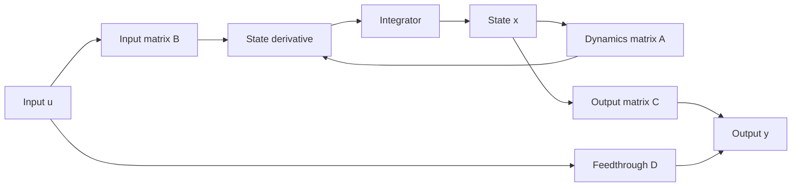

# State-Space Modeling and Conversions

Transfer functions describe the input-output behavior of linear systems, but they hide internal variables. State-space modeling exposes those variables directly. Nise introduces state space as the time-domain representation built from first-order differential equations, useful for simulation, multi-output systems, controllability, observability, and modern controller design.

The shift is conceptual. Instead of asking only for $C(s)/R(s)$, we choose a vector of state variables whose present values, together with the input, determine the future motion. The state model can then be converted to and from transfer-function form, but many design questions are easier to state using the matrices $A$, $B$, $C$, and $D$.

## Definitions

The continuous-time linear time-invariant state-space representation is

$$
\dot{\mathbf x}=A\mathbf x+B\mathbf u,
\qquad
\mathbf y=C\mathbf x+D\mathbf u.
$$

Here $\mathbf x$ is the state vector, $\mathbf u$ is the input vector, and $\mathbf y$ is the output vector. The matrix $A$ describes internal dynamics, $B$ maps inputs into states, $C$ maps states to outputs, and $D$ is direct feedthrough.

A **state variable** is one member of a minimal set of variables that describes the system memory. In electrical networks, capacitor voltages and inductor currents are natural choices because they represent stored energy. In mechanical systems, positions and velocities are common choices.

The transfer function associated with a single-input single-output state model is

$$
G(s)=C(sI-A)^{-1}B+D.
$$

The eigenvalues of $A$ are the system poles for a minimal realization. They are found from

$$
\det(sI-A)=0.
$$

A **similarity transformation** changes coordinates without changing input-output behavior. If

$$
\mathbf x=P\mathbf z,
$$

then

$$
\dot{\mathbf z}=P^{-1}AP\mathbf z+P^{-1}B\mathbf u,
\qquad
\mathbf y=CP\mathbf z+D\mathbf u.
$$

## Key results

For a monic transfer function

$$
G(s)=\frac{b_{n-1}s^{n-1}+\cdots+b_1s+b_0}
{s^n+a_{n-1}s^{n-1}+\cdots+a_1s+a_0},
$$

one phase-variable realization is

$$
A=
\begin{bmatrix}
0&1&0&\cdots&0\\
0&0&1&\cdots&0\\
\vdots&\vdots&\vdots&\ddots&\vdots\\
0&0&0&\cdots&1\\
-a_0&-a_1&-a_2&\cdots&-a_{n-1}
\end{bmatrix},
\quad
B=
\begin{bmatrix}
0\\0\\\vdots\\0\\1
\end{bmatrix},
$$

with

$$
C=\begin{bmatrix}b_0&b_1&\cdots&b_{n-1}\end{bmatrix},
\qquad D=0
$$

when the numerator order is less than the denominator order and the realization is arranged in this phase-variable form. Nise uses this form because the pattern makes the denominator coefficients visible in the last row.

State equations are not unique. Infinitely many coordinate choices describe the same input-output map. This matters because some coordinates are physically meaningful while others are computationally convenient. For example, capacitor voltages and inductor currents are easy to interpret in a circuit, while controller canonical form is easy to use for pole placement.

The time-domain solution separates zero-input and zero-state responses:

$$
\mathbf x(t)=e^{At}\mathbf x(0)+\int_0^t e^{A(t-\tau)}B\mathbf u(\tau)\,d\tau.
$$

The first term is due to initial conditions. The second term is due to the input. This is the state-space counterpart of natural and forced response.

The matrix exponential $e^{At}$ is the state-space equivalent of modal exponentials from differential equations. If $A$ has eigenvalue $-3$, the response contains an $e^{-3t}$ mode. If $A$ has eigenvalues $-2\pm j5$, the response contains a sinusoid at $5$ rad/s under an $e^{-2t}$ envelope. When $A$ is diagonalizable, a coordinate transformation can expose independent modal coordinates. When it is defective, Jordan forms introduce polynomial factors multiplying exponentials.

State selection affects interpretability but not the underlying physics. Energy variables such as capacitor voltage and inductor current often lead to sparse equations and clear physical meaning. Phase variables lead to a standard companion form that is convenient for converting from transfer functions. Modal variables decouple the dynamics when possible. Balanced or scaled coordinates can improve numerical conditioning. A poor coordinate choice can make a simple system look complicated, especially when units differ by many orders of magnitude.

The feedthrough matrix $D$ deserves attention. Many strictly proper physical plants have $D=0$ because the output cannot change instantaneously in response to the input. Some measurement equations or algebraic interconnections do have direct feedthrough. In simulation, direct feedthrough can create algebraic loops when systems are interconnected. In transfer functions, nonzero $D$ corresponds to a numerator with the same degree as the denominator after polynomial division.

Minimality connects controllability and observability to transfer functions. A realization can contain a mode that the input cannot excite or the output cannot see. Such a mode may cancel from $G(s)$, but it still exists in the state equations. For design, this is not a minor bookkeeping issue. An uncontrollable unstable mode cannot be stabilized by state feedback. An unobservable unstable mode cannot be detected from the measured output. Later state-space design therefore begins with rank tests rather than gain selection.

State-space models also handle multiple inputs and outputs naturally. A motor drive may have voltage input, load-torque disturbance input, position output, and current output. Transfer-function notation can represent each input-output pair, but the state model represents all of them in one set of equations. This is why modern control, observers, Kalman filtering, and multivariable design use state-space notation as their default language.

Conversion from transfer function to state space is not unique, and software may return a different realization from the phase-variable form shown in class. MATLAB, SciPy, and python-control often use controller or observer canonical forms with state ordering choices that differ from a hand derivation. If the transfer function matches and the realization is minimal, the difference is usually just a coordinate transformation.

For simulation, state-space form handles arbitrary inputs and initial conditions cleanly. Numerical integrators update $\dot x=Ax+Bu$ directly, and outputs are computed from $y=Cx+Du$. This avoids repeated inverse Laplace transforms and makes it straightforward to include disturbances, saturation blocks, or time-varying commands in a simulation environment.

When comparing a transfer function and a state model, check both poles and dc gain. Matching eigenvalues alone is not enough; the input and output matrices determine how modes are excited and observed. Matching dc gain alone is also not enough; the transient modes may still be wrong. The complete transfer function $C(sI-A)^{-1}B+D$ is the reliable comparison.

Document the state ordering next to every matrix.

Otherwise even correct matrices become difficult to review and reuse.

## Visual



| Representation | Best for | Main limitation |
|---|---|---|
| Differential equation | direct physical law statement | cumbersome for interconnection and design |
| Transfer function | input-output poles, zeros, block diagrams | hides internal state and initial conditions |
| State space | simulation, MIMO systems, modern design | coordinate choices are not unique |
| Signal-flow graph | visual interconnection and Mason formula | can become cluttered for large systems |

## Worked example 1: transfer function to phase-variable state space

Problem: Convert

$$
G(s)=\frac{4}{s^2+3s+2}
$$

to phase-variable state-space form.

Method:

1. Cross-multiply:

$$
(s^2+3s+2)C(s)=4R(s).
$$

2. Convert to the differential equation:

$$
\ddot c+3\dot c+2c=4r.
$$

3. Choose phase variables:

$$
x_1=c,\qquad x_2=\dot c.
$$

4. Differentiate:

$$
\dot x_1=x_2.
$$

5. Solve the differential equation for $\ddot c$:

$$
\ddot c=-2c-3\dot c+4r.
$$

Therefore

$$
\dot x_2=-2x_1-3x_2+4r.
$$

6. Write matrix form:

$$
\dot{\mathbf x}=
\begin{bmatrix}
0&1\\
-2&-3
\end{bmatrix}\mathbf x+
\begin{bmatrix}
0\\4
\end{bmatrix}r,
\qquad
y=\begin{bmatrix}1&0\end{bmatrix}\mathbf x.
$$

Checked answer: The characteristic equation of $A$ is $s^2+3s+2=0$, matching the transfer-function denominator.

## Worked example 2: state space to transfer function

Problem: Given

$$
A=\begin{bmatrix}0&1\\-6&-5\end{bmatrix},
\quad
B=\begin{bmatrix}0\\1\end{bmatrix},
\quad
C=\begin{bmatrix}2&1\end{bmatrix},
\quad
D=0,
$$

find $G(s)$.

Method:

1. Compute $sI-A$:

$$
sI-A=
\begin{bmatrix}
s&-1\\
6&s+5
\end{bmatrix}.
$$

2. Find its determinant:

$$
\det(sI-A)=s(s+5)-(-1)(6)=s^2+5s+6.
$$

3. Invert the $2\times2$ matrix:

$$
(sI-A)^{-1}=
\frac{1}{s^2+5s+6}
\begin{bmatrix}
s+5&1\\
-6&s
\end{bmatrix}.
$$

4. Multiply by $B$:

$$
(sI-A)^{-1}B=
\frac{1}{s^2+5s+6}
\begin{bmatrix}
1\\
s
\end{bmatrix}.
$$

5. Multiply by $C$:

$$
G(s)=\begin{bmatrix}2&1\end{bmatrix}
\frac{1}{s^2+5s+6}
\begin{bmatrix}
1\\s
\end{bmatrix}
=\frac{s+2}{s^2+5s+6}.
$$

Checked answer: $G(s)=(s+2)/[(s+2)(s+3)]=1/(s+3)$ after cancellation. The cancellation also warns that this realization is not minimal for this input-output map.

## Code

```python
import numpy as np
from scipy import signal

A = np.array([[0.0, 1.0], [-6.0, -5.0]])
B = np.array([[0.0], [1.0]])
C = np.array([[2.0, 1.0]])
D = np.array([[0.0]])

num, den = signal.ss2tf(A, B, C, D)
print("numerator coefficients:", np.round(num[0], 8))
print("denominator coefficients:", den)
print("A eigenvalues:", np.linalg.eigvals(A))

tf = signal.TransferFunction(num[0], den)
t, y = signal.step(tf)
print("step final value approx:", y[-1])
```

## Common pitfalls

- Assuming the state variables are unique. A coordinate transformation can change $A$, $B$, and $C$ without changing $G(s)$.
- Forgetting direct feedthrough $D$ for transfer functions whose numerator and denominator have equal degree.
- Calling eigenvalues of a nonminimal realization the visible poles of the transfer function. Pole-zero cancellations can hide modes from the input-output transfer function.
- Choosing too few state variables for a mechanical system. Each independent displacement usually contributes position and velocity states.
- Confusing zero-input response with transient response. Zero-input response is caused by initial state; transient response can also be input driven.

## Connections

- [Transfer functions and linearization](/cs/control-engineering/laplace-transfer-functions-and-linearization) introduce the input-output model converted here.
- [Block diagrams and Mason rule](/cs/control-engineering/block-diagrams-signal-flow-and-mason) includes signal-flow graphs of state equations.
- [State-space controller design](/cs/control-engineering/state-space-controller-observer-design) uses controllability and observability.
- [Routh-Hurwitz stability](/cs/control-engineering/routh-hurwitz-stability) applies to $\det(sI-A)$ as well as transfer-function denominators.
- [Simulation](/physics/simulation/) often uses state-space models directly.
