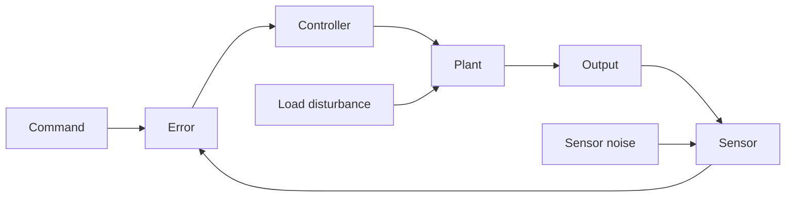

# Steady-State Errors and Sensitivity

Steady-state error measures the accuracy left after transients have died out. In Nise's sequence it follows stability because final error is meaningful only for stable closed-loop systems. A design that tracks accurately while unstable is not a design; it is an invalid calculation.

The chapter's main message is that low-frequency loop structure determines tracking accuracy. System type, static error constants, disturbance location, nonunity feedback, and parameter sensitivity all describe what remains after the fast behavior is gone. These ideas explain why integral action is so valuable and why gain alone often creates trade-offs with transient response.


*Figure: Feedback loop block diagram in control theory. Image: [Wikimedia Commons](https://commons.wikimedia.org/wiki/File:Feedback_Loop.svg), Inductiveload, public domain.*

## Definitions

For a unity negative-feedback system with forward transfer function $G(s)$,

$$
E(s)=\frac{R(s)}{1+G(s)}.
$$

The steady-state error is

$$
e_{ss}=\lim_{t\to\infty}e(t).
$$

When the closed-loop system is stable and the final value theorem applies,

$$
e_{ss}=\lim_{s\to0}sE(s).
$$

The **system type** is the number of pure integrators in the forward path $G(s)$ for unity feedback. Equivalently, it is the number of poles at the origin in $G(s)$ after cancellations that are physically justified. Static error constants are

$$
K_p=\lim_{s\to0}G(s),
$$

$$
K_v=\lim_{s\to0}sG(s),
$$

and

$$
K_a=\lim_{s\to0}s^2G(s).
$$

For step, ramp, and parabolic inputs, the steady-state errors are:

| Input | $R(s)$ | Error constant | $e_{ss}$ |
|---|---:|---:|---:|
| unit step | $1/s$ | $K_p$ | $1/(1+K_p)$ |
| unit ramp | $1/s^2$ | $K_v$ | $1/K_v$ |
| unit parabola | $1/s^3$ | $K_a$ | $1/K_a$ |

The **sensitivity** of a transfer function $T$ to a parameter $a$ is

$$
S_T^a=\frac{\partial T/T}{\partial a/a}
=\frac{a}{T}\frac{\partial T}{\partial a}.
$$

## Key results

For unity feedback, system type determines which polynomial inputs can be tracked with zero error:

| Type | Step error | Ramp error | Parabolic error |
|---:|---:|---:|---:|
| 0 | finite | infinite | infinite |
| 1 | zero | finite | infinite |
| 2 | zero | zero | finite |

This table is a structural result. Increasing gain changes the finite constants but does not change type. To turn a finite ramp error into zero ramp error, the loop needs another integrator or equivalent low-frequency behavior, not merely a larger finite gain.

For nonunity feedback, the actual error signal at the summing junction is

$$
E(s)=R(s)-H(s)C(s).
$$

If the desired physical tracking error is $R(s)-C(s)$, the block diagram may need to be rearranged into an equivalent unity-feedback form before applying static error constants. This is a frequent source of wrong answers.

Disturbance error depends on where the disturbance enters. A disturbance added at the plant input is filtered differently from a disturbance added at the output. Feedback reduces disturbances most effectively where loop gain is large, but actuator saturation, sensor noise, and stability margins limit how large loop gain can be.

For a standard closed-loop transfer function

$$
T(s)=\frac{G(s)}{1+G(s)H(s)},
$$

large loop gain reduces sensitivity to forward-path gain variations. If $H=1$, sensitivity of $T$ to $G$ is

$$
S_T^G=\frac{1}{1+G}.
$$

This is one of the central reasons feedback is used.

The final value theorem has a hidden stability requirement. It is not enough to take $\lim_{s\to0}sE(s)$ algebraically. All poles of $sE(s)$ must be in the open left half-plane for the limit to equal the time-domain final value. If the closed-loop system is unstable, the computed "steady-state error" may be a finite number even though the actual signal diverges. This is why Nise places stability before steady-state error in the sequence.

System type should be read after the loop has been put into the proper unity-feedback form. A sensor gain $H(s)$ changes the relationship between the summing-junction error and the physical tracking error. If $H(0)\ne1$, the output may settle to a scaled version of the reference even when the summing-junction error goes to zero. In instrumentation problems, calibration can be as important as controller type.

Integral action is powerful because it forces the controller to keep changing its output while a persistent error remains. In a stable loop, a nonzero constant error would make the integral term grow, so the only possible steady state is one where the error is driven to zero. The same mechanism can become harmful under actuator saturation: the integral term may grow while the actuator cannot respond, leading to overshoot when it finally desaturates.

Disturbance rejection has a frequency dimension. Static error constants describe low-frequency or polynomial inputs. A sinusoidal disturbance at high frequency is governed by the disturbance-to-output transfer function evaluated at that frequency. Raising low-frequency loop gain may improve constant load rejection while doing little for high-frequency sensor noise. A complete design therefore checks both steady-state constants and frequency-domain sensitivity functions.

Sensitivity is local. The expression $S_T^a=(a/T)(\partial T/\partial a)$ predicts small fractional changes around a nominal parameter value. It does not guarantee performance under large parameter jumps, nonlinear component changes, or structural model errors. Still, it is a useful first robustness measure because it identifies which physical parameters most strongly affect a specification and where feedback reduces or amplifies that dependence.

The input class must be specified when stating an error requirement. "Zero steady-state error" to a step is much easier than zero error to a ramp, and zero error to a ramp is easier than zero error to a parabolic command. In motion systems, these correspond roughly to position, constant-velocity, and constant-acceleration commands. The same controller can be excellent for setpoint regulation and poor for trajectory tracking.

Error constants also assume polynomial inputs of unit size. If the ramp has slope $A$, then the ramp input is $A/s^2$ and the steady-state error is $A/K_v$. If a parabolic input has a different acceleration coefficient, scale the formula accordingly. Always keep the command magnitude with the calculation rather than quoting only the unit-input result.

## Visual



| Design action | Error benefit | Common cost |
|---|---|---|
| Increase proportional gain | lowers finite steady-state error | more overshoot, less margin |
| Add integral action | increases system type | slower response or oscillation risk |
| Add lag compensator | boosts low-frequency gain | adds slow pole-zero pair |
| Improve sensor calibration | reduces nonunity scaling error | hardware cost |
| Feedforward known command | reduces predictable error | weak against unmodeled disturbances |

## Worked example 1: system type and static error constants

Problem: A unity-feedback system has

$$
G(s)=\frac{20(s+2)}{s(s+5)}.
$$

Find the system type and steady-state errors for unit step and unit ramp inputs.

Method:

1. Count pure integrators in $G(s)$. There is one pole at the origin, so the system is Type 1.

2. Step error uses

$$
K_p=\lim_{s\to0}G(s).
$$

Since $G(s)$ contains $1/s$,

$$
K_p=\infty.
$$

Thus

$$
e_{ss,\text{step}}=\frac{1}{1+K_p}=0.
$$

3. Ramp error uses

$$
K_v=\lim_{s\to0}sG(s).
$$

Compute:

$$
K_v=\lim_{s\to0}s\frac{20(s+2)}{s(s+5)}
=\lim_{s\to0}\frac{20(s+2)}{s+5}.
$$

Evaluate:

$$
K_v=\frac{20(2)}{5}=8.
$$

4. Ramp error is

$$
e_{ss,\text{ramp}}=\frac{1}{K_v}=\frac{1}{8}=0.125.
$$

Checked answer: Type 1, zero step error, ramp error $0.125$.

## Worked example 2: sensitivity reduction by feedback

Problem: A closed-loop unity-feedback system has forward path $G=50$ at low frequency. Estimate the sensitivity of closed-loop gain $T=G/(1+G)$ to a fractional change in $G$. If $G$ increases by $10\%$, approximately how much does $T$ change?

Method:

1. Use the sensitivity formula:

$$
S_T^G=\frac{1}{1+G}.
$$

2. Substitute $G=50$:

$$
S_T^G=\frac{1}{51}=0.0196.
$$

3. A $10\%$ change in $G$ means

$$
\frac{\Delta G}{G}=0.10.
$$

4. Approximate fractional change in $T$:

$$
\frac{\Delta T}{T}\approx S_T^G\frac{\Delta G}{G}
=0.0196(0.10)=0.00196.
$$

5. Convert to percent:

$$
0.00196\times100\%=0.196\%.
$$

Checked answer: the closed-loop gain changes by only about $0.2\%$ for a $10\%$ forward-path gain change, assuming the low-frequency gain model applies.

## Code

```python
import sympy as sp

s = sp.symbols("s")
G = 20 * (s + 2) / (s * (s + 5))

Kp = sp.limit(G, s, 0)
Kv = sp.limit(s * G, s, 0)
Ka = sp.limit(s**2 * G, s, 0)

print("Kp:", Kp)
print("Kv:", Kv)
print("Ka:", Ka)
print("step error:", sp.simplify(1 / (1 + Kp)))
print("ramp error:", sp.simplify(1 / Kv))

G0 = 50
sensitivity = 1 / (1 + G0)
print("closed-loop sensitivity:", sensitivity)
```

## Common pitfalls

- Applying the final value theorem before verifying closed-loop stability.
- Counting system type from the closed-loop transfer function instead of the unity-feedback forward path.
- Cancelling an integrator casually. A pole-zero cancellation at the origin changes steady-state error conclusions and may be physically impossible.
- Using unity-feedback formulas on nonunity-feedback diagrams without rearranging or interpreting the actual error.
- Forgetting disturbance location. There is no single disturbance rejection formula for every injection point.
- Solving for low steady-state error by gain alone when the specification really requires a higher system type.

## Connections

- [Routh-Hurwitz stability](/cs/control-engineering/routh-hurwitz-stability) is required before final-value calculations are trusted.
- [PID and compensators](/cs/control-engineering/pid-lead-lag-and-lag-lead-compensators) explains integral and lag actions for error improvement.
- [Root-locus design](/cs/control-engineering/root-locus-design-and-classical-compensation) shows the transient cost of changing gain.
- [Frequency-response design](/cs/control-engineering/frequency-response-compensator-design) shapes low-frequency gain and margins together.
- [Embedded control](/cs/embedded/) adds implementation limits such as finite resolution and actuator saturation.
