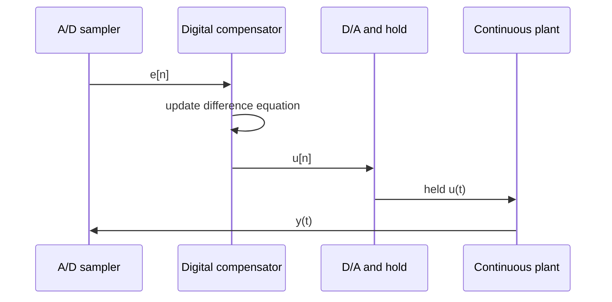

# z-Plane Design and Digital Compensators

Once a system is represented in the $z$-domain, many classical design ideas reappear with new geometry. Nise shows block-diagram reduction, stability, steady-state error, root locus, gain design, cascade compensation via the $s$-plane, and digital compensator implementation. The central translation is simple: the unit circle replaces the imaginary axis as the stability boundary.

Digital design has two common routes. One route discretizes an already designed analog compensator, often with the Tustin transformation. Another route designs directly in the $z$-plane using root locus and transient-response grids. In either case, the final controller must be converted into a difference equation that can run on a processor.

## Definitions

The exact pole mapping is

$$
z=e^{sT}.
$$

For an underdamped continuous pole

$$
s=-\zeta\omega_n\pm j\omega_d,
$$

the corresponding discrete pole has magnitude

$$
|z|=e^{-\zeta\omega_nT}
$$

and angle

$$
\theta=\omega_dT.
$$

Thus constant damping-ratio and natural-frequency curves in the $z$-plane are not straight lines like the simplest $s$-plane sketches.

The bilinear or **Tustin transformation** maps an analog compensator to a digital one using

$$
s\approx \frac{2}{T}\frac{z-1}{z+1}.
$$

This maps the stable left half-plane into the unit disk, though it warps frequency unless prewarping is used.

A digital compensator

$$
G_c(z)=\frac{X(z)}{E(z)}
$$

is implemented by cross-multiplying and translating powers of $z^{-1}$ into sample delays. For example,

$$
G_c(z)=\frac{b_0+b_1z^{-1}}{1+a_1z^{-1}}
$$

implies

$$
x[n]+a_1x[n-1]=b_0e[n]+b_1e[n-1].
$$

## Key results

Digital root locus uses the same angle and magnitude conditions as continuous root locus, but on the $z$-plane:

$$
1+KG(z)H(z)=0.
$$

Points on the locus satisfy

$$
\angle G(z)H(z)=(2k+1)180^\circ
$$

and

$$
K=\frac{1}{|G(z)H(z)|}.
$$

Stability requires all closed-loop poles inside $\vert z\vert =1$. As gain changes, poles can cross the unit circle. The crossing is the digital analog of imaginary-axis crossing in continuous time.

Discrete steady-state error also mirrors continuous error. In a unity-feedback digital system,

$$
E(z)=\frac{R(z)}{1+G(z)}.
$$

The final value theorem for sequences is commonly written

$$
e[\infty]=\lim_{z\to1}(1-z^{-1})E(z),
$$

provided the closed-loop poles satisfy the required stability conditions. Poles at $z=1$ increase digital system type.

For implementation, always convert the compensator into a causal difference equation. Coefficients must be scaled for numeric precision, saturation must be handled, and sample timing must be deterministic enough for the model assumptions to hold.

Direct $z$-plane design uses root-locus rules that look familiar but feel different. A point near the unit circle decays slowly, even if its angle is large. Moving a pole inward increases decay rate. Moving a pole around the circle changes oscillation frequency. Constant damping-ratio curves bend because the exponential map wraps the $s$-plane into the unit disk. Designers often map desired continuous pole locations to $z=e^{sT}$ first, then use the digital root locus to see whether those points are achievable.

The Tustin transformation is popular because it maps stable analog poles to stable digital poles. However, it warps frequency: equal intervals of analog frequency do not map to equal intervals of digital frequency. If a compensator must match behavior at a particular frequency, prewarping may be used. Without prewarping, Tustin is still often adequate when the sampling rate is high compared with the important loop bandwidth.

Difference-equation form should be selected with numerical implementation in mind. A high-order transfer function implemented as one direct-form polynomial can be sensitive to coefficient quantization. Cascading first-order and second-order sections is often more robust. Integrators should be protected against windup, and internal states should be bounded or scaled so fixed-point arithmetic does not overflow.

Digital compensators also need startup behavior. Delay states such as $e[n-1]$ and $u[n-1]$ must be initialized. If they are initialized inconsistently with the plant state, the controller can produce a bump at startup. In safety-critical systems, controllers often include bumpless transfer logic so switching between manual and automatic modes does not create a sudden actuator jump.

Testing should compare three responses: the ideal continuous design, the sampled model with zero-order hold, and the actual embedded implementation. Differences among them reveal sampling delay, quantization, saturation, and scheduling effects. Nise's digital chapter gives the classical sampled-data framework; real deployment completes the loop by validating that the code follows the assumed difference equation at the assumed period.

Digital steady-state error design is clearest when the pole at $z=1$ is recognized as the sampled integrator. A digital controller with a factor $1/(1-z^{-1})$ accumulates error from sample to sample. This can eliminate constant error in a stable loop, but it also creates the same windup risk as an analog integrator. Output limits and reset logic must be included in real implementations.

Root locus in the $z$-plane can be visually misleading if the unit circle is not drawn with equal aspect ratio. A pole that appears safely inside the circle on a stretched plot may actually be close to instability. Always check pole magnitudes numerically. Stability is determined by $\vert z\vert \lt 1$, not by apparent distance on a distorted display.

The discrete controller should be written in a form that matches code execution order. A difference equation may use current error $e[n]$, previous error $e[n-1]$, and previous command $u[n-1]$. If the ADC reading is not available until after the output update, the implemented equation has an extra delay. The timing diagram is part of the controller definition.

When discretizing analog compensators, compare frequency response before trusting the result. Plot the analog compensator and the digital compensator mapped over the frequency range of interest. If they differ near crossover, the sampling period is too slow, prewarping is needed, or direct digital redesign may be preferable. A symbolic transformation alone does not guarantee performance equivalence.

Finally, digital compensators should be tested under finite precision. Floating-point desktop simulations may hide overflow, rounding, and limit-cycle behavior that appears on a microcontroller. Fixed-point scaling, saturation arithmetic, and coefficient quantization can be as important as the nominal transfer function.

A controller update should be written as code-like pseudocode before deployment: read inputs, compute error, update stored states, apply saturation and anti-windup, write output, and save histories. This order determines the realized transfer function and any extra delay.

Reviewing this pseudocode catches many implementation mistakes before hardware testing.

It also documents the exact controller semantics.

That documentation should accompany tests.

Keep it versioned.

## Visual



| Design route | Procedure | Advantage | Caution |
|---|---|---|---|
| analog then discretize | design in $s$, map to $z$ | uses familiar lead/lag methods | sampling and warping can change margins |
| direct $z$-plane design | design poles in unit disk | accounts for sampling geometry | less intuitive without grids |
| emulation with fast sampling | implement analog-like controller | simple for slow plants | delay and quantization still matter |
| discrete redesign | identify pulse transfer function | accurate sampled model | depends on good sampling assumptions |

## Worked example 1: Tustin discretization of a PI controller

Problem: Discretize

$$
G_c(s)=2+\frac{4}{s}
$$

with sampling period $T=0.1$ s using Tustin,

$$
s=\frac{2}{T}\frac{z-1}{z+1}.
$$

Method:

1. Rewrite the controller:

$$
G_c(s)=\frac{2s+4}{s}.
$$

2. Substitute $s=20(z-1)/(z+1)$:

$$
G_c(z)=\frac{2\cdot20\frac{z-1}{z+1}+4}
{20\frac{z-1}{z+1}}.
$$

3. Multiply numerator and denominator by $(z+1)$:

$$
G_c(z)=\frac{40(z-1)+4(z+1)}{20(z-1)}.
$$

4. Expand:

$$
40z-40+4z+4=44z-36.
$$

Thus

$$
G_c(z)=\frac{44z-36}{20z-20}.
$$

5. Divide by $20z$ to express with $z^{-1}$:

$$
G_c(z)=\frac{2.2-1.8z^{-1}}{1-z^{-1}}.
$$

Checked answer: $G_c(z)=(2.2-1.8z^{-1})/(1-z^{-1})$.

## Worked example 2: difference equation implementation

Problem: Implement

$$
G_c(z)=\frac{2.2-1.8z^{-1}}{1-z^{-1}}
$$

as a difference equation from error $e[n]$ to controller output $u[n]$.

Method:

1. Write

$$
\frac{U(z)}{E(z)}=\frac{2.2-1.8z^{-1}}{1-z^{-1}}.
$$

2. Cross-multiply:

$$
(1-z^{-1})U(z)=(2.2-1.8z^{-1})E(z).
$$

3. Expand:

$$
U(z)-z^{-1}U(z)=2.2E(z)-1.8z^{-1}E(z).
$$

4. Translate $z^{-1}$ into one-sample delay:

$$
u[n]-u[n-1]=2.2e[n]-1.8e[n-1].
$$

5. Solve for current output:

$$
u[n]=u[n-1]+2.2e[n]-1.8e[n-1].
$$

Checked answer: the update law is $u[n]=u[n-1]+2.2e[n]-1.8e[n-1]$.

## Code

```python
import numpy as np

def pi_tustin_update(errors):
    u = np.zeros_like(errors, dtype=float)
    for n in range(len(errors)):
        e_now = errors[n]
        e_prev = errors[n - 1] if n > 0 else 0.0
        u_prev = u[n - 1] if n > 0 else 0.0
        u[n] = u_prev + 2.2 * e_now - 1.8 * e_prev
    return u

errors = np.ones(10)
u = pi_tustin_update(errors)
print("controller output for unit error:", u)

z_poles = np.roots([1, -1])
print("controller pole:", z_poles)
```

## Common pitfalls

- Designing stable analog poles but discretizing with too slow a sampling period.
- Forgetting that a pole on $z=1$ is an integrator and must be handled carefully with saturation.
- Implementing a noncausal transfer function because numerator order was not checked in $z^{-1}$ form.
- Ignoring coefficient quantization in fixed-point controllers.
- Assuming the zero-order hold output equals a smooth analog control signal.
- Failing to test timing jitter. Digital control assumes consistent sampling.

## Connections

- [Digital sampling and z-transform](/cs/control-engineering/digital-control-sampling-and-z-transform) introduces the transform and unit-circle stability.
- [PID and compensators](/cs/control-engineering/pid-lead-lag-and-lag-lead-compensators) gives the analog PI/PID forms discretized here.
- [Frequency-response design](/cs/control-engineering/frequency-response-compensator-design) is often used before digital emulation.
- [Embedded systems](/cs/embedded/) covers timers, ADCs, DACs, and fixed-point implementation concerns.
- [Simulation](/physics/simulation/) helps compare continuous, sampled, and held responses.
