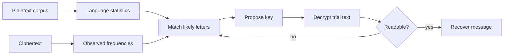

# Classical Ciphers and Cryptanalysis

Classical ciphers are the right place to begin cryptography because their designs are simple enough to compute by hand, but their failures already show the central lessons of the modern subject. A shift cipher, substitution cipher, and Vigenere cipher all hide a message by transforming letters according to a secret key. They fail because their transformations preserve too much structure: letter frequencies, repeated patterns, word boundaries, or predictable relations between plaintext and ciphertext.

Katz and Lindell use these examples to motivate the modern move from clever-looking secrecy to definitions, assumptions, and proofs. Smart's treatment is more historical and computational: it gives more hand examples of shift, substitution, Vigenere, Enigma-like thinking, and the attacker's view. Read together, the sources make one point clear: a cipher is not secure because its rule looks complicated. It is secure only relative to a precise attack model.

## Definitions

A **plaintext** is the message before encryption. A **ciphertext** is the encoded output sent over an insecure channel. A **key** is the secret input that selects one transformation from a family of possible transformations. In a private-key cipher, sender and receiver share the same secret key.

A **cipher** or **encryption scheme** has three algorithms:

- `Gen`: sample a key from the key space.
- `Enc_k(m)`: encrypt plaintext $m$ with key $k$.
- `Dec_k(c)`: decrypt ciphertext $c$ with key $k$.

Correctness means:

$$
\Pr[\mathrm{Dec}_k(\mathrm{Enc}_k(m))=m]=1
$$

for every allowed message $m$, where the probability is over any randomness used by key generation or encryption.

The **shift cipher** identifies letters with numbers modulo 26. With key $k \in \{0,\dots,25\}$,

$$
\mathrm{Enc}_k(m_i)=(m_i+k)\bmod 26,\qquad
\mathrm{Dec}_k(c_i)=(c_i-k)\bmod 26.
$$

The **monoalphabetic substitution cipher** chooses a permutation $\pi$ of the alphabet and replaces each letter $x$ by $\pi(x)$. Its key space has $26!$ keys, far larger than the shift cipher, but each plaintext letter still maps to the same ciphertext letter every time.

The **Vigenere cipher** uses a short key word as a repeating sequence of shifts. If the key is $k_1,\dots,k_t$, then the $i$th plaintext letter is shifted by $k_{((i-1)\bmod t)+1}$. It is a polyalphabetic cipher because the same plaintext letter can encrypt differently in different positions.

**Cryptanalysis** is the study of attacks. In a **ciphertext-only attack**, the adversary sees ciphertexts only. In a **known-plaintext attack**, the adversary sees some plaintext-ciphertext pairs. In a **chosen-plaintext attack**, the adversary can request encryptions of messages it chooses. Classical ciphers often fail even in the weakest ciphertext-only setting.

Kerckhoffs' principle says that the security of a cipher should depend on the secrecy of the key, not on the secrecy of the algorithm. This is not just a slogan. It is what makes public analysis possible, permits standardization, and prevents a design from collapsing when one implementation is reverse engineered.

## Key results

The first key result is that key-space size alone is not a security proof. A shift cipher has only 26 possible keys, so brute force is immediate. A substitution cipher has an enormous key space, but frequency analysis breaks it because the encryption preserves the distribution of letters. If `E` is common in English, then the ciphertext symbol representing `E` will tend to be common too. Digraphs such as `TH`, `HE`, and `IN` give even more evidence.

The second key result is that repeating structure leaks. The Vigenere cipher was historically treated as strong because the same plaintext letter is not always encrypted to the same ciphertext letter. But if the key length is $t$, then letters in positions congruent modulo $t$ are all encrypted by the same shift. Once an attacker estimates $t$, the cipher becomes $t$ independent shift ciphers. Repeated phrases in the plaintext also produce repeated spacing patterns in the ciphertext, which is the idea behind Kasiski-style analysis.

The third result is that attack models must be explicit. A classical cipher may look acceptable if the attacker only sees one short ciphertext, but fail badly when the attacker sees many messages, knows a greeting format, or can choose messages. Modern definitions formalize this. They ask not "Can I think of an attack?" but "What advantage can any efficient adversary obtain in a specified experiment?"

The fourth result is that determinism is dangerous for repeated encryption. If the same plaintext always gives the same ciphertext under the same key, then equality patterns survive. This is exactly why modern encryption schemes for multiple messages use randomness, nonces, counters, or state. The lesson from classical ciphers reappears later as the failure of ECB mode for block ciphers.

Proof sketch for frequency analysis: suppose a monoalphabetic substitution encrypts $n$ English letters. Let $q_x$ be the true frequency of plaintext letter $x$, and let $\hat p_y$ be the observed frequency of ciphertext letter $y$. If $y=\pi(x)$, then by the law of large numbers $\hat p_y$ approaches $q_x$ as $n$ grows. Therefore the ciphertext frequency vector is approximately a permuted plaintext frequency vector. The attacker searches for a permutation matching high-frequency and low-frequency letters, then refines using common words and digraphs.

Smart's information-theoretic discussion also explains why classical ciphers become easier to break as more text is encrypted under one key. Natural languages are redundant: not every string of letters is equally plausible English. A ciphertext-only attacker exploits that redundancy by eliminating keys that decrypt to implausible text. The **unicity distance** is the rough amount of ciphertext needed before one key is expected to stand out from all spurious keys. It is not a modern security definition, but it gives a useful historical intuition: redundancy plus repeated key structure creates evidence, and evidence accumulates with length.

The classical setting also separates two failures that students often merge. A cipher can be broken because the key space is too small, as with the shift cipher, or because the key space has exploitable structure, as with substitution and Vigenere. Modern designs fight both problems. They use large keys, but they also try to make every efficient test on the ciphertext behave as if it were seeing random data.

## Visual



| Cipher | Key idea | Main weakness | Typical attack |
|---|---|---|---|
| Shift | one modular offset | tiny key space | exhaustive search |
| Substitution | arbitrary alphabet permutation | preserves single-letter frequencies | frequency analysis |
| Vigenere | repeating sequence of shifts | periodic structure | estimate period, then solve shifts |
| Permutation/transposition | rearrange positions | preserves letters and often word statistics | anagramming, known plaintext |
| Enigma-style rotor systems | changing substitutions | operational patterns and known plaintexts | crib-based search and machinery |

## Worked example 1: breaking a shift cipher

Problem: decrypt the ciphertext `KHOOR` assuming it was produced by a shift cipher over the English alphabet.

Method:

1. Convert letters to numbers with $A=0,\dots,Z=25$:

$$
K=10,\ H=7,\ O=14,\ O=14,\ R=17.
$$

2. Try the common Caesar shift $k=3$ first. Decryption subtracts 3 modulo 26:

$$
\begin{aligned}
10-3 &\equiv 7 &&\Rightarrow H\\
7-3 &\equiv 4 &&\Rightarrow E\\
14-3 &\equiv 11 &&\Rightarrow L\\
14-3 &\equiv 11 &&\Rightarrow L\\
17-3 &\equiv 14 &&\Rightarrow O.
\end{aligned}
$$

3. The candidate plaintext is `HELLO`, which is grammatical and likely.

Check: encrypt `HELLO` with $k=3$:

$$
H\mapsto K,\quad E\mapsto H,\quad L\mapsto O,\quad L\mapsto O,\quad O\mapsto R.
$$

So the checked answer is `HELLO`, with key $k=3$.

## Worked example 2: attacking a Vigenere cipher when the period is known

Problem: decrypt `RIJVSUYVJN` if it is known that a Vigenere cipher used period $2$, and the first two plaintext letters are likely `HE`.

Method:

1. Write the ciphertext in two columns by position parity:

   ```text
   position:  1 2 3 4 5 6 7 8 9 10
   cipher:    R I J V S U Y V J N
   column 1:  R   J   S   Y   J
   column 2:    I   V   U   V   N
   ```

2. Use the crib `HE`. Since $H=7$ and $R=17$, the first shift is

$$
k_1 \equiv 17-7 \equiv 10 \pmod{26}.
$$

   Since $E=4$ and $I=8$, the second shift is

$$
k_2 \equiv 8-4 \equiv 4 \pmod{26}.
$$

3. Decrypt alternating positions by subtracting $10,4,10,4,\dots$:

$$
\begin{aligned}
R-10&=H,& I-4&=E,\\
J-10&=Z,& V-4&=R,\\
S-10&=I,& U-4&=Q,\\
Y-10&=O,& V-4&=R,\\
J-10&=Z,& N-4&=J.
\end{aligned}
$$

4. The result `HEZRIQORZJ` is not readable. The crib or the assumed period is probably wrong. Now try the same period but assume the first two letters are `TH`. Then

$$
k_1\equiv R-T\equiv 17-19\equiv 24,\qquad
k_2\equiv I-H\equiv 8-7\equiv 1.
$$

5. Decrypt with shifts $24,1$:

$$
R-24=T,\ I-1=H,\ J-24=L,\ V-1=U,\ S-24=U,\ U-1=T,\ Y-24=A,\ V-1=U,\ J-24=L,\ N-1=M.
$$

This also looks bad, so the checked answer is not a plaintext but a conclusion: knowing only the period and a weak crib is insufficient. The method is correct, but the evidence fails. A real attack would score all 26 shifts for each column using English frequencies, then check the combined plaintext.

## Code

```python
from collections import Counter
import string

ALPHABET = string.ascii_uppercase

def shift_decrypt(ciphertext: str, key: int) -> str:
    out = []
    for ch in ciphertext.upper():
        if ch in ALPHABET:
            out.append(ALPHABET[(ALPHABET.index(ch) - key) % 26])
    return "".join(out)

def rank_shift_keys(ciphertext: str):
    # A tiny score: reward common English letters after decryption.
    common = set("ETAOINSHRDLU")
    scores = []
    for key in range(26):
        plain = shift_decrypt(ciphertext, key)
        counts = Counter(plain)
        score = sum(counts[ch] for ch in common)
        scores.append((score, key, plain))
    return sorted(scores, reverse=True)

for score, key, plain in rank_shift_keys("KHOOR")[:5]:
    print(key, score, plain)
```

## Common pitfalls

- Treating a large key space as a proof of security. Structure can matter more than count.
- Forgetting that classical ciphers are usually deterministic, so repeated plaintext patterns survive.
- Confusing encoding with encryption. A public alphabet mapping without a key is not a cipher.
- Assuming that hiding the algorithm is a sustainable defense.
- Overtrusting a short attack sample. Frequency analysis becomes more reliable as text length grows.
- Thinking Vigenere is safe merely because it uses several shifts. A short repeated key turns it into several shift ciphers.

## Connections

- [Perfect secrecy and the one-time pad](/cs/cryptography/perfect-secrecy-one-time-pad)
- [Computational security definitions](/cs/cryptography/computational-security-definitions)
- [Symmetric encryption modes](/cs/cryptography/symmetric-encryption-modes)
- [TLS protocol overview](/cs/cryptography/tls-protocol-overview)
