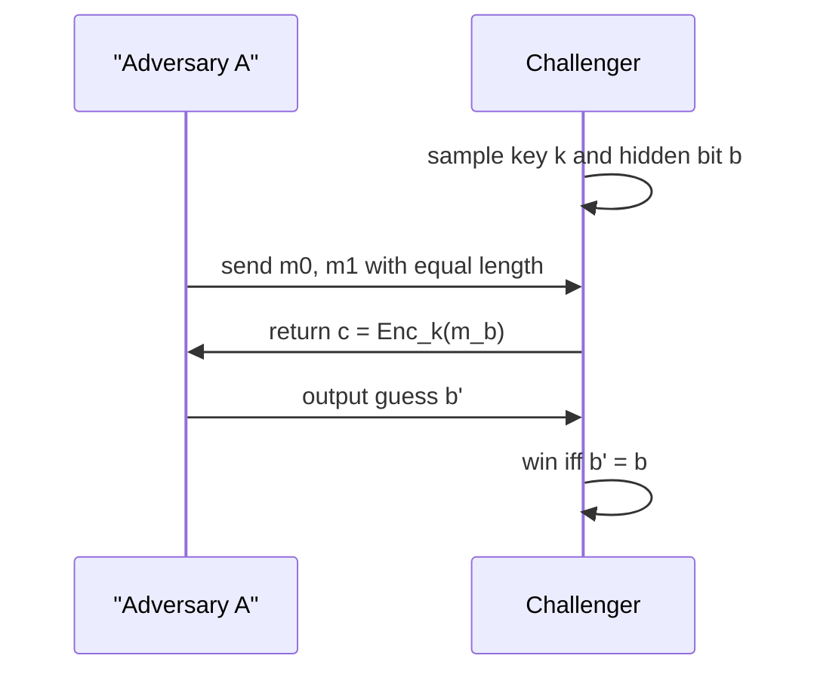

# Computational Security Definitions

Computational security is the bridge from perfect secrecy to practical cryptography. Instead of demanding that a ciphertext leak exactly zero information to an unlimited adversary, we demand that every efficient adversary has only negligible advantage in a formal experiment. This is the language used throughout modern private-key encryption, public-key encryption, MACs, signatures, and zero-knowledge.


*Figure: Asymmetric encryption turns key distribution into a public and private key pair. Image: [Wikimedia Commons](https://commons.wikimedia.org/wiki/File:Public_key_encryption.svg), Davidgothberg, public domain.*

Katz and Lindell make this shift central: modern cryptography needs definitions, assumptions, and reductions. Smart presents the same reductionist spirit later in the text through semantic security, indistinguishability, random oracles, and hybrid encryption. The shared message is that "secure" is not an adjective; it is a quantified statement about adversaries, resources, and success probabilities.

## Definitions

A **probabilistic polynomial-time adversary**, abbreviated PPT adversary, is an algorithm that may use randomness and whose running time is bounded by a polynomial in the security parameter $n$.

The **security parameter** $n$ controls key lengths, group sizes, output lengths, and adversary running times. A scheme is not a single object but a family of schemes indexed by $n$.

A function $\mu(n)$ is **negligible** if for every positive polynomial $p(n)$ there is an $N$ such that for all $n\gt N$,

$$
\mu(n)<\frac{1}{p(n)}.
$$

Examples such as $2^{-n}$ are negligible. Functions such as $1/n$, $1/n^2$, and $1/\sqrt n$ are not negligible because each is inverse-polynomial.

Two ensembles $X=\{X_n\}$ and $Y=\{Y_n\}$ are **computationally indistinguishable** if for every PPT distinguisher $D$ there exists a negligible function $\mu$ such that:

$$
\left|\Pr[D(1^n,X_n)=1]-\Pr[D(1^n,Y_n)=1]\right|\le \mu(n).
$$

An **experiment** is a game between a challenger and an adversary. The challenger samples keys, flips hidden coins, answers allowed oracle queries, and checks whether the adversary wins. The adversary's **advantage** is its success probability beyond a trivial baseline.

For private-key encryption, a basic indistinguishability experiment is:

1. The challenger samples $k\leftarrow\mathrm{Gen}(1^n)$.
2. The adversary outputs equal-length messages $m_0,m_1$.
3. The challenger samples $b\leftarrow\{0,1\}$ and returns $c\leftarrow\mathrm{Enc}_k(m_b)$.
4. The adversary outputs $b'$.
5. The adversary wins if $b'=b$.

The scheme is secure if every PPT adversary wins with probability at most $1/2+\mu(n)$.

## Key results

Indistinguishability and semantic security are equivalent for standard encryption settings. Indistinguishability says the adversary cannot tell which of two chosen messages was encrypted. Semantic security says the adversary cannot compute meaningful information about the plaintext from the ciphertext beyond what it could compute without the ciphertext. The equivalence is powerful because indistinguishability is usually easier to prove, while semantic security matches the intuition of "learns nothing useful."

Reductions are the proof mechanism. To prove a scheme secure under an assumption, we show that any adversary breaking the scheme can be transformed into an algorithm breaking the assumption. If the assumption says no efficient algorithm can solve problem $P$, then a successful encryption adversary would contradict that assumption.

A typical reduction has this form:

$$
\text{adversary against scheme} \quad\Rightarrow\quad \text{distinguisher or solver against primitive}.
$$

For example, a stream-cipher encryption proof may say: if adversary $A$ distinguishes encryptions using a pseudorandom generator from ideal one-time-pad encryptions, then construct distinguisher $D$ that distinguishes the generator output from uniform randomness. Since the one-time pad is perfectly secret, the only possible source of non-negligible advantage is distinguishing the keystream.

Hybrid arguments are a standard way to prove indistinguishability when a scheme has many components. A sequence of experiments $H_0,H_1,\dots,H_t$ begins with the real world and ends with an ideal world. If each adjacent pair is indistinguishable, then the endpoints are indistinguishable. The loss is usually bounded by a sum of adjacent advantages:

$$
\left|\Pr[A(H_0)=1]-\Pr[A(H_t)=1]\right|
\le
\sum_{i=0}^{t-1}
\left|\Pr[A(H_i)=1]-\Pr[A(H_{i+1})=1]\right|.
$$

Security definitions also depend on oracle access. **Eavesdropping security** gives the adversary only challenge ciphertexts. **Chosen-plaintext attack security**, or CPA security, additionally lets it request encryptions of messages of its choice. **Chosen-ciphertext attack security**, or CCA security, lets it request decryptions too, except for the challenge ciphertext. Each stronger model captures more realistic interaction.

There are two complementary ways to read an asymptotic definition. The first is qualitative: for large enough security parameter, no efficient adversary has more than negligible advantage. The second is concrete: for a fixed implementation, what is the best bound on an adversary running for time $t$, making $q$ queries, and receiving advantage $\epsilon$? Katz and Lindell introduce the asymptotic approach because it makes definitions clean and composable. Engineers still need concrete estimates because real keys have fixed sizes. A reduction that loses a factor of $q^2$ may be fine for small $q$ and useless for a very busy service.

Definitions also decide what is intentionally outside the model. A CPA experiment does not model decryption-error side channels. A standard EUF-CMA MAC experiment does not automatically model replay unless the definition or protocol state says replays are disallowed. A proof for a single user may not directly cover millions of users unless the reduction accounts for the extra attack surface. These are not defects in formalism; they are reminders that the formal statement must match the deployment question.

The phrase "for every PPT adversary" is doing heavy work. It means security is not tied to a named attack such as frequency analysis, meet-in-the-middle, or padding oracle. If any efficient attack wins, then the scheme fails the definition. Conversely, a proof usually does not enumerate attacks. It shows that a successful adversary, whatever its internal strategy, would imply a successful attack on an assumption.

Negligible probabilities are closed under polynomial sums, which is why the definition is stable. If a protocol has polynomially many bad events and each occurs with negligible probability, the union bound still gives a negligible total failure probability. This closure property is one reason cryptography does not use an arbitrary phrase such as "very small" in its core definitions.

## Visual



| Concept | Informal meaning | Why it matters |
|---|---|---|
| PPT adversary | efficient randomized attacker | rules out unlimited brute force |
| negligible function | smaller than any inverse polynomial | formalizes "vanishing advantage" |
| experiment | precise attack game | removes ambiguity from "secure" |
| reduction | converts an attack into a primitive break | ties schemes to assumptions |
| hybrid argument | changes one piece at a time | handles multi-step constructions |

## Worked example 1: checking negligibility

Problem: decide whether $2^{-n}$, $1/n^3$, and $2^{-\sqrt n}$ are negligible.

Method:

1. For $2^{-n}$, compare to any inverse polynomial $1/n^c$. Exponential growth eventually beats polynomial growth:

$$
n^c < 2^n
$$

   for all sufficiently large $n$. Therefore

$$
2^{-n}<n^{-c}
$$

   eventually for every $c$, so $2^{-n}$ is negligible.

2. For $1/n^3$, choose the polynomial $p(n)=n^4$. The negligible condition would require

$$
\frac{1}{n^3}<\frac{1}{n^4}
$$

   eventually, but this is false for every $n\gt 1$. Therefore $1/n^3$ is not negligible.

3. For $2^{-\sqrt n}$, compare to $1/n^c$. We need $n^c\lt 2^{\sqrt n}$ eventually. Taking base-2 logarithms gives

$$
c\log_2 n < \sqrt n,
$$

   which holds for all sufficiently large $n$. Thus $2^{-\sqrt n}$ is negligible, although much larger than $2^{-n}$.

Checked answer: $2^{-n}$ and $2^{-\sqrt n}$ are negligible; $1/n^3$ is not.

## Worked example 2: computing distinguishing advantage

Problem: in an encryption experiment an adversary guesses the hidden bit correctly with probability $0.56$. What is its advantage, and is that automatically a break?

Method:

1. The trivial random-guess success probability is $1/2=0.50$.

2. Advantage is the excess over random guessing:

$$
\mathrm{Adv}=0.56-0.50=0.06.
$$

3. Whether this is a break depends on how the probability scales with $n$. If the adversary achieves advantage $0.06$ for arbitrarily large security parameters, then the advantage is not negligible and the scheme is insecure.

4. If instead the measured $0.06$ happens only at a toy parameter such as $n=8$, the asymptotic definition alone does not decide the real implementation. Concrete security would ask for exact resources, exact key sizes, and exact success probabilities.

Checked answer: the advantage is $0.06$. It is a formal asymptotic break only if a PPT adversary maintains non-negligible advantage as $n$ grows.

## Code

```python
from fractions import Fraction

def advantage(success_probability: Fraction) -> Fraction:
    return success_probability - Fraction(1, 2)

def empirical_success(correct_guesses: int, trials: int) -> Fraction:
    return Fraction(correct_guesses, trials)

success = empirical_success(560, 1000)
adv = advantage(success)
print("success =", float(success))
print("advantage =", float(adv), "=", adv)
```

## Common pitfalls

- Treating "polynomial time" as "fast in practice." A polynomial can still be unusable.
- Calling $1/n^c$ negligible. It is small, but not negligible by the cryptographic definition.
- Forgetting the security parameter. Fixed-size claims need concrete security, not only asymptotic language.
- Proving that one attack fails and calling the scheme secure. Definitions quantify over all PPT adversaries.
- Ignoring oracle access. CPA and CCA security are different experiments.
- Losing too much in a reduction. A mathematically valid reduction may still give weak concrete parameters.

## Connections

- [Perfect secrecy and the one-time pad](/cs/cryptography/perfect-secrecy-one-time-pad)
- [Pseudorandom generators and functions](/cs/cryptography/pseudorandom-generators-functions)
- [Message authentication codes](/cs/cryptography/message-authentication-codes)
- [Public-key encryption](/cs/cryptography/public-key-encryption-elgamal-hybrid)
