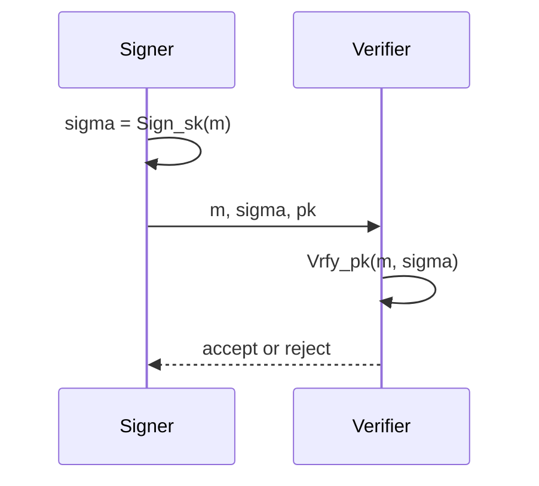

# Digital Signatures

Digital signatures are the public-key analogue of message authentication, but with a crucial difference: verification uses a public key. Anyone can check a valid signature, while only the signer should be able to create one. This gives integrity, origin authentication, and transferability in settings where a shared MAC key would not be enough.

Katz and Lindell present signatures through formal unforgeability definitions, hash-and-sign, RSA-FDH, Schnorr, DSA, ECDSA, certificate infrastructure, and TLS. Smart adds concrete public-key signature algorithms, implementation concerns, and the connection between signatures and authentic public keys. The modern view is that a signature scheme is not just a trapdoor operation; it is a randomized or carefully encoded protocol with a security proof target.

## Definitions

A **digital signature scheme** has three algorithms:

- $\mathrm{Gen}(1^n)$ outputs a key pair $(pk,sk)$.
- $\mathrm{Sign}_{sk}(m)$ outputs a signature $\sigma$.
- $\mathrm{Vrfy}_{pk}(m,\sigma)$ accepts or rejects.

Correctness requires:

$$
\mathrm{Vrfy}_{pk}(m,\mathrm{Sign}_{sk}(m))=1
$$

for valid keys and messages.

The standard security notion is **existential unforgeability under chosen-message attack**, or EUF-CMA. The adversary receives $pk$ and oracle access to $\mathrm{Sign}_{sk}(\cdot)$. It wins if it outputs $(m^\*,\sigma^\*)$ such that verification accepts and $m^\*$ was not signed by the oracle.

The **hash-and-sign paradigm** signs a digest rather than the raw message:

$$
\sigma=\mathrm{Sign}_{sk}(H(m)).
$$

This handles arbitrary message length and domain separation, but it is secure only when the signature encoding and hash assumptions are correct.

**RSA-FDH** models $H$ as a random oracle mapping messages into $\mathbb Z_N^\ast$ and signs by:

$$
\sigma=H(m)^d\bmod N.
$$

Verification checks:

$$
\sigma^e\equiv H(m)\pmod N.
$$

**Schnorr signatures** work in a prime-order group. They can be viewed as the Fiat-Shamir transform applied to a Schnorr identification protocol: replace the verifier's random challenge with a hash of the commitment and message.

DSA and ECDSA are standardized discrete-log-style signatures. They are widely deployed but highly sensitive to nonce generation.

## Key results

Signatures require stronger care than "encrypt with the private key." Plain RSA signing $\sigma=m^d\bmod N$ is algebraically forgeable. For example, if an attacker chooses $\sigma$ first and sets $m=\sigma^e\bmod N$, then $\sigma$ verifies as a signature on $m$. Real RSA signatures use encodings such as RSA-PSS or full-domain hashing models.

EUF-CMA captures adaptive signing access. This matters because attackers may obtain signatures on harmless-looking messages and combine information from them. A scheme secure only against no-message attacks is not enough for network protocols, software updates, or certificate systems.

Schnorr signatures demonstrate the relation between identification and signatures. In the interactive protocol, the prover sends a commitment $R=g^r$, receives challenge $e$, and responds $z=r+ex$. The verifier checks:

$$
g^z\stackrel{?}{=}R\cdot y^e
$$

where $y=g^x$. Fiat-Shamir makes $e=H(R\|m)$, producing a noninteractive signature $(R,z)$.

Nonce secrecy and uniqueness are critical in DSA, ECDSA, and Schnorr-style schemes. If the same nonce is reused for two messages, the private key can often be solved by linear equations. If nonce bits leak through timing or biased randomness, lattice attacks may recover the key.

Certificates bind public keys to identities. A certificate authority signs a statement such as "this public key belongs to example.com." Signature verification alone proves only that a key signed a message; PKI decides whether that key is trusted for a name and purpose.

Post-quantum signatures change the algorithm families but not the interface: key generation, signing, and verification remain. The assumptions move from factoring and discrete log toward lattice problems and hash-based constructions.

DSA and ECDSA illustrate why a correct formula is not enough. Both compute a signature using a per-message secret nonce. In simplified DSA notation, one component is derived from $g^k$, and the other has the form

$$
s=k^{-1}(H(m)+xr)\bmod q.
$$

If the same $k$ is used on two different messages, the attacker obtains two linear equations in the unknowns $k$ and $x$. Solving them reveals the private key. Even partial nonce bias can be exploitable with lattice methods after enough signatures. Deterministic nonce generation, such as deriving the nonce from the private key and message hash with a carefully specified procedure, is one response, but implementations still need side-channel resistance.

Signature encodings also protect protocol meaning. A signature on a byte string does not inherently say whether that byte string is a software update, a certificate request, a blockchain transaction, or a login challenge. Real systems use domain separation, context strings, algorithm identifiers, and structured encodings so a signature valid in one context cannot be replayed in another. This is the signature analogue of associated data in AEAD.

Finally, verification must reject invalid public keys and invalid group elements. In elliptic-curve signatures, accepting points not on the curve or in the wrong subgroup can undermine the assumed discrete-log problem. In RSA, accepting malformed encodings can recreate old padding failures. The verification algorithm in a proof includes these checks, even if a short textbook formula suppresses them.

The difference between MACs and signatures is also operational. With a MAC, both parties can create tags, so either party could have produced a valid transcript. With a signature, only the private-key holder should be able to sign, while everyone can verify. That public verifiability is exactly what software updates, certificates, transparency logs, and legal audit trails need. It is also why signature private keys require stronger lifecycle controls: compromise affects everyone who trusts the public key.

Signature schemes are normally randomized or domain-separated even when the mathematical core is deterministic. RSA-PSS deliberately randomizes its encoding. EdDSA and deterministic ECDSA-style methods derive nonces from secret material and the message to avoid relying on fragile external randomness. The design target is not "always random" or "always deterministic"; it is that the value used as a nonce must be unpredictable to attackers and never repeat in a way that exposes the key.

Batch verification and aggregate signatures add more engineering tradeoffs. They can reduce verification cost or bandwidth, but they require their own security analyses and failure handling. If one signature in a batch is invalid, the verifier may need a strategy to locate it without creating a denial-of-service weakness. Optimizations should never silently change the acceptance condition.

A verifier should therefore treat the published verification algorithm as a complete specification, not as a suggestion that can be partially implemented.

## Visual



| Scheme | Assumption family | Random nonce? | Main warning |
|---|---|---:|---|
| RSA-FDH | RSA assumption plus random oracle | no signing nonce | hash-to-domain model matters |
| RSA-PSS | RSA plus randomized encoding | yes | use standard parameters |
| Schnorr | discrete log | yes or deterministic derived | nonce reuse leaks key |
| DSA/ECDSA | discrete log | yes | biased or repeated nonce is fatal |
| Hash-based signatures | hash assumptions | varies | larger signatures/state tradeoffs |

## Worked example 1: toy RSA-FDH verification

Problem: use toy RSA key $N=55$, $e=3$, $d=27$. Suppose a hash-to-domain function gives $H(m)=12$. Compute the RSA-FDH signature and verify it.

Method:

1. Sign:

$$
\sigma=H(m)^d\bmod N=12^{27}\bmod55.
$$

2. Compute powers:

$$
12^2=144\equiv34,\quad
12^4\equiv34^2=1156\equiv1.
$$

3. Since $27=16+8+2+1$ and $12^4\equiv1$, we have $12^8\equiv1$ and $12^{16}\equiv1$:

$$
12^{27}\equiv1\cdot1\cdot34\cdot12=408\equiv23\pmod{55}.
$$

   So $\sigma=23$.

4. Verify:

$$
\sigma^e=23^3\bmod55.
$$

   $23^2=529\equiv34$, so:

$$
23^3\equiv34\cdot23=782\equiv12.
$$

5. Since $\sigma^e\equiv H(m)$, verification accepts.

Checked answer: signature $\sigma=23$ verifies for digest $12$. Toy parameters are insecure.

## Worked example 2: Schnorr signature and verification

Problem: use $p=23$, subgroup order $q=11$, generator $g=2$, secret $x=4$, public key $y=g^x\bmod p=16$. Let nonce $r=3$ and challenge hash value $e=7$. Compute a Schnorr-style signature and verify it.

Method:

1. Commitment:

$$
R=g^r=2^3=8\pmod{23}.
$$

2. Response:

$$
z=r+ex\bmod q=3+7\cdot4=31\equiv9\pmod{11}.
$$

3. Signature is $(R,z)=(8,9)$.

4. Verify:

$$
g^z\stackrel{?}{=}R\cdot y^e\pmod p.
$$

5. Left side:

$$
2^9=512\equiv6\pmod{23}.
$$

6. Right side:

$$
16^7\bmod23.
$$

   Compute $16^2=256\equiv3$, $16^4\equiv9$, so

$$
16^7=16^4\cdot16^2\cdot16\equiv9\cdot3\cdot16=432\equiv18.
$$

   Then:

$$
R\cdot y^e\equiv8\cdot18=144\equiv6.
$$

Checked answer: both sides equal $6$, so the signature verifies.

## Code

```python
import hashlib

def challenge(R: int, message: bytes, q: int) -> int:
    h = hashlib.sha256(str(R).encode() + b"|" + message).digest()
    return int.from_bytes(h, "big") % q

def schnorr_sign(p, q, g, x, message, r):
    R = pow(g, r, p)
    e = challenge(R, message, q)
    z = (r + e * x) % q
    return R, z

def schnorr_verify(p, q, g, y, message, sig):
    R, z = sig
    e = challenge(R, message, q)
    return pow(g, z, p) == (R * pow(y, e, p)) % p

p, q, g, x = 23, 11, 2, 4
y = pow(g, x, p)
sig = schnorr_sign(p, q, g, x, b"pay bob", r=3)
print(sig, schnorr_verify(p, q, g, y, b"pay bob", sig))
```

## Common pitfalls

- Describing signatures as "private-key encryption." That analogy hides important security requirements.
- Using raw RSA signatures without encoding.
- Reusing or biasing DSA/ECDSA/Schnorr nonces.
- Verifying a signature without validating the signer's certificate or key usage.
- Hashing messages without domain separation across protocols.
- Treating signature verification success as proof that the signer intended every surrounding context.

## Connections

- [RSA and OAEP](/cs/cryptography/rsa-and-oaep)
- [Discrete logarithms and Diffie-Hellman](/cs/cryptography/discrete-log-diffie-hellman)
- [TLS protocol overview](/cs/cryptography/tls-protocol-overview)
- [Post-quantum cryptography](/cs/cryptography/post-quantum-cryptography)
