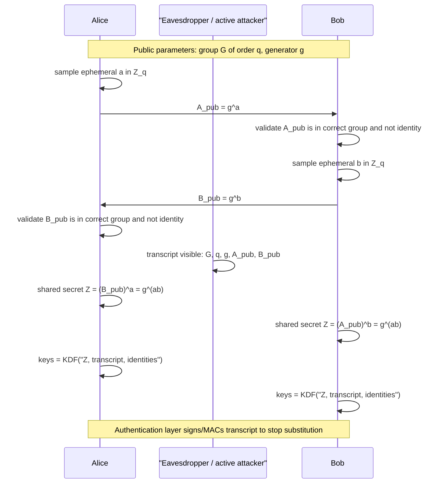

# Discrete Logarithms and Diffie-Hellman

Diffie-Hellman key exchange is the public-key revolution in its most compact form: two parties who share no secret can agree on a shared secret over an eavesdropped channel. The protocol relies on a group where exponentiation is efficient but discrete logarithms and related Diffie-Hellman problems are hard.


*Figure: Public-key encryption makes the Alice-to-Bob security goal explicit. Image: [Wikimedia Commons](https://commons.wikimedia.org/wiki/File:Public_key_encryption_alice_to_bob.svg), Winstonlee, CC0.*

Katz and Lindell separate the number-theory assumptions from the key-exchange protocol, which is the right proof-aware view. Smart gives more algorithmic background for discrete logarithms and signatures based on the same structures. Together they show that the protocol transcript is simple, but the security claim depends on the chosen group, parameter sizes, validation rules, and authentication layer.

## Definitions

Let $G$ be a cyclic group of order $q$ generated by $g$. Elements are written multiplicatively. For $x\in\mathbb Z_q$, exponentiation gives $g^x\in G$.

The **discrete logarithm problem** is: given $(G,q,g,h)$ where $h=g^x$, find $x$.

The **computational Diffie-Hellman problem**, or CDH, is: given

$$
g,\quad g^a,\quad g^b,
$$

compute

$$
g^{ab}.
$$

The **decisional Diffie-Hellman problem**, or DDH, is: distinguish tuples

$$
(g,g^a,g^b,g^{ab})
$$

from random-looking tuples

$$
(g,g^a,g^b,g^c)
$$

where $a,b,c$ are uniform in $\mathbb Z_q$.

The basic **Diffie-Hellman key exchange** is:

1. Alice samples $a\leftarrow\mathbb Z_q$ and sends $A=g^a$.
2. Bob samples $b\leftarrow\mathbb Z_q$ and sends $B=g^b$.
3. Alice computes $K=B^a=g^{ab}$.
4. Bob computes $K=A^b=g^{ab}$.

A **key derivation function**, or KDF, hashes the group element and transcript into usable symmetric keys.

An **authenticated key exchange** binds the DH values to party identities, usually with signatures, certificates, MACs from previous keys, or password-authenticated methods.

## Key results

Correctness is immediate from exponent laws:

$$
B^a=(g^b)^a=g^{ba}=g^{ab}=(g^a)^b=A^b.
$$

Security against passive eavesdroppers is based on CDH or DDH-type assumptions. An eavesdropper sees $g^a$ and $g^b$ but should not learn $g^{ab}$ or distinguish the derived key from random. In many protocol proofs, DDH is convenient because it directly says $g^{ab}$ is indistinguishable from a random group element given the transcript.

Unauthenticated Diffie-Hellman is vulnerable to man-in-the-middle attacks. An active adversary can replace Alice's $g^a$ with $g^x$ to Bob and replace Bob's $g^b$ with $g^y$ to Alice. Alice then shares a key with the adversary, and Bob shares a different key with the adversary. Both honest parties believe they are secure, but the attacker relays and modifies traffic.

Group choice matters. In $\mathbb Z_p^\ast$, the full multiplicative group has order $p-1$, which may have small factors. Implementations often use a prime-order subgroup generated by $g$, with validation that received elements lie in the correct subgroup. Elliptic-curve DH uses groups of curve points and has smaller keys for comparable classical security, but requires point validation and careful curve choices.

Ephemeral Diffie-Hellman gives forward secrecy. If Alice and Bob use fresh exponents for a session and later erase them, compromise of a long-term signing key does not reveal past session keys. TLS 1.3 relies on ephemeral (EC)DHE modes for this reason.

The discrete-log problem is not uniformly hard in every group. Index-calculus methods affect finite-field groups, while generic algorithms such as baby-step/giant-step and Pollard rho work in any group in about $O(\sqrt q)$ time. Elliptic-curve groups are attractive partly because no subexponential classical discrete-log algorithm is known for well-chosen curves.

There is also a useful hierarchy among assumptions. If an algorithm can solve discrete logarithms, then it can solve CDH by recovering $a$ from $g^a$ and computing $(g^b)^a$. If an algorithm can solve CDH, then it can usually solve the key-computation part of basic DH. DDH is a different kind of assumption: it asks whether the shared group element is distinguishable from random. Some groups make DDH easy because pairings or group structure leak a test, while CDH may still be hard. Protocol proofs must use the assumption their security claim actually needs.

Subgroup attacks are a practical boundary between algebra and implementation. If a receiver exponentiates an attacker-chosen element of small order, the result may leak information about the secret exponent modulo that small order. Repeating the attack across subgroups can recover the exponent. Standard defenses include validating group membership, using prime-order groups, clearing cofactors in elliptic-curve settings when appropriate, and deriving keys with transcript-aware KDFs rather than exposing raw exponentiation results.

Static Diffie-Hellman and ephemeral Diffie-Hellman offer different security properties. A static DH key can authenticate implicitly in some designs, but compromise of the static exponent may expose many sessions. Ephemeral DH creates fresh exponents per session and supports forward secrecy, but it must be authenticated by signatures, PSKs, or certificates to stop active substitution. TLS 1.3's preference for ephemeral exchange reflects this tradeoff.

After DH computes a group element, a protocol should feed an encoded form of that element into a KDF along with the transcript. The raw element may have representation quirks, leading zeros, cofactors, or multiple encodings. A KDF extracts uniform-looking key material and binds the resulting key to the exact messages that created it. Without this binding, the same mathematical shared secret might be replayed or misinterpreted across algorithm choices and identities.

Parameter generation is part of the assumption. A statement such as "DDH is hard in $G$" is meaningful only for a specified family of groups. Safe-prime finite-field groups, standardized elliptic curves, and modern prime-order abstractions are attempts to make the group choice reviewable. Inventing a group for an application is usually far riskier than using a well-studied standard group.

A final practical point is contributory behavior. In a good key exchange, both parties' fresh contributions should affect the final key. If one side can force a constant shared secret or a small set of possible secrets, the KDF may output attacker-predictable keys. Public-key validation, transcript binding, and checks for invalid or identity elements all support this contributory property.

These checks are especially important in libraries, because the library may not know whether the caller is building a toy demo, a VPN, a messenger, or a long-lived certificate protocol.

Defaults should therefore be conservative, validated, and tied to named parameter sets.

That keeps deployments reviewable.

## Visual



This sequence shows the complete DH interface: ephemeral exponent generation, public-value validation, shared-secret computation, and transcript-aware key derivation. The eavesdropper sees both public powers but not `g^(ab)` under the CDH/DDH assumptions; the final authentication note is what prevents an active man-in-the-middle from replacing the public values.

| Assumption | Given | Challenge | Typical role |
|---|---|---|---|
| Discrete log | $g,h=g^x$ | find $x$ | base hardness problem |
| CDH | $g,g^a,g^b$ | compute $g^{ab}$ | shared-secret secrecy |
| DDH | $g,g^a,g^b,T$ | decide if $T=g^{ab}$ | indistinguishable key proofs |
| Gap DH | DDH oracle plus CDH hardness | compute $g^{ab}$ | some random-oracle protocols |

## Worked example 1: toy Diffie-Hellman exchange

Problem: use prime $p=23$, generator $g=5$, Alice secret $a=6$, and Bob secret $b=15$. Compute the shared key.

Method:

1. Alice sends:

$$
A=g^a\bmod p=5^6\bmod23.
$$

   Compute:

$$
5^2=25\equiv2,\quad
5^4\equiv2^2=4,\quad
5^6=5^4\cdot5^2\equiv4\cdot2=8.
$$

   So $A=8$.

2. Bob sends:

$$
B=5^{15}\bmod23.
$$

   Compute powers:

$$
5^1=5,\quad 5^2\equiv2,\quad 5^4\equiv4,\quad 5^8\equiv16.
$$

   Since $15=8+4+2+1$:

$$
5^{15}\equiv16\cdot4\cdot2\cdot5=640\equiv19\pmod{23}.
$$

   So $B=19$.

3. Alice computes:

$$
K=B^a=19^6\bmod23.
$$

   $19^2=361\equiv16$, $19^4\equiv16^2=256\equiv3$, so

$$
19^6\equiv19^4\cdot19^2\equiv3\cdot16=48\equiv2.
$$

4. Bob computes:

$$
K=A^b=8^{15}\bmod23.
$$

   This also gives $2$.

Checked answer: shared group element $K=2$. The parameters are toy-sized and insecure.

## Worked example 2: man-in-the-middle structure

Problem: explain how an active attacker Mallory breaks unauthenticated DH without solving discrete logs.

Method:

1. Alice sends $A=g^a$ to Bob. Mallory intercepts it and sends $M_1=g^x$ to Bob.

2. Bob sends $B=g^b$ to Alice. Mallory intercepts it and sends $M_2=g^y$ to Alice.

3. Alice computes:

$$
K_A=(M_2)^a=(g^y)^a=g^{ay}.
$$

   Mallory can compute the same key as:

$$
A^y=(g^a)^y=g^{ay}.
$$

4. Bob computes:

$$
K_B=(M_1)^b=(g^x)^b=g^{xb}.
$$

   Mallory can compute the same key as:

$$
B^x=(g^b)^x=g^{xb}.
$$

5. Mallory now decrypts Alice's traffic under $K_A$, reads or modifies it, and re-encrypts to Bob under $K_B$.

Checked answer: the attack uses message substitution, not discrete-log solving. Authentication is required.

## Code

```python
def dh_public(p: int, g: int, secret: int) -> int:
    return pow(g, secret, p)

def dh_shared(p: int, peer_public: int, secret: int) -> int:
    return pow(peer_public, secret, p)

p = 23
g = 5
a = 6
b = 15
A = dh_public(p, g, a)
B = dh_public(p, g, b)
print(A, B)
print(dh_shared(p, B, a), dh_shared(p, A, b))
```

## Common pitfalls

- Using unauthenticated Diffie-Hellman and assuming passive security handles active attackers.
- Skipping validation of received group elements or curve points.
- Reusing ephemeral exponents across sessions.
- Treating the raw group element as an application key instead of applying a KDF with transcript context.
- Choosing groups with small subgroups or obsolete parameters.
- Confusing CDH and DDH; some groups make DDH easy while CDH may still be hard.

## Connections

- [Number theory background](/cs/cryptography/number-theory-background)
- [Public-key encryption](/cs/cryptography/public-key-encryption-elgamal-hybrid)
- [Digital signatures](/cs/cryptography/digital-signatures)
- [TLS protocol overview](/cs/cryptography/tls-protocol-overview)
