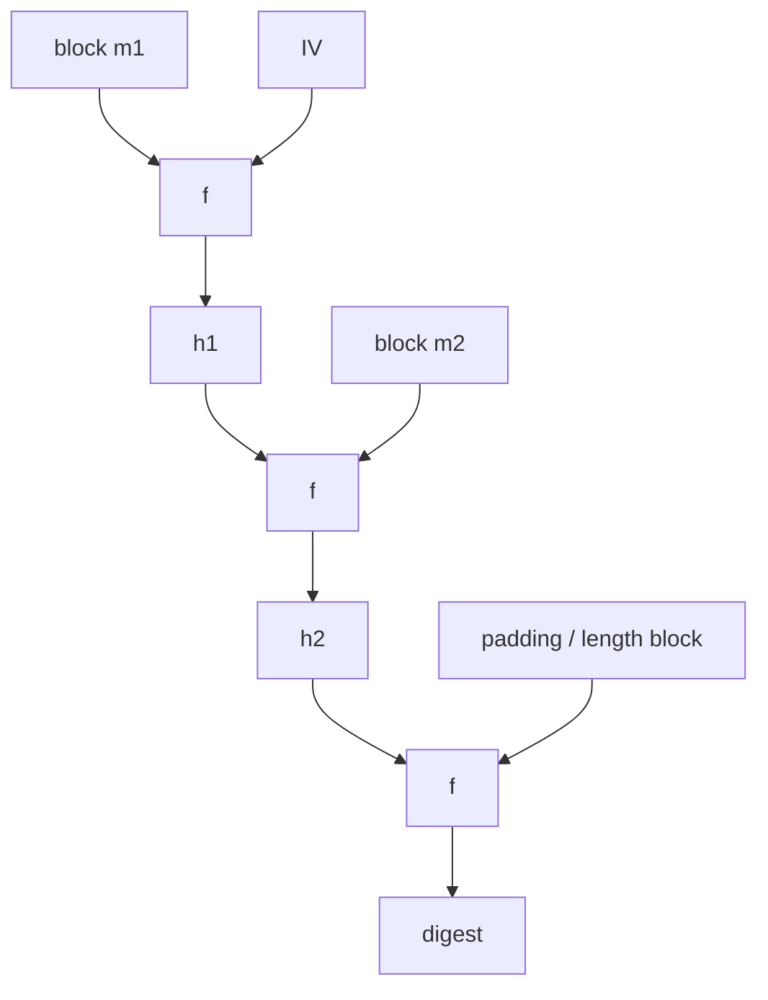

# Hash Functions and Random Oracles

Cryptographic hash functions compress arbitrary-length input into fixed-length digests while trying to preserve adversarial unpredictability properties. They are used for integrity checks, commitment schemes, password hashing, key derivation, signatures, Merkle trees, and MAC constructions such as HMAC. But a hash is not "just a checksum." It needs security properties defined against attackers.

Katz and Lindell separate collision resistance, weaker hash notions, Merkle-Damgard domain extension, birthday attacks, HMAC, applications, and the random-oracle model. Smart gives a more applied presentation of hash design, the MD4 family, SHA-style constructions, and MAC use. Together they show both sides: hash functions are concrete algorithms such as SHA-2 and SHA-3, and they are also idealized objects in proofs.

## Definitions

A **hash function** is an efficient deterministic function

$$
H:\{0,1\}^\ast\to\{0,1\}^n.
$$

The output is a digest of fixed length $n$.

**Collision resistance** means it is infeasible to find any two distinct inputs $x\ne x'$ such that:

$$
H(x)=H(x').
$$

Since the domain is larger than the range, collisions exist. Security says they are hard to find.

**Second-preimage resistance** means that given $x$, it is infeasible to find $x'\ne x$ with $H(x')=H(x)$.

**Preimage resistance** means that given a digest $y$, it is infeasible to find any $x$ such that $H(x)=y$.

The **Merkle-Damgard transform** builds a variable-length hash from a fixed-length compression function. It iterates:

$$
h_0=\mathrm{IV},\qquad h_i=f(h_{i-1},m_i),
$$

then outputs the final chaining value, usually after length padding. MD5, SHA-1, and SHA-2 are in this broad family, though their compression functions differ.

**SHA-3**, based on Keccak, uses a sponge construction instead of Merkle-Damgard. A sponge absorbs input into a larger internal state and squeezes output from it.

A **random oracle** is an ideal public random function. On each new input it returns an independent uniform output and remembers that answer for consistency. The random-oracle model proves security in a world where hash calls are replaced by this ideal oracle.

## Key results

The birthday bound controls collision security. For an $n$-bit hash, generic collision search takes about $2^{n/2}$ trials, not $2^n$. After $q$ random hash outputs, the collision probability is approximately:

$$
1-\exp\left(-\frac{q(q-1)}{2^{n+1}}\right).
$$

This is why 128-bit digests are not enough for 128-bit collision security; they give about 64-bit collision resistance. Modern collision-resistant uses often target 256-bit outputs or larger.

Merkle-Damgard needs strengthening, especially length padding, to preserve collision resistance from the compression function. Without unambiguous padding, different message decompositions can collide structurally. Even with proper padding, plain Merkle-Damgard exposes an internal-state style that can enable length-extension attacks on naive MACs such as $H(K\|m)$.

HMAC avoids the naive hash-MAC problem by using nested keyed hashing. Its design separates the inner digest from the final output and includes distinct pads. This is why HMAC-SHA-256 remains widely used even though plain SHA-256 is not a MAC by itself.

The random-oracle model is useful but idealized. A proof in the random-oracle model says the scheme is secure if the hash behaves like a truly random function accessible to all parties. Real hash functions are deterministic public algorithms, not random oracles. Therefore such proofs are evidence, not the same kind of theorem as a standard-model reduction. Katz and Lindell emphasize this distinction: random-oracle proofs can guide design, but the methodology has known limitations.

Hash functions also support Merkle trees. A Merkle tree commits to many leaves with one root digest. A proof for one leaf contains sibling hashes along the path to the root, so verification takes $O(\log n)$ hashes rather than downloading all leaves.

Domain separation is one of the simplest ways to avoid cross-protocol surprises. If the same hash function is used for commitments, Merkle leaves, Merkle internal nodes, password hashing, and transcript hashing, the inputs should be tagged so a value from one domain cannot be reinterpreted in another. For example, a tree may hash leaves as $H(\texttt{0x00}\|data)$ and internal nodes as $H(\texttt{0x01}\|left\|right)$. This prevents an internal-node encoding from also being a valid leaf encoding.

SHA-2 and SHA-3 have different internal designs, which is useful for algorithm diversity. SHA-256 and SHA-512 are Merkle-Damgard-style hashes built from compression functions. SHA-3 uses the Keccak sponge, with a capacity part of the state controlling security and a rate part controlling throughput. A sponge can naturally support extendable-output functions such as SHAKE, where the caller asks for as many output bytes as needed. The security property still depends on using the function with the right domain and output length.

Password hashing is a separate application with different cost goals. Fast hashes are good for signatures and Merkle trees, but bad for password storage because attackers can try guesses quickly. Password hashing uses salts and deliberately expensive functions to slow offline guessing. That is not a contradiction; it is a reminder that "hash function" names a family of tools, and the security goal determines the right construction.

Random oracles appear often in public-key proofs because they let a proof program oracle answers and extract information from adversary queries. This is powerful, but it creates a gap between the model and real hash functions. A scheme proven only in the random-oracle model should be implemented with conservative hash choices, clear encodings, and awareness that the proof is heuristic evidence about the concrete instantiation.

Collision resistance is not always the right property to ask for. A password reset token needs unpredictability and sufficient entropy, not merely collision resistance. A file identifier in a content-addressed store may need collision resistance because an attacker could try to substitute a different file with the same digest. A KDF needs pseudorandom-looking derived keys under assumptions about the input secret. Naming the exact property prevents both overclaiming and underprotecting.

Hash outputs also need enough bits for the intended threat. A 256-bit digest is common because it gives a comfortable collision margin of about $2^{128}$ generic work. If a digest is truncated, the security level changes immediately. Truncation can be safe when specified, but it must be included in the proof or concrete analysis.

Length encoding is part of safe hashing. If a construction hashes concatenated fields without delimiters, different structured inputs can collide before the hash function is even applied, such as `(A,BC)` and `(AB,C)`. Cryptographic hashing cannot repair an ambiguous serialization. Canonical encodings and length prefixes are therefore part of the security boundary.

A good hash design is therefore paired with a good input format.

Both matter.

## Visual



| Property | Given to attacker | Goal | Generic work for $n$-bit ideal hash |
|---|---|---|---|
| Preimage resistance | digest $y$ | find $x$ with $H(x)=y$ | about $2^n$ |
| Second preimage | input $x$ | find $x'\ne x$ with same digest | about $2^n$ |
| Collision resistance | no target input | find any $x\ne x'$ collision | about $2^{n/2}$ |
| Random oracle behavior | query access | outputs look random and consistent | ideal model, not a real algorithm |

## Worked example 1: birthday collision estimate

Problem: estimate the probability of at least one collision after hashing $q=1{,}000{,}000$ random inputs with a 64-bit hash.

Method:

1. Use:

$$
p\approx 1-\exp\left(-\frac{q(q-1)}{2^{n+1}}\right).
$$

2. Substitute $q=10^6$ and $n=64$:

$$
\frac{q(q-1)}{2^{65}}
=
\frac{1{,}000{,}000\cdot999{,}999}{36{,}893{,}488{,}147{,}419{,}103{,}232}.
$$

3. Approximate the numerator as $10^{12}$:

$$
\frac{10^{12}}{3.689\cdot10^{19}}\approx2.71\cdot10^{-8}.
$$

4. For small $x$, $1-e^{-x}\approx x$, so:

$$
p\approx2.71\cdot10^{-8}.
$$

Checked answer: about $2.7\cdot10^{-8}$. A 64-bit hash may look safe for a million items, but not for adversarial collision resistance at modern security levels.

## Worked example 2: Merkle proof verification

Problem: a four-leaf Merkle tree has leaves $L_0,L_1,L_2,L_3$. The root is:

$$
R=H(H(L_0\|L_1)\|H(L_2\|L_3)).
$$

Verify leaf $L_2$ using proof sibling $L_3$ and upper sibling $A=H(L_0\|L_1)$.

Method:

1. Hash the target leaf with its sibling in the correct order:

$$
B=H(L_2\|L_3).
$$

2. Combine with the upper sibling:

$$
R'=H(A\|B).
$$

3. Accept if:

$$
R'=R.
$$

4. Direction matters. If $L_2$ is on the left and $L_3$ on the right, use $H(L_2\|L_3)$, not $H(L_3\|L_2)$.

Checked answer: the proof is valid exactly when the recomputed root $R'$ equals the trusted root $R$.

## Code

```python
import hashlib

def H(data: bytes) -> bytes:
    return hashlib.sha256(data).digest()

def merkle_parent(left: bytes, right: bytes) -> bytes:
    return H(left + right)

leaves = [H(f"leaf {i}".encode()) for i in range(4)]
a = merkle_parent(leaves[0], leaves[1])
b = merkle_parent(leaves[2], leaves[3])
root = merkle_parent(a, b)

proof_for_leaf2 = [("right", leaves[3]), ("left", a)]
current = leaves[2]
for side, sibling in proof_for_leaf2:
    current = merkle_parent(current, sibling) if side == "right" else merkle_parent(sibling, current)

print(current == root)
```

## Common pitfalls

- Using a non-cryptographic checksum where collision resistance is required.
- Assuming an $n$-bit hash gives $n$-bit collision security. Birthday attacks halve the exponent.
- Building a MAC as `hash(key || message)` instead of HMAC.
- Forgetting domain separation between different hash uses.
- Treating a random-oracle proof as if it directly proves security for SHA-256.
- Omitting leaf positions or directions in Merkle proofs.

## Connections

- [Message authentication codes](/cs/cryptography/message-authentication-codes)
- [Digital signatures](/cs/cryptography/digital-signatures)
- [RSA and OAEP](/cs/cryptography/rsa-and-oaep)
- [Post-quantum cryptography](/cs/cryptography/post-quantum-cryptography)
