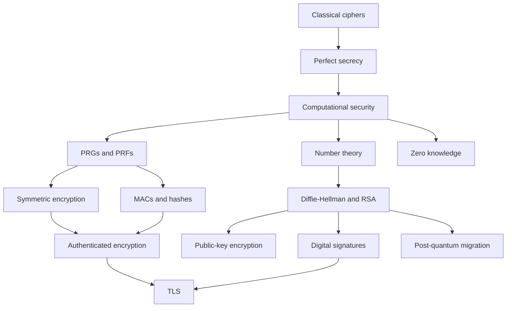

# Cryptography

Cryptography studies mathematical techniques for protecting information against adversaries. Historically it meant secret writing, but modern cryptography is broader: encryption, authentication, key exchange, digital signatures, hash functions, secure channels, zero-knowledge proofs, and post-quantum migration. The organizing question is not "does this look scrambled?" but "what can a precisely defined adversary achieve in a precisely defined experiment?"

These notes combine two complementary sources. Katz and Lindell's *Introduction to Modern Cryptography*, 2nd edition, is the canonical source for formal definitions, provable-security style, reductions, symmetric and public-key constructions, and security experiments. `IntroToCrypto.pdf` is Nigel Smart's *Cryptography: An Introduction*, a different textbook with a more applied and historical presentation; it is especially useful for hand examples, classical ciphers, Enigma-era intuition, finite-field algorithms, implementation concerns, hybrid encryption, certificates, and zero-knowledge. The post-quantum page goes beyond both books because they predate the current NIST post-quantum standards.


*Figure: Enigma machine hardware used in classical cryptography history. Image: [Wikimedia Commons](https://commons.wikimedia.org/wiki/File:ENIGMA_machine_%282585357353%29.jpg), Erik Pitti, CC BY 2.0.*

## Definitions

A **cryptographic primitive** is a basic tool with a security goal: encryption hides messages, a MAC authenticates messages under a shared key, a digital signature authenticates messages under a public key, a hash function compresses data with collision resistance, and a key exchange protocol establishes shared secrets.

A **scheme** is a set of algorithms with syntax and correctness rules. For example, private-key encryption has:

$$
\Pi=(\mathrm{Gen},\mathrm{Enc},\mathrm{Dec}).
$$

Correctness means decryption recovers the encrypted message except with allowed negligible error:

$$
\mathrm{Dec}_k(\mathrm{Enc}_k(m))=m.
$$

Security is defined by an **experiment**. A challenger samples keys and hidden bits, the adversary interacts according to the attack model, and the adversary wins if it achieves a forbidden goal. A secure scheme bounds the winning probability of every efficient adversary.

A **PPT adversary** is a probabilistic polynomial-time attacker. This models efficient computation in asymptotic definitions. A function $\mu(n)$ is **negligible** if it eventually becomes smaller than the reciprocal of every polynomial:

$$
\forall c>0,\quad \mu(n)<n^{-c}
$$

for sufficiently large $n$.

A **reduction** proves that breaking a scheme would break an underlying assumption. The modern pattern is:

$$
\text{efficient attack on construction}
\Rightarrow
\text{efficient attack on assumption}.
$$

The notes use the following generated chapter list:

| Position | Page | Main scope |
|---:|---|---|
| 2 | [Classical ciphers and cryptanalysis](/cs/cryptography/classical-ciphers-and-cryptanalysis) | shift, substitution, Vigenere, frequency attacks |
| 3 | [Perfect secrecy and the one-time pad](/cs/cryptography/perfect-secrecy-one-time-pad) | perfect secrecy, OTP, Shannon lower bound |
| 4 | [Computational security definitions](/cs/cryptography/computational-security-definitions) | PPT, negligible functions, experiments, reductions |
| 5 | [Pseudorandom generators and functions](/cs/cryptography/pseudorandom-generators-functions) | PRGs, PRFs, PRPs, stream-cipher view |
| 6 | [Symmetric encryption and modes](/cs/cryptography/symmetric-encryption-modes) | ECB, CBC, CTR, nonce and IV rules |
| 7 | [Message authentication codes](/cs/cryptography/message-authentication-codes) | EUF-CMA, PRF MACs, CBC-MAC, HMAC |
| 8 | [Authenticated encryption and GCM](/cs/cryptography/authenticated-encryption-gcm) | AEAD, encrypt-then-MAC, GCM concepts |
| 9 | [Hash functions and random oracles](/cs/cryptography/hash-functions-random-oracles) | collisions, Merkle-Damgard, SHA-2/3, random oracles |
| 10 | [Number theory background](/cs/cryptography/number-theory-background) | GCD, inverses, Euler, CRT, modular arithmetic |
| 11 | [Discrete logarithms and Diffie-Hellman](/cs/cryptography/discrete-log-diffie-hellman) | DLP, CDH, DDH, DH exchange |
| 12 | [RSA and OAEP](/cs/cryptography/rsa-and-oaep) | RSA arithmetic, textbook pitfalls, OAEP |
| 13 | [Public-key encryption](/cs/cryptography/public-key-encryption-elgamal-hybrid) | ElGamal, CPA/CCA ideas, KEM/DEM |
| 14 | [Digital signatures](/cs/cryptography/digital-signatures) | EUF-CMA, RSA-FDH, Schnorr, DSA/ECDSA |
| 15 | [TLS protocol overview](/cs/cryptography/tls-protocol-overview) | TLS 1.3 structure, certificates, HKDF, AEAD |
| 16 | [Zero-knowledge proofs](/cs/cryptography/zero-knowledge-proofs) | simulation, Sigma protocols, Schnorr proof |
| 17 | [Post-quantum cryptography](/cs/cryptography/post-quantum-cryptography) | ML-KEM, ML-DSA, SLH-DSA, migration |

## Key results

The first result is methodological: security needs formal definitions. Classical ciphers failed not merely because their designers were less clever, but because there was no precise definition forcing the designer to account for ciphertext-only attacks, repeated messages, known plaintext, chosen plaintext, chosen ciphertext, or public algorithms. Modern cryptography starts by saying what the adversary sees and what counts as a win.

The second result is that secrecy and integrity are different goals. Encryption can hide the message while still being malleable. MACs and signatures authenticate messages but do not necessarily hide them. Authenticated encryption combines confidentiality and integrity under a symmetric key, and secure channels such as TLS compose key exchange, authentication, KDFs, and AEAD into a protocol.

The third result is that randomness and nonces are not decoration. The one-time pad is perfectly secret only with fresh uniform key material as long as the message. Stream ciphers and CTR mode are safe only when keystream inputs do not repeat. CBC needs correct IV handling. Signatures such as DSA, ECDSA, and Schnorr can leak the private key when nonces repeat or are biased.

The fourth result is that public-key cryptography rests on structured hardness assumptions. RSA relies on trapdoor modular exponentiation and assumptions related to RSA inversion and factoring. Diffie-Hellman and Schnorr-like systems rely on discrete logarithm assumptions in chosen groups. Post-quantum cryptography replaces those assumptions with lattice, hash-based, and code-based candidates because quantum algorithms threaten factoring and discrete logarithms.

The fifth result is that composition matters. A secure block cipher in ECB mode is not a secure encryption scheme. A secure hash function used as `hash(key || message)` may not be a secure MAC. A secure unauthenticated Diffie-Hellman exchange is not safe against man-in-the-middle attacks. A secure primitive must be used inside a construction whose proof and operational rules match the intended environment.

These pages are proof-aware rather than proof-complete. They state the experiments, assumptions, reductions, and failure modes students need before reading full textbook proofs. Where the books differ in emphasis, the notes name the difference: Katz and Lindell supply the more rigorous provable-security path; Smart supplies more historical, applied, and implementation-facing examples.

The practical habit to build while reading is to ask four questions of every construction: what is the syntax, what is the correctness statement, what is the adversary allowed to do, and what assumption would be contradicted by a successful attack? Those four questions turn a list of algorithms into a coherent subject.

## Visual



| Goal | Symmetric-key tool | Public-key tool | Protocol-level use |
|---|---|---|---|
| Confidentiality | stream cipher, block-cipher mode, AEAD | PKE, KEM/DEM | encrypted records, file encryption |
| Integrity | MAC, AEAD tag | digital signature | update signing, certificates |
| Key establishment | pre-shared keys, KDFs | DH, KEMs | TLS handshakes |
| Commitment/proofs | hash commitments | zero-knowledge protocols | voting, identity, privacy systems |

## Worked example 1: choosing a primitive for a secure channel

Problem: Alice wants to connect to a server, authenticate that it is really `example.com`, agree on fresh traffic keys, and send private application data. Which cryptographic tools appear?

Method:

1. Alice needs the server's public key to be bound to `example.com`. This uses a certificate chain and digital signatures.

2. Alice and the server need a fresh shared secret. Modern TLS uses ephemeral Diffie-Hellman or a future/hybrid KEM-style exchange:

$$
K_{\text{shared}}=g^{ab}
$$

   in the DH mental model.

3. The shared secret is not used directly as an encryption key. A KDF derives separate keys:

$$
K_{c\to s},K_{s\to c},\dots=\mathrm{KDF}(K_{\text{shared}},\text{transcript}).
$$

4. Application data needs confidentiality and integrity, so use AEAD rather than bare encryption:

$$
(c,t)=\mathrm{AEAD.Enc}_{K_{c\to s}}(N,A,m).
$$

5. Sequence numbers or record counters prevent nonce reuse and replay confusion.

Checked answer: the channel combines certificates and signatures, ephemeral key exchange, KDFs, AEAD, transcript binding, and record sequencing. No single primitive is enough.

## Worked example 2: reading a security claim

Problem: a paper claims, "If $F$ is a PRF, then construction $\Pi$ is CPA secure." What should a reader extract from that sentence?

Method:

1. Identify the assumption: $F$ is a pseudorandom function. This means no efficient oracle algorithm can distinguish $F_k$ from a random function except with negligible advantage.

2. Identify the construction: $\Pi$ must be a precise encryption scheme, including key generation, encryption randomness or nonce rules, decryption, message lengths, and failure behavior.

3. Identify the target definition: CPA security. The adversary can request encryptions of chosen messages and then must distinguish an encryption of $m_0$ from one of $m_1$.

4. Identify the reduction: if adversary $A$ breaks $\Pi$, build distinguisher $D$ that uses $A$ to distinguish $F_k$ from random.

5. Check the loss: if $A$ has advantage $\epsilon$, the reduction might have advantage close to $\epsilon$, or it might lose factors depending on number of queries, collisions, or blocks.

Checked answer: the sentence is a conditional theorem, not a blanket guarantee. It depends on exact syntax, nonce rules, proof loss, and whether the deployment matches the CPA model.

## Code

```python
def choose_tool(goal: str, public_verification: bool = False) -> str:
    goal = goal.lower()
    if goal == "hide data":
        return "Use AEAD with unique nonces after key establishment."
    if goal == "authenticate message" and public_verification:
        return "Use a digital signature scheme with verified public keys."
    if goal == "authenticate message":
        return "Use a MAC such as HMAC or an AEAD tag under a shared key."
    if goal == "establish key":
        return "Use authenticated key exchange or a KEM/DEM protocol."
    if goal == "prove without revealing":
        return "Use a zero-knowledge proof for a precisely defined relation."
    return "Define the adversary and security experiment before choosing tools."

for query in ["hide data", "authenticate message", "establish key"]:
    print(query, "->", choose_tool(query))
print(choose_tool("authenticate message", public_verification=True))
```

## Common pitfalls

- Treating cryptography as a collection of interchangeable algorithms instead of definitions plus constructions.
- Using encryption when authentication is needed, or signatures when a MAC would be enough.
- Reusing nonces, IVs, one-time pads, or signature randomness.
- Ignoring the attack model: passive eavesdropping, CPA, CCA, active network attacks, and side channels are different.
- Assuming public-key encryption authenticates the sender. Anyone can encrypt to a public key.
- Trusting a public key without a certificate, fingerprint, trust-on-first-use policy, or other binding mechanism.
- Using textbook RSA, raw hashes as MACs, ECB mode, or unauthenticated CBC/CTR in new designs.
- Reading a random-oracle proof as if it were automatically a proof for every concrete hash function.

## Connections

- [Classical ciphers and cryptanalysis](/cs/cryptography/classical-ciphers-and-cryptanalysis)
- [Computational security definitions](/cs/cryptography/computational-security-definitions)
- [Authenticated encryption and GCM](/cs/cryptography/authenticated-encryption-gcm)
- [TLS protocol overview](/cs/cryptography/tls-protocol-overview)
- [Post-quantum cryptography](/cs/cryptography/post-quantum-cryptography)
