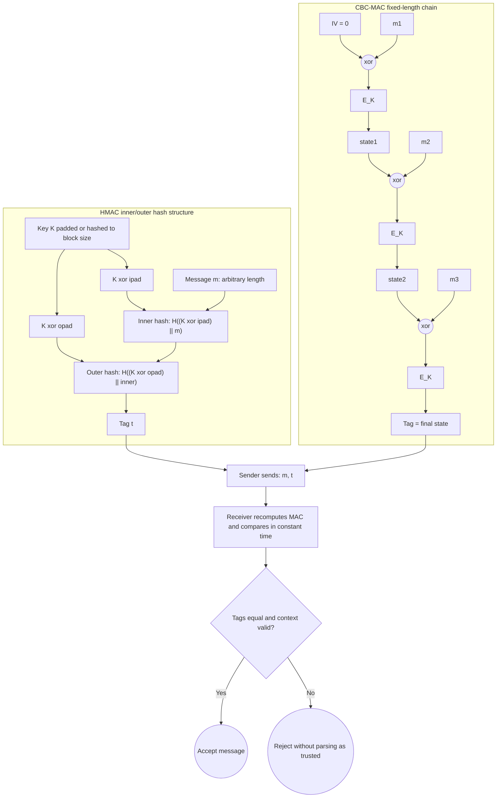

# Message Authentication Codes

Encryption hides content; it does not prove that a message came from the right sender or arrived unchanged. Message authentication codes solve the integrity side of symmetric cryptography. A MAC lets parties sharing a secret key attach a tag to a message so that an attacker who can see and even request tags cannot create a valid tag for a new message.

Katz and Lindell present MACs through formal unforgeability experiments and then develop PRF-based MACs, CBC-MAC, HMAC, and authenticated encryption. Smart's hash-and-MAC discussion is more applied and helps explain why real systems often authenticate protocol records, file chunks, or handshake transcripts. The shared point is that integrity needs its own primitive and its own definition.

## Definitions

A **message authentication code** is a triple:

- $\mathrm{Gen}(1^n)$ samples a secret key $k$.
- $\mathrm{Mac}_k(m)$ outputs a tag $t$.
- $\mathrm{Vrfy}_k(m,t)$ outputs `1` for accept or `0` for reject.

Correctness requires:

$$
\Pr[\mathrm{Vrfy}_k(m,\mathrm{Mac}_k(m))=1]=1
$$

for every message $m$.

The standard security notion is **existential unforgeability under chosen-message attack**, often written EUF-CMA. The adversary gets oracle access to $\mathrm{Mac}_k(\cdot)$ and may request tags on messages of its choice. It wins if it outputs a pair $(m^\*,t^\*)$ such that:

1. $\mathrm{Vrfy}_k(m^\*,t^\*)=1$.
2. $m^\*$ was not previously queried to the MAC oracle.

A **secure fixed-length PRF MAC** is:

$$
\mathrm{Mac}_k(m)=F_k(m)
$$

for messages of the PRF input length. Verification recomputes the tag and compares it.

**CBC-MAC** on fixed-length block messages computes CBC encryption with zero IV and uses the final chaining value as the tag. For blocks $m_1,\dots,m_\ell$:

$$
x_0=0,\qquad x_i=F_k(x_{i-1}\oplus m_i),\qquad t=x_\ell.
$$

**HMAC** wraps a hash function with inner and outer keyed pads:

$$
\mathrm{HMAC}_K(m)=H((K'\oplus \mathrm{opad})\|H((K'\oplus \mathrm{ipad})\|m)).
$$

## Key results

If $F$ is a secure PRF, then the fixed-length MAC $t=F_k(m)$ is secure for messages in the PRF domain. Proof idea: replace $F_k$ with a truly random function. A tag for a new message is then a fresh uniform value unknown to the adversary, so the success probability is about $2^{-s}$ for an $s$-bit tag. If an adversary forges more often, it distinguishes $F_k$ from random.

Variable-length authentication is subtle. A secure MAC for fixed-length messages does not automatically extend to arbitrary lengths. Concatenating block tags, XORing block tags, or using plain CBC-MAC on variable-length messages can be forgeable. Secure domain extension must encode lengths, use different keys, or use constructions designed for variable input.

CBC-MAC is secure for fixed-length messages when built from a secure PRF or PRP, but insecure for variable-length messages. The basic reason is that a tag is also a chaining value. If an attacker has tags for one-block messages, it can use one tag to manipulate the first chaining step of a longer message.

HMAC is the dominant practical hash-based MAC because it avoids the naive length-extension problem of Merkle-Damgard hashes. A construction such as $H(K\|m)$ may be vulnerable when the hash permits extension from an internal state. HMAC's nested structure separates the inner hash from the final public tag in a way that supports strong analysis under appropriate assumptions about the compression function.

MAC verification must be constant-time with respect to the tag comparison. If verification returns as soon as it finds the first mismatched byte, timing may reveal the correct prefix of the tag. This is an implementation issue, not a mathematical flaw in the MAC definition, but real systems fail at exactly this boundary.

MACs provide integrity and origin authentication among parties sharing the key. They do not provide public verifiability or non-repudiation. For those, use digital signatures.

Strong unforgeability is a useful variant. Ordinary EUF-CMA forbids producing a valid tag for a new message. Strong EUF-CMA also forbids producing a new valid tag for a message that was already queried, if the tag differs from the one returned. This matters when tags are randomized or when a larger construction treats the exact pair $(m,t)$ as an object. Authenticated encryption proofs often want strong unforgeability so an attacker cannot alter the tag while leaving the ciphertext unchanged.

Replay is not automatically a MAC failure. If an attacker records $(m,t)$ and sends the same pair again, verification will accept because the pair is authentic. Whether that is allowed depends on the protocol. A payment system, command channel, or secure session must include sequence numbers, timestamps, nonces, or state in the authenticated data. A MAC proves origin and integrity of the bytes it covers; it does not decide freshness unless freshness data is included and checked.

Key separation is another recurring rule. The same raw key should not be used directly for encryption, MAC, KDF, and application tokens. Even if no immediate attack is known, proofs typically assume independent keys or keys derived with labels. A KDF can expand a master secret into `client_write_key`, `server_write_key`, `client_mac_key`, and so on. This makes the construction easier to analyze and limits cross-protocol interactions.

MAC definitions also assume that verification covers the exact encoded message. Ambiguous encodings can break systems even with a secure MAC. If `("ab","c")` and `("a","bc")` both encode as `abc`, a tag on one structured message verifies for the other. Length prefixes, canonical encodings, and domain labels are not bureaucracy; they are part of authenticating the intended object.

A MAC can authenticate a stream by tagging each record, but then record numbers must be part of what is authenticated. Otherwise an attacker may reorder, drop, or duplicate records while keeping each individual tag valid. Secure channels therefore MAC or AEAD-protect a sequence number, direction bit, epoch, or transcript-derived context. The primitive authenticates bytes; the protocol authenticates the conversation.

Verification keys and tagging keys are usually the same in a MAC because both parties share one secret. That symmetry is convenient, but it limits accountability. If Alice and Bob share a MAC key and a valid tag appears, either party could have made it. This is exactly why public disputes and third-party verification require signatures instead.

Within a closed protocol, that symmetry is often acceptable and much faster than public-key verification.

## Visual



This diagram shows MACs as constructions rather than just sender/receiver arrows. HMAC separates the inner and outer keyed hash domains, while CBC-MAC chains block-cipher outputs and uses the final state as the tag under fixed-length or length-protected conditions.

| Construction | Message length | Main assumption | Main warning |
|---|---|---|---|
| PRF tag $F_k(m)$ | fixed input length | PRF security | needs domain extension |
| CBC-MAC | fixed number of blocks | block cipher as PRF/PRP | not plain variable-length safe |
| HMAC | arbitrary length | hash compression behaves well | use real HMAC, not $H(K\|m)$ |
| Poly1305-style MAC | bounded one-time or AE use | universal hashing plus one-time key | key/nonce rules matter |

## Worked example 1: PRF MAC forgery probability

Problem: a fixed-length PRF MAC outputs 32-bit tags. In the ideal random-function world, an adversary has seen valid tags for 100 chosen messages and now tries one new message with one guessed tag. What is its success probability?

Method:

1. In the random-function world, the tag for a new message is independent of all previously seen tags.

2. The tag space has size:

$$
2^{32}=4{,}294{,}967{,}296.
$$

3. A single guessed tag succeeds with probability:

$$
\frac{1}{2^{32}}\approx 2.33\cdot10^{-10}.
$$

4. The 100 previous queries do not improve the probability for a new message, except for ruling out messages already queried.

Checked answer: success probability is $2^{-32}$. In modern systems 32-bit tags are often too short for high-volume settings; 96 or 128 bits is more typical.

## Worked example 2: variable-length CBC-MAC forgery

Problem: use a toy CBC-MAC with zero IV. The attacker knows the tag $t$ for one-block message $a$:

$$
t=F_k(a).
$$

Show how to create a valid tag for a two-block message using one more MAC query.

Method:

1. Query the MAC oracle on a one-block message $b$. Receive:

$$
u=F_k(b).
$$

2. Consider the two-block message:

$$
M=a\|(t\oplus b).
$$

3. CBC-MAC computation on $M$:

$$
x_1=F_k(0\oplus a)=F_k(a)=t.
$$

4. Second block:

$$
x_2=F_k(x_1\oplus(t\oplus b))
   =F_k(t\oplus t\oplus b)
   =F_k(b)
   =u.
$$

5. Therefore $u$ is a valid tag for the new two-block message $a\|(t\oplus b)$, even though that message was never queried.

Checked answer: $(a\|(t\oplus b),u)$ is a forgery. This is why plain CBC-MAC must not be used naively for variable-length messages.

## Code

```python
import hmac
import hashlib

def tag(key: bytes, message: bytes) -> bytes:
    return hmac.new(key, message, hashlib.sha256).digest()

def verify(key: bytes, message: bytes, candidate: bytes) -> bool:
    expected = tag(key, message)
    return hmac.compare_digest(expected, candidate)

key = b"shared secret key"
message = b"transfer=100&to=alice"
t = tag(key, message)
print(t.hex())
print(verify(key, message, t))
print(verify(key, b"transfer=900&to=alice", t))
```

## Common pitfalls

- Assuming encryption gives integrity.
- Using a raw hash as a MAC, such as `SHA256(key || message)`, instead of HMAC or a standard MAC.
- Applying CBC-MAC to variable-length messages without a secure variant.
- Comparing tags with ordinary early-exit equality in timing-sensitive code.
- Truncating tags too aggressively for the number of verification attempts the system allows.
- Reusing one-time MAC keys in constructions that require one-time use.

## Connections

- [Symmetric encryption and modes](/cs/cryptography/symmetric-encryption-modes)
- [Authenticated encryption and GCM](/cs/cryptography/authenticated-encryption-gcm)
- [Hash functions and random oracles](/cs/cryptography/hash-functions-random-oracles)
- [Digital signatures](/cs/cryptography/digital-signatures)
