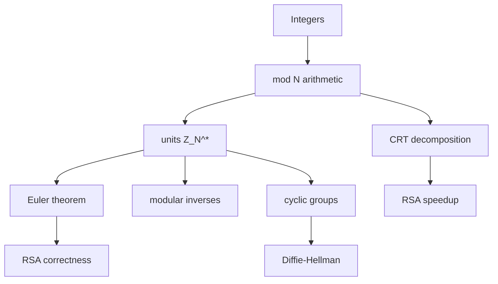

# Number Theory Background

Public-key cryptography is built on arithmetic that is easy to compute in one direction and hard to reverse without special information. RSA uses modular exponentiation modulo a product of primes. Diffie-Hellman uses exponentiation in cyclic groups where discrete logarithms are believed hard. Elliptic-curve systems use the same group language over points on curves. Before those schemes make sense, the number-theory toolkit must be precise.

Katz and Lindell give a self-contained number-theory chapter for primes, modular arithmetic, groups, Euler's theorem, the Chinese remainder theorem, RSA and Diffie-Hellman assumptions. Smart covers similar ground early, with more explicit algorithms for Euclid, inverses, CRT, finite fields, and implementation issues. The common theme is computational: the arithmetic operations are efficient, while selected inverse problems are believed infeasible at cryptographic sizes.

## Definitions

An integer $a$ **divides** $b$, written $a\mid b$, if $b=ak$ for some integer $k$. A prime is an integer $p\gt 1$ whose only positive divisors are $1$ and $p$.

The **greatest common divisor** $\gcd(a,b)$ is the largest positive integer dividing both $a$ and $b$. If $\gcd(a,b)=1$, then $a$ and $b$ are **coprime**.

Modular equivalence is:

$$
a\equiv b\pmod N
$$

when $N\mid(a-b)$. The set of residues modulo $N$ is $\mathbb Z_N=\{0,1,\dots,N-1\}$.

The multiplicative group of invertible residues modulo $N$ is:

$$
\mathbb Z_N^\ast=\{a\in\mathbb Z_N:\gcd(a,N)=1\}.
$$

Euler's phi function is:

$$
\varphi(N)=|\mathbb Z_N^\ast|.
$$

If $N=pq$ for distinct primes $p,q$, then:

$$
\varphi(N)=(p-1)(q-1).
$$

A **modular inverse** of $a$ modulo $N$ is a value $a^{-1}$ satisfying:

$$
aa^{-1}\equiv1\pmod N.
$$

It exists exactly when $\gcd(a,N)=1$.

A **cyclic group** $G$ is a group generated by one element $g$, meaning every element can be written as $g^x$ for some integer $x$. The order of $g$ is the smallest positive $q$ such that $g^q=1$.

## Key results

The Euclidean algorithm computes $\gcd(a,b)$ efficiently by repeatedly replacing $(a,b)$ with $(b,a\bmod b)$ until the remainder is zero. The extended Euclidean algorithm also computes integers $x,y$ such that:

$$
ax+by=\gcd(a,b).
$$

When $\gcd(a,N)=1$, this identity gives a modular inverse:

$$
ax+Ny=1 \quad\Rightarrow\quad ax\equiv1\pmod N.
$$

Fermat's little theorem says that if $p$ is prime and $a\not\equiv0\pmod p$, then:

$$
a^{p-1}\equiv1\pmod p.
$$

Euler's theorem generalizes it: if $a\in\mathbb Z_N^\ast$, then:

$$
a^{\varphi(N)}\equiv1\pmod N.
$$

The Chinese remainder theorem says that if $N_1,\dots,N_t$ are pairwise coprime, then the system:

$$
x\equiv a_i\pmod{N_i}\quad(1\le i\le t)
$$

has a unique solution modulo $N=N_1\cdots N_t$. The map

$$
x\bmod N \mapsto (x\bmod N_1,\dots,x\bmod N_t)
$$

is a ring isomorphism. In RSA, CRT speeds up private-key operations by computing modulo $p$ and modulo $q$ separately, then recombining.

Fast modular exponentiation computes $a^e\bmod N$ in $O(\log e)$ multiplications by repeated squaring. This is why RSA encryption and Diffie-Hellman exponentiation are efficient even when exponents are hundreds or thousands of bits.

Cryptographic hardness assumptions are not theorems that problems are impossible. They are carefully stated beliefs about the cost of algorithms. Factoring large semiprimes, computing RSA roots without the private exponent, and finding discrete logarithms in selected groups are believed hard for classical computers at appropriate parameters. Parameter choice depends on the best known algorithms.

The group viewpoint keeps the notation honest. Addition modulo $N$ always gives an abelian group, but multiplication modulo $N$ is a group only after restricting to invertible residues. When $N$ is prime, every nonzero residue is invertible, so $\mathbb Z_p^\ast=\{1,\dots,p-1\}$. When $N=pq$, many nonzero residues are not invertible: every multiple of $p$ or $q$ has no inverse. RSA works inside this mixed arithmetic, and the trapdoor is precisely the factorization that reveals the group structure.

Finite fields extend the same ideas beyond prime moduli. AES, for example, uses arithmetic in a field with $2^8$ elements, represented by polynomials over $\mathbb F_2$ modulo an irreducible polynomial. Elliptic-curve cryptography uses points whose coordinates lie in finite fields. The notes do not need the full field theory to introduce RSA and DH, but recognizing that "modular arithmetic" and "finite-field arithmetic" are structured algebra prevents treating them as arbitrary bit tricks.

Primality testing is also part of the public-key pipeline. RSA key generation needs large primes, and it is not feasible to prove primality by trial division. Probabilistic tests such as Miller-Rabin quickly reject composites and accept primes with high confidence when repeated with independent bases. The important distinction is between generating a random number that merely has no small factors and generating one that passes a strong primality test.

CRT is more than a hand-solving trick. In RSA decryption, computing $c^d\bmod N$ directly is slower than computing $c^{d_p}\bmod p$ and $c^{d_q}\bmod q$, where $d_p=d\bmod(p-1)$ and $d_q=d\bmod(q-1)$, then recombining. This speedup is standard, but it introduces fault-attack concerns: if an attacker can induce an error in one branch and see the faulty result, the difference from a correct signature can reveal a factor of $N$. Implementations add verification or countermeasures.

Finally, asymptotic efficiency matters because cryptographic numbers are large. The extended Euclidean algorithm, modular multiplication, modular exponentiation, and primality tests all run in time polynomial in the bit length. Factoring and discrete logarithm algorithms are much more expensive at recommended sizes. Public-key cryptography lives in that gap.

It is also important to distinguish a theorem from an algorithmic assumption. Fermat's little theorem, Euler's theorem, Lagrange's theorem, and CRT are proven mathematical facts. The claim that factoring a 2048-bit RSA modulus is infeasible for current classical adversaries is an assumption based on known algorithms and public analysis. Cryptographic systems combine both: the theorem proves correctness, while the assumption supports security.

Many attacks exploit parameters that technically satisfy a formula but violate the intended group setting. A generator may not have the claimed order. A modulus may be composite where a prime was expected. An RSA modulus may share a prime with another modulus if random generation fails. These are number-theory errors first and cryptographic disasters second, so implementations routinely validate parameters before using them.

Random sampling in number-theoretic sets must also be exact enough for the proof. Choosing a random exponent modulo $q$, a random RSA prime, or a random group element with biased rejection logic can leak structure or reduce the search space. Textbooks often write $x\leftarrow\mathbb Z_q$ in one symbol; implementations must turn that symbol into unbiased bytes, rejection sampling, and tests.

This is why cryptographic libraries expose high-level key-generation routines instead of asking every application to assemble primes, groups, exponents, inverses, and validation checks by hand.

The fewer raw number-theory choices an application makes, the smaller its chance of violating a hidden precondition.

Reviewable parameters are part of the security story.

## Visual



| Tool | Computes or states | Cryptographic use |
|---|---|---|
| Euclidean algorithm | $\gcd(a,b)$ | coprimality checks |
| Extended Euclid | $ax+by=\gcd(a,b)$ | modular inverses |
| Fermat/Euler theorem | exponent cycles | RSA correctness, primality tests |
| CRT | combine residues | faster RSA decryption/signing |
| Repeated squaring | $a^e\bmod N$ | RSA, DH, DSA, Schnorr |

## Worked example 1: modular inverse with extended Euclid

Problem: compute $7^{-1}\pmod{19}$.

Method:

1. Run Euclid:

$$
19=2\cdot7+5
$$

$$
7=1\cdot5+2
$$

$$
5=2\cdot2+1.
$$

2. Back-substitute:

$$
1=5-2\cdot2.
$$

3. Substitute $2=7-1\cdot5$:

$$
1=5-2(7-5)=3\cdot5-2\cdot7.
$$

4. Substitute $5=19-2\cdot7$:

$$
1=3(19-2\cdot7)-2\cdot7=3\cdot19-8\cdot7.
$$

5. Reduce modulo 19:

$$
-8\cdot7\equiv1\pmod{19}.
$$

   Since $-8\equiv11\pmod{19}$, the inverse is $11$.

Check:

$$
7\cdot11=77\equiv1\pmod{19}.
$$

Checked answer: $7^{-1}\equiv11\pmod{19}$.

## Worked example 2: Chinese remainder theorem

Problem: solve:

$$
x\equiv4\pmod7,\qquad x\equiv3\pmod5.
$$

Method:

1. The modulus product is:

$$
N=7\cdot5=35.
$$

2. Write $x=4+7t$ from the first congruence.

3. Substitute into the second:

$$
4+7t\equiv3\pmod5.
$$

4. Reduce:

$$
7t\equiv -1\pmod5
$$

   and $7\equiv2$, so:

$$
2t\equiv4\pmod5.
$$

5. The inverse of $2$ modulo $5$ is $3$, so:

$$
t\equiv 3\cdot4\equiv12\equiv2\pmod5.
$$

6. Take $t=2$:

$$
x=4+7\cdot2=18.
$$

Check:

$$
18\bmod7=4,\qquad18\bmod5=3.
$$

Checked answer: $x\equiv18\pmod{35}$.

## Code

```python
def egcd(a: int, b: int):
    if b == 0:
        return (a, 1, 0)
    g, x1, y1 = egcd(b, a % b)
    return (g, y1, x1 - (a // b) * y1)

def invmod(a: int, n: int) -> int:
    g, x, _ = egcd(a, n)
    if g != 1:
        raise ValueError("inverse does not exist")
    return x % n

def crt_pair(a1, n1, a2, n2):
    t = ((a2 - a1) * invmod(n1, n2)) % n2
    return (a1 + n1 * t) % (n1 * n2)

print(invmod(7, 19))
print(crt_pair(4, 7, 3, 5))
```

## Common pitfalls

- Assuming every nonzero residue has an inverse modulo $N$. That is true modulo prime $p$, not arbitrary $N$.
- Using Fermat's little theorem with composite moduli.
- Forgetting that CRT uniqueness is modulo the product of pairwise coprime moduli.
- Confusing $\varphi(N)$ with $N-1$ when $N$ is not prime.
- Implementing modular exponentiation by computing the huge integer first.
- Treating hardness assumptions as proven lower bounds.

## Connections

- [Discrete logarithms and Diffie-Hellman](/cs/cryptography/discrete-log-diffie-hellman)
- [RSA and OAEP](/cs/cryptography/rsa-and-oaep)
- [Digital signatures](/cs/cryptography/digital-signatures)
- [Post-quantum cryptography](/cs/cryptography/post-quantum-cryptography)
