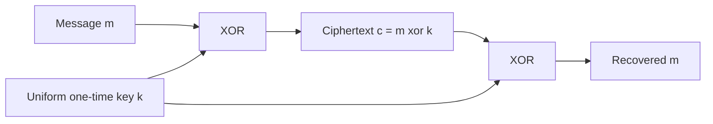

# Perfect Secrecy and the One-Time Pad

Perfect secrecy is the cleanest possible confidentiality definition: after seeing the ciphertext, the adversary learns nothing about which message was sent. This is stronger than "hard to break" and stronger than "no known attack." It is an information-theoretic statement, so it does not depend on the attacker's running time or computing power.


*Figure: Asymmetric encryption turns key distribution into a public and private key pair. Image: [Wikimedia Commons](https://commons.wikimedia.org/wiki/File:Public_key_encryption.svg), Davidgothberg, public domain.*

The one-time pad is the central construction. Katz and Lindell present it as the canonical perfectly secret encryption scheme and use Shannon's theorem to explain its cost: the secret key must be at least as long as the message. Smart adds information-theoretic language such as entropy, equivocation, and unicity distance, which helps connect perfect secrecy to statistical leakage in classical systems.

## Definitions

Let $\Pi=(\mathrm{Gen},\mathrm{Enc},\mathrm{Dec})$ be a private-key encryption scheme with message space $\mathcal M$, key space $\mathcal K$, and ciphertext space $\mathcal C$.

The scheme is **perfectly secret** if for every probability distribution over $\mathcal M$, every message $m\in\mathcal M$, and every ciphertext $c\in\mathcal C$ with $\Pr[C=c]\gt 0$,

$$
\Pr[M=m\mid C=c]=\Pr[M=m].
$$

Equivalently, for every pair $m_0,m_1\in\mathcal M$ and every ciphertext $c\in\mathcal C$,

$$
\Pr[\mathrm{Enc}_K(m_0)=c]=\Pr[\mathrm{Enc}_K(m_1)=c],
$$

where $K$ is sampled by $\mathrm{Gen}$. This equivalent condition says that the ciphertext distribution is the same no matter which message was encrypted.

The **one-time pad** over $n$-bit strings has:

$$
\mathcal M=\mathcal K=\mathcal C=\{0,1\}^n.
$$

Key generation samples $k\leftarrow\{0,1\}^n$ uniformly. Encryption and decryption are:

$$
\mathrm{Enc}_k(m)=m\oplus k,\qquad
\mathrm{Dec}_k(c)=c\oplus k.
$$

Correctness holds because:

$$
\mathrm{Dec}_k(\mathrm{Enc}_k(m))=(m\oplus k)\oplus k=m.
$$

The phrase **one-time** is essential. Reusing the pad destroys perfect secrecy.

## Key results

The one-time pad is perfectly secret. For any fixed $m$ and $c$, exactly one key makes $m$ encrypt to $c$, namely $k=m\oplus c$. Since all keys are equally likely,

$$
\Pr[\mathrm{Enc}_K(m)=c]=2^{-n}
$$

for every $m,c\in\{0,1\}^n$. The ciphertext distribution is uniform and independent of the message.

Shannon's lower bound says that perfect secrecy requires enough key material. In the common finite setting where every message can be sent with positive probability and decryption is correct, any perfectly secret scheme must satisfy:

$$
|\mathcal K|\ge |\mathcal M|.
$$

For $n$-bit messages, this means the key must contain at least $n$ bits of uncertainty. The one-time pad is therefore optimal in key length, but not convenient: sender and receiver must share a fresh key as long as all data they will ever send.

The reuse attack explains why modern systems do not simply reuse a one-time pad. If

$$
c_1=m_1\oplus k,\qquad c_2=m_2\oplus k,
$$

then

$$
c_1\oplus c_2=m_1\oplus m_2.
$$

The key cancels. The adversary may not learn both messages immediately, but it learns a relation between them. Natural language, file headers, JSON syntax, and protocol constants often make that relation enough to recover large parts of the messages.

Perfect secrecy is different from computational secrecy. Perfect secrecy tolerates unlimited attackers but pays with long secret keys. Computational secrecy permits tiny leakage probabilities against efficient attackers and uses short keys, pseudorandom generators, and block ciphers. Modern cryptography mostly uses computational security because perfect secrecy is too expensive for ordinary network communication.

Proof sketch of Shannon's bound: fix a ciphertext $c$ that can occur. For every message $m$, perfect secrecy requires that $m$ remain possible after seeing $c$. Correct decryption means that for each key $k$, the ciphertext $c$ decrypts to only one message. Therefore the number of messages that can remain possible after $c$ is at most the number of keys. If all messages must remain possible, $\vert \mathcal M\vert \le \vert \mathcal K\vert $.

The definition quantifies over message distributions because secrecy should not rely on messages being uniform. Real messages are highly nonuniform: `yes` may be more likely than a random 128-bit string, English text has redundancy, and protocol messages often start with predictable headers. Perfect secrecy says even if the adversary knows that prior distribution exactly, seeing the ciphertext does not update it. The posterior equals the prior.

Entropy gives another way to phrase the same idea. If $M$ is the message random variable and $C$ is the ciphertext random variable, perfect secrecy means:

$$
H(M\mid C)=H(M).
$$

The ciphertext does not reduce uncertainty about the message. This does not mean the ciphertext is useless to the receiver. The receiver has additional information, the key $K$, and with $K$ the conditional entropy collapses:

$$
H(M\mid C,K)=0
$$

for a correct deterministic decryption scheme.

The one-time pad also shows that information-theoretic security and usability can conflict. To send a gigabyte with perfect secrecy, the parties must already share a gigabyte of fresh uniform secret key. If they can securely share that much key in advance, they might also be able to share the message itself. This does not make the one-time pad irrelevant; it is useful in special high-assurance settings and as a conceptual benchmark. It tells us exactly what true secrecy costs.

Computational encryption can be understood as replacing the uniform pad with a pseudorandom pad and replacing equality of distributions with computational indistinguishability. That replacement is enormous. It gives practical communication from short keys, but the guarantee now depends on efficient attackers, assumptions, nonce discipline, and implementation behavior. Perfect secrecy remains the comparison point that makes those compromises visible.

Perfect secrecy also says nothing about authenticity. An attacker can flip any bit of a one-time-pad ciphertext, and the receiver's decrypted plaintext will have the corresponding bit flipped. The receiver has no way to tell from the pad alone whether the ciphertext was modified. This is why information-theoretic encryption still needs an authentication mechanism if active attacks are possible.

The key distribution problem is the main practical obstacle. If two parties share fresh secret pads through a physically secure courier, then the pad can protect later radio messages. If the parties are ordinary web clients and servers meeting for the first time, they need public-key key exchange or a KEM to establish shorter session keys. Perfect secrecy solves message leakage after the key exists; it does not solve how the key was delivered.

The definition is also all-or-nothing. A scheme that leaks the length of a variable-length message is not perfectly secret over a message space containing different lengths, unless length is excluded from the secret. Modern systems often accept length leakage, but perfect secrecy forces the designer to say exactly what the message space contains.

That precision is the enduring value of the definition.

## Visual



| Property | One-time pad | Ordinary stream cipher |
|---|---|---|
| Key length | same as message | short seed key |
| Security type | information-theoretic | computational |
| Reuse allowed | never | nonce/state rules vary |
| Main proof idea | ciphertext uniform for every message | keystream indistinguishable from random |
| Main failure | reused pad leaks $m_1\oplus m_2$ | nonce reuse can imitate pad reuse |

## Worked example 1: encrypting and decrypting a one-time pad

Problem: encrypt $m=10110010$ with one-time key $k=01101100$, then decrypt.

Method:

1. XOR bit by bit:

   ```text
   m = 1 0 1 1 0 0 1 0
   k = 0 1 1 0 1 1 0 0
       -----------------
   c = 1 1 0 1 1 1 1 0
   ```

   So $c=11011110$.

2. Decrypt by XORing the same key:

   ```text
   c = 1 1 0 1 1 1 1 0
   k = 0 1 1 0 1 1 0 0
       -----------------
   m = 1 0 1 1 0 0 1 0
   ```

3. Algebraic check:

$$
c\oplus k=(m\oplus k)\oplus k=m\oplus (k\oplus k)=m.
$$

The checked answer is ciphertext $11011110$ and recovered plaintext $10110010$.

## Worked example 2: seeing why pad reuse leaks information

Problem: two 8-bit messages are encrypted with the same one-time pad:

$$
c_1=00110111,\qquad c_2=01010110.
$$

Assume the attacker guesses that $m_1=01100001$, the ASCII byte for lowercase `a`. Recover $m_2$.

Method:

1. Compute the XOR of ciphertexts:

   ```text
   c1 = 0 0 1 1 0 1 1 1
   c2 = 0 1 0 1 0 1 1 0
        -----------------
   x  = 0 1 1 0 0 0 0 1
   ```

   So $x=c_1\oplus c_2=01100001$.

2. Because the same key was used,

$$
x=(m_1\oplus k)\oplus(m_2\oplus k)=m_1\oplus m_2.
$$

3. Solve for $m_2$:

$$
m_2=x\oplus m_1=01100001\oplus 01100001=00000000.
$$

4. Check by deriving the key from the guess:

$$
k=c_1\oplus m_1=00110111\oplus01100001=01010110.
$$

   Then $m_2=c_2\oplus k=01010110\oplus01010110=00000000$.

The checked answer is $m_2=00000000$. The example is artificial, but the lesson is real: a single plaintext guess can expose another message when a pad is reused.

## Code

```python
import secrets

def otp_encrypt(message: bytes, key: bytes) -> bytes:
    if len(message) != len(key):
        raise ValueError("one-time pad key must match message length")
    return bytes(m ^ k for m, k in zip(message, key))

message = b"attack at dawn"
key = secrets.token_bytes(len(message))
ciphertext = otp_encrypt(message, key)
recovered = otp_encrypt(ciphertext, key)

print(ciphertext.hex())
print(recovered.decode())
```

## Common pitfalls

- Reusing a one-time pad. This is the classic catastrophic error.
- Generating the pad with a predictable pseudorandom source and still calling it perfect secrecy.
- Forgetting that perfect secrecy says the ciphertext leaks no information about the message, not that keys are easy to distribute.
- Treating compression, encoding, or a fixed XOR mask as an OTP.
- Using a key shorter than the message and cycling it, which recreates the Vigenere problem in binary form.
- Confusing "the attacker cannot read this one example" with a proof that the ciphertext distributions are identical.

## Connections

- [Classical ciphers and cryptanalysis](/cs/cryptography/classical-ciphers-and-cryptanalysis)
- [Computational security definitions](/cs/cryptography/computational-security-definitions)
- [Pseudorandom generators and functions](/cs/cryptography/pseudorandom-generators-functions)
- [Symmetric encryption modes](/cs/cryptography/symmetric-encryption-modes)
