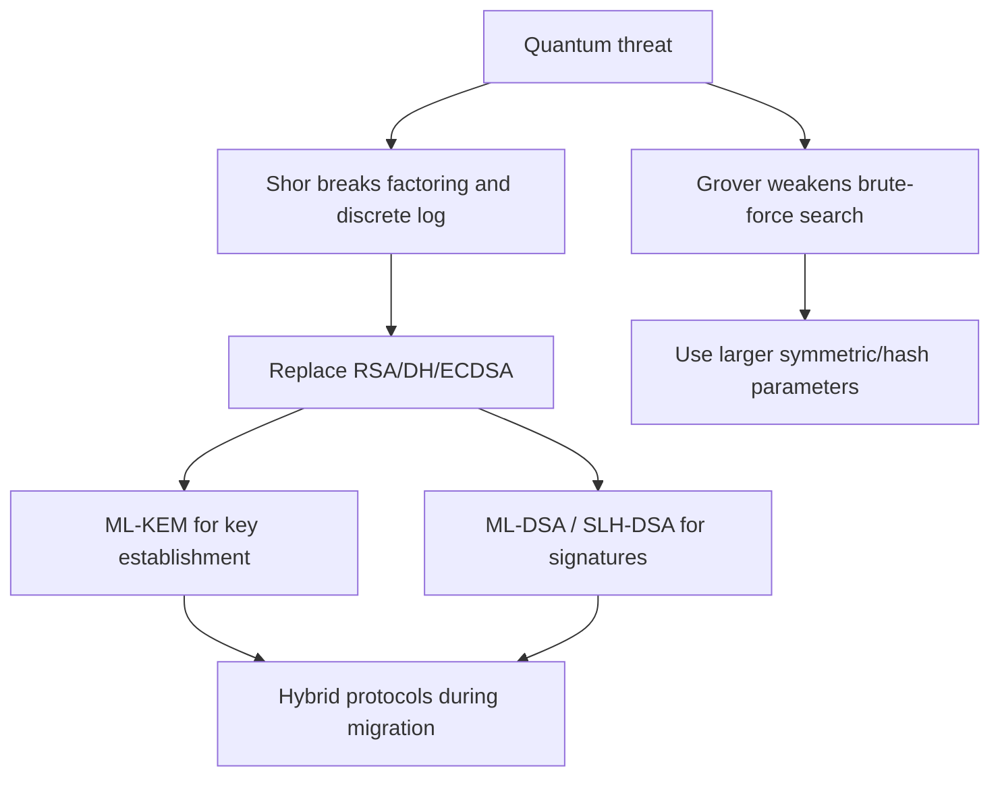

# Post-Quantum Cryptography

Post-quantum cryptography studies public-key algorithms intended to remain secure against attackers with large quantum computers. The motivation is simple: Shor's algorithm would break the factoring and discrete-log assumptions behind RSA, finite-field Diffie-Hellman, elliptic-curve Diffie-Hellman, DSA, Schnorr, and ECDSA if sufficiently large fault-tolerant quantum computers become available. Symmetric cryptography is affected differently: Grover's algorithm gives a quadratic search speedup, so larger symmetric keys and hash outputs can compensate.


*Figure: Alice and Bob diagrams make communication and adversary models easier to track. Image: [Wikimedia Commons](https://commons.wikimedia.org/wiki/File:Alice_e_Bob_%28crittografia_quantistica%29.png), Ft1 at Italian Wikipedia, public domain.*

The two supplied textbooks predate the current NIST post-quantum standards, so this page necessarily goes beyond them. It uses their framework of assumptions, reductions, hybrid encryption, signatures, and symmetric primitives, and adds current standardization context from NIST. NIST published FIPS 203, FIPS 204, and FIPS 205 on August 13, 2024, covering ML-KEM, ML-DSA, and SLH-DSA; its PQC process page also notes HQC selection for future standardization on March 11, 2025.

## Definitions

A scheme is **post-quantum** if it is intended to resist known attacks by both classical and quantum computers. This does not mean it uses quantum mechanics. Most post-quantum cryptography runs on ordinary computers.

A **KEM**, or key encapsulation mechanism, has:

- $\mathrm{KeyGen}$: produce public and secret keys.
- $\mathrm{Encaps}(pk)$: produce ciphertext $c$ and shared key $K$.
- $\mathrm{Decaps}(sk,c)$: recover $K$ or reject.

KEMs are the natural public-key component for hybrid encryption and TLS key establishment.

**ML-KEM** is NIST's module-lattice-based KEM standard in [FIPS 203](https://csrc.nist.gov/pubs/fips/203/final), derived from CRYSTALS-Kyber. Its security is related to Module Learning With Errors.

**ML-DSA** is NIST's module-lattice-based digital signature standard in [FIPS 204](https://csrc.nist.gov/pubs/fips/204/final), derived from CRYSTALS-Dilithium.

**SLH-DSA** is NIST's stateless hash-based digital signature standard in [FIPS 205](https://csrc.nist.gov/pubs/fips/205/final), based on SPHINCS+.

**Lattice-based cryptography** uses hard problems on noisy linear equations or short vectors in lattices. Module-LWE and Module-SIS are common structured assumptions.

**Code-based cryptography** relies on decoding random-looking error-correcting codes. Classic McEliece is the famous long-studied example; HQC is a code-based KEM selected by NIST for standardization after the first PQC standards.

**Hash-based signatures** rely mainly on hash-function security and can be stateful or stateless. They often have larger signatures but conservative assumptions.

## Key results

RSA and discrete-log public-key systems are not post-quantum because Shor's algorithm solves factoring and discrete logarithms in polynomial time on a suitable quantum computer. That affects encryption, signatures, and key exchange. A future quantum adversary could also record today's traffic and decrypt later if the session key was established using quantum-vulnerable public-key exchange and no post-quantum protection.

Symmetric primitives are more resilient. Grover's algorithm gives a square-root speedup for exhaustive key search, so a 256-bit symmetric key is often discussed as giving about 128-bit quantum search security. Hash collision search has different quantum considerations, but the practical conclusion is still to use conservative output sizes and modern hashes.

Post-quantum migration is mostly a protocol and engineering problem, not just an algorithm swap. Public keys, ciphertexts, and signatures may be larger. Implementations must resist side channels. Protocols must bind algorithm negotiation into transcripts. Certificates and hardware security modules may need new formats and performance budgets.

Hybrid key exchange combines a classical secret and a post-quantum secret, then derives the final key from both:

$$
K=\mathrm{KDF}(K_{\text{classical}}\|K_{\text{PQ}}\|\text{transcript}).
$$

This can hedge migration risk: if either component remains secure and the KDF is sound, the final key should remain hidden. But hybrid designs still need precise standards and careful downgrade protection.

Security confidence differs by family. Lattice schemes are efficient and now standardized, but structured assumptions and implementation details require scrutiny. Hash-based signatures are conservative but larger. Code-based systems have long history but may have large public keys or ciphertexts. Isogeny-based approaches suffered major cryptanalytic breaks in recent years, illustrating why diversity and review matter.

The conceptual framework from Katz and Lindell still applies: define the experiment, state the assumption, prove a reduction where possible, and track concrete parameters. The assumptions have changed, not the discipline.

The "harvest now, decrypt later" threat is a major reason migration begins before large quantum computers exist. An adversary can record encrypted traffic today. If the session keys were established using RSA key transport or classical Diffie-Hellman, a future quantum computer might recover the session secret from the transcript and decrypt stored traffic. Data with a long confidentiality lifetime, such as medical records, state secrets, source code, and long-term credentials, therefore has a different migration timeline from short-lived data.

Signatures have a different migration pressure. A quantum adversary in the future might forge signatures under old public keys, but old signed artifacts can often be protected with timestamps, transparency logs, archival policies, and migration to new trust roots. The size and performance impact of post-quantum signatures matters for certificate chains, firmware updates, package repositories, and constrained devices.

Post-quantum KEMs also change failure handling. Decapsulation may reject malformed ciphertexts, and implementations must ensure rejection behavior does not leak secret-key information. Constant-time arithmetic, rejection sampling discipline, masking, and careful error handling matter just as much as they do for classical RSA and ECC. A scheme can be mathematically strong and still fail through timing, cache, power, or fault side channels.

Algorithm agility is necessary but risky. Protocols need a way to negotiate new groups and signature schemes, but negotiation itself creates downgrade opportunities. The selected algorithms must be included in the transcript that is authenticated or MACed. This is the same lesson from TLS and classical cipher-suite negotiation, now applied to a larger and newer algorithm menu.

The NIST standards do not end research. They provide stable targets for deployment, testing, validation, and interoperability. Cryptanalysis, side-channel research, alternate candidates, and hybrid designs continue. A conservative migration plan treats post-quantum adoption as a staged engineering program: inventory cryptography, identify long-lived secrets, deploy hybrid key exchange where appropriate, update signature infrastructure, and monitor standards updates.

A final caution is that security categories are not interchangeable byte-for-byte with old key sizes. A post-quantum parameter set has a claimed security category, performance profile, failure probability if any, and implementation requirements. Choosing among them is a system decision involving data lifetime, bandwidth, CPU budget, certificate size, and interoperability. The right question is not "which algorithm is newest?" but "which standardized parameter set meets this protocol's threat model and operational limits?"

For study purposes, post-quantum cryptography is best viewed as continuity plus new assumptions. The interfaces are still KEMs, signatures, hashes, KDFs, and AEAD channels. What changes is the hardness landscape and the size/performance profile of the public-key pieces.

## Visual



| Family | Example | Main use | Tradeoff |
|---|---|---|---|
| Module lattice | ML-KEM | KEM/key exchange | fast, moderate sizes, structured assumptions |
| Module lattice | ML-DSA | signatures | efficient, larger than ECDSA |
| Hash-based | SLH-DSA | signatures | conservative assumptions, larger/slower |
| Code-based | Classic McEliece, HQC | KEM/encryption | long history, often large keys |
| Symmetric/hash | AES-256, SHA-384/SHA-512 | data protection | mostly parameter scaling |

## Worked example 1: Grover-style key-size intuition

Problem: explain why AES-128 is often said to offer about 64-bit security against ideal Grover search, while AES-256 offers about 128-bit security.

Method:

1. Classical exhaustive search over a $k$-bit key space takes about:

$$
2^k
$$

   trials in the worst case and $2^{k-1}$ on average.

2. Grover search gives a quadratic speedup in the ideal model:

$$
2^k \mapsto 2^{k/2}
$$

   oracle queries, ignoring large practical overheads for reversible circuits and error correction.

3. For $k=128$:

$$
2^{128/2}=2^{64}.
$$

4. For $k=256$:

$$
2^{256/2}=2^{128}.
$$

Checked answer: the rough Grover exponent halves the symmetric key length. This is why 256-bit symmetric keys are a conservative post-quantum choice for long-term protection.

## Worked example 2: hybrid key derivation

Problem: a protocol obtains a classical ECDHE secret `C` and a post-quantum KEM secret `P`. Show how to derive a final session key while binding the handshake transcript `T`.

Method:

1. Concatenate secrets in an unambiguous order:

$$
IKM=C\|P.
$$

2. Include transcript context in the KDF info:

$$
\mathrm{info}=\texttt{"hybrid tls key"}\|H(T).
$$

3. Derive:

$$
K=\mathrm{HKDF}(IKM,\mathrm{info}).
$$

4. Security intuition: if the attacker fails to learn either $C$ or $P$, the extracted key material should remain unpredictable under standard KDF assumptions.

5. Downgrade check: the transcript must include the offered and selected algorithms. Otherwise an attacker might strip the post-quantum component.

Checked answer: derive the final key from both secrets and the transcript. Hybridization without transcript binding is incomplete.

## Code

```python
import hashlib
import hmac

def hkdf_extract(salt: bytes, ikm: bytes) -> bytes:
    return hmac.new(salt, ikm, hashlib.sha256).digest()

def hkdf_expand(prk: bytes, info: bytes, length: int) -> bytes:
    okm = b""
    block = b""
    counter = 1
    while len(okm) < length:
        block = hmac.new(prk, block + info + bytes([counter]), hashlib.sha256).digest()
        okm += block
        counter += 1
    return okm[:length]

classical_secret = bytes.fromhex("01" * 32)
pq_secret = bytes.fromhex("a5" * 32)
transcript = b"clienthello...serverhello...selected hybrid group"
salt = bytes(32)
prk = hkdf_extract(salt, classical_secret + pq_secret)
info = b"hybrid key" + hashlib.sha256(transcript).digest()
print(hkdf_expand(prk, info, 32).hex())
```

## Common pitfalls

- Saying "quantum computers break all cryptography." They mainly threaten current public-key assumptions; symmetric cryptography can be strengthened.
- Assuming post-quantum means quantum hardware is required. These are classical algorithms resisting quantum attacks.
- Migrating algorithms without updating certificates, protocol negotiation, transcript binding, monitoring, and key lifetimes.
- Ignoring larger key, ciphertext, and signature sizes in bandwidth-constrained systems.
- Treating newly standardized algorithms as immune to implementation side channels.
- Using hybrid key exchange without downgrade protection.

## Connections

- [Number theory background](/cs/cryptography/number-theory-background)
- [Discrete logarithms and Diffie-Hellman](/cs/cryptography/discrete-log-diffie-hellman)
- [Public-key encryption](/cs/cryptography/public-key-encryption-elgamal-hybrid)
- [TLS protocol overview](/cs/cryptography/tls-protocol-overview)
