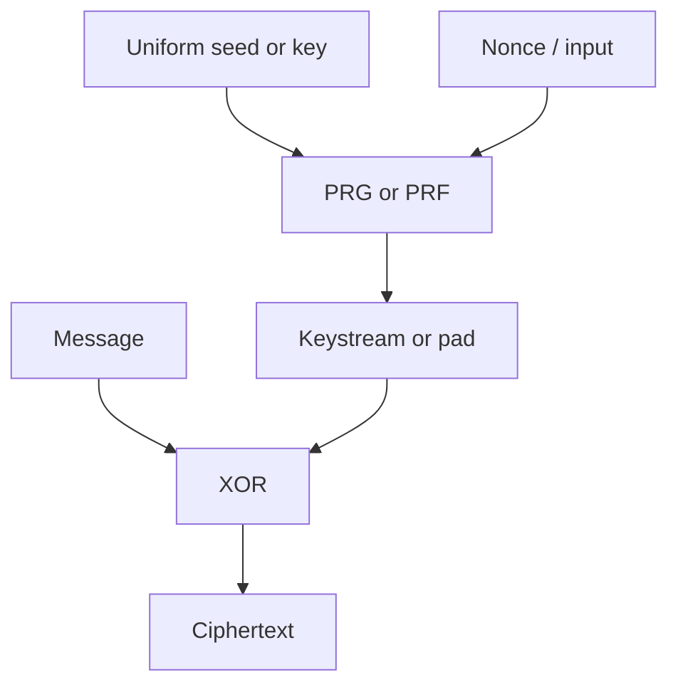

# Pseudorandom Generators and Functions

Pseudorandomness is the practical substitute for true randomness. A one-time pad needs a key as long as the message because it uses truly uniform keystream bits. A pseudorandom generator expands a short uniform seed into a longer string that efficient adversaries cannot distinguish from uniform. A pseudorandom function goes further: it gives keyed random-looking answers on many inputs.


*Figure: Asymmetric encryption turns key distribution into a public and private key pair. Image: [Wikimedia Commons](https://commons.wikimedia.org/wiki/File:Public_key_encryption.svg), Davidgothberg, public domain.*

Katz and Lindell treat PRGs and PRFs as foundational primitives for private-key encryption and MACs. Smart approaches the same territory through stream ciphers, LFSRs, block ciphers, and the later provable-security vocabulary. The synthesis is useful: a practical stream cipher is engineered machinery, but the security goal it tries to approximate is the PRG indistinguishability experiment.

## Definitions

A **pseudorandom generator**, or PRG, is a deterministic polynomial-time algorithm

$$
G:\{0,1\}^n\to\{0,1\}^{\ell(n)}
$$

where $\ell(n)\gt n$. The input $s$ is a uniform seed. The output $G(s)$ is the pseudorandom string.

The PRG is secure if the ensembles

$$
\{G(U_n)\}_n
\quad\text{and}\quad
\{U_{\ell(n)}\}_n
$$

are computationally indistinguishable. Here $U_t$ denotes a uniform $t$-bit string.

A **stream cipher** uses a key, nonce, and internal state to generate a keystream. Encryption XORs the keystream with the message:

$$
c=m\oplus \mathrm{KS}.
$$

Security requires that the keystream used for a given key/nonce pair not be reused and that it look random to efficient adversaries.

A **pseudorandom function**, or PRF, is a keyed family of efficiently computable functions

$$
F_k:\{0,1\}^r\to\{0,1\}^s.
$$

It is secure if no PPT oracle algorithm can distinguish oracle access to $F_k(\cdot)$ for random $k$ from oracle access to a truly random function $f:\{0,1\}^r\to\{0,1\}^s$.

A **pseudorandom permutation**, or PRP, is a keyed family of permutations. Block ciphers such as AES are modeled as PRPs or strong PRPs, depending on whether the adversary also gets inverse-oracle access.

## Key results

The PRG-based fixed-length encryption scheme is the computational analogue of the one-time pad. Let $G$ expand an $n$-bit seed to $\ell$ bits. To encrypt an $\ell$-bit message, choose key $k\leftarrow\{0,1\}^n$ and compute

$$
c=G(k)\oplus m.
$$

If $G(k)$ were uniform, this would be a one-time pad. If $G(k)$ is computationally indistinguishable from uniform, then the ciphertext is computationally indistinguishable from a one-time-pad ciphertext. The reduction is direct: any adversary distinguishing encryptions can be used to distinguish $G(k)$ from uniform.

This basic construction is only for one message per key. If two messages use the same keystream, the reuse attack returns:

$$
c_1\oplus c_2=m_1\oplus m_2.
$$

Real stream-cipher encryption therefore uses nonces, counters, or state to ensure that the keystream segment is unique.

PRFs give CPA-secure encryption by deriving a fresh pad from a random nonce. A standard construction for one-block messages is:

$$
\mathrm{Enc}_k(m): r\leftarrow\{0,1\}^n,\quad c=(r,F_k(r)\oplus m).
$$

The random value $r$ is public but should not repeat. If $F_k$ is indistinguishable from a random function, then $F_k(r)$ is a fresh random-looking pad for each new $r$. Collisions in $r$ are the main residual concern; with $n$-bit nonces, the birthday bound says collisions become likely around $2^{n/2}$ encryptions if nonces are random.

Block ciphers are usually treated as practical PRPs. Modes such as CTR turn a block cipher into a stream of pseudorandom blocks:

$$
F_k(\mathrm{nonce}\|0),\ F_k(\mathrm{nonce}\|1),\ F_k(\mathrm{nonce}\|2),\dots
$$

The proof idealizes the block cipher as a PRF or PRP, then reduces the security of the mode to the pseudorandomness of those outputs and the non-repetition of inputs.

LFSRs illustrate why statistical randomness is not enough. A linear feedback shift register can produce long, balanced-looking sequences, but linear recurrence makes it predictable from enough output bits. Modern stream ciphers add nonlinear filtering, irregular clocking, or ARX-style operations because pseudorandomness is an adversarial indistinguishability goal, not just a frequency test.

The next-bit viewpoint is another useful characterization of pseudorandomness. Informally, if a generator output is pseudorandom, then after seeing a prefix no efficient algorithm should predict the next bit with probability noticeably better than $1/2$. If a predictor exists, it can be turned into a distinguisher: run the predictor on prefixes and check whether it predicts the next bit unusually well. Conversely, distinguishers can often be converted into predictors. This connects the abstract indistinguishability definition to the concrete intuition of unpredictability.

Stretch matters. A PRG with output length $n+1$ already contains deep theoretical content, because repeated expansion can build longer pseudorandom strings under suitable constructions. In practice, stream ciphers and deterministic random bit generators expand seeds much further, but they must manage state, reseeding, nonces, and backtracking resistance. If an internal state is compromised, a robust generator should limit what the attacker can learn about past outputs after state updates.

PRFs are stronger interfaces than PRGs because the adversary chooses inputs adaptively. The same key must answer many queries, and the outputs should look like a consistent random function. Consistency matters: querying the same input twice must return the same value, unlike drawing a fresh random string each time. Security says that this consistency is the only visible structure.

PRPs add invertibility, which is exactly what block ciphers need for decryption. But many modes never call the inverse direction and only require that forward outputs on distinct inputs look random. This is why proofs may switch between PRP and PRF assumptions with a birthday-bound loss: a random permutation and a random function are hard to distinguish until collisions or inverse structure become visible.

A practical warning follows from all these definitions: never use a general-purpose programming-language PRNG for cryptographic keys, nonces that require unpredictability, or pads. Such generators are often designed for simulation speed and reproducibility, not adversarial prediction resistance. Cryptographic randomness must come from an approved CSPRNG or operating-system entropy interface.

The same primitive may appear under different names in different layers. A block cipher used in CTR mode behaves like a PRF on counter inputs. HMAC can be used as a PRF inside a KDF. A stream cipher can be viewed as a stateful PRG with nonce input. These identifications are useful, but only when the input rules match the proof. A PRF is not safe if the same key is reused across incompatible domains without labels.

Backtracking resistance is another generator goal. If an attacker compromises the current internal state, a well-designed generator should make it hard to reconstruct old outputs that were produced before earlier state updates. This is important for long-running services that generate many keys over time.

Forward security after reseeding is the matching goal for future outputs.

## Visual



| Primitive | Input | Output behavior | Typical use | Main security experiment |
|---|---|---|---|---|
| PRG | short seed | long random-looking string | stream encryption | distinguish $G(U_n)$ from $U_{\ell(n)}$ |
| PRF | key and chosen input | random-function-like answers | encryption, MACs, KDFs | distinguish keyed oracle from random function |
| PRP | key and block | random-permutation-like block mapping | block ciphers | distinguish permutation oracle from random permutation |
| Stream cipher | key, nonce, state | keystream sequence | high-speed encryption | distinguish keystream from random under nonce rules |

## Worked example 1: PRG encryption as a computational one-time pad

Problem: suppose a toy PRG maps a 4-bit seed `1010` to the 8-bit output `01101101`. Encrypt the 8-bit message `11001010`.

Method:

1. Write the message and pad:

   ```text
   m      = 1 1 0 0 1 0 1 0
   G(k)   = 0 1 1 0 1 1 0 1
   ```

2. XOR them:

   ```text
   c      = 1 0 1 0 0 1 1 1
   ```

3. Decrypt by generating the same pad and XORing:

   ```text
   c      = 1 0 1 0 0 1 1 1
   G(k)   = 0 1 1 0 1 1 0 1
          -----------------
   m      = 1 1 0 0 1 0 1 0
   ```

Checked answer: ciphertext `10100111`, recovered message `11001010`.

Security check: this toy is not secure because a 4-bit seed can be brute-forced. The worked arithmetic shows the construction, not a real parameter choice.

## Worked example 2: nonce collision probability

Problem: a PRF-based encryption scheme samples a random 32-bit nonce for each message. Estimate the collision probability after $q=10{,}000$ encryptions.

Method:

1. Use the birthday approximation:

$$
\Pr[\text{collision}]
\approx
1-\exp\left(-\frac{q(q-1)}{2N}\right),
$$

   where $N=2^{32}$.

2. Substitute:

$$
\frac{q(q-1)}{2N}
=
\frac{10000\cdot9999}{2\cdot2^{32}}
=
\frac{99{,}990{,}000}{8{,}589{,}934{,}592}
\approx 0.01164.
$$

3. Then

$$
1-e^{-0.01164}\approx 1-0.98843=0.01157.
$$

4. Interpret the result: about a $1.16\%$ chance of at least one repeated nonce.

Checked answer: 32-bit random nonces are too small for 10,000 encryptions if collisions are dangerous. Use larger nonces or deterministic counters with uniqueness guarantees.

## Code

```python
from hashlib import sha256

def prf_block(key: bytes, nonce: int, counter: int) -> bytes:
    data = key + nonce.to_bytes(12, "big") + counter.to_bytes(4, "big")
    return sha256(data).digest()

def xor_stream_encrypt(key: bytes, nonce: int, message: bytes) -> bytes:
    out = bytearray()
    for block_index in range((len(message) + 31) // 32):
        pad = prf_block(key, nonce, block_index)
        chunk = message[32 * block_index:32 * (block_index + 1)]
        out.extend(m ^ p for m, p in zip(chunk, pad))
    return bytes(out)

key = b"demo key material".ljust(32, b"\0")
nonce = 7
c = xor_stream_encrypt(key, nonce, b"meet at the library")
print(c.hex())
print(xor_stream_encrypt(key, nonce, c))
```

## Common pitfalls

- Using a statistically nice generator as if it were cryptographic. Simulations and cryptography need different guarantees.
- Reusing a nonce in stream encryption or CTR mode.
- Forgetting that a PRG is deterministic; only the seed is random.
- Treating a block cipher as a random oracle. A block cipher is keyed and length-preserving.
- Confusing PRFs with collision-resistant hashes. They solve different problems.
- Ignoring birthday limits for random nonces and random function outputs.

## Connections

- [Computational security definitions](/cs/cryptography/computational-security-definitions)
- [Symmetric encryption modes](/cs/cryptography/symmetric-encryption-modes)
- [Message authentication codes](/cs/cryptography/message-authentication-codes)
- [Hash functions and random oracles](/cs/cryptography/hash-functions-random-oracles)
