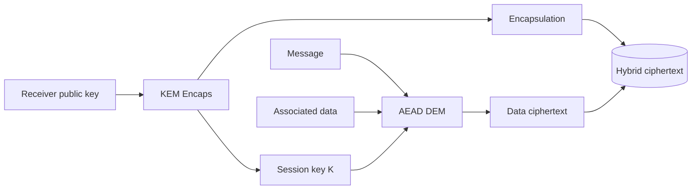

# Public-Key Encryption, ElGamal, and Hybrid Encryption

Public-key encryption lets anyone encrypt to a receiver using a public key, while only the receiver can decrypt using a private key. It solves the distribution problem that limits purely symmetric systems, but public-key operations are usually slower and message-size limited. Practical systems therefore use public-key encryption to protect a short symmetric key, then use authenticated symmetric encryption for the data.

Katz and Lindell present public-key encryption through CPA and CCA experiments, hybrid encryption, KEM/DEM, ElGamal, DDH-based encapsulation, and RSA-based schemes. Smart's public-key and hybrid-encryption chapters complement this with concrete RSA, ElGamal, Rabin, Paillier, and KEM/DEM explanations. The synthesis is that public-key encryption is mostly a key-establishment tool inside larger protocols.

## Definitions

A **public-key encryption scheme** has:

- $\mathrm{Gen}(1^n)$: output key pair $(pk,sk)$.
- $\mathrm{Enc}_{pk}(m)$: encrypt using the public key.
- $\mathrm{Dec}_{sk}(c)$: decrypt using the secret key.

Correctness means:

$$
\mathrm{Dec}_{sk}(\mathrm{Enc}_{pk}(m))=m
$$

except with negligible probability.

The **CPA indistinguishability experiment** for public-key encryption gives the adversary $pk$. Since the public key already lets it encrypt arbitrary messages, no separate encryption oracle is needed. The adversary submits equal-length $m_0,m_1$, receives an encryption of $m_b$, and guesses $b$.

The **CCA experiment** additionally gives a decryption oracle, except that the adversary may not ask to decrypt the challenge ciphertext.

**ElGamal encryption** works in a cyclic group $G$ of order $q$ with generator $g$:

1. Secret key: $x\leftarrow\mathbb Z_q$.
2. Public key: $h=g^x$.
3. Encrypt group message $m\in G$: sample $r\leftarrow\mathbb Z_q$ and output

$$
c=(g^r,\ h^r\cdot m).
$$

4. Decrypt:

$$
m=\frac{c_2}{c_1^x}.
$$

A **key encapsulation mechanism**, or KEM, produces a shared key and encapsulation ciphertext. A **data encapsulation mechanism**, or DEM, uses that key for symmetric authenticated encryption. Hybrid encryption combines them.

## Key results

ElGamal correctness follows from:

$$
c_1^x=(g^r)^x=g^{rx}=h^r.
$$

Therefore:

$$
\frac{c_2}{c_1^x}=\frac{h^r m}{h^r}=m.
$$

ElGamal is randomized because each encryption uses fresh $r$. Under the DDH assumption, ElGamal is CPA secure for messages encoded as group elements. If $(g,g^x,g^r,g^{xr})$ is indistinguishable from $(g,g^x,g^r,g^z)$, then $h^r m$ looks like a one-time pad over the group.

Plain ElGamal is malleable and not CCA secure. Given $(c_1,c_2)$ encrypting $m$, an attacker can form $(c_1, c_2\cdot \Delta)$, which decrypts to $m\cdot\Delta$. CCA-secure variants add authentication, hashing, KEM/DEM transforms, or other structure.

Hybrid encryption is the practical pattern:

1. KEM: use public-key cryptography to derive a random session key $K$ and encapsulation $C_K$.
2. DEM: use AEAD to encrypt the actual message under $K$.
3. Output $(C_K, C_{\text{data}})$.

The security proof usually separates concerns. If the KEM key is indistinguishable from random and the DEM is secure authenticated encryption, then the hybrid ciphertext hides the message and resists modification, subject to exact definitions and composition rules.

Public-key encryption does not authenticate the sender by itself. Anyone can encrypt to the receiver's public key. If the receiver needs sender authentication, the protocol must add signatures, MACs from an established key, certificates, or authenticated key exchange.

Public-key authenticity also depends on binding public keys to identities. If an attacker can replace Bob's public key with its own, Alice may encrypt secrets to the attacker. Certificates and PKI solve this binding problem imperfectly but practically.

The distinction between CPA and CCA security is especially important for public-key encryption because decryption oracles are realistic. A server may reveal whether a ciphertext had valid padding, whether a session key decrypted to a valid MAC key, or whether a decrypted message parsed correctly. Bleichenbacher-style attacks on RSA PKCS #1 v1.5 encryption showed that even one bit of validity information can be amplified into full plaintext recovery. CCA-secure schemes are designed so modified ciphertexts do not become useful probes.

KEM/DEM clarifies message size and security boundaries. The KEM handles a fixed-size secret and public-key ciphertext. The DEM handles arbitrary-length data with symmetric authenticated encryption. This avoids trying to encode large files as group elements or RSA integers. It also lets the symmetric layer handle associated data, streaming, chunking, and replay rules while the public-key layer focuses on encapsulating a random key.

ElGamal has an instructive randomness requirement. If the same exponent $r$ encrypts two group messages under the same public key, then both ciphertexts share $c_1=g^r$ and the same mask $h^r$. Dividing the second components reveals the ratio of messages:

$$
\frac{c_{2,1}}{c_{2,2}}=\frac{h^r m_1}{h^r m_2}=m_1m_2^{-1}.
$$

This is the group analogue of stream-cipher nonce reuse. Fresh encryption randomness is not optional.

Message encoding is another hidden detail. ElGamal as written encrypts group elements, but real messages are byte strings. A secure implementation either uses a KEM to avoid encoding messages into the group, or uses a carefully specified encoding with rejection rules and proofs. "Convert the bytes to a number and hope" is how textbook examples become vulnerable systems.

Finally, public-key encryption by itself does not give sender deniability or non-repudiation. Since anyone can create a ciphertext to Bob, Bob cannot show a third party that Alice created it unless additional signatures or authenticated channel context exist. This is often a feature for privacy, but it must be understood by protocol designers.

Hybrid encryption also improves failure containment. If the public-key layer encapsulates only a random key, then malformed public-key ciphertexts can be rejected before any large plaintext parser runs. If the DEM is an AEAD, modified data ciphertexts are rejected before release of plaintext. This layered rejection behavior is exactly what CCA-aware design wants: attackers should not get a rich oracle that reports how far a malformed message got through the application.

Key privacy is a separate property. Ordinary public-key encryption primarily hides the message, not necessarily the identity of the recipient public key. Some schemes or protocols may leak which public key was used through ciphertext format, certificate choice, or network metadata. Anonymous messaging systems need stronger definitions and additional routing protections. The basic PKE definition in these notes is not meant to solve traffic analysis.

Randomness quality is as important in public-key encryption as in symmetric encryption. ElGamal needs fresh random exponents; RSA-OAEP needs fresh seeds; KEMs often need coins for encapsulation. If the random source repeats or becomes predictable, ciphertexts may link, session keys may repeat, or private information may leak. Public-key algorithms do not remove the need for a cryptographic random source.

Multi-recipient encryption is another place where naive designs fail. Encrypting the same raw session key independently to many recipients can be safe in a KEM/DEM design if each encapsulation is randomized and the DEM context is clear. Reusing deterministic textbook encryption or omitting recipient identities from associated data can create substitution problems.

The recipient set is often security-relevant metadata.

## Visual



| Scheme pattern | Strength | Main limitation |
|---|---|---|
| Textbook RSA | simple trapdoor example | deterministic, malleable |
| ElGamal | DDH-based CPA security | malleable without transforms |
| RSA-OAEP | practical RSA encryption | random-oracle proof and careful parsing |
| KEM/DEM hybrid | practical large-message encryption | both halves and binding must be correct |
| Integrated AEAD channel | best application interface | requires key establishment first |

## Worked example 1: toy ElGamal encryption

Problem: use $p=23$, group $\mathbb Z_{23}^\ast$, generator $g=5$, secret $x=6$, and message $m=7$. Encrypt with randomness $r=3$.

Method:

1. Compute public key:

$$
h=g^x=5^6\bmod23.
$$

   From earlier arithmetic, $5^6\equiv8$, so $h=8$.

2. Compute first ciphertext component:

$$
c_1=g^r=5^3=125\equiv10\pmod{23}.
$$

3. Compute shared mask:

$$
h^r=8^3=512\equiv6\pmod{23}.
$$

4. Compute second component:

$$
c_2=h^r m=6\cdot7=42\equiv19\pmod{23}.
$$

5. Ciphertext is:

$$
(c_1,c_2)=(10,19).
$$

Checked answer: ElGamal ciphertext is $(10,19)$.

## Worked example 2: toy ElGamal decryption

Problem: decrypt the ciphertext $(10,19)$ from the previous example using secret key $x=6$.

Method:

1. Compute:

$$
c_1^x=10^6\bmod23.
$$

2. Repeated squaring:

$$
10^2=100\equiv8,\qquad
10^4\equiv8^2=64\equiv18.
$$

   Thus:

$$
10^6=10^4\cdot10^2\equiv18\cdot8=144\equiv6\pmod{23}.
$$

3. We need inverse of $6$ modulo $23$. Since:

$$
6\cdot4=24\equiv1\pmod{23},
$$

   $6^{-1}=4$.

4. Recover:

$$
m=c_2\cdot(c_1^x)^{-1}=19\cdot4=76\equiv7\pmod{23}.
$$

Checked answer: decrypted message is $7$.

## Code

```python
def invmod(a: int, p: int) -> int:
    return pow(a, -1, p)

def elgamal_keygen(p: int, g: int, x: int):
    return pow(g, x, p), x

def elgamal_encrypt(p: int, g: int, h: int, m: int, r: int):
    c1 = pow(g, r, p)
    c2 = (pow(h, r, p) * m) % p
    return c1, c2

def elgamal_decrypt(p: int, x: int, c):
    c1, c2 = c
    shared = pow(c1, x, p)
    return (c2 * invmod(shared, p)) % p

p, g, x, m, r = 23, 5, 6, 7, 3
h, sk = elgamal_keygen(p, g, x)
c = elgamal_encrypt(p, g, h, m, r)
print(h, c, elgamal_decrypt(p, sk, c))
```

## Common pitfalls

- Encrypting large data directly with public-key operations.
- Forgetting public-key encryption does not identify the sender.
- Treating CPA-secure encryption as safe against chosen-ciphertext attacks.
- Reusing ElGamal randomness $r$.
- Skipping public-key validation or certificate validation.
- Combining KEM and DEM without binding algorithm choices, identities, and associated data.

## Connections

- [Discrete logarithms and Diffie-Hellman](/cs/cryptography/discrete-log-diffie-hellman)
- [RSA and OAEP](/cs/cryptography/rsa-and-oaep)
- [Authenticated encryption and GCM](/cs/cryptography/authenticated-encryption-gcm)
- [TLS protocol overview](/cs/cryptography/tls-protocol-overview)
