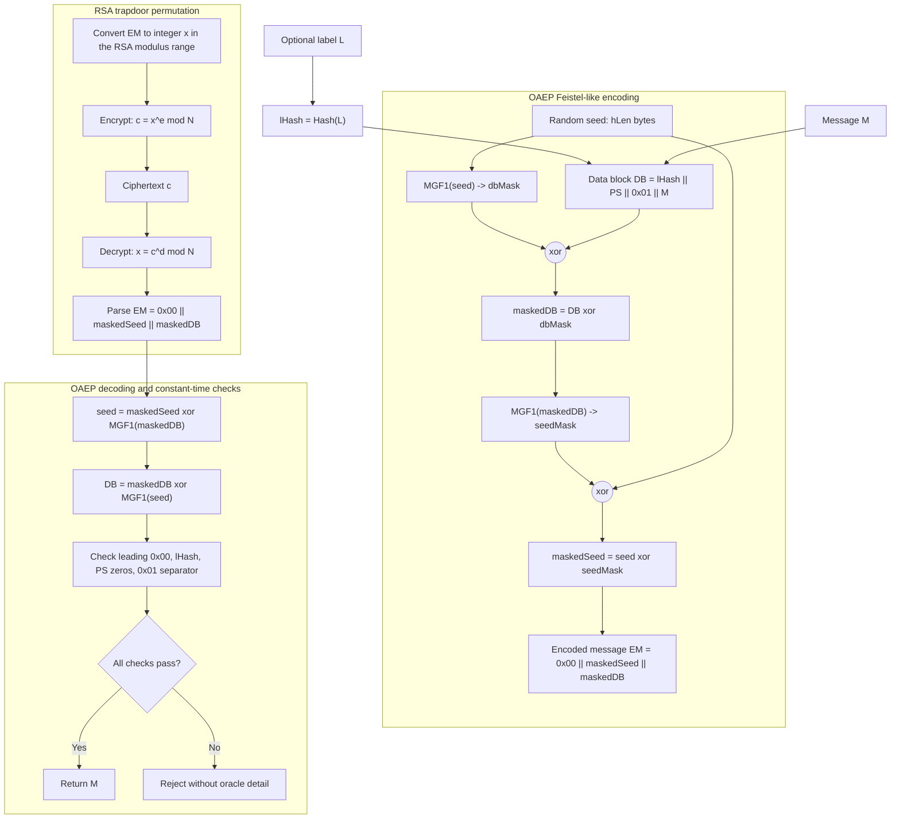

# RSA and OAEP

RSA is the best-known public-key cryptosystem and a central example of trapdoor arithmetic. Public operations raise values to an exponent modulo $N=pq$. Private operations use knowledge of $p$ and $q$ to invert that exponent. The algebra is elegant, but textbook RSA is not secure encryption. Padding and security definitions are not optional details; they are the difference between a math function and a cryptographic scheme.


*Figure: Public-key encryption makes the Alice-to-Bob security goal explicit. Image: [Wikimedia Commons](https://commons.wikimedia.org/wiki/File:Public_key_encryption_alice_to_bob.svg), Winstonlee, CC0.*

Katz and Lindell distinguish plain RSA, RSA assumptions, padded RSA, OAEP, CCA security, and implementation pitfalls. Smart gives complementary arithmetic examples, implementation notes, and public-key attack context. Taken together, they show why modern RSA encryption is normally used as a KEM or through standardized padding, not as $c=m^e\bmod N$ on raw messages.

## Definitions

RSA key generation:

1. Choose large distinct primes $p,q$.
2. Set $N=pq$.
3. Compute $\varphi(N)=(p-1)(q-1)$ or $\lambda(N)=\mathrm{lcm}(p-1,q-1)$.
4. Choose public exponent $e$ with $\gcd(e,\varphi(N))=1$.
5. Compute private exponent $d$ such that:

$$
ed\equiv1\pmod{\varphi(N)}.
$$

The public key is $(N,e)$ and the private key is $d$ together with often $p,q$ for efficient CRT computation.

The RSA function is:

$$
f_{N,e}(x)=x^e\bmod N.
$$

The trapdoor inverse is:

$$
f^{-1}_{N,e}(y)=y^d\bmod N.
$$

The **RSA assumption** says that for appropriately generated $(N,e)$ and random $y\in\mathbb Z_N^\ast$, it is infeasible to find $x$ such that:

$$
x^e\equiv y\pmod N.
$$

**Textbook RSA encryption** is:

$$
c=m^e\bmod N.
$$

It is deterministic and malleable, and therefore not CPA secure.

**OAEP**, Optimal Asymmetric Encryption Padding, is a randomized encoding method that uses hash-like masks before applying the RSA function. It is used in RSAES-OAEP and supports strong security proofs in the random-oracle model.

## Key results

RSA correctness follows from Euler-style exponent arithmetic. Since $ed=1+t\varphi(N)$, for $m\in\mathbb Z_N^\ast$:

$$
(m^e)^d=m^{ed}=m^{1+t\varphi(N)}=m(m^{\varphi(N)})^t\equiv m\pmod N.
$$

The result extends to all residues modulo $N$ using CRT reasoning over $p$ and $q$.

Textbook RSA is not secure. It is deterministic, so encrypting the same message twice gives the same ciphertext. It is also multiplicatively malleable:

$$
c=m^e\bmod N.
$$

For any $r\in\mathbb Z_N^\ast$, define:

$$
c'=c\cdot r^e\bmod N.
$$

Then:

$$
(c')^d\equiv m\cdot r\pmod N.
$$

An attacker can transform a ciphertext into an encryption of a related plaintext without knowing the message.

Small-exponent and small-message errors are also dangerous. If $e=3$ and $m^3\lt N$, then $c=m^3$ as an ordinary integer, so the attacker can take an integer cube root. If the same message is sent to several recipients with $e=3$ and no padding, CRT can recover the message.

OAEP addresses determinism and structure by encoding a message with randomness before RSA exponentiation. In simplified form, it uses two mask-generating functions $G$ and $H$:

$$
s=(m\|0^k)\oplus G(r),\qquad
t=r\oplus H(s),
$$

and RSA is applied to $s\|t$. Decoding reverses the masks and checks the padding. The exact standardized format includes lengths, labels, and error handling rules.

RSA decryption and signing implementations must resist side channels. Timing differences, padding-oracle behavior, fault attacks, and missing blinding have all mattered in practice. The mathematical proof assumes the adversary sees only allowed inputs and outputs, not power traces or detailed error codes.

Key generation has several quiet requirements. The primes $p$ and $q$ must be generated with high-quality randomness, be large enough, and not be too close together. The public exponent $e$ is often $65537$ because it is efficient and avoids the worst small-exponent choices when combined with proper padding. The private exponent must not be unusually small; otherwise attacks such as Wiener's attack may apply. Implementations also store CRT parameters for speed, but those parameters are sensitive secret-key material.

OAEP's label field is often empty, but it is still part of the encoding. If a protocol uses a nonempty label, decryption must check the same label. This is another instance of context binding: the ciphertext should decrypt only in the context for which it was created. OAEP decoding must perform all checks in a way that does not reveal which check failed. Returning "bad seed," "bad label hash," and "bad delimiter" as separate errors would defeat the point of CCA-aware design.

RSA is now more common for signatures than for new encryption designs, and many modern protocols prefer elliptic-curve or post-quantum key exchange for establishing session secrets. Still, RSA remains important because of deployed certificates, legacy protocols, hardware support, and the conceptual clarity of trapdoor permutations. Understanding why textbook RSA fails is one of the best ways to learn why padding standards exist.

The relation between factoring and RSA inversion is subtle. Knowing $p$ and $q$ lets the holder compute $\varphi(N)$ and invert the public exponent. Therefore factoring breaks RSA. The reverse direction is not known to be equivalent in all formulations: an algorithm that inverts RSA on random inputs may or may not directly factor $N$ depending on assumptions and details. This is why textbooks state an RSA assumption separately from a factoring assumption.

For signatures, do not reuse encryption padding. RSA-OAEP is for encryption. RSA-PSS or carefully analyzed hash-and-sign variants are for signatures. The same trapdoor arithmetic underlies both, but the security experiments and encodings differ.

CRT optimization illustrates the tension between speed and robustness. Private RSA can compute modulo $p$ and modulo $q$ and recombine, often making operations several times faster. But if a fault corrupts only one branch during signing, the faulty signature may reveal a factor through a gcd computation. A defensive implementation can verify the final signature before output, use blinding, protect memory, and detect faults. The algebraic shortcut must be paired with implementation checks.

Blinding protects against timing and power leakage by randomizing the value before private exponentiation. For decryption, one can multiply the ciphertext by $r^e$, exponentiate, and then remove $r$ afterward. The mathematical result is unchanged, but side-channel traces vary with fresh randomness rather than directly with the attacker's chosen ciphertext. This is another example where the textbook formula is correct but incomplete as an implementation recipe.

RSA ciphertext sizes are fixed by the modulus. A 2048-bit modulus produces 256-byte ciphertexts, regardless of whether the message being wrapped is a 32-byte session key. OAEP padding consumes some of that space for randomness and checks, so RSA encryption is naturally a key-wrapping or KEM-like tool rather than a bulk-data mechanism. Large data belongs in the symmetric DEM.

This size limit is another practical reason hybrid encryption is the default pattern.

## Visual



This diagram shows OAEP as a two-mask encoding wrapped by the RSA permutation. The seed masks the data block, the masked data block masks the seed, and decoding must verify the label hash, separator, padding zeros, and leading byte before releasing either the message or a generic rejection.

| RSA variant | Randomized? | CPA secure? | Main issue |
|---|---:|---:|---|
| Textbook RSA | no | no | deterministic and malleable |
| RSA with ad hoc padding | maybe | not necessarily | parsing or oracle failures |
| RSAES-OAEP | yes | yes under ROM assumptions | must implement checks carefully |
| RSA-KEM | yes | can be CCA-secure with DEM | KDF and encapsulation details matter |

## Worked example 1: toy RSA correctness

Problem: use $p=5$, $q=11$, $N=55$, $\varphi(N)=40$, public exponent $e=3$. Find $d$, encrypt $m=7$, and decrypt.

Method:

1. Find $d$ such that:

$$
3d\equiv1\pmod{40}.
$$

   Since $3\cdot27=81\equiv1\pmod{40}$, $d=27$.

2. Encrypt:

$$
c=7^3\bmod55=343\bmod55.
$$

   Since $55\cdot6=330$, $343-330=13$, so $c=13$.

3. Decrypt:

$$
m'=13^{27}\bmod55.
$$

   Use repeated squaring:

$$
13^2=169\equiv4,\quad
13^4\equiv16,\quad
13^8\equiv36,\quad
13^{16}\equiv31.
$$

   Since $27=16+8+2+1$:

$$
13^{27}\equiv31\cdot36\cdot4\cdot13\pmod{55}.
$$

   $31\cdot36=1116\equiv16$, $16\cdot4=64\equiv9$, $9\cdot13=117\equiv7$.

Checked answer: ciphertext $c=13$, decrypted message $m'=7$.

## Worked example 2: textbook RSA malleability

Problem: with the toy RSA key above, a ciphertext $c=13$ encrypts $m=7$. Show that an attacker can create a ciphertext decrypting to $2m\bmod55$ without knowing $d$.

Method:

1. Choose multiplier $r=2$.

2. Compute the public RSA encryption of $r$:

$$
r^e=2^3=8\pmod{55}.
$$

3. Multiply the ciphertext:

$$
c'=c\cdot r^e\bmod55=13\cdot8=104\equiv49.
$$

4. Decrypt algebraically:

$$
(c')^d\equiv(c\cdot r^e)^d\equiv c^d\cdot r^{ed}\equiv m\cdot r\pmod{55}.
$$

5. The target plaintext is:

$$
7\cdot2=14\pmod{55}.
$$

Check with direct decryption:

$$
49^{27}\bmod55=14.
$$

Checked answer: $c'=49$ decrypts to $14$. Textbook RSA is malleable.

## Code

```python
def egcd(a, b):
    if b == 0:
        return a, 1, 0
    g, x, y = egcd(b, a % b)
    return g, y, x - (a // b) * y

def invmod(a, n):
    g, x, _ = egcd(a, n)
    if g != 1:
        raise ValueError("no inverse")
    return x % n

p, q = 5, 11
N = p * q
phi = (p - 1) * (q - 1)
e = 3
d = invmod(e, phi)
m = 7
c = pow(m, e, N)
print(N, e, d, c, pow(c, d, N))
print("malleated:", (c * pow(2, e, N)) % N)
```

## Common pitfalls

- Calling textbook RSA encryption secure.
- Using deterministic or ad hoc padding.
- Forgetting that RSA encryption and RSA signatures need different padding schemes and different security arguments.
- Returning detailed OAEP padding errors.
- Using small messages with small exponents without randomized encoding.
- Implementing RSA private operations without blinding or CRT fault checks.

## Connections

- [Number theory background](/cs/cryptography/number-theory-background)
- [Public-key encryption](/cs/cryptography/public-key-encryption-elgamal-hybrid)
- [Digital signatures](/cs/cryptography/digital-signatures)
- [Hash functions and random oracles](/cs/cryptography/hash-functions-random-oracles)
