# Symmetric Encryption and Modes

Symmetric encryption is the workhorse of secure communication. Once two parties share a secret key, they need to encrypt many messages of many lengths without leaking equality patterns, block structure, or relations between plaintexts. The core mathematical object may be a PRF, PRP, stream cipher, or block cipher, but the mode of operation determines whether that object is used safely.

Katz and Lindell emphasize security definitions such as eavesdropping security, multiple-message security, CPA security, and CCA security. Smart complements this with a practical tour of stream ciphers, DES, Rijndael/AES, and block-cipher modes. The combined lesson is that AES by itself is not an encryption scheme for arbitrary messages. The scheme is AES plus a mode, nonce or IV rules, padding rules, and an integrity plan.

## Definitions

A **symmetric encryption scheme** is a triple $\Pi=(\mathrm{Gen},\mathrm{Enc},\mathrm{Dec})$ where the same secret key is used for encryption and decryption.

A **block cipher** is a keyed permutation on fixed-length blocks:

$$
E_k:\{0,1\}^n\to\{0,1\}^n.
$$

For AES, $n=128$. The key length may be 128, 192, or 256 bits. A block cipher is usually modeled as a pseudorandom permutation, but a mode may require only PRF-like behavior on nonrepeating inputs.

A **mode of operation** extends a block cipher to longer messages. It defines how plaintext blocks, IVs, nonces, counters, and chaining values are processed.

Important mode vocabulary:

- An **IV** is an initialization value. In CBC mode it must be unpredictable for CPA security.
- A **nonce** is a number used once. In CTR mode it need not be random, but it must not repeat with the same key.
- **Padding** encodes messages whose length is not a multiple of the block size.
- **Stateful encryption** remembers counters or sequence numbers to avoid reuse.
- **Stateless encryption** receives or samples all needed randomness per encryption.

The main security target for encryption alone is usually **CPA security**: even with access to an encryption oracle, the adversary cannot distinguish encryptions of chosen equal-length messages.

## Key results

ECB mode is not CPA secure. It encrypts each block independently:

$$
c_i=E_k(m_i).
$$

Equal plaintext blocks give equal ciphertext blocks. This leaks patterns in images, database fields, protocol headers, and repeated records. ECB is useful only as a building block inside carefully designed constructions, not as a general encryption mode.

CBC mode chains blocks:

$$
c_0=\mathrm{IV},\qquad c_i=E_k(m_i\oplus c_{i-1}).
$$

Decryption is:

$$
m_i=D_k(c_i)\oplus c_{i-1}.
$$

With a fresh unpredictable IV, CBC can achieve CPA security under a PRP assumption. If IVs are predictable, an attacker can craft messages that force equality tests against earlier blocks. CBC also needs padding for variable-length messages, and unauthenticated CBC is vulnerable to padding-oracle attacks when decryption errors leak information.

CTR mode turns a block cipher into a stream cipher:

$$
s_i=E_k(\mathrm{nonce}\|i),\qquad c_i=m_i\oplus s_i.
$$

It supports parallel encryption and decryption, random access, and no padding for the final partial block. Its non-negotiable rule is nonce uniqueness. Reusing the same key and nonce repeats the keystream and creates the same failure as two-time pad reuse.

Security reductions for modes usually compare the real mode using $E_k$ to an ideal mode using a random function or random permutation. If the inputs to the primitive do not repeat and the primitive is pseudorandom, then the pads look random. If inputs repeat, no reduction can save the construction because the mode itself has exposed a relation.

Encryption alone does not provide integrity. CTR, CBC, and stream-cipher encryption are malleable: flipping selected ciphertext bits causes predictable changes to plaintext bits or blocks. Modern protocols therefore use authenticated encryption, such as AES-GCM or ChaCha20-Poly1305, rather than bare encryption modes.

Padding deserves its own warning. CBC mode needs messages to be split into full blocks, so schemes often append bytes that say how much padding was added. If a receiver reports padding errors differently from MAC errors, an attacker can submit modified ciphertexts and learn whether the decrypted last block has valid padding. Repeating this query can recover plaintext bytes. The block cipher remains strong; the mode and error channel create the vulnerability.

IV and nonce requirements differ by mode. CBC needs an IV that is fresh and unpredictable before the adversary chooses its plaintext. CTR needs a nonce/counter input that is unique; unpredictability is not the point, non-repetition is. Confusing these rules leads to designs that look random but are not secure in the required experiment. A random 32-bit nonce, for example, may repeat quickly under the birthday bound, while a deterministic 96-bit counter may be safer if it is never reused.

Parallelism affects both performance and side-channel surface. ECB and CTR can encrypt blocks independently. CBC encryption is sequential because each block depends on the previous ciphertext, though CBC decryption can be parallelized once ciphertext blocks are known. GCM is fast partly because CTR and GHASH parallelize well. Performance choices should still preserve constant-time behavior and avoid data-dependent table lookups where side channels matter.

State management is a security property. A device that resets its counter after reboot may reuse CTR nonces. A virtual machine snapshot can roll back a nonce state. A multi-process service can accidentally allocate the same nonce range twice. Good designs either derive nonces from protocol sequence numbers, allocate counter ranges carefully, or use misuse-resistant modes when the environment cannot reliably guarantee uniqueness.

Finally, modes are not interchangeable at the ciphertext level. A CBC ciphertext cannot be decrypted with CTR, and an IV format from one protocol may be invalid in another. Algorithm identifiers, versioning, and associated data prevent accidental cross-mode interpretation.

Chosen-plaintext security is the right minimum target for ordinary encryption APIs because attackers often influence plaintext. Web requests, email templates, file formats, and protocol greetings contain attacker-controlled fields next to secrets. If the mode leaks equality or lets an attacker predict the pad for a chosen block, that influence becomes an attack. CPA security is therefore not an academic luxury; it models routine interaction with encrypted systems.

Chosen-ciphertext security requires integrity. A mode like CTR can be CPA secure under nonce uniqueness, but it is still malleable. If an attacker flips a ciphertext bit, the corresponding plaintext bit flips after decryption. Without a MAC or AEAD tag, the receiver may process attacker-modified commands. This is why modern guidance points applications to AEAD rather than asking them to pair a bare mode with a separate MAC themselves.

The safest application-level interface is therefore not "AES" but an AEAD construction with explicit nonce and associated-data parameters. If a library exposes only low-level modes, the caller inherits proof obligations that are easy to miss: padding, uniqueness, authentication, key separation, and error handling. High-level APIs exist to remove those choices from ordinary application code.

Low-level modes are best reserved for protocol designers who can state and test those obligations.

Most applications should not.

## Visual

```mermaid
flowchart TB
  subgraph ECB["ECB encryption of independent blocks"]
    direction LR
    E_M1["m1: 128-bit block"] --> E_AES1["E_K"]
    E_M2["m2: 128-bit block"] --> E_AES2["E_K"]
    E_AES1 --> E_C1["c1"]
    E_AES2 --> E_C2["c2"]
    E_M1 -. "equal plaintext blocks give equal ciphertext blocks" .-> E_M2
  end

  subgraph CBC["CBC encryption chain"]
    direction LR
    CBC_IV["IV: fresh unpredictable block"] --> CBC_X1(("xor"))
    CBC_M1["m1"] --> CBC_X1 --> CBC_AES1["E_K"] --> CBC_C1["c1"]
    CBC_C1 --> CBC_X2(("xor"))
    CBC_M2["m2"] --> CBC_X2 --> CBC_AES2["E_K"] --> CBC_C2["c2"]
    CBC_C2 --> CBC_X3(("xor"))
    CBC_M3["m3"] --> CBC_X3 --> CBC_AES3["E_K"] --> CBC_C3["c3"]
  end

  subgraph CTR["CTR keystream mode"]
    direction LR
    Nonce["Nonce N, never repeated with key K"] --> Ctr0["N || ctr0"]
    Nonce --> Ctr1["N || ctr1"]
    Ctr0 --> CTR_AES0["E_K"] --> Pad0["s0 keystream block"]
    Ctr1 --> CTR_AES1["E_K"] --> Pad1["s1 keystream block"]
    CTR_M0["m0"] --> CTR_X0(("xor")) --> CTR_C0["c0"]
    Pad0 --> CTR_X0
    CTR_M1["m1"] --> CTR_X1(("xor")) --> CTR_C1["c1"]
    Pad1 --> CTR_X1
  end

  subgraph GCM["GCM high-level composition"]
    direction LR
    GCM_N["Nonce N"] --> GCM_CTR["CTR encryption"]
    GCM_M["message blocks"] --> GCM_CTR --> GCM_C["ciphertext blocks"]
    GCM_A["associated data A"] --> GHASH["GHASH over A, C, lengths"]
    GCM_C --> GHASH
    GCM_N --> TagMask["E_K(J0) tag mask"]
    GHASH --> TagXor(("xor"))
    TagMask --> TagXor --> GCM_T["authentication tag t"]
  end
```



This diagram compares the data dependencies of ECB, CBC, CTR, and GCM at the block level. ECB has no chaining and leaks equality patterns, CBC feeds each ciphertext block into the next xor, CTR turns block encryption into a nonce/counter keystream, and GCM adds GHASH authentication over associated data and ciphertext.

| Mode | Parallel encryption | Needs padding | IV/nonce rule | Main warning |
|---|---:|---:|---|---|
| ECB | yes | yes | none | leaks repeated blocks |
| CBC | no | yes | IV fresh and unpredictable | padding oracles if unauthenticated |
| CTR | yes | no | nonce/counter never repeats | reuse leaks XOR of plaintexts |
| Stream cipher | yes after keystream | no | nonce/state never repeats | weak generators are predictable |

## Worked example 1: detecting ECB leakage

Problem: a block cipher has 4-byte blocks for a toy example. The plaintext blocks are:

```text
PAY1 PAY1 DUE9 PAY1
```

ECB encryption under an unknown key gives:

```text
9A7C 9A7C 031F 9A7C
```

What can an eavesdropper learn?

Method:

1. ECB is deterministic per block:

$$
c_i=E_k(m_i).
$$

2. The ciphertext has equality pattern:

   ```text
   block:      1    2    3    4
   ciphertext: A    A    B    A
   ```

3. Therefore the plaintext has the same equality pattern:

   ```text
   plaintext block 1 = plaintext block 2 = plaintext block 4
   plaintext block 3 is different
   ```

4. The attacker may not know that the repeated value is `PAY1`, but it knows that the same field or phrase occurred three times.

Checked answer: ECB leaks that blocks 1, 2, and 4 are identical. This violates CPA-style privacy for structured data.

## Worked example 2: CTR nonce reuse

Problem: two messages are encrypted in CTR mode using the same key and nonce:

$$
c_1=10110100,\qquad c_2=11000110.
$$

If the attacker knows $m_1=01100001$, find $m_2$.

Method:

1. CTR encryption is XOR with a keystream $s$:

$$
c_1=m_1\oplus s,\qquad c_2=m_2\oplus s.
$$

2. Recover the keystream from known plaintext:

   ```text
   c1 = 1 0 1 1 0 1 0 0
   m1 = 0 1 1 0 0 0 0 1
        -----------------
   s  = 1 1 0 1 0 1 0 1
   ```

3. Decrypt the second ciphertext:

   ```text
   c2 = 1 1 0 0 0 1 1 0
   s  = 1 1 0 1 0 1 0 1
        -----------------
   m2 = 0 0 0 1 0 0 1 1
   ```

4. Check by recomputing:

$$
m_2\oplus s=00010011\oplus11010101=11000110=c_2.
$$

Checked answer: $m_2=00010011$. The failure is nonce reuse, not a weakness in the block cipher.

## Code

```python
import hashlib
import secrets

def block_prf(key: bytes, nonce: int, counter: int) -> bytes:
    data = key + nonce.to_bytes(12, "big") + counter.to_bytes(4, "big")
    return hashlib.sha256(data).digest()

def ctr_shape_encrypt(key: bytes, nonce: int, message: bytes) -> bytes:
    # Demonstrates CTR structure with a hash-based toy PRF, not production AES.
    out = bytearray()
    for counter in range((len(message) + 31) // 32):
        pad = block_prf(key, nonce, counter)
        chunk = message[32 * counter:32 * (counter + 1)]
        out.extend(a ^ b for a, b in zip(chunk, pad))
    return bytes(out)

key = secrets.token_bytes(32)
nonce = 7
message = b"CTR mode needs unique nonces."
ciphertext = ctr_shape_encrypt(key, nonce, message)
recovered = ctr_shape_encrypt(key, nonce, ciphertext)
print(ciphertext.hex())
print(recovered)
```

## Common pitfalls

- Using ECB because "AES is secure." AES is a block cipher; ECB is an unsafe mode for messages.
- Reusing a CTR nonce with the same key.
- Treating a CBC IV as a secret. It may be public, but it must satisfy the required freshness/unpredictability rule.
- Reporting detailed padding errors before authentication.
- Assuming encryption provides integrity. It does not.
- Designing a custom mode when standard authenticated encryption is available.

## Connections

- [Pseudorandom generators and functions](/cs/cryptography/pseudorandom-generators-functions)
- [Message authentication codes](/cs/cryptography/message-authentication-codes)
- [Authenticated encryption and GCM](/cs/cryptography/authenticated-encryption-gcm)
- [TLS protocol overview](/cs/cryptography/tls-protocol-overview)
