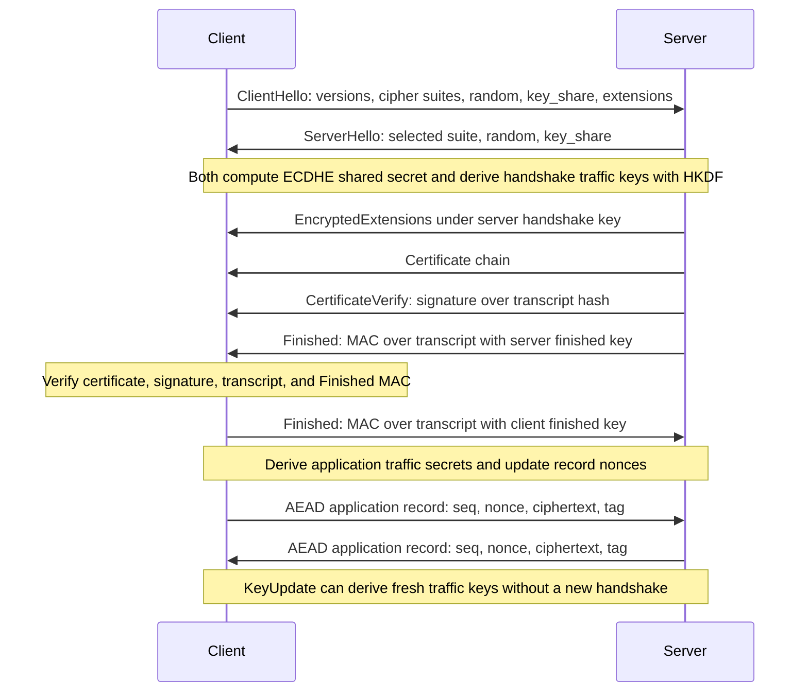

# TLS Protocol Overview

TLS is the protocol layer that turns cryptographic primitives into secure client-server communication. It negotiates algorithms, authenticates endpoints, establishes shared secrets, derives traffic keys, and protects application records. It is not a single primitive; it is a carefully sequenced protocol combining key exchange, signatures or certificates, KDFs, AEAD, transcript hashing, alerts, and version negotiation.


*Figure: Public-key encryption makes the Alice-to-Bob security goal explicit. Image: [Wikimedia Commons](https://commons.wikimedia.org/wiki/File:Public_key_encryption_alice_to_bob.svg), Winstonlee, CC0.*

Katz and Lindell use SSL/TLS as a culmination of private-key encryption, MACs, public-key encryption, signatures, certificates, and key exchange. Smart's material on certificates, key exchange, signatures, and hybrid encryption fills in the infrastructure view. For current TLS 1.3 details, the primary standard is [RFC 8446](https://www.rfc-editor.org/rfc/rfc8446), published in August 2018.

## Definitions

**TLS**, Transport Layer Security, protects application-layer traffic over a network connection. It aims to prevent passive eavesdropping, active tampering, and message forgery when configured correctly.

A **handshake** establishes cryptographic parameters and traffic secrets. In TLS 1.3, the main full handshake uses ephemeral Diffie-Hellman, usually ECDHE, plus server authentication by a certificate signature.

A **record** is a protected unit of application data. After the handshake, records are encrypted and authenticated with AEAD keys derived from the handshake.

A **cipher suite** names cryptographic algorithms. TLS 1.3 simplified cipher suites compared with TLS 1.2: key exchange and authentication are negotiated separately from AEAD and hash choices.

A **transcript hash** is a running hash of handshake messages. Signatures and key derivation bind to this transcript so attackers cannot splice messages from different handshakes.

**HKDF** is the HMAC-based key derivation function used by TLS 1.3. It applies extract and expand phases to derive separate secrets for handshake traffic, application traffic, exporter keys, and resumption.

**Forward secrecy** means that compromise of a long-term authentication key does not reveal past session traffic, assuming ephemeral DH secrets were erased and the DH problem remains hard.

**0-RTT data** lets clients send early data during resumption, but it has weaker replay properties and must be used carefully.

## Key results

TLS 1.3 removed many legacy options that complicated earlier versions. The core full handshake uses ephemeral (EC)DHE for key agreement, certificate-based signatures for authentication, HKDF for key derivation, and AEAD for records. RSA key transport, static DH, compression, many old ciphers, and custom DH groups are not part of the TLS 1.3 core design.

The handshake has two intertwined purposes. First, it creates shared secrets from fresh key exchange. Second, it authenticates the transcript so that the client knows which server key participated and both sides agree on negotiated parameters. Without transcript binding, downgrade and substitution attacks become possible.

The record layer uses keys that are separate from handshake keys. This key separation limits damage if one purpose is attacked and makes proofs cleaner. A typical mental model is:

$$
\text{DH shared secret} \to \text{HKDF secret tree} \to \text{client/server traffic keys}.
$$

Certificates do not magically prove trust. A browser validates a chain from the server certificate to a trusted root, checks the hostname, checks validity periods and key usage, and may consult revocation or transparency mechanisms. A valid signature under the wrong name is not enough.

TLS authenticates the server by default. Client authentication is optional and uses client certificates or application-layer mechanisms. Many web sessions authenticate the server at TLS and the user later with cookies, passwords, OAuth, or tokens.

Replay and ordering are protocol issues. AEAD protects each record with nonces derived from sequence numbers, but the receiver must enforce the record sequence. 0-RTT early data can be replayed at the protocol level, so applications must restrict it to idempotent or replay-safe actions.

Post-quantum TLS migration usually means replacing or hybridizing the key exchange first, because large quantum computers would threaten classical DH and RSA. Symmetric AEAD and hash functions can often be adjusted by using larger security margins.

TLS 1.3's handshake key schedule has several stages rather than one direct hash of the DH secret. Early secrets handle PSK and resumption inputs, handshake secrets protect encrypted handshake messages, and application secrets protect records after the Finished messages. This staged design gives key separation and lets the protocol authenticate progressively more of the transcript. It also supports exporters, resumption master secrets, and key updates without reusing the same bytes for multiple purposes.

The Finished messages are small but conceptually important. They are MACs over the transcript using keys derived from the handshake secrets. If an attacker changes any earlier handshake byte, the transcript hash changes and Finished verification fails. CertificateVerify authenticates the server's identity and key share; Finished confirms that both sides derived the same secrets and saw the same negotiation.

Record nonces in TLS 1.3 are derived from a static per-direction IV and a sequence number. The sequence number is not sent as a separate plaintext field in the same way older mental models might suggest, but both sides maintain it. This prevents nonce reuse as long as keys are updated before sequence numbers wrap and implementations do not roll state backward.

PSK and resumption modes reduce latency but change the authentication story. A PSK-only mode authenticates possession of a pre-shared key but does not provide fresh DH forward secrecy for that connection. PSK plus (EC)DHE restores fresh key exchange. 0-RTT early data can be sent before the full handshake completes, but replay resistance is weaker, so applications must decide whether early data is safe for a given request.

Operational TLS security includes more than the RFC message flow. Servers need valid certificate chains, secure private-key storage, sane supported versions, correct randomness, OCSP or revocation strategy where applicable, and monitoring for expiration. Clients need hostname validation and a trustworthy root store. The protocol design gives the structure; deployment decides whether the structure is actually followed.

TLS also separates handshake authentication from application authentication. A successful server-authenticated handshake tells the client it is talking to the holder of a private key certified for the server name. It does not identify the human user, authorize a bank transfer, or decide whether an HTTP request is replay-safe. Those decisions happen above TLS, but they rely on TLS to provide a confidential and integrity-protected channel.

Version negotiation is deliberately transcript-bound. A server and client may support several versions and groups, but the final choice must be authenticated so an attacker cannot strip stronger options. This is the same design pattern seen throughout cryptography: negotiation is data, and security-critical data must be included in what gets signed, MACed, or derived into keys.

This makes TLS a useful capstone topic. Every earlier primitive appears with operational constraints: DH for shared secrets, signatures for authentication, hashes for transcripts, HMAC/HKDF for derivation, AEAD for records, and certificates for public-key binding. The protocol is the composition test.

## Visual



This sequence expands the TLS 1.3 handshake into its authenticated key-exchange and record-protection layers. The ServerHello key share establishes handshake encryption, CertificateVerify and Finished bind authentication to the transcript, and application records use separate AEAD traffic keys and nonces derived from the HKDF schedule.

| TLS component | Cryptographic role | Related primitive |
|---|---|---|
| ECDHE key share | fresh shared secret | Diffie-Hellman |
| CertificateVerify | server authentication | digital signature |
| HKDF schedule | key separation | HMAC/hash |
| Finished messages | transcript confirmation | MAC |
| Record protection | confidentiality and integrity | AEAD such as AES-GCM |
| Certificates | public-key binding | signatures and PKI |

## Worked example 1: why transcript binding matters

Problem: a client offers two cipher choices, strong `A` and weak `B`. An attacker changes the ClientHello so the server sees only `B`. How does TLS 1.3 detect this?

Method:

1. The real client sends a ClientHello containing:

   ```text
   supported = [A, B]
   ```

2. The attacker modifies it in transit:

   ```text
   supported = [B]
   ```

3. The server selects `B` and signs or MACs handshake data that includes the transcript it saw.

4. The client computes its own transcript hash over the messages it sent and received. Its transcript includes `[A,B]`, not `[B]`.

5. When the client verifies `CertificateVerify` and `Finished`, the values do not match the client's transcript.

Checked answer: transcript binding causes verification failure. The attacker cannot silently downgrade the negotiation without producing valid authentication over the client's transcript.

## Worked example 2: deriving separate traffic keys conceptually

Problem: a handshake produces a shared secret `S`. Explain why client-to-server and server-to-client traffic should not use the same AEAD key.

Method:

1. If both directions used the same key and nonce space, nonce collisions could occur across directions.

2. TLS-style key schedules derive labeled keys:

$$
K_{c\to s}=\mathrm{KDF}(S,\texttt{"client app traffic"})
$$

$$
K_{s\to c}=\mathrm{KDF}(S,\texttt{"server app traffic"}).
$$

3. Distinct labels give domain separation. Even with the same secret $S$, the derived keys differ.

4. Each direction can then maintain its own sequence-number-derived nonces.

Checked answer: derive separate directional keys with labeled KDF inputs. This avoids key/nonce overlap and supports cleaner analysis.

## Code

```python
import hashlib
import hmac

def hkdf_extract(salt: bytes, ikm: bytes) -> bytes:
    return hmac.new(salt, ikm, hashlib.sha256).digest()

def hkdf_expand(prk: bytes, info: bytes, length: int) -> bytes:
    out = b""
    block = b""
    counter = 1
    while len(out) < length:
        block = hmac.new(prk, block + info + bytes([counter]), hashlib.sha256).digest()
        out += block
        counter += 1
    return out[:length]

shared_secret = b"demo dh shared secret"
early_salt = bytes(32)
handshake_secret = hkdf_extract(early_salt, shared_secret)
client_key = hkdf_expand(handshake_secret, b"client app traffic", 16)
server_key = hkdf_expand(handshake_secret, b"server app traffic", 16)
print(client_key.hex())
print(server_key.hex())
print(client_key != server_key)
```

## Common pitfalls

- Thinking TLS is just "RSA plus AES." Modern TLS composes several primitives with strict transcript binding.
- Disabling certificate validation during testing and leaving it disabled.
- Assuming a valid certificate chain is enough without hostname and usage checks.
- Reusing nonces or sequence numbers in record protection.
- Sending non-idempotent actions in 0-RTT data without replay defenses.
- Supporting legacy versions and ciphers without understanding downgrade risk.

## Connections

- [Discrete logarithms and Diffie-Hellman](/cs/cryptography/discrete-log-diffie-hellman)
- [Digital signatures](/cs/cryptography/digital-signatures)
- [Authenticated encryption and GCM](/cs/cryptography/authenticated-encryption-gcm)
- [Post-quantum cryptography](/cs/cryptography/post-quantum-cryptography)
