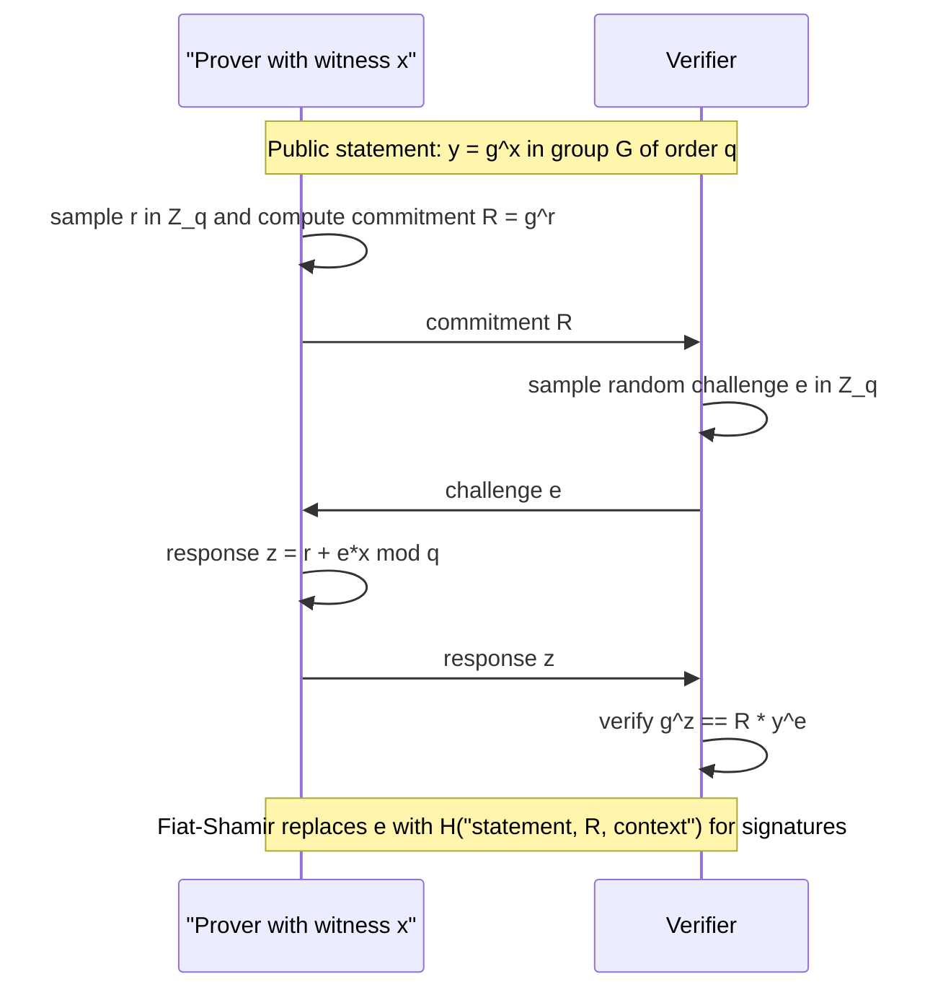

# Zero-Knowledge Proofs

Zero-knowledge proofs let a prover convince a verifier that a statement is true without revealing why it is true. This sounds paradoxical until you separate knowledge from verification: the verifier should become convinced of truth, but anything it sees should be simulatable without the secret witness. That simulation idea is the heart of zero knowledge.


*Figure: Public-key encryption makes the Alice-to-Bob security goal explicit. Image: [Wikimedia Commons](https://commons.wikimedia.org/wiki/File:Public_key_encryption_alice_to_bob.svg), Winstonlee, CC0.*

The supplied Katz and Lindell edition is focused mainly on encryption, MACs, hashes, number theory, public-key encryption, and signatures. Smart's later chapters include zero-knowledge, graph isomorphism, Sigma protocols, and voting applications, so this page leans more heavily on Smart while keeping the same proof-aware style used in modern cryptography. Zero knowledge connects naturally to identification, signatures through Fiat-Shamir, commitments, and secure multiparty computation.

## Definitions

An **interactive proof** is a protocol between a prover $P$ and verifier $V$ for a language $L$. The prover wants to convince the verifier that $x\in L$.

Three properties matter:

1. **Completeness**: if $x\in L$ and both parties are honest, the verifier accepts with high probability.
2. **Soundness**: if $x\notin L$, no cheating prover can make the verifier accept except with small probability.
3. **Zero knowledge**: if $x\in L$, the verifier learns nothing beyond the fact that $x\in L$.

Zero knowledge is formalized by a **simulator**. For every efficient verifier, there is an efficient simulator that can produce a transcript computationally indistinguishable from a real protocol transcript, without knowing the witness.

A **witness** is secret information proving membership. For example, in a graph-isomorphism proof, the statement is "graphs $G_0$ and $G_1$ are isomorphic," and the witness is a permutation mapping one graph to the other.

A **Sigma protocol** is a three-move public-coin proof:

1. Commitment $a$ from prover.
2. Random challenge $e$ from verifier.
3. Response $z$ from prover.

It usually has special soundness and honest-verifier zero knowledge. Schnorr's identification protocol is the canonical example for discrete logarithms.

The **Fiat-Shamir transform** makes some Sigma protocols noninteractive by replacing the verifier challenge with a hash:

$$
e=H(a\|x\|m).
$$

This is used conceptually in Schnorr-style signatures.

## Key results

The graph-isomorphism protocol shows the zero-knowledge idea cleanly. The prover knows an isomorphism $\phi:G_0\to G_1$. To prove knowledge without revealing $\phi$, it chooses a random isomorphic copy $H$ of one graph, sends $H$, receives a random challenge bit $b$, and reveals an isomorphism from $G_b$ to $H$. An honest prover can answer either challenge because it knows how $G_0$ and $G_1$ relate. A cheating prover who does not know an isomorphism can usually prepare to answer only one challenge.

Completeness is straightforward: the honest prover always answers. Soundness error is $1/2$ per round for graph isomorphism; repeating the protocol $t$ times reduces cheating probability to $2^{-t}$. Zero knowledge comes from simulation: a simulator guesses the challenge bit first, constructs $H$ as an isomorphic copy of $G_b$, and outputs a transcript. Conditioned on the guessed challenge matching, the transcript distribution matches a real one. Rewinding lets the simulator try again.

Schnorr identification proves knowledge of $x$ such that $y=g^x$. The prover sends $R=g^r$, receives challenge $e$, and answers $z=r+ex$. The verifier checks:

$$
g^z=R\,y^e.
$$

Special soundness: if two accepting transcripts have the same $R$ but different challenges $e\ne e'$, then:

$$
z-z'=(e-e')x\pmod q,
$$

so:

$$
x=(z-z')(e-e')^{-1}\pmod q.
$$

This extraction property explains why answering unpredictable challenges demonstrates knowledge.

Zero knowledge does not mean "no information exists anywhere." It means the verifier's view can be simulated from public information. Side channels, bad randomness, repeated commitments, or nonstandard challenge generation can break the property.

There are several strengths of zero knowledge. **Honest-verifier zero knowledge** assumes the verifier follows the protocol, especially when choosing random challenges. This is often easier to prove for Sigma protocols. Full zero knowledge must handle malicious verifiers that choose challenges adaptively, abort selectively, or embed information in messages. Compilers and commitment techniques can sometimes upgrade protocols, but the distinction matters.

Proof of knowledge is stronger than ordinary soundness. Soundness says a false statement cannot be proven. A proof of knowledge says that any prover who convinces the verifier must "know" a witness, formalized by an extractor that can recover the witness from the prover. In Schnorr, two accepting responses to the same commitment with different challenges let the extractor solve for the discrete logarithm. This is why challenge unpredictability is essential.

Zero-knowledge protocols often use commitments. A commitment lets a party bind to a value while hiding it until opening. In many protocols, the prover commits to randomized data, receives a challenge, and opens just enough to answer. The commitment must be binding so the prover cannot change its mind after the challenge, and hiding so the verifier learns nothing early.

Noninteractive zero knowledge, or NIZK, removes back-and-forth communication, but it needs extra setup, a common reference string, or a random-oracle-style Fiat-Shamir transform depending on the protocol. Blockchain systems, anonymous credentials, and privacy-preserving audits often need NIZKs because verifiers may check proofs later or on-chain. The conceptual properties remain completeness, soundness, and zero knowledge, but the setup assumptions become part of the statement.

The graph-isomorphism example is pedagogically clean but not the dominant deployed proof system. It matters because it makes simulation easy to see. Modern systems use arithmetic circuits, polynomial commitments, pairings, hash-based proof systems, or lattice assumptions. The same definitions still govern them, even when the engineering is much more complex.

Repetition can be sequential or parallel, but the proof details change. Running a one-bit-challenge protocol many times sequentially clearly reduces soundness error, because a cheating prover must keep answering fresh challenges. Parallel repetition is more efficient, but the analysis can be subtler depending on the protocol and adversary model. Textbook examples often use repetition to make the soundness error visibly negligible.

Zero knowledge is especially valuable when authentication would otherwise reveal a reusable secret. Instead of sending a password or private key, a prover can demonstrate knowledge of a witness tied to a public statement. The verifier learns that the prover is authorized, but does not receive the secret itself. This idea underlies identification protocols and motivates the move from interactive identification to signatures via Fiat-Shamir.

Soundness error should be interpreted like other cryptographic failure probabilities. A one-round protocol with cheating probability $1/2$ is not enough by itself, but repeating it 128 times can drive the idealized error toward $2^{-128}$. The implementation must ensure challenges are independent and unpredictable, or the repetition analysis no longer applies.

As with encryption and signatures, the proof statement and the implementation discipline must match.

A simulated transcript is only convincing evidence when the real transcript follows the modeled protocol.

Model drift weakens the claim.

## Visual



This sequence is the Schnorr Sigma protocol in its three moves: commitment, random challenge, and response. The verifier checks the labeled algebraic relation without learning the witness, while the note marks where Fiat-Shamir turns the interaction into a noninteractive signature-style proof.

| Property | Informal test | Failure mode |
|---|---|---|
| Completeness | honest proof accepts | protocol rejects valid witnesses |
| Soundness | false claims rarely accept | prover can cheat |
| Zero knowledge | transcript can be simulated | verifier learns witness information |
| Special soundness | two challenges reveal witness | extractor cannot recover witness |
| Fiat-Shamir | challenge from hash | random-oracle assumption and domain separation needed |

## Worked example 1: Schnorr identification check

Problem: use $p=23$, $q=11$, $g=2$, secret $x=4$, public key $y=16$, random $r=3$, and verifier challenge $e=7$. Show the verifier accepts.

Method:

1. Prover sends:

$$
R=g^r=2^3=8\pmod{23}.
$$

2. Verifier sends challenge $e=7$.

3. Prover responds:

$$
z=r+ex\bmod q=3+7\cdot4=31\equiv9\pmod{11}.
$$

4. Verifier computes left side:

$$
g^z=2^9=512\equiv6\pmod{23}.
$$

5. Verifier computes right side:

$$
R y^e=8\cdot16^7\pmod{23}.
$$

   From the signature page calculation, $16^7\equiv18$, so:

$$
8\cdot18=144\equiv6\pmod{23}.
$$

Checked answer: both sides are $6$, so the verifier accepts.

## Worked example 2: extracting a Schnorr witness from two transcripts

Problem: suppose two accepting transcripts share $R$ but have challenges and responses:

$$
e=2,\quad z=5
$$

and

$$
e'=7,\quad z'=3
$$

in a group of order $q=11$. Recover the secret $x$.

Method:

1. For accepting transcripts:

$$
z=r+ex\pmod q
$$

   and

$$
z'=r+e'x\pmod q.
$$

2. Subtract:

$$
z-z'=(e-e')x\pmod q.
$$

3. Substitute:

$$
5-3=(2-7)x\pmod{11}.
$$

   Thus:

$$
2\equiv -5x\equiv6x\pmod{11}.
$$

4. Invert $6$ modulo $11$. Since $6\cdot2=12\equiv1$, $6^{-1}=2$.

5. Multiply:

$$
x\equiv2\cdot2=4\pmod{11}.
$$

Checked answer: extracted witness is $x=4$.

## Code

```python
def invmod(a: int, q: int) -> int:
    return pow(a % q, -1, q)

def schnorr_response(q: int, r: int, e: int, x: int) -> int:
    return (r + e * x) % q

def schnorr_accepts(p, g, y, R, e, z):
    return pow(g, z, p) == (R * pow(y, e, p)) % p

def extract_witness(q, e, z, e2, z2):
    return ((z - z2) * invmod(e - e2, q)) % q

p, q, g, x, r = 23, 11, 2, 4, 3
y = pow(g, x, p)
R = pow(g, r, p)
z1 = schnorr_response(q, r, 2, x)
z2 = schnorr_response(q, r, 7, x)
print(schnorr_accepts(p, g, y, R, 2, z1))
print(schnorr_accepts(p, g, y, R, 7, z2))
print(extract_witness(q, 2, z1, 7, z2))
```

## Common pitfalls

- Saying zero knowledge means the verifier learns literally nothing. It learns that the statement is true.
- Ignoring soundness amplification. One round may have too much cheating probability.
- Reusing commitments or nonces in Sigma protocols.
- Applying Fiat-Shamir without domain separation or a suitable hash model.
- Confusing proof of knowledge with proof of statement membership.
- Forgetting that implementation side channels can reveal the witness even if the protocol transcript is zero knowledge.

## Connections

- [Digital signatures](/cs/cryptography/digital-signatures)
- [Discrete logarithms and Diffie-Hellman](/cs/cryptography/discrete-log-diffie-hellman)
- [Hash functions and random oracles](/cs/cryptography/hash-functions-random-oracles)
- [Post-quantum cryptography](/cs/cryptography/post-quantum-cryptography)
