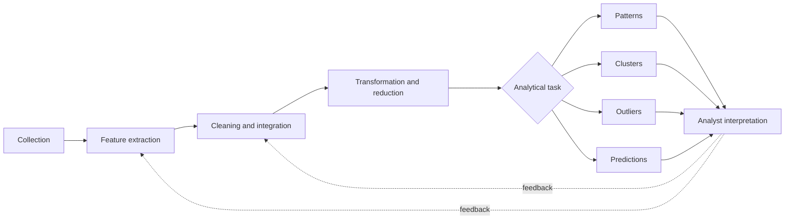

# Data Mining Process and Data Types

Data mining is the disciplined process of turning raw, messy, application-specific data into useful patterns, predictions, or decisions. In Aggarwal's organization, the field is not just a list of algorithms. It is a pipeline: collect data, extract usable features, clean and integrate them, choose an analytical formulation, evaluate the output, and often feed the result back into earlier stages. This matters because the quality of a mining result is usually limited more by representation and preprocessing than by the final model.


*Figure: The Iris scatterplot makes feature spaces and class separation visible. Image: [Wikimedia Commons](https://commons.wikimedia.org/wiki/File:Iris_dataset_scatterplot.svg), Nicoguaro, CC BY 4.0.*

This page sits before the specialized topics. Association patterns, clustering, outlier detection, and classification appear later as major building blocks, but they all depend on the same questions: What is one data object? What are its features? Are the objects independent records, or are they connected by time, sequence, space, or graph edges? Which transformations preserve the information needed by the task?

## Definitions

A **data object** is one unit to be mined. In a customer table it may be a customer; in a web log it may be a session; in a graph it may be a node, an edge, or an entire graph depending on the task.

A **feature** or **attribute** is a measurable property of a data object. A data set with $n$ objects and $d$ features is often represented as a matrix $D \in \mathbb{R}^{n \times d}$, where row $i$ is object $X_i$ and column $j$ is feature $j$.

The **data mining pipeline** is the sequence:

1. Data collection from sensors, logs, transactions, documents, surveys, databases, or crawlers.
2. Feature extraction from raw source formats into structured records.
3. Data cleaning and integration to handle missing, inconsistent, duplicated, or incompatible entries.
4. Transformation or reduction to produce a representation suitable for analysis.
5. Analytical modeling with pattern mining, clustering, outlier detection, classification, or a combination.
6. Interpretation and feedback, where results may suggest new features, different cleaning rules, or a refined problem definition.

**Nondependency-oriented data** consists of records that can often be treated as independent objects. Examples include quantitative multidimensional data, categorical records, binary transaction data, set data, and bag-of-words text vectors.

**Dependency-oriented data** contains relationships among values or objects that are part of the signal. Time series, discrete sequences, spatial data, and graphs fall into this category.

The four recurring analytical building blocks are:

| Building block | Typical input | Typical output | Example use |
|---|---:|---:|---|
| Association pattern mining | Transactions, sets, sequences | Frequent or interesting co-occurrences | Market baskets, web paths |
| Clustering | Unlabeled objects and a similarity notion | Groups or prototypes | Customer segmentation |
| Outlier detection | Objects plus normality assumptions | Anomaly scores or flagged cases | Fraud or fault detection |
| Classification | Labeled training objects | Predictive model | Diagnosis, churn prediction |

## Key results

**Representation is part of the model.** A distance-based clustering algorithm, a nearest-neighbor classifier, and a proximity-based outlier detector may all use the same feature matrix, but they interpret it differently. If the matrix encodes the wrong objects or scales, all downstream tasks are distorted.

**Data type determines the feasible operations.** Numeric vectors support arithmetic averages and $L_p$ distances. Categorical records support matches, contingency tables, and encodings. Text supports sparse term vectors and language-specific preprocessing. Time series require order-sensitive distances and sometimes warping. Graphs require topology-aware matching, random walks, or substructure features. Treating all types as ordinary numeric tables is often possible, but it may destroy the dependency structure that made the data useful.

**The pipeline is iterative.** A first classifier may reveal that missing values are concentrated in one class; a first cluster analysis may reveal duplicated records; an outlier analysis may expose impossible measurements. These discoveries feed back into cleaning and feature design.

**Scalability changes the problem definition.** If the data fit in memory, one can use algorithms that repeatedly scan and refine. If the data are disk resident, random access becomes expensive. If the data arrive as a stream, one-pass synopsis structures, reservoir samples, sketches, and online model updates replace full recomputation. MapReduce-like batch frameworks are useful when data are huge but can be stored and scanned in distributed form; streaming methods are useful when real-time processing or storage limits dominate.

**A proof sketch for why preprocessing affects all later steps.** Suppose a feature $x_j$ has a scale 1000 times larger than another feature $x_k$. Euclidean distance between two objects is

$$
\mathrm{dist}(X,Y)=\sqrt{\sum_{\ell=1}^{d}(x_\ell-y_\ell)^2}.
$$

If $\vert x_j-y_j\vert $ is usually large only because of units, then $(x_j-y_j)^2$ dominates the sum. Any nearest-neighbor, clustering, or distance-based outlier method is then mostly measuring feature $j$. Normalization is not cosmetic; it changes the effective objective.

## Visual



| Data type | Dependency structure | Common representation | Frequent first question |
|---|---|---|---|
| Numeric records | None or weak | Dense matrix | Are scales comparable? |
| Categorical records | None or weak | One-hot or match-based table | Do categories have high cardinality? |
| Text | Token order often reduced | Sparse term-document matrix | Which tokens are informative? |
| Time series | Ordered values | Vector, windows, transforms | Should time shifts be allowed? |
| Sequences | Ordered symbols | Strings, $k$-grams, HMM states | Are insertions/deletions meaningful? |
| Graphs | Edges among entities | Adjacency, features, kernels | Are we mining nodes or whole graphs? |

## Worked example 1: Web log to feature matrix

**Problem.** A retailer has raw web log entries and customer profiles. Build a mining-ready table for recommending products.

Raw evidence:

```text
customer_id=42, url=/productA, timestamp=10:03
customer_id=42, url=/productB, timestamp=10:05
customer_id=91, url=/productA, timestamp=10:12
profile(42): age=31, region=West
profile(91): age=55, region=East
```

**Method.**

1. Choose the object. For recommendations, a useful object is a customer-session or a customer. Use one row per customer for a simple batch example.
2. Extract behavior features. Count whether each product page was visited:

   | customer | productA | productB |
   |---:|---:|---:|
   | 42 | 1 | 1 |
   | 91 | 1 | 0 |

3. Integrate profile features:

   | customer | age | region | productA | productB |
   |---:|---:|---|---:|---:|
   | 42 | 31 | West | 1 | 1 |
   | 91 | 55 | East | 1 | 0 |

4. Transform the categorical region into binary columns:

   | customer | age | region_East | region_West | productA | productB |
   |---:|---:|---:|---:|---:|---:|
   | 42 | 31 | 0 | 1 | 1 | 1 |
   | 91 | 55 | 1 | 0 | 1 | 0 |

5. Decide the analytical task. If predicting whether the customer will buy productB, then `productB` may be the label and the remaining columns become features.

**Checked answer.** The row for customer 42 is $(31,0,1,1)$ with label $1$ for productB purchase or interest. The row for customer 91 is $(55,1,0,1)$ with label $0$. The exact label depends on whether visits or purchases define the target; this is a modeling decision, not a parsing detail.

## Worked example 2: Choosing the right object type

**Problem.** A telecom data set contains call records:

| caller | receiver | time | duration |
|---|---|---:|---:|
| A | B | 1 | 5 |
| B | C | 2 | 3 |
| A | C | 3 | 9 |
| C | A | 4 | 2 |

Decide three different mining formulations.

**Method.**

1. Classification of suspicious calls:
   - Object: one call record.
   - Features: caller history, receiver history, duration, time-of-day bucket.
   - Label: suspicious or normal.

2. Social graph mining:
   - Object: one subscriber node.
   - Edges: calls between subscribers, possibly weighted by frequency or duration.
   - Features: degree, weighted degree, clustering coefficient, PageRank-like scores.

3. Sequence mining:
   - Object: one subscriber's ordered activity sequence.
   - For subscriber A: outgoing calls at times 1 and 3 give sequence $(B,C)$.
   - For subscriber C: outgoing call at time 4 gives sequence $(A)$.

**Checked answer.** The same raw table supports at least three legitimate data types: multidimensional records, a graph, and discrete sequences. A graph algorithm can use the A-B-C topology; a record classifier cannot unless graph-derived features are added. A sequence algorithm can use order; an unordered graph summary cannot.

## Code

Pseudocode for a mining pipeline:

```text
INPUT: raw sources S1, ..., Sm
OUTPUT: model M and interpreted result R

for each source Sj:
    parse raw events into candidate records
    extract task-relevant fields
    standardize identifiers and time units

merge records across sources
clean missing, inconsistent, duplicate, and impossible values
transform data into the representation required by the task
fit or mine the selected analytical model
evaluate output against task-specific criteria
if output reveals representation problems:
    revise features or cleaning rules and repeat
return model and interpreted result
```

```python
import pandas as pd
from sklearn.preprocessing import OneHotEncoder, StandardScaler
from sklearn.compose import ColumnTransformer

logs = pd.DataFrame(
    [
        {"customer": 42, "url": "productA"},
        {"customer": 42, "url": "productB"},
        {"customer": 91, "url": "productA"},
    ]
)
profiles = pd.DataFrame(
    [
        {"customer": 42, "age": 31, "region": "West"},
        {"customer": 91, "age": 55, "region": "East"},
    ]
)

visits = pd.crosstab(logs["customer"], logs["url"]).reset_index()
data = profiles.merge(visits, on="customer", how="left").fillna(0)

preprocess = ColumnTransformer(
    transformers=[
        ("numeric", StandardScaler(), ["age"]),
        ("categorical", OneHotEncoder(sparse_output=False), ["region"]),
    ],
    remainder="passthrough",
)

X = preprocess.fit_transform(data[["age", "region", "productA", "productB"]])
print(data)
print(X.round(3))
```

## Common pitfalls

- Starting with an algorithm before deciding the object, feature, and label definitions.
- Treating dependent data as independent records and losing sequence, time, spatial, or graph structure.
- Forgetting that cleaning rules can bias the later model, especially when missingness is related to the target.
- Mixing identifiers with meaningful numeric features; customer IDs and product IDs are not ordinary continuous variables.
- Evaluating only the final algorithm and not the quality of feature extraction and integration.
- Assuming large-scale data only needs faster hardware. Streaming, disk-resident, and distributed settings often require different algorithmic constraints.

## Connections

- [Data Preparation](/cs/data-mining/chapter-02-data-preparation)
- [Similarity and Distances](/cs/data-mining/chapter-03-similarity-distances)
- [Association Pattern Mining](/cs/data-mining/chapter-04-association-pattern-mining)
- [Cluster Analysis](/cs/data-mining/chapter-06-cluster-analysis)
- [Mining Data Streams and Big Data](/cs/data-mining/chapter-12-mining-data-streams)
