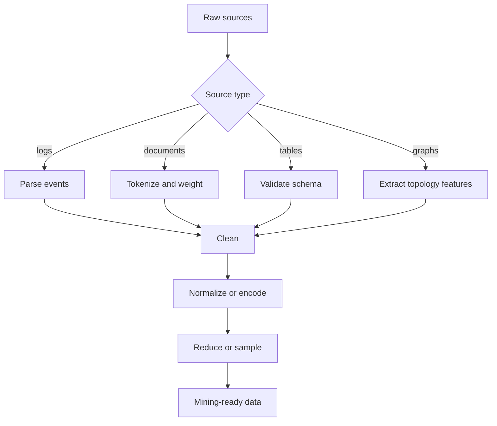

# Data Preparation

Data preparation is the part of data mining that converts raw evidence into a representation algorithms can actually use. Aggarwal gives it a central role: logs, documents, images, transactions, streams, and graphs rarely arrive as clean rows in a matrix. The analyst must extract features, repair or remove errors, integrate sources, normalize scales, and sometimes convert one data type into another.

This topic sits directly after the mining pipeline because preparation is where many modeling choices become irreversible. A missing value can be imputed, marked, or removed; a numeric value can be standardized or discretized; a categorical value can be one-hot encoded or grouped; a time series can remain ordered or be summarized into statistics. Each choice changes which patterns are visible to later mining algorithms.

## Definitions

**Feature extraction** maps raw objects into variables useful for mining. A document may become a vector of term weights; a time series may become trend, variance, and seasonal features; a graph may become degree, clustering coefficient, or subgraph-count features.

**Data type portability** is the conversion of one data representation into another so algorithms designed for one type can be used on another. Examples include text to numeric vectors, categories to binary indicators, time series to symbolic sequences, graphs to numeric structural descriptors, or arbitrary objects to a similarity graph.

**Data cleaning** repairs or controls problems such as missing entries, impossible values, duplicated records, inconsistent units, inconsistent category names, and noisy measurements.

**Normalization** changes the scale of numeric features. Common methods include min-max scaling,

$$
x'=\frac{x-\min(x)}{\max(x)-\min(x)},
$$

and z-score standardization,

$$
z=\frac{x-\mu}{\sigma}.
$$

**Discretization** maps numeric values into intervals. Equal-width discretization uses intervals of the same size; equal-depth discretization chooses intervals with roughly equal counts.

**Binarization** converts a categorical attribute with $m$ categories into $m$ binary indicators, or sometimes $m-1$ indicators when a baseline is omitted.

**Sampling** selects a subset of records to reduce cost. In a stream, reservoir sampling maintains a sample of fixed size while items arrive one at a time.

## Key results

**Cleaning is task dependent.** A value that looks like an outlier may be an error in a sales forecasting task but the most important case in a fraud-detection task. Preparation must respect the mining objective.

**Imputation should preserve uncertainty where possible.** Mean imputation is simple but reduces variance and can create artificial clusters. Model-based or neighborhood-based imputation may preserve local structure better, but it can also leak label information if fitted incorrectly.

**Normalization is required when feature magnitude is not inherently meaningful.** Distance-based algorithms are especially sensitive. If income is measured in dollars and age in years, raw Euclidean distance mostly measures income. Standardization gives both features comparable influence, provided that such influence is justified.

**Reservoir sampling gives an unbiased fixed-size sample of a stream.** For a stream item at position $t$ and reservoir size $k$, keep the item with probability $k/t$. If kept, replace one existing reservoir element uniformly at random. Proof sketch by induction: after $t$ items, each item has probability $k/t$ of being in the reservoir. Existing item probability equals $(k/(t-1)) \cdot (1 - (k/t)(1/k)) = (k/(t-1))(1-1/t)=k/t$; the new item is kept with probability $k/t$.

**Type transformations create tradeoffs.** Discretization can make noisy continuous values more robust and useful for pattern mining, but it loses order detail within each bin. One-hot encoding makes categories usable for linear models, but high-cardinality categorical variables can create sparse, high-dimensional data.

## Visual



| Problem | Typical symptom | Preparation response | Risk |
|---|---|---|---|
| Missing values | Blank, null, not measured | Impute, add missing indicator, or filter | Bias if missingness is informative |
| Inconsistent units | kg mixed with pounds | Convert to common unit | Silent errors if unit is unknown |
| Category spelling | "NY", "New York" | Standardize category dictionary | Over-merging distinct values |
| Different scales | Age vs. income | Standardize or normalize | Removing meaningful magnitude |
| High cardinality | Thousands of IDs | Hashing, grouping, embeddings | Collisions or lost detail |
| Stream volume | Cannot store all rows | Reservoir sample or sketch | Approximation error |

## Worked example 1: Cleaning and scaling a customer table

**Problem.** Prepare this table for distance-based clustering:

| customer | age | income | region |
|---:|---:|---:|---|
| 1 | 20 | 30000 | East |
| 2 | 40 | 90000 | E |
| 3 | missing | 60000 | West |
| 4 | 80 | 1200000 | West |

**Method.**

1. Standardize categories. Treat `E` as `East` if metadata confirms it.

2. Handle missing age. Use a simple median for this example. Observed ages are $20,40,80$, so the median is $40$. Customer 3 gets age $40$. Add a missing-age indicator if the missingness may be informative.

3. Examine income. $1{,}200{,}000$ is extreme relative to the others. It may be a valid high-income customer, not automatically an error. For a robust distance example, use log income:

$$
\log_{10}(30000)=4.477,\quad
\log_{10}(90000)=4.954,\quad
\log_{10}(60000)=4.778,\quad
\log_{10}(1200000)=6.079.
$$

4. Standardize numeric columns. For age values $(20,40,40,80)$, mean is $45$ and population standard deviation is

$$
\sqrt{\frac{(20-45)^2+(40-45)^2+(40-45)^2+(80-45)^2}{4}}
=\sqrt{475}=21.794.
$$

   Customer 1 age z-score is $(20-45)/21.794=-1.147$.

5. One-hot encode region:

   | customer | East | West |
   |---:|---:|---:|
   | 1 | 1 | 0 |
   | 2 | 1 | 0 |
   | 3 | 0 | 1 |
   | 4 | 0 | 1 |

**Checked answer.** A usable row for customer 1 contains standardized age, standardized log-income, and region indicators. The extreme income is controlled by log transformation, while the original value can still be kept for audit.

## Worked example 2: Reservoir sampling by hand

**Problem.** Maintain a reservoir of size $k=3$ for a stream of eight items:

$$
A,B,C,D,E,F,G,H.
$$

Assume the first three items fill the reservoir. Use the following random choices:

| Item position | Item | Keep? | Replacement index |
|---:|---|---|---:|
| 4 | D | yes | 2 |
| 5 | E | no | - |
| 6 | F | yes | 1 |
| 7 | G | no | - |
| 8 | H | yes | 3 |

**Method.**

1. After first three items: reservoir is $[A,B,C]$.
2. At $t=4$, keep D with probability $3/4$. The table says yes. Replace index 2: $[A,D,C]$.
3. At $t=5$, keep E with probability $3/5$. The table says no: $[A,D,C]$.
4. At $t=6$, keep F with probability $3/6$. The table says yes. Replace index 1: $[F,D,C]$.
5. At $t=7$, keep G with probability $3/7$. The table says no: $[F,D,C]$.
6. At $t=8$, keep H with probability $3/8$. The table says yes. Replace index 3: $[F,D,H]$.

**Checked answer.** The final reservoir for this random run is $[F,D,H]$. Over many random runs, each of the eight items has probability $3/8$ of appearing in the final reservoir.

## Code

Pseudocode for robust preparation:

```text
INPUT: table D, schema S, task T
OUTPUT: transformed matrix X

validate each column against schema S
standardize category labels and units
for each feature:
    if missing values exist:
        choose imputation rule using training data only
        optionally add missingness indicator
    if numeric and scale-sensitive task:
        apply task-appropriate scaling
    if categorical and model needs numeric input:
        encode categories
if data volume is too large:
    sample, sketch, or aggregate
return transformed feature matrix
```

```python
import numpy as np
import pandas as pd
from sklearn.compose import ColumnTransformer
from sklearn.impute import SimpleImputer
from sklearn.pipeline import Pipeline
from sklearn.preprocessing import OneHotEncoder, StandardScaler

df = pd.DataFrame(
    {
        "age": [20, 40, np.nan, 80],
        "income": [30000, 90000, 60000, 1200000],
        "region": ["East", "E", "West", "West"],
    }
)
df["region"] = df["region"].replace({"E": "East"})
df["log_income"] = np.log10(df["income"])

numeric = Pipeline(
    [
        ("impute", SimpleImputer(strategy="median", add_indicator=True)),
        ("scale", StandardScaler()),
    ]
)

prep = ColumnTransformer(
    [
        ("numeric", numeric, ["age", "log_income"]),
        ("region", OneHotEncoder(sparse_output=False), ["region"]),
    ]
)

X = prep.fit_transform(df)
print(np.round(X, 3))
```

## Common pitfalls

- Imputing missing values before train-test splitting, which leaks test-set information into the model.
- Normalizing identifiers as if their numeric order has meaning.
- Removing rare categories that are rare precisely because they are important, such as rare fraud codes.
- Applying one-hot encoding independently to train and test sets, producing incompatible columns.
- Treating outliers as errors without checking the task; anomaly detection needs unusual cases.
- Using a sample that is convenient rather than representative, especially when streams or logs have time-of-day patterns.
- Discretizing continuous features too aggressively and erasing useful thresholds.

## Connections

- [Data Mining Process and Data Types](/cs/data-mining/chapter-01-process-data-types)
- [Feature Selection and Dimensionality Reduction](/cs/data-mining/chapter-02-feature-selection-dimensionality-reduction)
- [Similarity and Distances](/cs/data-mining/chapter-03-similarity-distances)
- [Mining Data Streams and Big Data](/cs/data-mining/chapter-12-mining-data-streams)
- [Outlier Analysis](/cs/data-mining/chapter-08-outlier-analysis)
