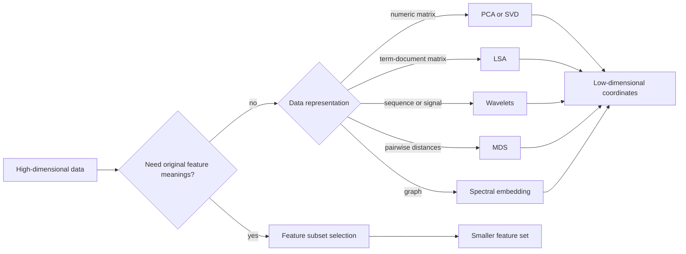

# Feature Selection and Dimensionality Reduction

Feature selection and dimensionality reduction address the same pressure from different directions: real data sets often have too many variables, many of which are noisy, redundant, expensive, or irrelevant. Aggarwal separates feature subset selection from transformations such as principal component analysis, singular value decomposition, latent semantic analysis, wavelets, multidimensional scaling, and graph spectral embeddings. The shared goal is to keep the structure that matters while reducing computational and statistical burden.

This page belongs with data preparation, but it also connects to nearly every later chapter. Clustering in high dimensions becomes unstable because distances concentrate. Text mining depends on sparse high-dimensional vectors, then often reduces them with SVD or topic models. Stream mining uses compact synopses. Graph mining uses spectral transformations to turn topology into coordinates.

## Definitions

**Feature subset selection** chooses a subset of the original features. It preserves interpretability because selected features keep their original meaning.

**Filter methods** score features before fitting the final mining model. Scores may use variance, correlation, mutual information, entropy, term strength, or class-separation criteria.

**Wrapper methods** evaluate feature subsets by repeatedly fitting a model. They can match a target algorithm closely but are usually more expensive.

**Embedded methods** select features during model training, as in Lasso regression or tree-based split selection.

**Dimensionality reduction** maps data from $d$ dimensions to $k$ dimensions, where $k\lt d$. The new coordinates may be linear combinations of old features or nonlinear embeddings.

**Principal component analysis (PCA)** finds orthogonal directions of maximum variance. For centered data matrix $X$, PCA uses eigenvectors of the covariance matrix $X^\top X/(n-1)$.

**Singular value decomposition (SVD)** writes a matrix as

$$
X = U \Sigma V^\top,
$$

where columns of $U$ and $V$ are orthonormal and $\Sigma$ contains singular values. Truncating to the largest $k$ singular values gives the best rank-$k$ approximation in squared Frobenius error.

**Latent semantic analysis (LSA)** applies truncated SVD to a term-document matrix so documents and terms are embedded in a lower-dimensional semantic space.

**Haar wavelet transform** represents a sequence by recursive averages and differences. It is useful when the signal has local changes.

**Multidimensional scaling (MDS)** embeds objects from pairwise distances into coordinates, usually by preserving distances as well as possible.

## Key results

**Feature selection reduces variance but may increase bias.** Removing irrelevant variables helps models generalize and improves speed. Removing weak but genuinely useful variables can hide structure. Selection should be validated on held-out data or with stability checks.

**PCA maximizes retained variance.** The first principal component is the unit vector $v$ maximizing $\|Xv\|^2 = v^\top X^\top Xv$. The solution is the top eigenvector of $X^\top X$. The next components repeat the same optimization subject to orthogonality constraints.

**Truncated SVD gives the best low-rank reconstruction.** If $X=U\Sigma V^\top$, then

$$
X_k = U_k \Sigma_k V_k^\top
$$

minimizes $\|X-Y\|_F$ over all matrices $Y$ with rank at most $k$. This is why SVD is central in text mining and matrix approximation.

**Reduction is not always supervised.** PCA and SVD do not know the target label. They may keep high-variance directions that are irrelevant to classification and discard low-variance directions that separate classes. Supervised feature selection should be preferred when label prediction is the task and labels are reliable.

**Graph embeddings use matrix structure.** An adjacency matrix, Laplacian, or normalized Laplacian can be decomposed spectrally. The resulting eigenvectors provide coordinates that reflect graph connectivity, which can then feed clustering or classification.

**Dimensionality reduction should be fitted as part of the training pipeline.** The reducer learns means, variances, singular vectors, selected features, or neighborhood structure from data. If it is fitted before a train-test split, information from the test set influences the representation and the validation score becomes optimistic. This is especially easy to miss with PCA, SVD, feature scaling, and mutual-information filters because they feel like harmless preprocessing. In predictive work, fit the selector or reducer only on the training fold, then apply the learned transformation to validation and test data.

## Visual



| Method | Keeps original features? | Uses labels? | Strength | Main caution |
|---|---:|---:|---|---|
| Filter selection | Yes | Sometimes | Fast and scalable | Ignores feature interactions |
| Wrapper selection | Yes | Usually | Tuned to target model | Expensive and overfit-prone |
| PCA | No | No | Captures variance compactly | Components may be hard to interpret |
| SVD/LSA | No | No | Works well for sparse matrices | Requires choosing rank |
| Wavelets | No | No | Captures local signal changes | Best for ordered signals |
| MDS | No | No | Starts from distances only | Costly for many objects |

## Worked example 1: PCA by hand on centered points

**Problem.** Reduce four two-dimensional points to one dimension:

$$
(2,0),\ (0,2),\ (-2,0),\ (0,-2).
$$

Rotate them? Or is one dimension insufficient?

**Method.**

1. The mean is $(0,0)$, so the data are already centered.

2. Build the covariance matrix. The $x$ values are $(2,0,-2,0)$ and $y$ values are $(0,2,0,-2)$.

$$
\sum x_i^2 = 8,\quad \sum y_i^2 = 8,\quad \sum x_i y_i=0.
$$

   Using $n-1=3$,

$$
C=\begin{bmatrix}8/3 & 0\\0 & 8/3\end{bmatrix}.
$$

3. The eigenvalues are both $8/3$. Every unit direction has the same variance.

4. Projecting onto any one-dimensional direction keeps only half of the total variance, because total variance is $16/3$ and one component retains $8/3$.

**Checked answer.** PCA has no unique preferred direction here. A one-dimensional embedding loses half the variance. The data form a symmetric cross, so reducing to one coordinate is not a strong representation.

## Worked example 2: Feature selection with class separation

**Problem.** Choose between two features for a binary classifier.

| object | feature A | feature B | class |
|---:|---:|---:|---|
| 1 | 0 | 10 | negative |
| 2 | 1 | 11 | negative |
| 3 | 5 | 10 | positive |
| 4 | 6 | 11 | positive |

**Method.**

1. Compare class means for feature A:

   Negative mean is $(0+1)/2=0.5$. Positive mean is $(5+6)/2=5.5$. Difference is $5.0$.

2. Compare within-class spread for feature A:

   Each class values differ from its mean by $0.5$, so within-class variation is small.

3. Compare class means for feature B:

   Negative mean is $(10+11)/2=10.5$. Positive mean is $(10+11)/2=10.5$. Difference is $0$.

4. Feature B varies, but it does not separate the classes.

**Checked answer.** Feature A is useful for classification; feature B is not useful for this label, even though it has nonzero variance. This shows why unsupervised variance filters and supervised selection can disagree.

## Code

Pseudocode for a conservative reduction workflow:

```text
INPUT: feature matrix X, optional labels y, target dimension k
OUTPUT: reduced representation Z

split data into training and validation parts
if labels y are available and prediction is the goal:
    score features using training labels only
    keep a candidate subset
if features are still high-dimensional:
    fit PCA, SVD, or another reducer on training data only
transform training and validation data
evaluate downstream mining task
check stability of selected features or components
return fitted reducer and transformed data
```

```python
import numpy as np
from sklearn.decomposition import PCA, TruncatedSVD
from sklearn.feature_selection import mutual_info_classif, SelectKBest
from sklearn.pipeline import Pipeline
from sklearn.preprocessing import StandardScaler

X = np.array(
    [
        [0, 10, 3],
        [1, 11, 2],
        [5, 10, 3],
        [6, 11, 2],
        [5, 12, 4],
        [0, 12, 1],
    ],
    dtype=float,
)
y = np.array([0, 0, 1, 1, 1, 0])

selector = SelectKBest(mutual_info_classif, k=2)
pipeline = Pipeline(
    [
        ("scale", StandardScaler()),
        ("select", selector),
        ("pca", PCA(n_components=1)),
    ]
)

z = pipeline.fit_transform(X, y)
print("selected feature indices:", selector.fit(X, y).get_support(indices=True))
print("one-dimensional coordinates:", np.round(z.ravel(), 3))

term_doc = np.array([[3, 0, 1], [0, 4, 0], [1, 0, 2]], dtype=float)
lsa = TruncatedSVD(n_components=2, random_state=0)
print(np.round(lsa.fit_transform(term_doc), 3))
```

## Common pitfalls

- Selecting features on the full data set before train-test splitting.
- Assuming high variance means high predictive value.
- Keeping too many principal components because the scree plot looks smooth; use downstream validation.
- Interpreting PCA components as original features without checking loadings.
- Applying PCA to unscaled features when units differ.
- Using SVD embeddings from a term-document matrix without controlling common stop words and document length effects.
- Forgetting that nonlinear structures may need graph, manifold, or kernel methods rather than a global linear projection.

## Connections

- [Data Preparation](/cs/data-mining/chapter-02-data-preparation)
- [Similarity and Distances](/cs/data-mining/chapter-03-similarity-distances)
- [Cluster Analysis](/cs/data-mining/chapter-06-cluster-analysis)
- [Advanced Clustering Concepts](/cs/data-mining/chapter-07-advanced-clustering)
- [Mining Text Data](/cs/data-mining/chapter-13-mining-text-data)
