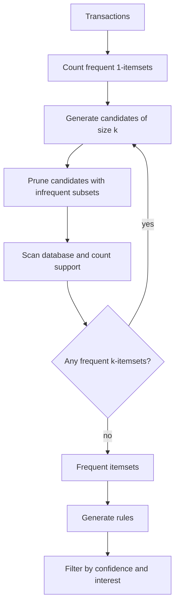

# Association Pattern Mining

Association pattern mining finds combinations of items, events, or attribute values that occur together more often than a user-defined threshold or more interestingly than chance. Aggarwal treats this as one of the four major data mining building blocks because it converts large transaction collections into interpretable co-occurrence structure. The classic setting is market basket analysis, but the same ideas apply to web paths, text terms, categorical profiles, biological markers, and many discretized data sets.

This page covers the basic frequent itemset model, association rules, Apriori, pattern growth, and interest measures. The advanced chapter adds closed and maximal patterns, querying, constraints, and downstream uses.

## Definitions

Let $I=\{i_1,\dots,i_m\}$ be a set of items. A **transaction** $T$ is a subset of $I$. A transaction database $\mathcal{D}$ is a multiset of transactions.

An **itemset** $X$ is a subset of $I$. Transaction $T$ **contains** $X$ if $X\subseteq T$.

The **support count** of itemset $X$ is

$$
\mathrm{supcount}(X)=|\{T\in\mathcal{D}:X\subseteq T\}|.
$$

The **support** is often the fraction $\mathrm{supcount}(X)/\vert \mathcal{D}\vert $.

An itemset is **frequent** if its support count is at least a threshold $\sigma$.

An **association rule** has the form $X\Rightarrow Y$, where $X\cap Y=\emptyset$. Its support is $\mathrm{sup}(X\cup Y)$ and its confidence is

$$
\mathrm{conf}(X\Rightarrow Y)=\frac{\mathrm{sup}(X\cup Y)}{\mathrm{sup}(X)}.
$$

The **Apriori property** states that every subset of a frequent itemset is frequent. Equivalently, if an itemset is infrequent, all of its supersets are infrequent.

**FP-growth** mines frequent patterns by compressing transactions into an FP-tree and recursively mining conditional pattern bases, avoiding the breadth-first candidate explosion of Apriori in many dense cases.

## Key results

**Downward closure enables pruning.** If itemset $X$ is not frequent, then any $Y\supseteq X$ cannot be frequent because every transaction containing $Y$ also contains $X$. Therefore $\mathrm{supcount}(Y)\le \mathrm{supcount}(X)\lt \sigma$.

**Apriori is level-wise.** It first finds frequent 1-itemsets, then generates candidate 2-itemsets, counts them, prunes infrequent ones, and repeats. It is simple and exact, but candidate generation and repeated database scans can be expensive.

**Rule generation follows itemset mining.** First mine frequent itemsets. Then for each frequent itemset $Z$, choose nonempty $X\subset Z$ and set $Y=Z\setminus X$. The rule $X\Rightarrow Y$ is accepted if its confidence exceeds a threshold. This separation is useful because support pruning applies to itemsets, while confidence is evaluated after itemsets are known.

**Support and confidence are not enough for all applications.** A rule can have high confidence simply because the consequent is common. Interest ratio, lift, correlation, cosine, Jaccard, and related measures compare observed co-occurrence with baselines.

For binary variables $A$ and $B$, **lift** is

$$
\mathrm{lift}(A\Rightarrow B)=\frac{P(A\cap B)}{P(A)P(B)}.
$$

A value above 1 suggests positive association; below 1 suggests negative association.

**FP-growth trades candidates for conditional recursion.** It compresses common prefixes in the transaction database. When data have many shared prefixes after frequency ordering, the tree is much smaller than the raw database.

**Frequent does not mean useful.** A very common pattern may simply restate the obvious, such as every grocery basket containing a checkout item. A rare pattern may be more actionable if it is highly discriminative or expensive. Practical association mining therefore combines support thresholds with interest measures, domain constraints, redundancy control, and sometimes statistical testing. The analyst should also inspect whether patterns survive on a holdout period, because co-occurrences in small or seasonal data can be unstable.

**Transaction construction is a major modeling choice.** A web basket might be one session, one user-day, or one user's full history. A retail basket might include returns or exclude them. A medical transaction might represent one visit or one patient. These choices change support counts and rule meanings, so they should be documented before interpreting the mined patterns.

**Rule direction is not causality.** The rule $X\Rightarrow Y$ means that $Y$ is common among transactions containing $X$; it does not prove that buying $X$ caused buying $Y$. In many applications the direction is chosen for actionability, not because the data establish cause. Temporal ordering, experiments, or stronger assumptions are needed for causal claims.

## Visual



| Measure | Formula | Interpretation | Limitation |
|---|---|---|---|
| Support | $P(X\cup Y)$ | How common the full pattern is | Misses rare but strong patterns |
| Confidence | $P(Y\mid X)$ | Reliability of implication | Inflated by common consequents |
| Lift | $P(XY)/(P(X)P(Y))$ | Departure from independence | Unstable for rare events |
| Cosine | $P(XY)/\sqrt{P(X)P(Y)}$ | Symmetric co-occurrence strength | Less direct than confidence |
| Jaccard | $P(XY)/P(X\cup Y)$ | Overlap among occurrences | Ignores joint absence |

## Worked example 1: Apriori support counting

**Problem.** Mine frequent itemsets with minimum support count $\sigma=3$.

| transaction | items |
|---:|---|
| 1 | bread, milk |
| 2 | bread, diaper, beer, eggs |
| 3 | milk, diaper, beer, cola |
| 4 | bread, milk, diaper, beer |
| 5 | bread, milk, diaper, cola |

**Method.**

1. Count 1-itemsets:
   - bread: transactions 1,2,4,5 -> 4
   - milk: 1,3,4,5 -> 4
   - diaper: 2,3,4,5 -> 4
   - beer: 2,3,4 -> 3
   - eggs: 2 -> 1
   - cola: 3,5 -> 2

   Frequent 1-itemsets: bread, milk, diaper, beer.

2. Generate 2-item candidates from frequent items and count:
   - bread,milk: transactions 1,4,5 -> 3
   - bread,diaper: 2,4,5 -> 3
   - bread,beer: 2,4 -> 2
   - milk,diaper: 3,4,5 -> 3
   - milk,beer: 3,4 -> 2
   - diaper,beer: 2,3,4 -> 3

   Frequent 2-itemsets: \{bread,milk\}, \{bread,diaper\}, \{milk,diaper\}, \{diaper,beer\}.

3. Generate 3-item candidates. Apriori pruning allows \{bread,milk,diaper\} because all its 2-subsets are frequent? Its subsets are \{bread,milk\}, \{bread,diaper\}, \{milk,diaper\}, all frequent. Count is transactions 4 and 5 -> 2, so it is not frequent.

   Candidate \{bread,diaper,beer\} is pruned because \{bread,beer\} is infrequent.

**Checked answer.** The frequent itemsets are the four frequent singletons and four frequent pairs listed above. No 3-itemset reaches support count 3.

## Worked example 2: Rule confidence and lift

**Problem.** From the same data, evaluate the rule

$$
\{\text{diaper}\}\Rightarrow \{\text{beer}\}.
$$

**Method.**

1. Support count of diaper is 4, so $P(\text{diaper})=4/5$.
2. Support count of beer is 3, so $P(\text{beer})=3/5$.
3. Support count of diaper and beer together is 3, so $P(\text{diaper},\text{beer})=3/5$.
4. Confidence:

$$
\mathrm{conf}=\frac{P(\text{diaper},\text{beer})}{P(\text{diaper})}
=\frac{3/5}{4/5}=\frac{3}{4}=0.75.
$$

5. Lift:

$$
\mathrm{lift}=\frac{3/5}{(4/5)(3/5)}=\frac{0.6}{0.48}=1.25.
$$

**Checked answer.** The rule has confidence $0.75$ and lift $1.25$. It is stronger than independence in this toy database, but the database is small, so the estimate is not stable.

## Code

Pseudocode for Apriori:

```text
INPUT: transaction database D, minimum support sigma
OUTPUT: all frequent itemsets F

F1 = frequent 1-itemsets
k = 2
while F(k-1) is not empty:
    Ck = join frequent itemsets in F(k-1)
    remove any candidate whose (k-1)-subset is not in F(k-1)
    count support of each candidate in one scan of D
    Fk = candidates with support at least sigma
    k = k + 1
return union of all Fk
```

```python
from itertools import combinations
from collections import Counter

transactions = [
    {"bread", "milk"},
    {"bread", "diaper", "beer", "eggs"},
    {"milk", "diaper", "beer", "cola"},
    {"bread", "milk", "diaper", "beer"},
    {"bread", "milk", "diaper", "cola"},
]

def support_counts(candidates):
    counts = Counter()
    for t in transactions:
        for c in candidates:
            if c.issubset(t):
                counts[c] += 1
    return counts

def apriori(min_support):
    items = sorted(set().union(*transactions))
    level = [frozenset([i]) for i in items]
    all_freq = {}
    while level:
        counts = support_counts(level)
        freq = {c: n for c, n in counts.items() if n >= min_support}
        all_freq.update(freq)
        prev = sorted(freq)
        candidates = set()
        for a, b in combinations(prev, 2):
            union = a | b
            if len(union) == len(a) + 1:
                if all(frozenset(s) in freq for s in combinations(union, len(a))):
                    candidates.add(union)
        level = sorted(candidates)
    return all_freq

for itemset, count in apriori(3).items():
    print(set(itemset), count)
```

## Common pitfalls

- Setting minimum support so high that only obvious patterns remain.
- Setting minimum support so low that the output explodes into millions of patterns.
- Interpreting confidence as causation.
- Ignoring base rates; high confidence may only reflect a common consequent.
- Treating every generated rule as actionable without statistical validation or business constraints.
- Forgetting to sort or order items consistently in candidate generation.
- Mining continuous attributes without meaningful discretization.

## Connections

- [Advanced Association Patterns](/cs/data-mining/chapter-05-advanced-association-patterns)
- [Data Preparation](/cs/data-mining/chapter-02-data-preparation)
- [Mining Data Streams and Big Data](/cs/data-mining/chapter-12-mining-data-streams)
- [Mining Text Data](/cs/data-mining/chapter-13-mining-text-data)
- [Mining Web Data and Recommenders](/cs/data-mining/chapter-18-mining-web-data)
