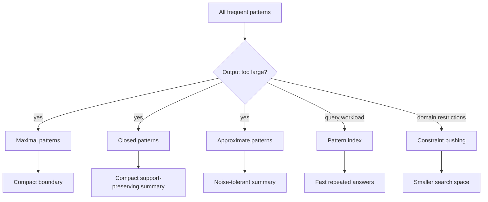

# Advanced Association Patterns

Basic association mining can produce too many itemsets and rules. Aggarwal's advanced association chapter addresses this output-management problem with summarization, querying, constraints, and applications. Instead of treating every frequent itemset as equally useful, the analyst can mine closed patterns, maximal patterns, approximate patterns, constrained patterns, or preprocessed structures that answer many pattern queries efficiently.


*Figure: Hash lists connect hashing to integrity checking and authenticated data structures. Image: [Wikimedia Commons](https://commons.wikimedia.org/wiki/File:Hash_list.svg), David Gothberg and DataWraith, public domain.*

This page builds directly on Apriori and FP-growth. The central issue is no longer only "can we find all frequent itemsets?" It is "which representation of the pattern space is compact, queryable, and useful for the downstream task?"

## Definitions

A frequent itemset $X$ is **maximal frequent** if no proper superset of $X$ is frequent. Maximal patterns summarize the boundary of frequency but do not preserve exact support counts for all subsets.

A frequent itemset $X$ is **closed frequent** if no proper superset of $X$ has the same support count as $X$. Closed patterns preserve support information for all frequent itemsets because any nonclosed itemset has a closed superset with the same support.

An **approximate frequent pattern** relaxes exact matching. Approximation may allow a small number of missing transactions, missing items, or errors depending on the model.

A **pattern query** asks for itemsets satisfying constraints, such as containing a given item, excluding another item, having price above a threshold, or meeting aggregate conditions.

An **anti-monotone constraint** has the property that if an itemset violates it, every superset also violates it. Minimum support is the standard example. Anti-monotone constraints can be pushed deep into search.

A **monotone constraint** has the property that if an itemset satisfies it, every superset also satisfies it. For example, "contains at least one item from category C" is monotone after it becomes true.

**Convertible constraints** can become monotone or anti-monotone after imposing a useful item ordering.

## Key results

**Maximal patterns are compact but lossy.** If \{A,B,C\} is maximal frequent, then \{A,B\}, \{A,C\}, \{B,C\}, A, B, and C are frequent by downward closure. However, their exact support counts cannot be recovered from the maximal set alone.

**Closed patterns are a lossless support summary.** If $X$ is frequent but not closed, there exists a closed superset $Y\supset X$ with the same supporting transactions. The support of $X$ can be recovered by finding the smallest closed superset sharing its transaction set. In practice, closed patterns often reduce output size while preserving counts.

**Constraint pushing reduces the search space.** If a constraint can be evaluated during candidate generation or conditional pattern growth, the miner avoids producing patterns that will be discarded later. The gain is largest when constraints are selective and pruning-safe.

**Pattern querying separates preprocessing from repeated analysis.** In exploratory settings, analysts often ask many pattern questions over the same database. A lattice, prefix tree, FP-tree, vertical tid-list index, or closed-pattern index can make repeated queries cheaper than rerunning mining from scratch.

**Associations are useful beyond baskets.** Frequent patterns can become classification rules, cluster descriptions, outlier explanations, recommender features, web usage summaries, and biological or demographic profile descriptors. In those settings, the best pattern is not necessarily the most frequent one; interpretability and discriminative power matter.

**Advanced pattern mining is mainly about controlling the search and the output.** The raw frequent-pattern lattice grows exponentially in the number of items, so even an efficient miner can overwhelm the analyst. Closed and maximal summaries reduce output size; constraints focus the search on domain-relevant regions; query structures support repeated exploration; and approximation can absorb noise. These techniques should be chosen according to what must be preserved: exact supports, only boundary information, answer speed, or tolerance to imperfect data.

## Visual



| Pattern type | Compact? | Preserves all support counts? | Best use |
|---|---:|---:|---|
| All frequent | No | Yes | Complete analysis |
| Maximal frequent | Very | No | Boundary summary |
| Closed frequent | Often | Yes | Lossless support compression |
| Approximate | Often | Model-dependent | Noisy data |
| Constrained | Depends | For selected query | Domain-specific mining |

## Worked example 1: Maximal vs. closed patterns

**Problem.** Consider transactions:

| tid | items |
|---:|---|
| 1 | A, B, C |
| 2 | A, B, C |
| 3 | A, B |
| 4 | A, D |

Let minimum support count be $\sigma=2$. Identify frequent, maximal frequent, and closed frequent patterns among itemsets involving A, B, C, D.

**Method.**

1. Count singletons:
   - A: 4
   - B: 3
   - C: 2
   - D: 1, not frequent

2. Count pairs:
   - AB: transactions 1,2,3 -> 3
   - AC: 1,2 -> 2
   - BC: 1,2 -> 2
   - AD: 4 -> 1, not frequent

3. Count triples:
   - ABC: 1,2 -> 2, frequent

4. Maximal frequent patterns:
   - ABC is frequent and has no frequent superset, so ABC is maximal.
   - AB, AC, BC, A, B, C are not maximal because each has frequent superset ABC or AB.

5. Closed frequent patterns:
   - ABC has support 2 and no frequent superset, so it is closed.
   - AB has support 3. Its frequent superset ABC has support 2, not the same, so AB is closed.
   - A has support 4. Supersets have lower support, so A is closed.
   - C has support 2 and superset ABC also has support 2, so C is not closed.
   - AC and BC each have support 2 and ABC also has support 2, so they are not closed.

**Checked answer.** Maximal frequent set: \{ABC\}. Closed frequent sets: \{A\}, \{AB\}, \{ABC\}. Maximal is smaller but loses the support count of AB and A.

## Worked example 2: Constraint pushing

**Problem.** Mine frequent itemsets with minimum support 2, but only report patterns whose total price is at least 10. Items have prices:

| item | price |
|---|---:|
| A | 2 |
| B | 4 |
| C | 7 |
| D | 8 |

The transactions are:

| tid | items |
|---:|---|
| 1 | A, B, C |
| 2 | A, C |
| 3 | B, C, D |
| 4 | A, B, D |

**Method.**

1. The support constraint is anti-monotone: if \{A,D\} is infrequent, any superset containing A and D is infrequent.

2. The price constraint "sum at least 10" is monotone for nonnegative prices: once an itemset reaches price 10, every superset also reaches at least 10.

3. Count frequent pairs:
   - AB: transactions 1,4 -> 2, price 6
   - AC: 1,2 -> 2, price 9
   - BC: 1,3 -> 2, price 11
   - BD: 3,4 -> 2, price 12
   - CD: 3 -> 1, not frequent
   - AD: 4 -> 1, not frequent

4. Apply price reporting:
   - AB frequent but price 6, reject.
   - AC frequent but price 9, reject.
   - BC frequent and price 11, report.
   - BD frequent and price 12, report.

5. Check triples. ABC appears only in transaction 1, so not frequent. BCD appears only in transaction 3. ABD appears only in transaction 4.

**Checked answer.** Report \{B,C\} and \{B,D\}. During search, support pruning removes supersets of infrequent pairs, while price monotonicity helps reason about which extensions could eventually satisfy the reporting constraint.

## Code

Pseudocode for closed-pattern filtering after frequent itemsets are known:

```text
INPUT: frequent itemsets F with support counts
OUTPUT: closed frequent itemsets C

C = empty set
for each itemset X in F:
    closed = true
    for each itemset Y in F:
        if X is a proper subset of Y and support(X) == support(Y):
            closed = false
            break
    if closed:
        add X to C
return C
```

```python
from itertools import combinations

transactions = [
    {"A", "B", "C"},
    {"A", "B", "C"},
    {"A", "B"},
    {"A", "D"},
]

def all_itemsets(items):
    for r in range(1, len(items) + 1):
        for combo in combinations(items, r):
            yield frozenset(combo)

items = sorted(set().union(*transactions))
support = {}
for itemset in all_itemsets(items):
    support[itemset] = sum(itemset.issubset(t) for t in transactions)

freq = {x: c for x, c in support.items() if c >= 2}
closed = {}
maximal = {}
for x, c in freq.items():
    has_same_support_superset = any(x < y and c == freq[y] for y in freq)
    has_frequent_superset = any(x < y for y in freq)
    if not has_same_support_superset:
        closed[x] = c
    if not has_frequent_superset:
        maximal[x] = c

print("closed:", {tuple(sorted(k)): v for k, v in closed.items()})
print("maximal:", {tuple(sorted(k)): v for k, v in maximal.items()})
```

## Common pitfalls

- Treating maximal patterns as if they preserve exact support counts for all subsets.
- Mining all patterns first and only then applying constraints that could have pruned the search.
- Confusing closed with maximal; closed patterns are support-preserving, maximal patterns are boundary summaries.
- Using approximate patterns without clearly defining what type of approximation is allowed.
- Reporting many statistically redundant rules without grouping or summarization.
- Forgetting that a pattern useful for classification may be rare but discriminative.
- Building a pattern index without considering the actual query workload.

## Connections

- [Association Pattern Mining](/cs/data-mining/chapter-04-association-pattern-mining)
- [Data Classification](/cs/data-mining/chapter-10-data-classification)
- [Advanced Classification Concepts](/cs/data-mining/chapter-11-advanced-classification)
- [Mining Web Data and Recommenders](/cs/data-mining/chapter-18-mining-web-data)
- [Mining Discrete Sequences](/cs/data-mining/chapter-15-mining-discrete-sequences)
