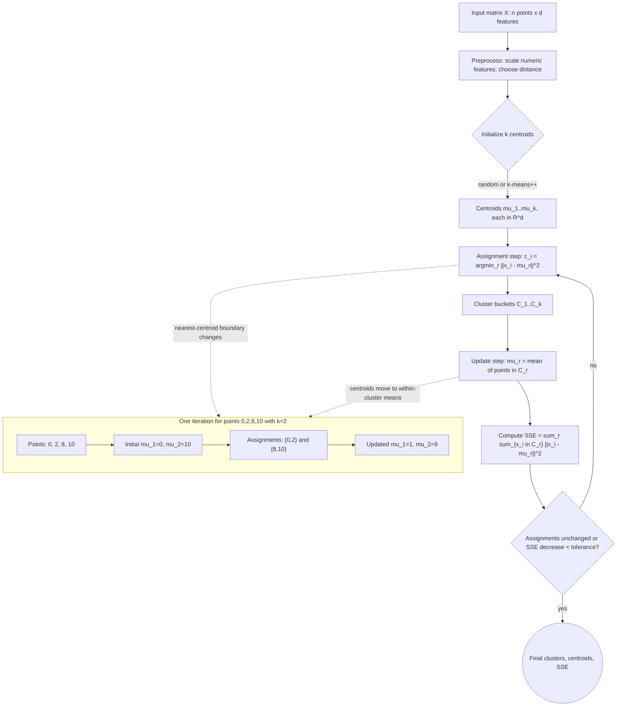

# Cluster Analysis

Cluster analysis groups unlabeled data objects so that objects in the same group are more similar to each other than to objects in other groups. Aggarwal presents clustering as a core unsupervised building block, with representative-based methods such as k-means, hierarchical methods, probabilistic model-based clustering, density and grid methods, graph-based algorithms, non-negative matrix factorization, and validation criteria.

This page focuses on the main families from the basic clustering chapter. The next page covers advanced settings such as categorical data, scalability, high-dimensional clustering, semi-supervised clustering, visual supervision, and ensembles.

## Definitions

A **clustering** partitions or organizes objects $X_1,\dots,X_n$ into groups $C_1,\dots,C_k$. Some algorithms create a hard partition where each object belongs to one cluster; others create soft memberships or hierarchical structures.

**Representative-based clustering** describes each cluster by a prototype. In **k-means**, the prototype is the arithmetic mean or centroid. In **k-medians**, it is a coordinate-wise median. In **k-medoids**, it is an actual data object.

The **k-means objective** is

$$
\min_{C_1,\dots,C_k,\mu_1,\dots,\mu_k}
\sum_{r=1}^{k}\sum_{X_i\in C_r}\|X_i-\mu_r\|_2^2.
$$

**Agglomerative hierarchical clustering** starts with each point as its own cluster and repeatedly merges the closest pair. Linkage criteria include single linkage, complete linkage, average linkage, and Ward linkage.

**Probabilistic model-based clustering** assumes data are generated by a mixture distribution. A Gaussian mixture model represents the density as

$$
p(X)=\sum_{r=1}^{k}\pi_r \mathcal{N}(X\mid \mu_r,\Sigma_r),
$$

where $\pi_r$ are mixture weights.

**Density-based clustering** finds dense regions separated by sparse regions. DBSCAN uses an $\epsilon$ radius and a minimum number of points to define core points.

**Grid-based clustering** partitions the data space into cells and groups dense cells.

**Cluster validation** evaluates whether the clustering is meaningful. Internal measures use only the data and clustering; external measures compare against known labels.

## Key results

**K-means alternates between assignment and update.** Given centroids, assign each point to its nearest centroid. Given assignments, update each centroid to the mean of its assigned points. Each step does not increase the squared-error objective, so the algorithm converges to a local optimum. It is not guaranteed to find the global optimum.

**Centroids are optimal for squared Euclidean loss.** For one cluster $C$, minimize $\sum_{X_i\in C}\|X_i-\mu\|^2$. Differentiating with respect to $\mu$ gives

$$
\frac{\partial}{\partial \mu}\sum_{X_i\in C}\|X_i-\mu\|^2
=2\sum_{X_i\in C}(\mu-X_i).
$$

Setting the derivative to zero yields $\mu=(1/\vert C\vert )\sum_{X_i\in C}X_i$.

**Hierarchical clustering produces a dendrogram, not just one partition.** A user can cut the dendrogram at different heights to obtain different numbers of clusters. This is useful when no single $k$ is known in advance.

**Density methods find nonconvex shapes.** K-means favors roughly spherical clusters because of its centroid and Euclidean squared-error objective. DBSCAN can recover arbitrary connected dense regions and identify noise, but it depends strongly on $\epsilon$ and density parameters.

**Validation must match the goal.** A low within-cluster sum of squares does not necessarily mean meaningful clusters. Silhouette score, Dunn index, Davies-Bouldin index, adjusted Rand index, and normalized mutual information answer different questions.

**Initialization and preprocessing are part of the clustering result.** For k-means, different initial centroids can lead to different local optima. For hierarchical clustering, a different linkage can change the dendrogram. For DBSCAN, a small change in $\epsilon$ can merge clusters or turn many points into noise. A credible clustering study reports these choices, checks stability under reasonable perturbations, and inspects whether the clusters are interpretable in original feature space, not only in the transformed space used by the algorithm.

**Cluster labels are arbitrary.** Cluster 0 and cluster 1 have no inherent ordering, and repeated runs may permute them. Evaluation and downstream use should compare memberships, centroids, or matched clusters rather than relying on numeric label IDs.

## Visual




*Figure: K-means alternates assignment and centroid-update steps until the cluster boundaries stop changing. From [Chire, 2017](https://commons.wikimedia.org/wiki/File:K-means_convergence.gif) — CC BY-SA 4.0.*

This k-means diagram shows the full alternating optimization loop instead of only naming clustering families. The input shape, centroid dimensions, assignment formula, centroid update rule, SSE objective, and convergence test are all labeled, so the reader can see why each iteration cannot increase the squared-error objective. The side example traces the one-dimensional worked example from initial centroids through assignments to updated centroids.

| Algorithm | Cluster shape | Parameters | Strength | Weakness |
|---|---|---|---|---|
| k-means | Spherical, equal-variance tendency | $k$ | Fast, simple | Local minima, outlier-sensitive |
| k-medoids | Prototype as data point | $k$ | Works with arbitrary distances | More expensive |
| Agglomerative | Depends on linkage | linkage, cut height | Dendrogram | Often $O(n^2)$ memory/time |
| Gaussian mixture | Elliptical density | $k$, covariance form | Soft memberships | Model assumptions |
| DBSCAN | Arbitrary dense regions | $\epsilon$, MinPts | Finds noise | Hard with varying density |
| Grid-based | Cell-connected regions | grid size, density | Scalable summaries | Grid resolution matters |

## Worked example 1: One k-means iteration

**Problem.** Cluster four one-dimensional points $0,2,8,10$ with $k=2$. Initial centroids are $\mu_1=0$ and $\mu_2=10$.

**Method.**

1. Assign each point to the nearest centroid:
   - Point 0: distance to 0 is 0, to 10 is 10 -> cluster 1.
   - Point 2: distance to 0 is 2, to 10 is 8 -> cluster 1.
   - Point 8: distance to 0 is 8, to 10 is 2 -> cluster 2.
   - Point 10: distance to 0 is 10, to 10 is 0 -> cluster 2.

2. Update centroids:

$$
\mu_1=\frac{0+2}{2}=1,\quad \mu_2=\frac{8+10}{2}=9.
$$

3. Compute squared-error objective:

$$
(0-1)^2+(2-1)^2+(8-9)^2+(10-9)^2=1+1+1+1=4.
$$

4. Repeat assignment with centroids 1 and 9:
   - 0 and 2 remain closer to 1.
   - 8 and 10 remain closer to 9.

**Checked answer.** The algorithm has converged to clusters \{0,2\} and \{8,10\} with centroids 1 and 9 and objective value 4.

## Worked example 2: DBSCAN core and border points

**Problem.** Use DBSCAN with $\epsilon=1.1$ and MinPts = 3 on one-dimensional points:

$$
0,\ 0.5,\ 1.0,\ 3.0,\ 3.4,\ 10.0.
$$

Count each point itself in its $\epsilon$-neighborhood.

**Method.**

1. Neighborhood of 0 includes 0, 0.5, 1.0 because all are within 1.1. Count 3 -> core.
2. Neighborhood of 0.5 includes 0, 0.5, 1.0. Count 3 -> core.
3. Neighborhood of 1.0 includes 0, 0.5, 1.0. Count 3 -> core.
4. Neighborhood of 3.0 includes 3.0 and 3.4 only. Count 2 -> not core.
5. Neighborhood of 3.4 includes 3.0 and 3.4 only. Count 2 -> not core.
6. Neighborhood of 10.0 includes only 10.0. Count 1 -> not core.

Now connect density-reachable points. Points 0, 0.5, and 1.0 are core points in one connected dense region. Points 3.0 and 3.4 are not within $\epsilon$ of any core point, so they are noise under these parameters. Point 10.0 is also noise.

**Checked answer.** DBSCAN returns one cluster \{0,0.5,1.0\} and noise points \{3.0,3.4,10.0\}. If MinPts were 2, the 3.0 and 3.4 pair would become a second dense cluster, showing parameter sensitivity.

## Code

Pseudocode for k-means:

```text
INPUT: data X, number of clusters k
OUTPUT: assignments and centroids

initialize k centroids
repeat until assignments stop changing or max iterations reached:
    for each point Xi:
        assign Xi to nearest centroid
    for each cluster r:
        set centroid r to the mean of assigned points
return assignments and centroids
```

```python
import numpy as np
from sklearn.cluster import DBSCAN, KMeans
from sklearn.metrics import silhouette_score

X = np.array([[0.0], [2.0], [8.0], [10.0]])
kmeans = KMeans(n_clusters=2, init=np.array([[0.0], [10.0]]), n_init=1, random_state=0)
labels = kmeans.fit_predict(X)
print("k-means labels:", labels)
print("centers:", kmeans.cluster_centers_.ravel())
print("inertia:", kmeans.inertia_)

Y = np.array([[0.0], [0.5], [1.0], [3.0], [3.4], [10.0]])
db = DBSCAN(eps=1.1, min_samples=3)
db_labels = db.fit_predict(Y)
print("DBSCAN labels:", db_labels)

if len(set(labels)) > 1:
    print("silhouette:", round(silhouette_score(X, labels), 3))
```

## Common pitfalls

- Choosing $k$ because it is convenient rather than validating it.
- Running k-means once and trusting a local optimum from unlucky initialization.
- Applying k-means to categorical or highly non-spherical data without justification.
- Forgetting to normalize features before distance-based clustering.
- Interpreting DBSCAN noise as necessarily erroneous; noise may be the most interesting part.
- Comparing clustering results only by visual inspection in two dimensions when the algorithm used many dimensions.
- Treating external class labels as the only valid clustering, even though clusters and classes can represent different structure.

## Connections

- [Advanced Clustering Concepts](/cs/data-mining/chapter-07-advanced-clustering)
- [Similarity and Distances](/cs/data-mining/chapter-03-similarity-distances)
- [Outlier Analysis](/cs/data-mining/chapter-08-outlier-analysis)
- [Mining Data Streams and Big Data](/cs/data-mining/chapter-12-mining-data-streams)
- [Mining Graph Data](/cs/data-mining/chapter-17-mining-graph-data)
