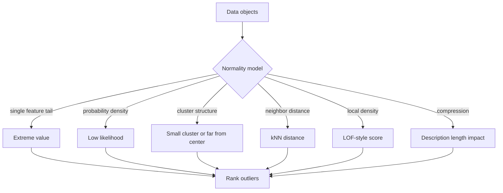

# Outlier Analysis

Outlier analysis finds objects that deviate strongly from the expected behavior of the data. Aggarwal treats it as a core data mining problem, parallel to clustering, classification, and association mining. The same unusual object can be a data error, a fraud signal, a rare medical case, a sensor fault, or an emerging event, so outlier analysis is tightly tied to the domain and the cost of false alarms.


*Figure: DBSCAN explains clustering as density reachability rather than a fixed number of clusters. Image: [Wikimedia Commons](https://commons.wikimedia.org/wiki/File:DBSCAN-Illustration.svg), Chire, CC BY-SA 3.0.*

This page covers the main outlier families: extreme value analysis, probabilistic models, clustering-based detection, distance-based detection, density-based methods, information-theoretic models, and validity. The advanced outlier page covers categorical, high-dimensional, and ensemble settings.

## Definitions

An **outlier** is an object that differs significantly from most other objects under a chosen model of normality.

An **outlier score** is a numeric value where larger values usually mean more anomalous. A threshold turns scores into binary flags.

**Extreme value analysis** flags values that are unusually large or small in one or more numeric attributes.

**Probabilistic outlier detection** fits a probability model and treats low-probability objects as outliers. If $p(X)$ is small, then $X$ is surprising under the model.

**Clustering-based outlier detection** treats points far from cluster centers, in tiny clusters, or not assigned to any dense cluster as outliers.

**Distance-based outlier detection** uses nearest-neighbor distances. A common score is the distance to the $k$th nearest neighbor.

**Density-based outlier detection** compares local density around a point with local density around its neighbors. Local outlier factor (LOF) is the classic example.

**Information-theoretic outlier detection** asks which objects increase description length, entropy, or model complexity the most.

## Key results

**Outlierness is model-relative.** There is no universal outlier without a reference population and a comparison rule. A high-income customer is normal in a luxury database and anomalous in a student-loan database.

**Global methods fail under varying density.** A point in a sparse but legitimate cluster may look far from neighbors compared with points in a dense cluster. Density-based local methods compare a point with its neighborhood rather than with the whole data set.

**Nearest-neighbor scores are simple and effective.** The $k$th nearest-neighbor distance grows when a point is isolated. However, all-pairs distance computation is expensive for large $n$, and the score depends on $k$ and the distance measure.

**Clustering and outlier detection are linked but not identical.** Clustering tries to summarize major groups; outlier detection focuses on residual or rare behavior. A clustering algorithm that forces every point into a cluster may hide outliers unless distances, cluster sizes, or assignment probabilities are inspected.

**Statistical thresholds require assumptions.** A z-score threshold such as $\vert z\vert \gt 3$ assumes a meaningful mean and standard deviation, often a roughly normal central distribution, and enough data to estimate scale. Heavy-tailed data can produce many large z-scores without actual anomalies.

**Validity is difficult.** Labels for anomalies are often rare or delayed. Analysts may evaluate precision at top $k$, stability under parameter changes, domain review, injected anomalies, or downstream cost.

**Outlier analysis is usually a ranking problem before it is a labeling problem.** In many applications there is no natural threshold that separates normal from abnormal. Investigators review the top 10, top 100, or top 1 percent of cases subject to staffing and cost constraints. This means score calibration, ranking stability, and explanation can matter more than a binary decision. A detector that gives slightly worse global separation but clearer reasons for the top alerts may be better operationally.

**The reference set must represent normal behavior.** If the training data mix several regimes, a model may flag legitimate minority behavior. If the training data contain many anomalies, a density or clustering method may absorb them as normal. Time-based systems also need to account for drift: yesterday's unusual traffic may become today's normal pattern after a product launch or seasonal event.

**Explanation should be designed with the detector.** A z-score points to a feature, a nearest-neighbor score can point to missing neighbors, a clustering residual can point to the closest centroid, and a density method can compare local neighborhoods. If a detector only outputs a score, investigators may not know whether to trust or act on it. In applied mining, anomaly explanation is often as important as anomaly ranking.

**Outlier feedback can improve the data pipeline.** Reviewed anomalies often reveal upstream issues such as unit conversion mistakes, duplicate accounts, broken sensors, bot traffic, or changed logging formats. Those discoveries should feed back into cleaning and monitoring rules. In this sense, outlier detection is both an analysis method and a data-quality diagnostic.

**Thresholds should be revisited after review.** Once analysts label some alerts as useful or useless, the threshold can be tuned to match observed workload and precision. Static thresholds chosen before review are rarely optimal.

## Visual



| Method | Score idea | Good for | Main risk |
|---|---|---|---|
| z-score | Distance from mean in standard deviations | Simple numeric tails | Heavy tails, skew |
| Gaussian likelihood | Low fitted probability | Elliptical normal data | Model misspecification |
| kNN distance | Far from $k$ neighbors | Generic metric data | Expensive and density-sensitive |
| LOF | Less dense than neighbors | Varying local density | Parameter sensitivity |
| Clustering residual | Far from centroid or tiny cluster | Clustered normal behavior | Forced assignments |
| Information-theoretic | Increases encoding cost | Pattern-based anomalies | Harder to explain simply |

## Worked example 1: z-scores and robust suspicion

**Problem.** A sensor reports values:

$$
10,\ 11,\ 10,\ 12,\ 11,\ 100.
$$

Use mean and standard deviation to compute a z-score for 100. Then discuss the limitation.

**Method.**

1. Compute the mean:

$$
\mu=\frac{10+11+10+12+11+100}{6}=\frac{154}{6}=25.667.
$$

2. Compute squared deviations:

$$
(10-25.667)^2=245.44,\quad
(11-25.667)^2=215.11,\quad
(10-25.667)^2=245.44,
$$

$$
(12-25.667)^2=186.78,\quad
(11-25.667)^2=215.11,\quad
(100-25.667)^2=5525.44.
$$

3. Population variance:

$$
\sigma^2=\frac{6633.33}{6}=1105.56,\quad \sigma=33.25.
$$

4. z-score for 100:

$$
z=\frac{100-25.667}{33.25}=2.24.
$$

**Checked answer.** The z-score is only about 2.24 because the extreme value inflated both the mean and standard deviation. A robust median-based view would compare 100 with median 11 and identify it more clearly as unusual.

## Worked example 2: k-nearest-neighbor outlier score

**Problem.** For one-dimensional points

$$
0,\ 1,\ 2,\ 10,
$$

compute the $k=2$ nearest-neighbor distance score for each point.

**Method.**

1. Point 0 distances to others: 1, 2, 10. The 2nd nearest distance is 2.
2. Point 1 distances: 1 to 0, 1 to 2, 9 to 10. The 2nd nearest distance is 1.
3. Point 2 distances: 2 to 0, 1 to 1, 8 to 10. Sorted: 1,2,8. The 2nd nearest distance is 2.
4. Point 10 distances: 10 to 0, 9 to 1, 8 to 2. Sorted: 8,9,10. The 2nd nearest distance is 9.

**Checked answer.** The kNN outlier scores are:

| point | score |
|---:|---:|
| 0 | 2 |
| 1 | 1 |
| 2 | 2 |
| 10 | 9 |

Point 10 is the strongest outlier by this score.

## Code

Pseudocode for kNN outlier scoring:

```text
INPUT: data X, neighbor count k
OUTPUT: outlier scores s

for each point Xi:
    distances = empty list
    for each point Xj where j != i:
        add distance(Xi, Xj) to distances
    sort distances
    s[i] = distances[k]
rank points by descending s
return s
```

```python
import numpy as np
from sklearn.neighbors import NearestNeighbors, LocalOutlierFactor

X = np.array([[0.0], [1.0], [2.0], [10.0]])

nn = NearestNeighbors(n_neighbors=3)  # includes the point itself
nn.fit(X)
distances, indices = nn.kneighbors(X)
k2_scores = distances[:, 2]
print("2NN distance scores:", k2_scores)

lof = LocalOutlierFactor(n_neighbors=2)
labels = lof.fit_predict(X)
scores = -lof.negative_outlier_factor_
print("LOF labels:", labels)
print("LOF-style scores:", np.round(scores, 3))
```

## Common pitfalls

- Calling every rare point an error rather than checking domain meaning.
- Using z-scores blindly on skewed or heavy-tailed data.
- Choosing a distance measure that is inappropriate for mixed, categorical, text, or graph data.
- Evaluating outlier methods only by how many points they flag, not by precision or usefulness.
- Letting a clustering algorithm force anomalous points into normal clusters without inspecting residuals.
- Ignoring parameter sensitivity in $k$, $\epsilon$, or contamination rate.
- Training an outlier detector on data that already contains many anomalies without robust methods.

## Connections

- [Advanced Outlier Analysis](/cs/data-mining/chapter-09-advanced-outlier-analysis)
- [Similarity and Distances](/cs/data-mining/chapter-03-similarity-distances)
- [Cluster Analysis](/cs/data-mining/chapter-06-cluster-analysis)
- [Mining Data Streams and Big Data](/cs/data-mining/chapter-12-mining-data-streams)
- [Mining Time Series Data](/cs/data-mining/chapter-14-mining-time-series-data)
