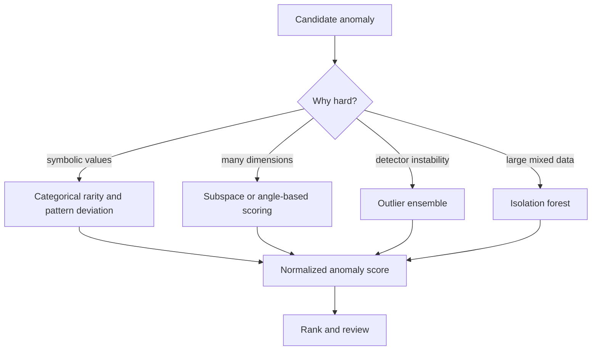

# Advanced Outlier Analysis

Advanced outlier analysis studies cases where ordinary numeric, full-dimensional, single-model anomaly detection is inadequate. Aggarwal's advanced chapter focuses on categorical data, high-dimensional outlier detection, ensembles, and applications. These settings are common in data mining: fraud records mix category codes, text vectors have thousands of sparse dimensions, and operational systems often need robust rankings rather than one brittle detector.

This page extends basic outlier analysis. The main message is that an anomaly may be hidden in a subspace, in an unusual categorical combination, or in disagreement among several detectors.

## Definitions

**Categorical outlier detection** finds unusual combinations of symbolic attribute values. It often uses frequency, entropy, pattern rarity, or deviations from expected co-occurrence.

**High-dimensional outlier detection** seeks anomalies when the number of dimensions is large and raw distances lose contrast. Outliers may be visible only in a subset of dimensions.

**Subspace outlier** refers to an object that is anomalous in some feature subset even if it does not look anomalous in all dimensions together.

**Angle-based outlier detection** uses angles among points rather than distances, because angles can be more stable than distances in some high-dimensional settings.

**Outlier ensembles** combine multiple anomaly scores. Base detectors may vary by algorithm, feature subset, sample, parameter, or random seed.

**Isolation-based detection** ranks objects by how quickly random splits isolate them. Isolation forest is a practical ensemble method: anomalies tend to require shorter paths in random trees.

## Key results

**Categorical rarity is combinatorial.** A single category value may be common, but its combination with other values may be rare. For example, country = US and device = desktop may both be common, but a specific browser-language-payment combination may be unusual.

**High-dimensional distance concentration hurts global detectors.** If all pairwise distances become similar, nearest-neighbor scores lose contrast. Subspace methods search for projections in which contrast reappears.

**Subspace search must be controlled.** The number of feature subsets is exponential in dimension. Practical methods use random subspaces, feature bagging, evolutionary search, sparse models, or domain-restricted subsets.

**Ensembles improve robustness when detectors fail differently.** A distance detector, density detector, isolation detector, and subspace detector may rank different objects highly. Combining normalized scores can reduce dependence on one fragile assumption.

**Isolation forest intuition.** Randomly choose a feature and a split value. Points in sparse or extreme regions are separated by fewer random splits. Average path length across many trees becomes an anomaly score.

**Score normalization matters.** Combining raw scores from different detectors is meaningless if one detector outputs distances, another outputs negative log-likelihoods, and another outputs path lengths. Convert scores to ranks, quantiles, z-scores, or calibrated probabilities before aggregation.

**Subspace anomalies require evidence control.** In high dimensions, it is easy to find some projection where a point looks strange by chance. This is the anomaly-detection version of multiple testing. A practical workflow limits candidate subspaces with domain knowledge, random feature bagging, minimum support requirements, or validation on known anomalies. The final explanation should name the feature subset that made the point unusual; otherwise reviewers cannot distinguish a meaningful subspace anomaly from a search artifact.

**Categorical anomaly scores need smoothing.** A combination not seen in historical data may have empirical probability zero, but that does not always mean impossible. New products, new countries, and new device types appear over time. Smoothing, hierarchical category grouping, and recency-aware baselines help avoid turning every new legitimate category into a severe alert.

**Ensemble disagreement is diagnostic.** If every detector ranks the same point highly, the anomaly is probably strong under several assumptions. If only one detector does, the point may reveal a specific structure: isolation forests like marginal separation, LOF likes local-density dips, and subspace detectors like feature-specific deviations. Reviewing the pattern of detector scores can therefore help explain why a case was flagged.

**Advanced anomaly detection should report why the case is reviewable now.** For streaming or operational data, a point may be unusual because it is new, because its frequency changed, because its combination of categories is rare, or because a local peer group shifted. The explanation should distinguish persistent rare behavior from sudden change; the response may be different.

**Maintenance matters.** Advanced detectors often depend on background frequencies, subspace samples, or ensemble components. These baselines should be refreshed on a controlled schedule so the model adapts without immediately normalizing every suspicious burst.

## Visual



| Advanced setting | Useful idea | Example score | Main danger |
|---|---|---|---|
| Categorical | Rare combinations | Negative log frequency | Sparse data overflags rare but valid cases |
| High-dimensional | Subspace contrast | Max score over sampled subspaces | Multiple testing |
| Angle-based | Directional isolation | Variance of angles | Costly for large data |
| Ensemble | Combine detectors | Average rank | Poor normalization |
| Isolation | Random partition depth | Short path length | Needs enough trees |

## Worked example 1: Categorical combination rarity

**Problem.** A login table has three categorical attributes:

| record | country | device | hour_bucket |
|---:|---|---|---|
| 1 | US | desktop | day |
| 2 | US | desktop | day |
| 3 | US | mobile | day |
| 4 | US | desktop | night |
| 5 | FR | desktop | day |
| 6 | FR | mobile | night |

Score each record by negative log frequency of the full combination, using empirical probability.

**Method.**

1. Count full combinations:
   - (US, desktop, day): records 1 and 2 -> count 2.
   - (US, mobile, day): count 1.
   - (US, desktop, night): count 1.
   - (FR, desktop, day): count 1.
   - (FR, mobile, night): count 1.

2. Total records $n=6$. Probability for (US, desktop, day) is $2/6=1/3$.

3. Probability for each singleton combination is $1/6$.

4. Negative log score with natural log:

$$
-\log(1/3)=1.099,\quad -\log(1/6)=1.792.
$$

5. Records 3, 4, 5, and 6 tie as more unusual by full-combination frequency.

**Checked answer.** The rare full combinations receive higher scores. This does not prove they are malicious; it only says they are less frequent under this simple categorical model.

## Worked example 2: Isolation depth intuition

**Problem.** In one dimension, points are

$$
0.0,\ 0.1,\ 0.2,\ 0.3,\ 9.0.
$$

Explain why 9.0 is likely isolated quickly by random splits.

**Method.**

1. The data range is from 0.0 to 9.0.

2. A random split threshold between 0.3 and 9.0 immediately separates 9.0 from the four compact points.

3. The length of this interval is $9.0-0.3=8.7$, while the full split range is $9.0-0.0=9.0$.

4. The probability that a uniformly random threshold falls in $(0.3,9.0)$ is

$$
\frac{8.7}{9.0}=0.967.
$$

5. Therefore a single split isolates 9.0 with high probability. By contrast, isolating 0.1 from nearby points requires thresholds in narrow intervals such as $(0.0,0.1)$ and $(0.1,0.2)$ across multiple branches.

**Checked answer.** The point 9.0 has a short expected isolation path because it is separated by a large empty gap from the rest of the data.

## Code

Pseudocode for an outlier ensemble:

```text
INPUT: data X, base detectors A1..Am
OUTPUT: combined anomaly ranking

for each detector Aj:
    fit Aj on X
    compute raw anomaly scores sj
    convert sj to ranks or quantiles qj
combined_score = average of q1..qm
rank objects by combined_score descending
return ranking
```

```python
import numpy as np
from scipy.stats import rankdata
from sklearn.ensemble import IsolationForest
from sklearn.neighbors import LocalOutlierFactor

X = np.array(
    [
        [0.0, 0.0],
        [0.1, 0.0],
        [0.0, 0.2],
        [0.2, 0.1],
        [4.0, 4.0],
    ]
)

iso = IsolationForest(random_state=0, contamination=0.2)
iso_score = -iso.fit(X).score_samples(X)

lof = LocalOutlierFactor(n_neighbors=2)
lof.fit_predict(X)
lof_score = -lof.negative_outlier_factor_

def quantile_scores(scores):
    return rankdata(scores, method="average") / len(scores)

ensemble = (quantile_scores(iso_score) + quantile_scores(lof_score)) / 2
print("isolation:", np.round(iso_score, 3))
print("lof:", np.round(lof_score, 3))
print("ensemble:", np.round(ensemble, 3))
```

## Common pitfalls

- Treating rare categorical values as automatically anomalous without accounting for legitimate class imbalance.
- Searching many subspaces and reporting the best anomaly without correcting for chance discoveries.
- Averaging raw outlier scores from incompatible detectors.
- Assuming an ensemble is better when all base detectors use the same flawed distance measure.
- Using isolation forest contamination settings as ground truth rather than threshold choices.
- Ignoring explainability; anomaly reviewers often need the features or patterns that caused the flag.
- Evaluating only top-ranked examples and missing systematic false positives in protected or operationally sensitive groups.

## Connections

- [Outlier Analysis](/cs/data-mining/chapter-08-outlier-analysis)
- [Feature Selection and Dimensionality Reduction](/cs/data-mining/chapter-02-feature-selection-dimensionality-reduction)
- [Advanced Clustering Concepts](/cs/data-mining/chapter-07-advanced-clustering)
- [Mining Data Streams and Big Data](/cs/data-mining/chapter-12-mining-data-streams)
- [Mining Web Data and Recommenders](/cs/data-mining/chapter-18-mining-web-data)
