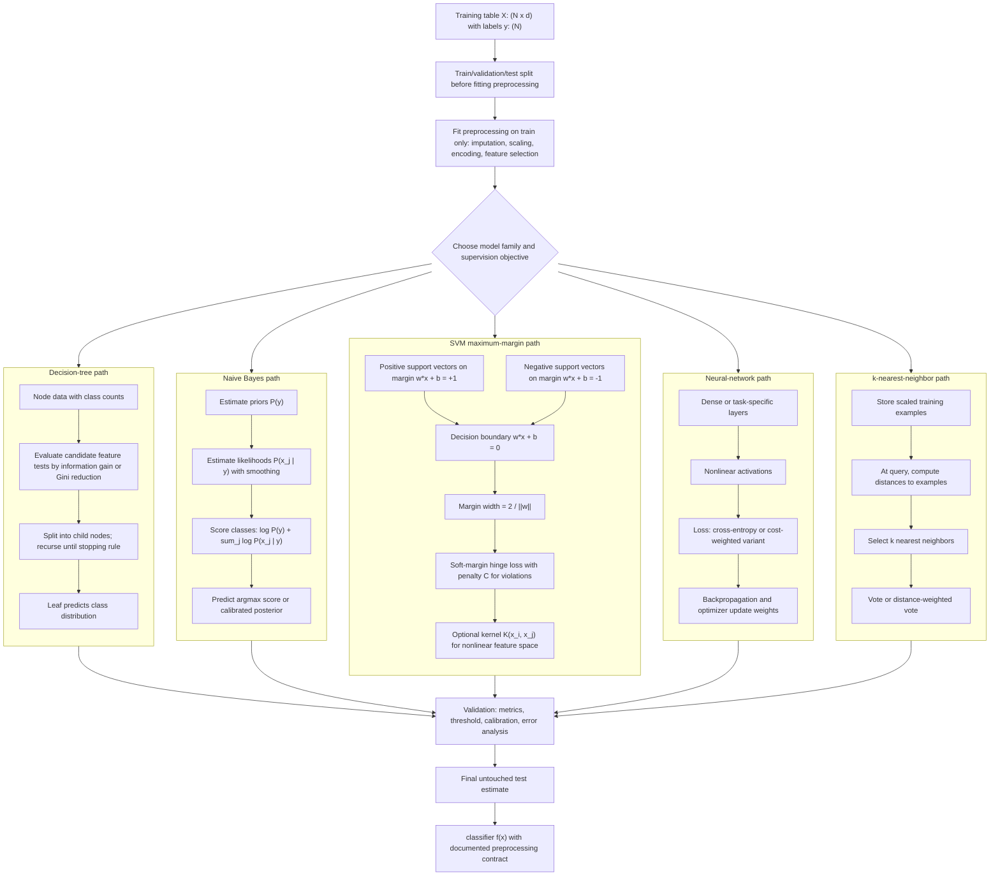

# Data Classification

Data classification learns a model from labeled examples and uses it to assign labels to new objects. Aggarwal's classification chapter covers feature selection, decision trees, rule-based classifiers, probabilistic classifiers such as naive Bayes, support vector machines, neural networks, instance-based learning, and evaluation. Classification is supervised: unlike clustering, it is judged by how well it predicts known labels or future outcomes.

This page covers the core classification toolkit. The advanced page covers multiclass learning, rare classes, scalability, regression, semi-supervised learning, active learning, and ensembles.

## Definitions

A **training set** consists of pairs $(X_i,y_i)$, where $X_i$ is a feature vector and $y_i$ is a class label.

A **classifier** is a function $f(X)$ that predicts a label for a new object.

A **decision tree** recursively partitions the feature space. Internal nodes test features; leaves predict labels.

**Information gain** measures the entropy reduction from splitting on a feature. If a node has class distribution $p_1,\dots,p_c$, its entropy is

$$
H=-\sum_{r=1}^{c}p_r\log_2 p_r.
$$

**Gini impurity** is

$$
G=1-\sum_{r=1}^{c}p_r^2.
$$

**Rule-based classification** predicts with if-then rules such as "if age < 25 and student = yes, then class = buys".

**Naive Bayes** uses Bayes' rule and assumes conditional independence of features given the class:

$$
P(y\mid X)\propto P(y)\prod_{j=1}^{d}P(x_j\mid y).
$$

**Support vector machines (SVMs)** find a separating hyperplane with maximum margin, often using kernels for nonlinear boundaries.

**Neural networks** compose layers of weighted transformations and nonlinear activation functions to learn flexible decision functions.

**Instance-based learning** predicts from nearby training examples, as in $k$-nearest-neighbor classification.

## Key results

**Tree splits are greedy.** A decision tree usually chooses the split that most improves purity at the current node. This does not guarantee the globally smallest or most accurate tree, but it is efficient and interpretable.

**Naive Bayes can work even when independence is false.** The independence assumption may be unrealistic, especially for text terms or correlated attributes, but classification only requires the correct class to get the highest posterior score. Probability calibration may still be poor.

**SVM margin controls generalization.** For linearly separable data, the maximum-margin separator is the one farthest from the nearest training points. Soft-margin SVMs allow violations with a penalty parameter.

**Neural networks trade interpretability for representation power.** They can learn complex nonlinear boundaries, but require careful regularization, scaling, architecture choices, and validation.

**Evaluation must reflect the cost of errors.** Accuracy can be misleading with imbalanced classes. Precision, recall, F1 score, ROC AUC, PR AUC, calibration, and cost-sensitive metrics may be more meaningful.

**Feature selection for classification should be supervised.** A feature with little variance may perfectly indicate a rare class. A high-variance feature may be irrelevant. Use label-aware criteria on training data only.

**The training protocol is part of the classifier.** A model is not just a fitted tree, SVM, or neural network; it also includes the split strategy, preprocessing fit, class weighting, hyperparameter search, and threshold selection. If any of these steps use validation or test labels improperly, the reported performance is no longer an honest estimate. In data mining applications with time, users, or graph links, the split must also reflect the future deployment setting.

**Probabilistic output and decisions are different layers.** A model may estimate $P(y=1\mid X)$, but the action threshold should depend on costs, capacity, and risk. Medical screening, fraud review, and product targeting rarely use 0.5 as the best threshold. Evaluation should therefore include both ranking quality and the chosen operating point.

**Interpretability depends on audience and use.** A decision tree may be interpretable to an analyst but still too large for a policy manual. A linear model may be clear if features are meaningful, but unclear if features are thousands of SVD components. A neural network can be acceptable when only prediction is needed, but not when a denied loan, medical alert, or compliance decision requires a human-readable reason. The model family should match the accountability requirement.

**Calibration should be checked when probabilities drive actions.** Two classifiers can have the same accuracy but different probability quality. If predicted 0.8 events happen only 0.6 of the time, downstream cost calculations become unreliable. Platt scaling, isotonic regression, reliability curves, and held-out calibration sets are common tools when predicted probabilities matter.

**Class definitions deserve version control.** In many data mining projects, labels come from business rules or human review queues. If the definition of churn, fraud, conversion, or diagnosis changes, a classifier trained on old labels may no longer match the task. Track label-generation logic with the same discipline as feature code.

**Baselines are mandatory.** A majority-class classifier, simple rule, or naive Bayes model gives context for whether a complex classifier is actually adding value.

## Visual




*Figure: A decision tree routes an example through successive feature tests until it reaches a class leaf. From [Eviatar Bach, 2013](https://commons.wikimedia.org/wiki/File:Simple_decision_tree.svg) — CC0 1.0.*

The classification diagram makes preprocessing, model-family internals, and validation part of one deployable system instead of treating the classifier as a black box. The SVM branch includes the decision boundary, the two margin hyperplanes, support vectors, soft-margin violations, and the kernel option; the other branches expose their own sufficient statistics, split criteria, parameters, or stored examples.

| Classifier | Strength | Main hyperparameters | Good first use |
|---|---|---|---|
| Decision tree | Interpretable, mixed data | depth, min samples, criterion | Rules and diagnostics |
| Rule-based | Human-readable | rule ordering, pruning | Policy-like decisions |
| Naive Bayes | Fast, sparse data | smoothing | Text and categorical baselines |
| SVM | Strong margins | $C$, kernel, gamma | Medium-size numeric data |
| Neural network | Flexible nonlinear fit | architecture, learning rate | Large data, complex patterns |
| kNN | Simple local model | $k$, distance | Small data, irregular boundaries |

## Worked example 1: Entropy split for a decision tree

**Problem.** A node contains 6 training examples: 3 positive and 3 negative. Candidate split A creates left child with 2 positive and 0 negative, and right child with 1 positive and 3 negative. Compute information gain.

**Method.**

1. Parent entropy:

$$
H(parent)=-\frac{3}{6}\log_2\frac{3}{6}-\frac{3}{6}\log_2\frac{3}{6}=1.
$$

2. Left child has class distribution $(1,0)$, so

$$
H(left)=0.
$$

3. Right child has 1 positive and 3 negative, so probabilities are $1/4$ and $3/4$:

$$
H(right)=-\frac{1}{4}\log_2\frac{1}{4}-\frac{3}{4}\log_2\frac{3}{4}
=0.5+0.311=0.811.
$$

4. Weighted child entropy:

$$
\frac{2}{6}\cdot0+\frac{4}{6}\cdot0.811=0.541.
$$

5. Information gain:

$$
1-0.541=0.459.
$$

**Checked answer.** Split A has information gain about 0.459 bits.

## Worked example 2: Naive Bayes posterior

**Problem.** Classify an email with words `free` and `meeting`. Suppose:

$$
P(spam)=0.4,\quad P(not)=0.6,
$$

$$
P(free\mid spam)=0.5,\quad P(meeting\mid spam)=0.1,
$$

$$
P(free\mid not)=0.05,\quad P(meeting\mid not)=0.4.
$$

Use naive Bayes scores.

**Method.**

1. Spam score:

$$
P(spam)P(free\mid spam)P(meeting\mid spam)
=0.4\cdot0.5\cdot0.1=0.02.
$$

2. Not-spam score:

$$
P(not)P(free\mid not)P(meeting\mid not)
=0.6\cdot0.05\cdot0.4=0.012.
$$

3. Normalize if posterior probabilities are needed:

$$
P(spam\mid words)=\frac{0.02}{0.02+0.012}=0.625.
$$

**Checked answer.** The classifier predicts spam, with normalized posterior 0.625 under this simplified model.

## Code

Pseudocode for supervised classification:

```text
INPUT: labeled data (X, y), classifier family A
OUTPUT: trained classifier and validation metrics

split data into train and test sets
fit preprocessing on training data only
transform train and test features
train classifier A on transformed training data
predict labels or probabilities on validation/test data
compute metrics appropriate to class balance and costs
return model and metrics
```

```python
from sklearn.datasets import load_breast_cancer
from sklearn.model_selection import train_test_split
from sklearn.pipeline import Pipeline
from sklearn.preprocessing import StandardScaler
from sklearn.tree import DecisionTreeClassifier
from sklearn.naive_bayes import GaussianNB
from sklearn.metrics import accuracy_score, precision_recall_fscore_support

X, y = load_breast_cancer(return_X_y=True)
X_train, X_test, y_train, y_test = train_test_split(
    X, y, test_size=0.25, stratify=y, random_state=0
)

models = {
    "tree": DecisionTreeClassifier(max_depth=4, random_state=0),
    "naive_bayes": Pipeline([("scale", StandardScaler()), ("clf", GaussianNB())]),
}

for name, model in models.items():
    model.fit(X_train, y_train)
    pred = model.predict(X_test)
    p, r, f1, _ = precision_recall_fscore_support(y_test, pred, average="binary")
    print(name, "accuracy", round(accuracy_score(y_test, pred), 3), "f1", round(f1, 3))
```

## Common pitfalls

- Reporting accuracy alone on imbalanced data.
- Selecting features or tuning hyperparameters on the test set.
- Letting categorical encodings leak target information through improper preprocessing.
- Growing a decision tree until it memorizes the training data.
- Interpreting naive Bayes probabilities as calibrated without checking calibration.
- Using an SVM or kNN without scaling numeric features.
- Comparing classifiers without consistent train-test splits or cross-validation.

## Connections

- [Advanced Classification Concepts](/cs/data-mining/chapter-11-advanced-classification)
- [Data Preparation](/cs/data-mining/chapter-02-data-preparation)
- [Similarity and Distances](/cs/data-mining/chapter-03-similarity-distances)
- [Mining Text Data](/cs/data-mining/chapter-13-mining-text-data)
- [Mining Graph Data](/cs/data-mining/chapter-17-mining-graph-data)
