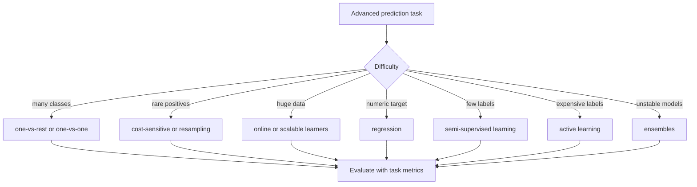

# Advanced Classification Concepts

Advanced classification covers supervised learning cases that go beyond a balanced, moderate-size, fully labeled two-class table. Aggarwal's advanced classification chapter includes multiclass learning, rare class learning, scalable classification, regression with numeric targets, semi-supervised learning, active learning, and ensemble methods. These topics matter because real data sets rarely arrive with abundant clean labels and equal class frequencies.


*Figure: Decision trees classify by asking a sequence of feature questions. Image: [Wikimedia Commons](https://commons.wikimedia.org/wiki/File:Simple_decision_tree.svg), Eviatar Bach, CC0.*


*Figure: The Iris scatterplot makes feature spaces and class separation visible. Image: [Wikimedia Commons](https://commons.wikimedia.org/wiki/File:Iris_dataset_scatterplot.svg), Nicoguaro, CC BY 4.0.*

This page extends the core classifiers. The unifying question is how to adapt a predictive model when labels are many, rare, expensive, partially missing, numeric, streaming, or noisy.

## Definitions

**Multiclass classification** predicts one of more than two labels. Common reductions include one-vs-rest and one-vs-one binary classifiers.

**Rare class learning** focuses on classes with small prevalence but high importance, such as fraud, disease, or equipment failure.

**Cost-sensitive learning** assigns different costs to different error types. False negatives may be far more expensive than false positives in safety or fraud settings.

**Scalable classification** trains and predicts under large data constraints using sampling, online updates, distributed computation, or model families with cheap sufficient statistics.

**Regression** predicts a numeric target rather than a class label. Linear regression, generalized linear models, regression trees, and kernel regression are common examples.

**Semi-supervised learning** uses both labeled and unlabeled data.

**Active learning** asks the model to choose which unlabeled examples should be labeled next.

An **ensemble** combines multiple models. Bagging averages models trained on bootstrap samples; boosting trains models sequentially to focus on previously misclassified examples; random forests combine tree bagging with random feature subsets.

## Key results

**Multiclass reductions change the decision surface.** One-vs-rest trains one classifier per class against all others. One-vs-one trains a classifier for each pair of classes and uses voting. The best reduction depends on class count, imbalance, and base classifier.

**Rare classes require different metrics and sometimes different objectives.** Accuracy can remain high while a model misses every rare positive case. Precision-recall curves, recall at a fixed false-positive rate, and cost-weighted loss are more informative.

**Boosting reduces bias by focusing on hard cases.** In AdaBoost-style methods, misclassified examples receive more weight in later rounds. The final classifier is a weighted vote of weak learners. It can be powerful, but it is sensitive to label noise if hard cases are actually mislabeled.

**Bagging reduces variance.** Training many unstable models on bootstrap samples and averaging their predictions reduces prediction variance. Decision trees benefit strongly because small data changes can produce different trees.

**Semi-supervised learning depends on structural assumptions.** Unlabeled data help only when the marginal distribution of $X$ contains information about the label boundary. Common assumptions include cluster assumption, manifold assumption, and smoothness on a graph.

**Active learning is useful when labels are expensive.** Querying the most uncertain examples can reduce labeling cost, but uncertainty sampling may overfocus on outliers unless diversity or representativeness is included.

**Advanced classification is often about choosing the right supervision budget.** If labels are plentiful but classes are imbalanced, cost-sensitive learning and thresholding may be enough. If labels are scarce but unlabeled data are abundant, semi-supervised learning may help. If labels are expensive and can be requested selectively, active learning changes the data collection process itself. If data are massive, a slightly simpler model that can be updated online may beat an expensive model that cannot be retrained often.

**Ensembles need diversity and disciplined validation.** Bagging works because the base models vary across bootstrap samples. Random forests add feature randomness to increase diversity among trees. Boosting works because later models focus on examples earlier models handled poorly. If all base learners make the same errors, an ensemble only repeats them. If hyperparameters are selected on the test set, the ensemble's apparent gain may be validation leakage rather than real improvement.

**Rare-class work should separate ranking from capacity.** A model may rank positives well, but an operations team may only review 50 cases per day. Precision at 50 can matter more than global AUC. Conversely, a public-health screening task may require high recall even at low precision. The evaluation protocol should match the intervention capacity.

**Semi-supervised and active learning change the data distribution.** When the learner selects examples for labeling, the labeled set is no longer a random sample. Metrics computed on actively selected labels can be biased unless evaluated on an independent test set. Similarly, pseudo-labeling unlabeled data can reinforce early model mistakes if confidence thresholds are too loose.

**Regression deserves residual checks.** When numeric targets are modeled, inspect residuals by segment, time, and predicted value range. A low average error can hide systematic underprediction for the cases that matter.

## Visual



| Method | Main idea | Best use | Main caution |
|---|---|---|---|
| One-vs-rest | One classifier per class | Many classes, simple deployment | Imbalance in each binary task |
| Cost-sensitive learning | Penalize costly mistakes more | Rare or asymmetric errors | Cost estimates may be uncertain |
| Bagging | Average bootstrap models | High-variance learners | Less helpful for stable models |
| Boosting | Reweight hard examples | Strong tabular prediction | Label noise sensitivity |
| Semi-supervised | Use unlabeled structure | Few labels, many unlabeled records | Wrong assumptions hurt |
| Active learning | Query informative labels | Expensive annotation | Sampling bias |
| Regression | Predict numeric target | Continuous outcomes | Different metrics needed |

## Worked example 1: Cost-sensitive threshold

**Problem.** A fraud model outputs probability $p=P(fraud\mid X)$. A false negative costs 100 dollars; a false positive costs 5 dollars. When should the model flag a transaction?

**Method.**

1. If we flag the transaction, expected cost is from a false positive:

$$
C_{flag}=5\cdot P(not\ fraud)=5(1-p).
$$

2. If we do not flag, expected cost is from a false negative:

$$
C_{no}=100\cdot P(fraud)=100p.
$$

3. Flag when $C_{flag}\lt C_{no}$:

$$
5(1-p)<100p.
$$

4. Solve:

$$
5<105p,\quad p>\frac{5}{105}=0.0476.
$$

**Checked answer.** The threshold is about 4.8 percent, much lower than 50 percent, because missing fraud is far more expensive than investigating a normal case.

## Worked example 2: One-vs-rest multiclass scores

**Problem.** A one-vs-rest classifier for classes A, B, and C produces these decision scores for one test object:

| classifier | score |
|---|---:|
| A vs rest | 0.7 |
| B vs rest | 0.2 |
| C vs rest | 0.6 |

Predict the class and explain the ambiguity.

**Method.**

1. One-vs-rest uses one binary classifier per class.
2. A score is often interpreted as confidence that the object belongs to that class rather than the rest.
3. Choose the class with the largest score:

$$
\max(0.7,0.2,0.6)=0.7.
$$

4. The predicted class is A.
5. The ambiguity is that A and C both have positive-looking scores. One-vs-rest classifiers are trained separately, so their raw scores may not be calibrated against each other.

**Checked answer.** Predict A, but score calibration should be checked if these scores are used as probabilities or for ranking.

## Code

Pseudocode for active learning with uncertainty sampling:

```text
INPUT: small labeled set L, unlabeled pool U, labeling budget B
OUTPUT: trained classifier

train classifier on L
for t from 1 to B:
    for each x in U:
        compute prediction uncertainty
    choose x* with highest uncertainty
    request label y* from annotator
    move (x*, y*) from U to L
    retrain or update classifier
return classifier
```

```python
import numpy as np
from sklearn.datasets import make_classification
from sklearn.ensemble import RandomForestClassifier, AdaBoostClassifier
from sklearn.metrics import classification_report
from sklearn.model_selection import train_test_split

X, y = make_classification(
    n_samples=1000,
    n_features=12,
    n_informative=5,
    weights=[0.95, 0.05],
    random_state=0,
)
X_train, X_test, y_train, y_test = train_test_split(
    X, y, stratify=y, random_state=0, test_size=0.3
)

models = {
    "random_forest_balanced": RandomForestClassifier(
        n_estimators=100, class_weight="balanced", random_state=0
    ),
    "adaboost": AdaBoostClassifier(n_estimators=100, random_state=0),
}

for name, model in models.items():
    model.fit(X_train, y_train)
    pred = model.predict(X_test)
    print(name)
    print(classification_report(y_test, pred, digits=3))
```

## Common pitfalls

- Using accuracy for rare class problems where recall and precision matter more.
- Oversampling before train-test splitting, which duplicates information across splits.
- Treating one-vs-rest scores as calibrated probabilities without calibration.
- Using semi-supervised learning when unlabeled data come from a different distribution.
- Querying only uncertain active-learning points and ignoring coverage of the data space.
- Boosting heavily mislabeled data without noise control.
- Comparing regression and classification models with incompatible metrics.

## Connections

- [Data Classification](/cs/data-mining/chapter-10-data-classification)
- [Outlier Analysis](/cs/data-mining/chapter-08-outlier-analysis)
- [Mining Data Streams and Big Data](/cs/data-mining/chapter-12-mining-data-streams)
- [Mining Text Data](/cs/data-mining/chapter-13-mining-text-data)
- [Mining Graph Data](/cs/data-mining/chapter-17-mining-graph-data)
