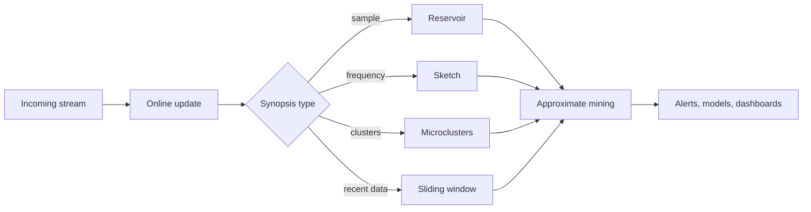

# Mining Data Streams and Big Data

Data stream mining studies data that arrive continuously and may be too large to store, revisit, or process with multiple full passes. Aggarwal's stream chapter covers synopsis structures, reservoir sampling, sketches, streaming frequent patterns, stream clustering, streaming outlier detection, and streaming classification. The broader big-data issue also includes disk-resident and distributed batch settings, where frameworks such as MapReduce can scan huge stored data but do not replace real-time stream algorithms.


*Figure: The Iris scatterplot makes feature spaces and class separation visible. Image: [Wikimedia Commons](https://commons.wikimedia.org/wiki/File:Iris_dataset_scatterplot.svg), Nicoguaro, CC BY 4.0.*

This page connects scalability to the rest of the book. Most familiar mining tasks have streaming versions, but the one-pass constraint, concept drift, memory limits, and real-time deadlines change the algorithms.

## Definitions

A **data stream** is a sequence $X_1,X_2,\dots$ observed over time, often with no known endpoint.

The **one-pass constraint** means each item can be processed once, or only a small number of times, before it is discarded.

A **synopsis** is a compact summary of a stream. Examples include samples, histograms, sketches, Bloom filters, wavelet summaries, and microclusters.

**Reservoir sampling** maintains a uniform sample of fixed size from a stream of unknown length.

A **sliding window** model keeps only the most recent $w$ observations.

A **decay model** weights recent observations more heavily than old observations, often with exponential decay.

**Concept drift** occurs when the relationship between features and labels, or the data distribution itself, changes over time.

**MapReduce** is a distributed batch pattern with map tasks producing key-value pairs and reduce tasks aggregating values by key. It is useful for large stored data sets, but classic MapReduce is not a low-latency stream model.

**Microclusters** are compact cluster summaries with counts and sufficient statistics, often used by stream clustering methods.

## Key results

**Streaming changes exactness expectations.** Many exact batch algorithms need repeated scans or random access. Stream methods often return approximate answers with bounded memory.

**Reservoir sampling is unbiased over all items seen so far.** With reservoir size $k$, item $t$ is retained with probability $k/t$. Older items remain with the same probability after replacement logic.

**Sketches trade memory for controlled error.** Count-min sketch, Bloom filters, and related structures use hash functions to summarize frequencies or membership. They can update quickly but may have false positives or overestimates.

**Stream clustering separates online and offline phases.** The online phase maintains microclusters. The offline phase reclusters summaries when a user asks for a current clustering. This avoids storing all raw points.

**Concept drift requires recency.** A classifier trained on all historical data may be worse than one trained on recent data if behavior changes. Sliding windows, decay, and adaptive ensembles address this.

**Distributed batch is not the same as streaming.** MapReduce can compute item counts or model updates over huge stored files. A stream method must update continuously and may never see the full data again.

**Window choice is a modeling assumption.** A sliding window of one hour, one day, or one month defines what "current" means. Short windows adapt quickly but have high variance; long windows are stable but slow to react to drift. Exponential decay gives a smoother compromise, but the decay rate still encodes a memory horizon. Stream mining results should therefore report the window or decay policy as carefully as a batch method reports its training set.

**Synopses should match query guarantees.** A Bloom filter answers approximate membership queries with false positives. A count-min sketch estimates frequencies with overestimation. A reservoir sample supports approximate full-data analysis. A microcluster supports centroid and variance summaries. These structures are not interchangeable: choosing a sketch for a task that needs quantiles or choosing a reservoir for a task that needs rare-item counts can produce poor results even when memory use is low.

**Latency is a first-class constraint.** A stream model that is accurate but updates too slowly can miss the event it was meant to detect. Online algorithms should report update time, memory footprint, and alert delay, not only final accuracy or approximation error.

**Backpressure and missing data affect stream mining.** Real streams can arrive late, out of order, duplicated, or dropped under load. A robust mining system defines event time versus processing time, handles late arrivals, and records how much data were skipped or approximated. Otherwise, changes in infrastructure can look like changes in behavior.

**Replay is valuable when available.** Even if production is one-pass, archived samples let engineers test new stream logic against historical bursts, outages, and drift events before deployment.

## Visual



| Setting | Data access | Typical tool | Suitable task |
|---|---|---|---|
| In-memory batch | Many random accesses | Standard algorithms | Moderate data |
| Disk-resident batch | Few sequential scans | External memory algorithms | Very large stored data |
| Distributed batch | Parallel scans | MapReduce-style aggregation | Huge stored logs |
| Stream | One pass, bounded memory | Samples, sketches, online models | Real-time monitoring |
| Sliding window stream | Recent data only | Window summaries | Drift-aware analytics |

## Worked example 1: Count-min sketch update

**Problem.** Track approximate item counts using a sketch with two hash rows and five columns. The hash functions are:

$$
h_1(A)=1,\ h_1(B)=3,\quad h_2(A)=4,\ h_2(B)=3.
$$

Process stream $A,B,A$. Estimate counts of A and B.

**Method.**

1. Initialize a $2\times5$ table of zeros.

2. Process first A:
   - row 1, column 1 increases to 1.
   - row 2, column 4 increases to 1.

3. Process B:
   - row 1, column 3 increases to 1.
   - row 2, column 3 increases to 1.

4. Process second A:
   - row 1, column 1 increases to 2.
   - row 2, column 4 increases to 2.

5. Estimate count of A by taking the minimum of its hashed counters:

$$
\hat{c}(A)=\min(table[1,1],table[2,4])=\min(2,2)=2.
$$

6. Estimate B:

$$
\hat{c}(B)=\min(table[1,3],table[2,3])=\min(1,1)=1.
$$

**Checked answer.** The estimates are exact in this tiny example: A has count 2 and B has count 1. In larger streams, collisions can only increase counters, so count-min sketch overestimates rather than underestimates.

## Worked example 2: Microcluster sufficient statistics

**Problem.** Maintain a one-dimensional microcluster for points $2,4,8$. Store count $N$, linear sum $LS$, and squared sum $SS$. Compute centroid and variance.

**Method.**

1. Count:

$$
N=3.
$$

2. Linear sum:

$$
LS=2+4+8=14.
$$

3. Squared sum:

$$
SS=2^2+4^2+8^2=4+16+64=84.
$$

4. Centroid:

$$
\mu=\frac{LS}{N}=\frac{14}{3}=4.667.
$$

5. Population variance:

$$
\frac{SS}{N}-\mu^2=\frac{84}{3}-4.667^2=28-21.778=6.222.
$$

**Checked answer.** The microcluster summary $(N,LS,SS)=(3,14,84)$ is enough to compute centroid 4.667 and variance 6.222 without storing the three raw points.

## Code

Pseudocode for reservoir sampling:

```text
INPUT: stream x1, x2, ..., reservoir size k
OUTPUT: sample reservoir R

put first k items into R
for item xt at position t > k:
    with probability k / t:
        choose a random index r in 1..k
        replace R[r] with xt
return R
```

```python
import random
from collections import defaultdict

def reservoir_sample(stream, k, seed=0):
    rng = random.Random(seed)
    reservoir = []
    for t, item in enumerate(stream, start=1):
        if t <= k:
            reservoir.append(item)
        else:
            j = rng.randint(1, t)
            if j <= k:
                reservoir[j - 1] = item
    return reservoir

class CountMinSketch:
    def __init__(self, width=10, depth=3, seed=0):
        self.width = width
        self.depth = depth
        self.tables = [[0] * width for _ in range(depth)]
        self.salts = [seed + i * 9973 for i in range(depth)]

    def _hash(self, item, row):
        return hash((item, self.salts[row])) % self.width

    def update(self, item, count=1):
        for r in range(self.depth):
            self.tables[r][self._hash(item, r)] += count

    def estimate(self, item):
        return min(self.tables[r][self._hash(item, r)] for r in range(self.depth))

stream = list("ABRACADABRA")
print(reservoir_sample(stream, k=4, seed=1))

cms = CountMinSketch(width=20, depth=4)
for item in stream:
    cms.update(item)
print({item: cms.estimate(item) for item in sorted(set(stream))})
```

## Common pitfalls

- Applying a batch algorithm that needs repeated scans to a true stream.
- Ignoring concept drift and letting stale data dominate a current model.
- Treating sketch estimates as exact counts.
- Choosing sliding-window size without considering delay, noise, and drift rate.
- Confusing distributed batch processing with real-time stream processing.
- Keeping a reservoir sample when the task requires recency-biased behavior.
- Forgetting that stream labels may arrive late, which complicates supervised evaluation.

## Connections

- [Data Mining Process and Data Types](/cs/data-mining/chapter-01-process-data-types)
- [Data Preparation](/cs/data-mining/chapter-02-data-preparation)
- [Association Pattern Mining](/cs/data-mining/chapter-04-association-pattern-mining)
- [Cluster Analysis](/cs/data-mining/chapter-06-cluster-analysis)
- [Outlier Analysis](/cs/data-mining/chapter-08-outlier-analysis)
- [Advanced Classification Concepts](/cs/data-mining/chapter-11-advanced-classification)
