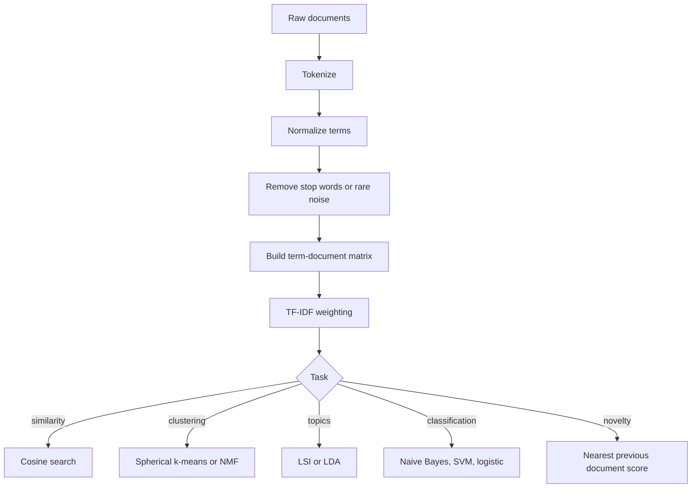

# Mining Text Data

Text mining transforms unstructured language into analyzable representations for similarity search, clustering, topic modeling, classification, novelty detection, and other data mining tasks. Aggarwal's text chapter covers document preparation, text similarity, specialized clustering, topic modeling, classification, and first-story detection. The central representation is usually the sparse term-document matrix, but the best weighting and reduction choices depend on the task.

This page focuses on classic data-mining text methods: tokenization, TF-IDF, cosine similarity, latent semantic indexing, topic models, text clustering, text classification, and novelty detection.

## Definitions

A **document-term matrix** has rows as documents and columns as terms. Entry $(i,j)$ stores a count or weight of term $j$ in document $i$.

**Term frequency (TF)** measures how often a term appears in a document. It may be raw count, binary presence, or log-scaled count.

**Inverse document frequency (IDF)** downweights terms that appear in many documents:

$$
\mathrm{idf}(t)=\log\frac{N}{df(t)},
$$

where $N$ is the number of documents and $df(t)$ is the number of documents containing term $t$. Implementations often use smoothing.

**TF-IDF** multiplies a term's within-document frequency by its inverse document frequency.

**Cosine similarity** is the standard similarity for TF-IDF vectors because it reduces the effect of document length.

**Latent semantic indexing (LSI)** applies truncated SVD to a term-document matrix, mapping documents into a lower-dimensional latent space.

**Topic modeling** represents documents as mixtures of latent topics and topics as distributions over words. Latent Dirichlet allocation (LDA) is a standard probabilistic topic model.

**Novelty or first-story detection** identifies documents that discuss events not already seen in the stream.

## Key results

**Bag-of-words loses order but gains tractability.** Many text mining methods ignore word order and grammar, representing each document by token counts. This is crude linguistically but effective for topical similarity and classification.

**TF-IDF balances local and global evidence.** A term repeated in a document is locally important, but a term appearing in almost every document is not very discriminative. TF-IDF encodes this tradeoff.

**Cosine similarity and length normalization are essential.** Without normalization, long documents appear similar to many documents simply because they contain more terms.

**SVD/LSI captures correlated terms.** If "car" and "automobile" occur in similar document contexts, a low-rank representation can place related documents closer even when exact words differ.

**Topic models provide soft structure.** A document may be 70 percent sports and 30 percent politics. This is more realistic than forcing each document into one topic cluster.

**Text classification often uses simple linear models well.** Naive Bayes, logistic regression, and linear SVMs are strong baselines for sparse high-dimensional text.

**Text preprocessing is domain-specific.** Lowercasing, stemming, stop-word removal, phrase detection, and rare-term filtering are not universally good or bad. In topic discovery, stop words usually obscure themes. In authorship or sentiment analysis, function words and punctuation may carry signal. In product search, exact model numbers and rare proper nouns can be critical. The preprocessing pipeline should be evaluated against the task, not copied blindly.

**Vocabulary drift is common in streams and web corpora.** New names, hashtags, products, and events appear continuously. A fixed vocabulary makes models stable but may miss emerging topics. Updating the vocabulary improves coverage but changes feature meanings over time. For novelty detection and first-story detection, this drift is part of the signal; for classification, it is a deployment challenge that requires monitoring.

**Sparse linear algebra is part of the method.** Text matrices often contain millions of possible terms but only a small number per document. Efficient mining uses sparse storage, sparse dot products, and algorithms that do not densify the matrix accidentally. A pipeline that converts TF-IDF to a dense array may fail long before the learning algorithm becomes the bottleneck.

**Evaluation should match reading behavior.** Search cares about top-ranked relevance; classification may care about macro-F1 across rare categories; topic modeling may care about interpretability; novelty detection may care about the first alert for an event. A single accuracy-like number rarely captures whether the text-mining system is useful.

## Visual



| Representation | What it captures | Strength | Caution |
|---|---|---|---|
| Raw counts | Term frequency | Simple and sparse | Length bias |
| Binary terms | Presence only | Robust for short text | Loses repetition |
| TF-IDF | Local frequency and rarity | Strong retrieval baseline | IDF must be fitted on training corpus |
| LSI/SVD | Low-rank semantic factors | Handles synonymy partly | Components are not always interpretable |
| Topic model | Mixture of topics | Soft thematic summaries | Needs topic count and validation |
| N-grams | Local word order | Phrases and style | Higher dimensionality |

## Worked example 1: TF-IDF and cosine similarity

**Problem.** Compute simple TF-IDF weights for three documents:

```text
D1: data mining data
D2: data science
D3: cooking recipe
```

Use raw term frequency and $\mathrm{idf}(t)=\log(N/df(t))$ with $N=3$. Compare D1 and D2.

**Method.**

1. Document frequencies:
   - data appears in D1 and D2 -> $df=2$.
   - mining appears in D1 -> $df=1$.
   - science appears in D2 -> $df=1$.
   - cooking and recipe appear in D3 -> $df=1$.

2. IDF values:

$$
idf(data)=\log(3/2)=0.405,\quad idf(mining)=idf(science)=\log(3)=1.099.
$$

3. D1 TF-IDF:
   - data count 2 -> $2\cdot0.405=0.810$.
   - mining count 1 -> $1.099$.

4. D2 TF-IDF:
   - data count 1 -> $0.405$.
   - science count 1 -> $1.099$.

5. Dot product between D1 and D2 uses shared term data only:

$$
0.810\cdot0.405=0.328.
$$

6. Norms:

$$
\|D1\|=\sqrt{0.810^2+1.099^2}=1.365,
$$

$$
\|D2\|=\sqrt{0.405^2+1.099^2}=1.171.
$$

7. Cosine similarity:

$$
\frac{0.328}{1.365\cdot1.171}=0.205.
$$

**Checked answer.** D1 and D2 are somewhat related because both contain "data", but the similarity is modest because their distinctive terms differ.

## Worked example 2: One LDA-style topic mixture interpretation

**Problem.** A topic model has two topics:

| word | topic 1 | topic 2 |
|---|---:|---:|
| goal | 0.30 | 0.01 |
| team | 0.25 | 0.02 |
| vote | 0.01 | 0.25 |
| policy | 0.02 | 0.30 |

A document contains `team goal policy`. Compare topic likelihoods under a simple equal-mixture check.

**Method.**

1. Topic 1 word-product score:

$$
0.25\cdot0.30\cdot0.02=0.0015.
$$

2. Topic 2 word-product score:

$$
0.02\cdot0.01\cdot0.30=0.00006.
$$

3. Topic 1 is much larger because two of the three words are sports-like.

4. The word `policy` still gives some topic 2 evidence, so a mixed membership is plausible.

**Checked answer.** The document is mostly topic 1 by this simple calculation, with a small topic 2 component due to `policy`. A real LDA inference procedure would infer a full mixture rather than using this crude product alone.

## Code

Pseudocode for TF-IDF text classification:

```text
INPUT: raw documents and labels
OUTPUT: text classifier

split documents into training and test sets
fit tokenizer and vocabulary on training documents
compute TF-IDF weights for training documents
train a linear classifier
transform test documents using the same vocabulary and IDF
evaluate predictions
```

```python
from sklearn.cluster import KMeans
from sklearn.decomposition import TruncatedSVD
from sklearn.feature_extraction.text import TfidfVectorizer
from sklearn.metrics.pairwise import cosine_similarity
from sklearn.pipeline import Pipeline
from sklearn.svm import LinearSVC

docs = [
    "data mining discovers patterns in data",
    "machine learning and data science",
    "fresh cooking recipe with vegetables",
    "football team scored a goal",
]
labels = ["tech", "tech", "food", "sports"]

tfidf = TfidfVectorizer(stop_words="english")
X = tfidf.fit_transform(docs)
print("cosine")
print(cosine_similarity(X).round(3))

lsi = TruncatedSVD(n_components=2, random_state=0)
print("lsi coordinates")
print(lsi.fit_transform(X).round(3))

clf = Pipeline([("tfidf", TfidfVectorizer(stop_words="english")), ("svm", LinearSVC())])
clf.fit(docs, labels)
print(clf.predict(["data patterns and learning"]))
print(KMeans(n_clusters=2, n_init=10, random_state=0).fit_predict(X))
```

## Common pitfalls

- Fitting TF-IDF on the full corpus before train-test splitting.
- Removing rare terms that are important labels, product names, or event markers.
- Forgetting document length normalization when using count vectors.
- Treating topic numbers as ground truth categories without interpretation.
- Evaluating topic models only by mathematical fit and not by human usefulness.
- Using cosine similarity on raw counts when common terms dominate.
- Ignoring time in novelty detection; a document can be old topically but new as an event.

## Connections

- [Similarity and Distances](/cs/data-mining/chapter-03-similarity-distances)
- [Feature Selection and Dimensionality Reduction](/cs/data-mining/chapter-02-feature-selection-dimensionality-reduction)
- [Data Classification](/cs/data-mining/chapter-10-data-classification)
- [Mining Data Streams and Big Data](/cs/data-mining/chapter-12-mining-data-streams)
- [Mining Web Data and Recommenders](/cs/data-mining/chapter-18-mining-web-data)
