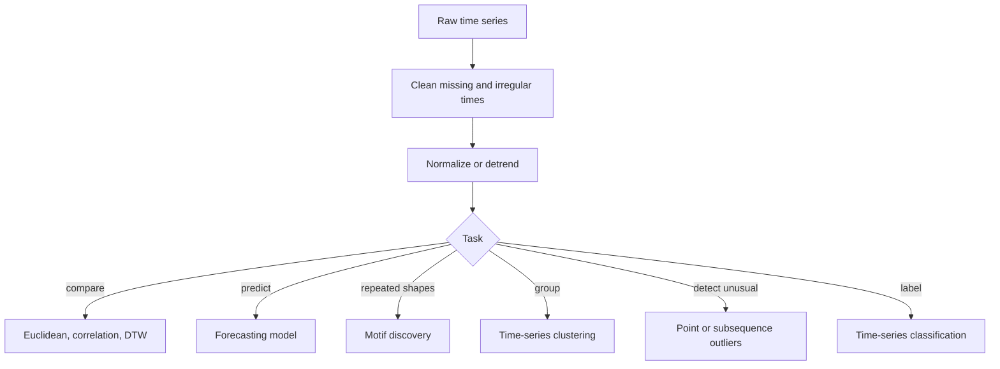

# Mining Time Series Data

Time series mining studies ordered numeric observations such as sensor readings, stock prices, demand curves, medical signals, click rates, and weather measurements. Aggarwal's time-series chapter covers preparation and similarity, forecasting, motifs, clustering, outlier detection, and classification. The key difference from ordinary vector data is that order matters: shifts, trends, seasonality, autocorrelation, and local shape all affect the analysis.


*Figure: The Iris scatterplot makes feature spaces and class separation visible. Image: [Wikimedia Commons](https://commons.wikimedia.org/wiki/File:Iris_dataset_scatterplot.svg), Nicoguaro, CC BY 4.0.*

This page focuses on the major tasks and representations: smoothing, normalization, windowing, dynamic time warping, forecasting, motif discovery, clustering, anomaly detection, and classification.

## Definitions

A **time series** is an ordered sequence

$$
X=(x_1,x_2,\dots,x_T),
$$

where $x_t$ is observed at time $t$.

A **subsequence** or **window** of length $w$ is

$$
X_{a:a+w-1}=(x_a,\dots,x_{a+w-1}).
$$

**Autocorrelation** measures correlation between a series and a lagged version of itself.

**Normalization** for time series often means z-normalizing a sequence or window:

$$
z_t=\frac{x_t-\mu_X}{\sigma_X}.
$$

**Dynamic time warping (DTW)** compares two series by finding a minimum-cost monotone alignment path through their time indices.

**Forecasting** predicts future values $x_{T+1},x_{T+2},\dots$ from past observations.

A **motif** is a repeated subsequence pattern in a time series or across many series.

A **time-series outlier** may be a point anomaly, subsequence anomaly, contextual anomaly, or entire anomalous series.

## Key results

**Time-series preparation must separate level, scale, and shape.** Two users may show the same daily pattern at different absolute activity levels. Z-normalizing windows can reveal shape similarity, but it removes magnitude information that may be important.

**DTW handles local speed variation.** If one series performs the same rise-and-fall pattern more slowly, Euclidean distance aligns time index to time index and may overstate dissimilarity. DTW can align one point with multiple points.

**Forecasting depends on temporal dependence.** Moving averages use recent history; autoregressive models use lagged values; exponential smoothing discounts older observations; more complex models handle trend and seasonality.

**Motif discovery often uses subsequence search.** A repeated shape can indicate a normal cycle, a repeated fault, or a behavioral signature. Efficient motif discovery avoids comparing every pair of windows naively when possible.

**Time-series clustering has several meanings.** One can cluster whole series, subsequences, or time points. The distance measure and normalization define the result.

**Streaming time series need online summaries.** Long or continuous series may require incremental statistics, sketches, or windows rather than storing all observations.

**The unit of analysis must be explicit.** A time-series project may classify whole series, forecast the next value of one series, cluster short windows, detect single-point spikes, or find unusual subsequences. These are different tasks with different train-test splits and leakage risks. For example, randomly splitting overlapping windows from the same long series can put nearly identical windows in both train and test sets, making performance look much better than it will be on future data.

**Seasonality and trend can masquerade as patterns.** A repeated daily cycle may dominate Euclidean similarity; an upward trend may make old normal values look anomalous; a weekly seasonal drop may look like a fault if the model ignores calendar context. Detrending, seasonal adjustment, contextual features, and time-aware validation are often required before applying generic clustering, classification, or outlier methods.

**Forecasting and anomaly detection interact.** One common anomaly score is the forecast residual: observed value minus predicted value. This means the anomaly detector inherits the strengths and weaknesses of the forecasting model. A poor model can create false alarms, while an overly flexible model can explain away real anomalies. Residual-based detection should therefore validate both forecast accuracy and alert quality.

**Motif discovery should handle trivial matches.** Overlapping windows from almost the same location in a series are naturally similar and can dominate the nearest-neighbor list. Many motif algorithms exclude trivial matches within a small temporal neighborhood so the discovered motifs represent repeated behavior rather than the same event shifted by one time step.

**Time-series features should be computed causally for prediction.** A centered moving average, future-normalized window, or decomposition fitted on the whole series may use information from the future. That is acceptable for retrospective description but invalid for forecasting or online classification. For deployed prediction, every feature at time $t$ must use only information available at or before time $t$.

**Multiple related series add hierarchy.** Retail demand may be measured by item, store, and region; sensors may be grouped by machine and factory. Mining each series independently ignores shared structure, while pooling all series can hide local behavior. Hierarchical or grouped evaluation helps decide whether patterns generalize across related series.

**Missing timestamps are not ordinary missing values.** A missing sensor reading may mean no measurement, device failure, communication delay, or zero activity depending on the system. Imputation should preserve that distinction when possible, often with explicit missingness indicators or gap-length features.

## Visual



```text
Euclidean alignment:       DTW alignment:

X: x1  x2  x3  x4          X: x1  x2      x3  x4
   |   |   |   |              |   | \     |   |
Y: y1  y2  y3  y4          Y: y1  y2  y3  y4  y5

Euclidean forces same index. DTW allows local stretching.
```

## Worked example 1: Z-normalized window comparison

**Problem.** Compare two windows:

$$
X=(2,4,6),\quad Y=(10,20,30).
$$

Compute Euclidean distance before and after z-normalization.

**Method.**

1. Raw Euclidean distance:

$$
\sqrt{(2-10)^2+(4-20)^2+(6-30)^2}
=\sqrt{64+256+576}
=\sqrt{896}=29.933.
$$

2. Normalize $X$. Mean is $4$. Population standard deviation is

$$
\sqrt{\frac{(2-4)^2+(4-4)^2+(6-4)^2}{3}}
=\sqrt{8/3}=1.633.
$$

   Therefore $X'=(-1.225,0,1.225)$.

3. Normalize $Y$. Mean is 20. Population standard deviation is

$$
\sqrt{\frac{100+0+100}{3}}=8.165.
$$

   Therefore $Y'=(-1.225,0,1.225)$.

4. Normalized Euclidean distance:

$$
\sqrt{0^2+0^2+0^2}=0.
$$

**Checked answer.** The raw distance is large, but the normalized shape distance is zero. The two windows have the same linear shape at different scales.

## Worked example 2: One-step moving average forecast

**Problem.** Given demand values

$$
20,\ 22,\ 21,\ 25,\ 27,
$$

forecast the next value using a 3-point moving average.

**Method.**

1. A 3-point moving average forecast uses the last three observations.
2. The last three values are 21, 25, and 27.
3. Average:

$$
\hat{x}_{6}=\frac{21+25+27}{3}=\frac{73}{3}=24.333.
$$

4. If the actual next value later turns out to be 26, absolute error is

$$
|26-24.333|=1.667.
$$

**Checked answer.** The forecast is approximately 24.33. This simple method smooths noise but lags behind upward trends.

## Code

Pseudocode for DTW distance:

```text
INPUT: series X of length m, series Y of length n
OUTPUT: DTW distance

create matrix D with infinity
D[0,0] = 0
for i from 1 to m:
    for j from 1 to n:
        cost = abs(X[i] - Y[j])
        D[i,j] = cost + min(D[i-1,j], D[i,j-1], D[i-1,j-1])
return D[m,n]
```

```python
import numpy as np
from sklearn.cluster import KMeans

def dtw_distance(x, y):
    x = np.asarray(x, dtype=float)
    y = np.asarray(y, dtype=float)
    d = np.full((len(x) + 1, len(y) + 1), np.inf)
    d[0, 0] = 0.0
    for i in range(1, len(x) + 1):
        for j in range(1, len(y) + 1):
            cost = abs(x[i - 1] - y[j - 1])
            d[i, j] = cost + min(d[i - 1, j], d[i, j - 1], d[i - 1, j - 1])
    return d[-1, -1]

series = np.array([20, 22, 21, 25, 27], dtype=float)
forecast = series[-3:].mean()
print("moving average forecast:", forecast)
print("dtw:", dtw_distance([1, 2, 3], [1, 1, 2, 3]))

windows = np.array([[2, 4, 6], [10, 20, 30], [6, 4, 2]], dtype=float)
windows_z = (windows - windows.mean(axis=1, keepdims=True)) / windows.std(axis=1, keepdims=True)
print(KMeans(n_clusters=2, n_init=10, random_state=0).fit_predict(windows_z))
```

## Common pitfalls

- Comparing raw series with different scales when shape is the real object of interest.
- Normalizing away magnitude when magnitude is the anomaly or target.
- Using Euclidean distance when patterns are phase-shifted or stretched.
- Letting DTW warp too freely without a window constraint.
- Mixing irregularly sampled series without resampling or time-aware models.
- Evaluating forecasts only in-sample rather than on future holdout periods.
- Treating overlapping subsequences as independent examples in validation.

## Connections

- [Similarity and Distances](/cs/data-mining/chapter-03-similarity-distances)
- [Mining Data Streams and Big Data](/cs/data-mining/chapter-12-mining-data-streams)
- [Outlier Analysis](/cs/data-mining/chapter-08-outlier-analysis)
- [Mining Discrete Sequences](/cs/data-mining/chapter-15-mining-discrete-sequences)
- [Mining Spatial and Trajectory Data](/cs/data-mining/chapter-16-mining-spatial-data)
