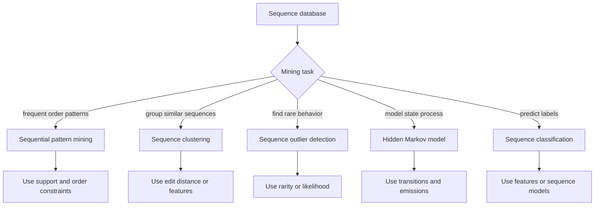

# Mining Discrete Sequences

Discrete sequence mining studies ordered symbolic data: click paths, purchase histories, DNA strings, event logs, user actions, command traces, and words at the token level. Aggarwal's sequence chapter covers sequential pattern mining, sequence clustering, outlier detection, hidden Markov models, and sequence classification. Unlike transaction mining, order is part of the pattern; unlike time series, values are symbols rather than continuous measurements.


*Figure: The Iris scatterplot makes feature spaces and class separation visible. Image: [Wikimedia Commons](https://commons.wikimedia.org/wiki/File:Iris_dataset_scatterplot.svg), Nicoguaro, CC BY 4.0.*

This page connects association mining, similarity measures, probabilistic models, and classification. The main challenge is deciding which forms of order matter: contiguous substrings, noncontiguous subsequences, edit operations, state transitions, or learned latent states.

## Definitions

A **sequence** is an ordered list of symbols:

$$
S=(s_1,s_2,\dots,s_T).
$$

A **subsequence** preserves order but not necessarily contiguity. For example, $(A,C)$ is a subsequence of $(A,B,C)$.

A **substring** or **contiguous subsequence** preserves order and contiguity. $(A,B)$ is a substring of $(A,B,C)$; $(A,C)$ is not.

**Sequential pattern mining** finds subsequences that occur in many sequences.

**Support** of a sequential pattern is the number or fraction of database sequences containing it.

**Edit distance** measures the minimum-cost edit operations required to transform one sequence into another.

A **hidden Markov model (HMM)** is a probabilistic sequence model with hidden states, transition probabilities between states, and emission probabilities from states to observed symbols.

**Sequence classification** predicts a label for an entire sequence, often using $k$-gram features, edit-distance nearest neighbors, HMM likelihoods, or discriminative models.

## Key results

**Sequential patterns generalize itemsets with order.** In transaction mining, \{A,B\} ignores order. In sequence mining, $(A,B)$ and $(B,A)$ are different patterns.

**Downward closure still helps.** If a sequence pattern is frequent, then all of its subsequences are frequent. If a pattern is infrequent, all supersequences are infrequent. This supports Apriori-like pruning for sequences.

**Edit distance supports noisy matching.** It is useful when insertions, deletions, or substitutions are natural, such as spelling variations, biological mutations, or optional user actions.

**HMMs summarize variable-length sequences.** An HMM can assign a likelihood to a sequence, infer likely hidden states, and support classification by choosing the class model with highest likelihood.

**Sequence clustering needs alignment or features.** One can cluster with edit distance, longest common subsequence similarity, HMM parameters, or $k$-gram vectors. Each choice captures different order structure.

**Outlier sequences may be globally rare or locally surprising.** A whole sequence can be unusual, or one transition within an otherwise normal sequence can be anomalous.

**Gap constraints and time constraints shape the meaning of a pattern.** The subsequence $(A,C)$ may be meaningful only if C occurs soon after A, or only if no disallowed event occurs between them. Web sessions, purchase histories, and biological sequences all use different notions of acceptable gaps. Adding minimum or maximum gap constraints can reduce candidate explosion and produce patterns that are easier to interpret.

**Feature-vector shortcuts are useful but lossy.** Turning sequences into $k$-gram counts allows standard classifiers and clustering algorithms to run quickly. However, it loses long-range order and may treat two sequences as similar even when the important event order differs. A good sequence-mining workflow often compares a feature-vector baseline with an order-sensitive method such as edit distance, sequential patterns, or HMM likelihoods.

**Sequence databases often have multiple levels.** A customer sequence may contain baskets, and each basket may contain several unordered items. A web session may contain page views with timestamps and dwell times. Choosing whether the pattern elements are single symbols, itemsets, or timed events changes the support definition and the algorithms that apply.

**Alphabet size controls difficulty.** A small alphabet makes long repeated patterns more likely and easier to count. A huge alphabet, such as product IDs or URLs, creates sparse sequences where exact repeats are rare. Grouping symbols, using taxonomies, or mining at multiple abstraction levels can make sequence patterns more robust and interpretable.

**Session boundaries change sequence meaning.** A purchase sequence split by month may reveal different behavior than one split by visit. Boundary rules should match the process being modeled, not just convenient storage batches.

**Repeated symbols need careful handling.** A sequence such as $(A,A,B)$ can mean two separate actions or one repeated state. Counting rules should preserve that distinction when repetition is meaningful.

## Visual



| Representation | Captures | Good for | Caution |
|---|---|---|---|
| Full sequence | Complete order | Edit distance, HMMs | Costly for long sequences |
| $k$-grams | Local contiguous patterns | Classification, clustering | Loses long-range order |
| Subsequences | Ordered but not contiguous | Pattern mining | Many candidates |
| Transition matrix | Adjacent dynamics | Markov models | Ignores long memory |
| HMM states | Latent phases | Noisy variable sequences | Model selection needed |

## Worked example 1: Sequential support

**Problem.** Given sequences:

$$
S_1=(A,B,C,D),\quad S_2=(A,C,B,D),\quad S_3=(B,A,C).
$$

Compute support count of patterns $(A,C)$ and $(C,A)$.

**Method.**

1. Pattern $(A,C)$ is contained in a sequence if A appears before C.
2. In $S_1=(A,B,C,D)$, A appears at position 1 and C at position 3 -> contains $(A,C)$.
3. In $S_2=(A,C,B,D)$, A position 1 and C position 2 -> contains $(A,C)$.
4. In $S_3=(B,A,C)$, A position 2 and C position 3 -> contains $(A,C)$.
5. Support count of $(A,C)$ is 3.

6. Pattern $(C,A)$ requires C before A.
7. In $S_1$, C is after A -> no.
8. In $S_2$, C is after A -> no.
9. In $S_3$, C is after A -> no.
10. Support count of $(C,A)$ is 0.

**Checked answer.** $(A,C)$ has support 3, while $(C,A)$ has support 0. Same symbols, different order, different pattern.

## Worked example 2: HMM sequence likelihood

**Problem.** A two-state HMM has states Rainy (R) and Sunny (S). Initial probabilities are $P(R)=0.6$, $P(S)=0.4$. Transition probabilities:

| from/to | R | S |
|---|---:|---:|
| R | 0.7 | 0.3 |
| S | 0.4 | 0.6 |

Emission probabilities for observation `walk`:

$$
P(walk\mid R)=0.1,\quad P(walk\mid S)=0.6.
$$

Compute probability of observing `walk, walk` by summing over hidden paths.

**Method.**

1. Hidden paths of length 2 are RR, RS, SR, SS.
2. RR contribution:

$$
0.6\cdot0.1\cdot0.7\cdot0.1=0.0042.
$$

3. RS contribution:

$$
0.6\cdot0.1\cdot0.3\cdot0.6=0.0108.
$$

4. SR contribution:

$$
0.4\cdot0.6\cdot0.4\cdot0.1=0.0096.
$$

5. SS contribution:

$$
0.4\cdot0.6\cdot0.6\cdot0.6=0.0864.
$$

6. Sum:

$$
0.0042+0.0108+0.0096+0.0864=0.111.
$$

**Checked answer.** The observation likelihood is 0.111. The SS path contributes most because `walk` is much more likely under Sunny.

## Code

Pseudocode for Apriori-style sequential pattern mining:

```text
INPUT: sequence database D, minimum support sigma
OUTPUT: frequent sequences

F1 = frequent one-symbol sequences
k = 2
while F(k-1) is not empty:
    generate length-k candidate sequences from F(k-1)
    prune candidates with infrequent subsequences
    count how many database sequences contain each candidate
    Fk = candidates with support at least sigma
    k = k + 1
return union of Fk
```

```python
from itertools import combinations

sequences = [
    ("A", "B", "C", "D"),
    ("A", "C", "B", "D"),
    ("B", "A", "C"),
]

def contains_subsequence(seq, pattern):
    it = iter(seq)
    return all(symbol in it for symbol in pattern)

def support(pattern):
    return sum(contains_subsequence(seq, pattern) for seq in sequences)

symbols = sorted(set().union(*map(set, sequences)))
patterns = []
for length in [1, 2, 3]:
    for pattern in combinations(symbols, length):
        s = support(pattern)
        if s >= 2:
            patterns.append((pattern, s))

print(patterns)

def forward_walk_walk():
    pi = {"R": 0.6, "S": 0.4}
    trans = {("R", "R"): 0.7, ("R", "S"): 0.3, ("S", "R"): 0.4, ("S", "S"): 0.6}
    emit_walk = {"R": 0.1, "S": 0.6}
    total = 0.0
    for a in "RS":
        for b in "RS":
            total += pi[a] * emit_walk[a] * trans[(a, b)] * emit_walk[b]
    return total

print(round(forward_walk_walk(), 3))
```

## Common pitfalls

- Confusing itemsets with sequences and accidentally ignoring order.
- Treating subsequences and substrings as the same concept.
- Letting sequential pattern candidates explode without pruning or constraints.
- Using edit distance when substitutions, insertions, and deletions should not have equal cost.
- Choosing HMM state counts without validation.
- Training sequence classifiers on overlapping windows and testing on nearby overlapping windows from the same original sequence.
- Ignoring time gaps between events when gaps carry meaning.

## Connections

- [Association Pattern Mining](/cs/data-mining/chapter-04-association-pattern-mining)
- [Advanced Association Patterns](/cs/data-mining/chapter-05-advanced-association-patterns)
- [Similarity and Distances](/cs/data-mining/chapter-03-similarity-distances)
- [Mining Time Series Data](/cs/data-mining/chapter-14-mining-time-series-data)
- [Mining Web Data and Recommenders](/cs/data-mining/chapter-18-mining-web-data)
