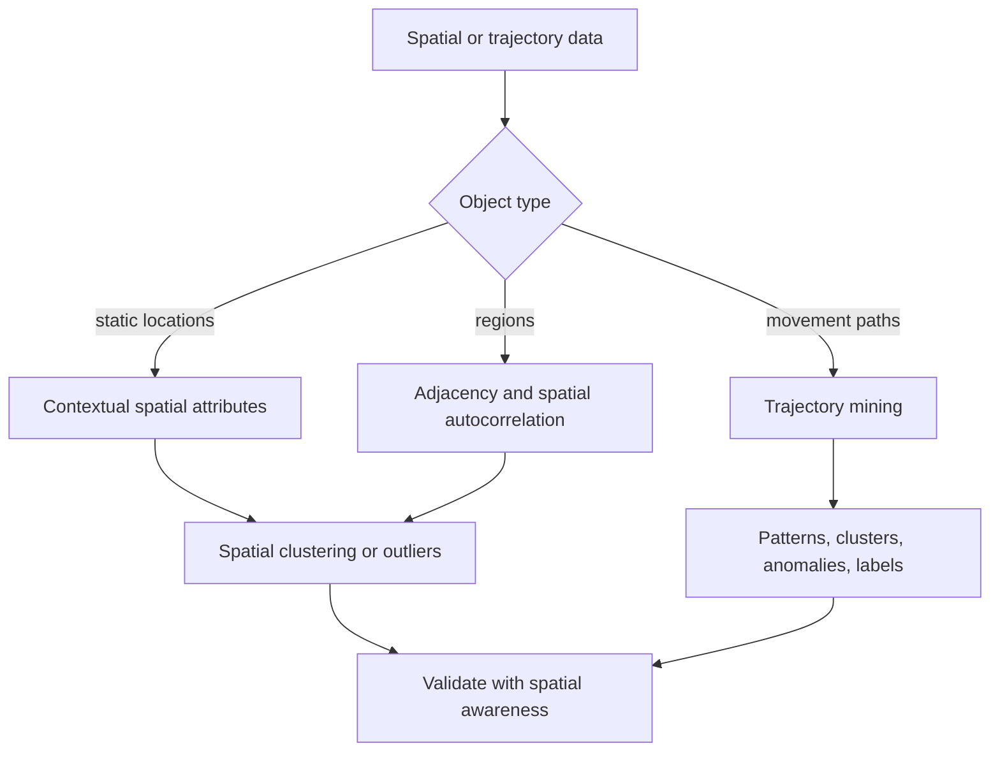

# Mining Spatial and Trajectory Data

Spatial data mining studies objects with location, geometry, distance, neighborhood, and regional context. Aggarwal's spatial chapter covers mining with contextual spatial attributes and trajectory mining. Spatial data sits between multidimensional mining and graph/time-series mining: a point has numeric coordinates, but its meaning often depends on nearby objects, regions, paths, and movement through space.

This page covers spatial context, spatial autocorrelation, spatial clustering, spatial outlier detection, trajectory pattern mining, trajectory clustering, trajectory outlier detection, and trajectory classification.

## Definitions

A **spatial object** has geometric information such as a point, line, polygon, raster cell, or region.

A **spatial attribute** is a feature tied to location. Examples include population density, elevation, pollution, store revenue, and temperature.

**Spatial autocorrelation** means nearby locations tend to have related values. Positive autocorrelation occurs when nearby values are similar; negative autocorrelation occurs when nearby values differ systematically.

A **neighborhood relation** defines which objects influence each other. It may use distance radius, $k$ nearest neighbors, adjacency of regions, or road-network distance.

A **trajectory** is an ordered sequence of spatial positions:

$$
T=((x_1,y_1,t_1),\dots,(x_m,y_m,t_m)).
$$

**Trajectory mining** analyzes movement paths for patterns, clusters, outliers, or labels.

**Map matching** aligns raw location observations to a road network or other spatial network.

**Trajectory similarity** may use pointwise distance, longest common subsequence, edit-distance variants, dynamic time warping, or route-overlap measures.

## Key results

**Spatial context changes feature meaning.** A high crime count may be expected in a dense downtown region and unusual in a small residential region. Spatial mining often needs contextual normalization.

**Nearby observations are not independent.** Standard validation assumptions can fail when train and test sets contain neighboring locations. Spatial cross-validation should separate regions when testing generalization to new areas.

**Spatial outliers are often local.** A location may be globally ordinary but locally anomalous relative to its neighbors. A temperature of 30 degrees may be normal in summer overall but unusual if surrounding sensors report 20.

**Trajectory mining combines order and geometry.** A trajectory is not just a set of coordinates. Direction, speed, stops, turns, and time gaps can be essential.

**Trajectory simplification can reduce noise.** GPS traces may contain many redundant points. Simplification keeps shape-defining points, reducing cost before clustering or classification.

**Road-network distance may matter more than Euclidean distance.** Two points separated by a river, wall, or road network may be close geometrically but far in travel time.

**Spatial scale controls what counts as local.** A neighborhood radius of 100 meters might detect building-level anomalies, while 10 kilometers might detect city-level regions. The same point can be normal at one scale and unusual at another. Multi-scale analysis is common in spatial mining because geographic processes such as traffic, disease, weather, and retail demand operate at different resolutions.

**Trajectory data usually need event extraction.** Raw GPS points are often too noisy and dense for direct mining. Analysts may extract stops, moves, road segments, turns, speeds, and dwell times before clustering or classification. This converts a numeric path into a richer sequence of movement events, but it also introduces parameters such as stop-duration thresholds and map-matching confidence.

**Spatial joins are often the expensive step.** Many spatial mining tasks start by connecting points to regions, sensors to nearby sensors, trips to roads, or events to neighborhoods. Indexes such as grids, R-trees, and geohashes are therefore not just database details; they determine whether the mining workflow can run at the required scale.

**Boundary effects require care.** A point near the edge of the study region has fewer observed neighbors, not necessarily fewer real neighbors. Local density and local outlier scores can be biased at borders unless the analysis accounts for the observation window.

**Coordinate reference systems matter.** Distances, areas, and angles depend on projection. A method that is correct for planar coordinates can be wrong on latitude-longitude pairs if the study region is large. Spatial mining should record the coordinate system, projection, and distance function before interpreting numeric distances.

**Privacy is often spatial too.** Trajectories and home-work patterns can identify people even after names are removed. Aggregation, spatial masking, and minimum-count rules may be needed before publishing maps or mined mobility patterns.

**Visualization is useful but can mislead.** Map projections, marker sizes, overplotting, and color scales can create apparent clusters or hide sparse anomalies. Spatial mining should pair maps with quantitative checks.

**Temporal context often matters for spatial data.** A location pattern during rush hour, a storm, or a holiday may be normal only within that temporal context. Spatial and time-series preparation frequently need to be combined.

## Visual



```text
Trajectory example

t1       t2       t3       t4
* ------ * ------ * -----> *
 \                         road B
  \ 
   * ------ *              road A

The same points may be close in Euclidean space but different as routes.
```

| Task | Static spatial version | Trajectory version |
|---|---|---|
| Similarity | Distance or neighbor context | Route, shape, timing similarity |
| Clustering | Group nearby similar locations | Group similar movement paths |
| Outlier detection | Local deviation from neighbors | Unusual route, stop, speed, or segment |
| Classification | Predict region label | Predict trip purpose or object type |
| Pattern mining | Co-located events | Frequent routes or movement motifs |

## Worked example 1: Local spatial outlier score

**Problem.** Four sensors report temperature:

| sensor | location | value |
|---|---|---:|
| A | center | 20 |
| B | near A | 21 |
| C | near A | 19 |
| D | near A | 35 |

Use the difference between a sensor value and the mean of its three neighbors as a local outlier score. Compute the score for D and A.

**Method.**

1. For D, neighbors are A, B, and C with values 20, 21, and 19.
2. Neighbor mean:

$$
\bar{x}_{N(D)}=\frac{20+21+19}{3}=20.
$$

3. D's absolute local deviation:

$$
|35-20|=15.
$$

4. For A, neighbors are B, C, and D with values 21, 19, and 35.
5. Neighbor mean:

$$
\bar{x}_{N(A)}=\frac{21+19+35}{3}=25.
$$

6. A's absolute local deviation:

$$
|20-25|=5.
$$

**Checked answer.** D has a larger local anomaly score, 15 versus 5. The result also shows a pitfall: if an outlier is included as a neighbor, it can distort other local scores.

## Worked example 2: Trajectory simplification by perpendicular distance

**Problem.** A trajectory has points

$$
P_1=(0,0),\quad P_2=(1,0.1),\quad P_3=(2,0),\quad P_4=(3,3).
$$

If we approximate the first three points by line segment $P_1P_3$, should $P_2$ be kept when tolerance is 0.2?

**Method.**

1. Segment $P_1P_3$ lies on the x-axis from $(0,0)$ to $(2,0)$.
2. The perpendicular distance from $P_2=(1,0.1)$ to the x-axis is $0.1$.
3. Compare with tolerance:

$$
0.1 \le 0.2.
$$

4. Therefore $P_2$ can be removed without exceeding the tolerance for this segment.
5. Point $P_4=(3,3)$ cannot be represented by the same segment without a much larger deviation, so it should be kept as a shape-changing point.

**Checked answer.** Remove $P_2$ under tolerance 0.2; keep $P_1$, $P_3$, and $P_4$ for the simplified trajectory.

## Code

Pseudocode for local spatial outlier detection:

```text
INPUT: spatial points with values, neighbor rule N
OUTPUT: local outlier scores

for each point i:
    neighbors = N(i)
    expected = average value among neighbors
    score[i] = abs(value[i] - expected)
rank points by descending score
return scores
```

```python
import numpy as np
from sklearn.cluster import DBSCAN
from sklearn.neighbors import NearestNeighbors

coords = np.array([[0, 0], [0, 1], [1, 0], [10, 10]], dtype=float)
values = np.array([20, 21, 19, 35], dtype=float)

nn = NearestNeighbors(n_neighbors=3).fit(coords)
dist, ind = nn.kneighbors(coords)
scores = []
for i, neighbors in enumerate(ind):
    # first neighbor is the point itself; skip it
    neigh = [j for j in neighbors if j != i]
    expected = values[neigh].mean()
    scores.append(abs(values[i] - expected))
print("local scores:", np.round(scores, 3))

trajectory_points = np.array([[0, 0], [1, 0.1], [2, 0], [3, 3]], dtype=float)
route_clusters = DBSCAN(eps=1.5, min_samples=2).fit_predict(trajectory_points)
print("point-level spatial clusters:", route_clusters)
```

## Common pitfalls

- Treating latitude and longitude as ordinary Euclidean coordinates over large areas.
- Ignoring road-network or barrier effects when travel distance matters.
- Randomly splitting nearby spatial points into train and test sets, causing optimistic evaluation.
- Removing "noisy" GPS points that are actually meaningful stops or turns.
- Comparing trajectories only by start and end points.
- Forgetting that local spatial outliers can be hidden by global statistics.
- Using a single spatial scale when patterns exist at multiple scales.

## Connections

- [Mining Time Series Data](/cs/data-mining/chapter-14-mining-time-series-data)
- [Mining Discrete Sequences](/cs/data-mining/chapter-15-mining-discrete-sequences)
- [Similarity and Distances](/cs/data-mining/chapter-03-similarity-distances)
- [Cluster Analysis](/cs/data-mining/chapter-06-cluster-analysis)
- [Outlier Analysis](/cs/data-mining/chapter-08-outlier-analysis)
