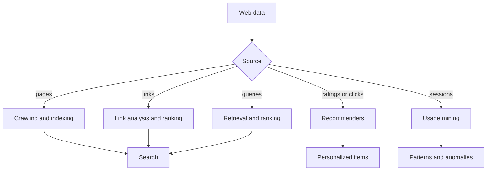

# Mining Web Data and Recommenders

Web mining studies documents, links, queries, user behavior, and recommender interactions on the web. Aggarwal's web chapter covers crawling and resource discovery, search engine indexing and query processing, ranking algorithms, recommender systems, and web usage mining. Web data combines text, graphs, streams, sequences, and large-scale systems, so it acts as a practical synthesis of many earlier chapters.


*Figure: Skip-gram training ties word meaning to surrounding context. Image: [Wikimedia Commons](https://commons.wikimedia.org/wiki/File:Word_embeddings_Skip-gram.svg), Jeran Renz, CC BY-SA 4.0.*

This page focuses on crawling, inverted indexes, link analysis, PageRank-style ranking, collaborative filtering, content-based recommendation, and web usage patterns.

## Definitions

A **web crawler** discovers pages by fetching URLs and following links under politeness and priority rules.

An **inverted index** maps terms to postings lists of documents containing those terms. It is the core data structure for search.

**Query processing** retrieves and ranks documents matching a user's query.

**Link analysis** uses hyperlinks as graph structure. A page linked by many important pages may itself be important.

**PageRank** defines a random-surfer stationary score. In simplified form,

$$
r = \alpha P^\top r + (1-\alpha)v,
$$

where $P$ is a transition matrix, $\alpha$ is a damping factor, and $v$ is a teleport distribution.

A **recommender system** predicts items a user may like. Collaborative filtering uses user-item behavior; content-based recommendation uses item or user features.

**Web usage mining** analyzes clickstreams, sessions, visits, paths, and conversions.

## Key results

**Crawling is a scheduling problem.** A crawler cannot fetch the whole web instantly. It must prioritize URLs, avoid traps, respect robots and politeness policies, refresh changing pages, and manage duplicates.

**Inverted indexes make search feasible.** Instead of scanning every document for every query, the engine intersects or scores postings lists for query terms.

**Ranking combines content and authority.** Text relevance alone can be manipulated or ambiguous. Link structure, freshness, user behavior, and personalization can adjust ranking.

**PageRank is an eigenvector-like centrality.** A page receives rank from pages linking to it, weighted by their own rank and outgoing degree. Teleportation prevents sinks and disconnected components from trapping all probability.

**Collaborative filtering uses interaction patterns.** Users with similar histories may receive similar recommendations, and items liked by similar users become candidates. Matrix factorization embeds users and items into a shared latent space.

**Web usage mining is sequence mining at scale.** A session is an ordered sequence of page visits. Frequent paths, drop-off points, and anomalous access patterns support site design, personalization, and security.

**Search and recommendation optimize different interactions.** Search starts with an explicit query and ranks documents for immediate relevance. Recommendation often starts without a query and predicts what a user may want next. Search relies heavily on text matching, indexing, and ranking signals; recommenders rely heavily on user-item interaction matrices, session context, and personalization. Web applications often combine both, such as search results reranked by personalization or recommendations constrained by content relevance.

**Temporal evaluation is critical on the web.** Pages change, links disappear, trends shift, and users adapt. A recommender evaluated by random train-test splits may accidentally train on future interactions. A ranking method evaluated on stale judgments may miss freshness. Web mining experiments should preserve time order when the deployment task is future prediction.

**Sessionization affects usage mining.** A single user may visit a site multiple times per day, share a device, block cookies, or switch devices. Common timeout rules, such as ending a session after inactivity, are approximations. Frequent path mining and conversion analysis can change substantially if sessions are split too aggressively or merged too broadly.

**Feedback loops are real.** A recommender changes what users see, which changes what they click, which changes future training data. Popular items may become more popular because they are recommended more often. Exploration, randomization, and careful offline evaluation help distinguish true preference from exposure bias.

**Crawling and indexing have quality controls.** Duplicate detection, canonical URLs, language detection, spam filtering, and freshness policies affect every downstream ranking result. A ranking algorithm cannot recover documents that were never crawled or terms that were parsed incorrectly. Web mining therefore treats acquisition and indexing as part of the mining pipeline.

**Cold start requires hybrid signals.** A new page has no links, a new item has no ratings, and a new user has no history. Content features, popularity priors, onboarding questions, demographic context, or exploration policies are commonly combined with collaborative signals to handle these cases.

**Bots and crawlers distort usage data.** Web logs often mix human sessions with automated traffic. Filtering or modeling this traffic is necessary before interpreting path patterns, conversion rates, or anomaly alerts.

**Query intent is heterogeneous.** Navigational, informational, and transactional queries should not always be judged by the same ranking signals. Web mining systems often segment intent before evaluation.

## Visual



| Component | Data structure | Mining task | Typical issue |
|---|---|---|---|
| Search | Inverted index | Retrieve and rank documents | Vocabulary mismatch |
| Link analysis | Web graph | Authority ranking | Link spam, sinks |
| Recommenders | User-item matrix | Predict preference | Sparsity, cold start |
| Usage mining | Session sequences | Frequent paths, anomalies | Bot traffic, sessionization |
| Crawling | URL frontier | Resource discovery | Duplicate pages, politeness |

## Worked example 1: One PageRank iteration

**Problem.** Three pages A, B, C link as follows:

- A links to B and C.
- B links to C.
- C links to A.

Use damping $\alpha=0.85$ and uniform teleportation. Start with rank $(1/3,1/3,1/3)$. Compute one iteration.

**Method.**

1. Contributions from A: A has two outgoing links, so it gives $(1/3)/2=1/6$ to B and $1/6$ to C.
2. Contributions from B: B gives all $1/3$ to C.
3. Contributions from C: C gives all $1/3$ to A.
4. Link-following totals:

$$
A:1/3,\quad B:1/6,\quad C:1/6+1/3=1/2.
$$

5. Teleportation adds $(1-\alpha)/3=0.15/3=0.05$ to each page after damping:

$$
r_A'=0.85(1/3)+0.05=0.333,
$$

$$
r_B'=0.85(1/6)+0.05=0.192,
$$

$$
r_C'=0.85(1/2)+0.05=0.475.
$$

6. Check sum: $0.333+0.192+0.475=1.000$.

**Checked answer.** After one iteration, C has the largest rank because it receives links from both A and B.

## Worked example 2: User-based collaborative filtering

**Problem.** Predict user U1's rating for item I3 using two neighbors.

| user | I1 | I2 | I3 |
|---|---:|---:|---:|
| U1 | 5 | 4 | ? |
| U2 | 5 | 5 | 4 |
| U3 | 1 | 2 | 5 |

Use cosine similarity on co-rated items I1 and I2, then weighted average of I3 ratings.

**Method.**

1. Vectors on I1 and I2:

$$
U1=(5,4),\quad U2=(5,5),\quad U3=(1,2).
$$

2. Similarity U1-U2:

$$
\frac{5\cdot5+4\cdot5}{\sqrt{5^2+4^2}\sqrt{5^2+5^2}}
=\frac{45}{\sqrt{41}\sqrt{50}}=0.994.
$$

3. Similarity U1-U3:

$$
\frac{5\cdot1+4\cdot2}{\sqrt{41}\sqrt{5}}
=\frac{13}{14.318}=0.908.
$$

4. Weighted prediction:

$$
\hat{r}_{U1,I3}=\frac{0.994\cdot4+0.908\cdot5}{0.994+0.908}
=\frac{3.976+4.540}{1.902}=4.477.
$$

**Checked answer.** The predicted rating is about 4.48. In a real system, mean-centering and more neighbors would usually be used.

## Code

Pseudocode for user-based recommendation:

```text
INPUT: user-item rating matrix R, target user u, target item i
OUTPUT: predicted rating

find users who rated item i
compute similarity between u and each such user on co-rated items
select top k positive-similarity neighbors
return similarity-weighted average of neighbors' ratings for item i
```

```python
import numpy as np
import networkx as nx
from sklearn.metrics.pairwise import cosine_similarity

G = nx.DiGraph()
G.add_edges_from([("A", "B"), ("A", "C"), ("B", "C"), ("C", "A")])
print(nx.pagerank(G, alpha=0.85))

ratings = np.array(
    [
        [5.0, 4.0, np.nan],
        [5.0, 5.0, 4.0],
        [1.0, 2.0, 5.0],
    ]
)
target = ratings[0, :2].reshape(1, -1)
neighbors = ratings[1:, :2]
sim = cosine_similarity(target, neighbors).ravel()
item3 = ratings[1:, 2]
prediction = np.dot(sim, item3) / sim.sum()
print(round(prediction, 3))
```

## Common pitfalls

- Treating crawled pages as independent when link structure is central.
- Ignoring duplicate or near-duplicate pages in indexing and ranking.
- Using PageRank without handling dangling pages or disconnected components.
- Evaluating recommender systems only by rating error when ranking quality matters.
- Ignoring cold-start users or items with no interaction history.
- Treating bot traffic as normal web usage.
- Splitting recommender data randomly when temporal leakage matters.

## Connections

- [Mining Text Data](/cs/data-mining/chapter-13-mining-text-data)
- [Mining Graph Data](/cs/data-mining/chapter-17-mining-graph-data)
- [Mining Discrete Sequences](/cs/data-mining/chapter-15-mining-discrete-sequences)
- [Association Pattern Mining](/cs/data-mining/chapter-04-association-pattern-mining)
- [Social Network Analysis](/cs/data-mining/chapter-19-social-network-analysis)
