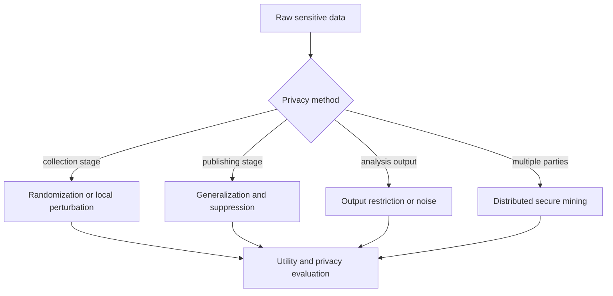

# Privacy-Preserving Data Mining

Privacy-preserving data mining studies how to extract useful patterns while reducing the risk of exposing sensitive information about individuals or organizations. Aggarwal's final chapter covers privacy during data collection, privacy-preserving data publishing, output privacy, and distributed privacy. The topic matters because mining systems often combine large, detailed, linkable data sets, and utility can conflict directly with confidentiality.

This page covers randomization, anonymization, $k$-anonymity-style publishing, l-diversity and t-closeness intuition, output privacy, distributed privacy, and evaluation of the privacy-utility tradeoff. It is not legal advice; it is an algorithmic summary.

## Definitions

**Identifier attributes** directly identify an individual, such as name or government ID.

**Quasi-identifiers** do not identify uniquely alone but may identify when combined, such as ZIP code, age, gender, and occupation.

A **sensitive attribute** is the value to protect, such as diagnosis, salary, political preference, or account status.

**Data perturbation** modifies values by adding noise, swapping values, aggregating, or randomizing responses.

**$k$-anonymity** requires each released record to be indistinguishable from at least $k-1$ others with respect to quasi-identifiers.

**l-diversity** strengthens $k$-anonymity by requiring diversity of sensitive values within each equivalence class.

**t-closeness** requires the sensitive-value distribution in each equivalence class to be close to the global distribution.

**Output privacy** protects information revealed by mining results, such as rules, counts, model parameters, or query answers.

**Distributed privacy-preserving mining** computes results across parties without fully sharing raw data.

## Key results

**Removing identifiers is not enough.** Quasi-identifiers can reidentify people when linked with external data. Privacy must consider combinations of attributes.

**Generalization and suppression trade utility for anonymity.** Replacing exact ages with age ranges or ZIP codes with prefixes creates larger equivalence classes but reduces analytical detail.

**$k$-anonymity protects identity linkage, not attribute disclosure by itself.** If all records in an equivalence class share the same sensitive diagnosis, an attacker can infer that diagnosis even without knowing the exact record.

**l-diversity and t-closeness address sensitive-value leakage.** They reduce the risk that membership in an equivalence class reveals the sensitive attribute too precisely, but they can be hard to satisfy with skewed data.

**Randomization can support aggregate mining.** Adding controlled noise may preserve population-level statistics while hiding individual values, but too much noise destroys utility.

**Distributed privacy separates computation from data sharing.** Secure protocols, local models, or summary exchange can compute mining results without centralizing all raw records, but communication cost and leakage through outputs remain concerns.

**Privacy and utility must be evaluated together.** A release that is perfectly private but useless does not support mining; a highly accurate release that exposes individuals is unacceptable. Practical work reports both disclosure risk and analytical loss, such as classification accuracy drop, aggregate error, pattern distortion, or query error. The right tradeoff depends on data sensitivity, attacker assumptions, and the intended analysis.

**Repeated releases compound risk.** One anonymized table may satisfy a privacy criterion, but releasing several overlapping tables, model outputs, or query answers can allow differencing attacks. Privacy-preserving data mining therefore treats the release process as a whole. Output privacy, query auditing, and limits on repeated access are as important as anonymizing the original table.

**The attacker model must be explicit.** A release that is safe against a casual observer may not be safe against an attacker with voter records, social-network links, location traces, or previous releases. Privacy definitions differ in what background knowledge they assume. Before choosing anonymization, perturbation, or distributed protocols, state what the attacker knows and what disclosure is being prevented.

**Privacy can affect fairness and accuracy unevenly.** Generalization may hide small groups; suppression may remove rare but important cases; noise may hurt minority-class prediction more than majority-class prediction. A privacy-preserving mining workflow should check not only overall utility but also whether the protected release distorts important subpopulations or downstream decisions.

**Anonymization is not a one-time formatting step.** It is a design problem that starts with data collection, consent, retention limits, access control, release purpose, and output monitoring. Algorithmic privacy models help, but they work only within a governance process that limits unnecessary data and records why each release is needed.

**Mining results can be sensitive even when inputs stay hidden.** A frequent pattern may reveal that a small group shares a diagnosis; a classifier may expose memorized records; a graph statistic may identify a bridge person. Output review is therefore part of privacy-preserving data mining, especially when results are released outside the original trusted environment.

**Privacy choices should be documented for future analysts.** Released data should state which fields were generalized, suppressed, perturbed, or excluded, and what utility checks were performed. Without that documentation, later mining results may be misinterpreted as properties of the original population rather than properties of the protected release.

**Small cells deserve special attention.** Rare combinations of quasi-identifiers, geography, time, or graph position are often where reidentification risk concentrates. Suppression or aggregation policies should be tested specifically on these sparse regions.

**Model release is a release.** Publishing coefficients, tree paths, nearest-neighbor examples, or synthetic data can leak training information. Privacy review should cover trained artifacts, not only raw tables.

## Visual



| Privacy model | Protects against | Mechanism | Limitation |
|---|---|---|---|
| Identifier removal | Direct lookup | Drop names/IDs | Linkage still possible |
| $k$-anonymity | Quasi-identifier identity linkage | Generalize/suppress | Attribute disclosure |
| l-diversity | Homogeneous sensitive groups | Sensitive diversity | Hard with skewed values |
| t-closeness | Distribution leakage | Match global distribution | Utility loss |
| Perturbation | Exact value disclosure | Noise or randomization | Accuracy loss |
| Distributed privacy | Central raw-data sharing | Secure or local computation | Output leakage, cost |

## Worked example 1: Checking k-anonymity

**Problem.** A released table has quasi-identifiers age range and ZIP prefix:

| record | age_range | zip_prefix | diagnosis |
|---:|---|---|---|
| 1 | 20-29 | 123** | flu |
| 2 | 20-29 | 123** | cold |
| 3 | 30-39 | 123** | flu |
| 4 | 30-39 | 123** | flu |
| 5 | 30-39 | 123** | cancer |

Is the table 2-anonymous with respect to age_range and zip_prefix?

**Method.**

1. Group records by quasi-identifier values.
2. Equivalence class (20-29, 123**) contains records 1 and 2. Size is 2.
3. Equivalence class (30-39, 123**) contains records 3, 4, and 5. Size is 3.
4. The minimum equivalence class size is 2.
5. For $k=2$, every equivalence class must have size at least 2.

**Checked answer.** The table is 2-anonymous. It is not 3-anonymous because the first equivalence class has only 2 records.

## Worked example 2: Attribute disclosure despite k-anonymity

**Problem.** Modify the previous table so records 1 and 2 both have diagnosis `flu`. The first equivalence class is still size 2. Explain the privacy weakness.

**Method.**

1. The first equivalence class is:

   | age_range | zip_prefix | diagnosis |
   |---|---|---|
   | 20-29 | 123** | flu |
   | 20-29 | 123** | flu |

2. An attacker who knows a target is in age range 20-29 and ZIP prefix 123** cannot distinguish between the two records.
3. However, both records have the same sensitive diagnosis.
4. Therefore the attacker can infer the target's diagnosis is flu with probability 1.
5. This is attribute disclosure, even though identity linkage is controlled at $k=2$.

**Checked answer.** $k$-anonymity alone is insufficient here. A diversity requirement would reject this equivalence class for sensitive diagnosis.

## Code

Pseudocode for checking k-anonymity:

```text
INPUT: table D, quasi-identifier columns Q, anonymity parameter k
OUTPUT: whether D is k-anonymous

group records by values in Q
for each group:
    if group size < k:
        return false
return true
```

```python
import pandas as pd

df = pd.DataFrame(
    {
        "age_range": ["20-29", "20-29", "30-39", "30-39", "30-39"],
        "zip_prefix": ["123**", "123**", "123**", "123**", "123**"],
        "diagnosis": ["flu", "cold", "flu", "flu", "cancer"],
    }
)

quasi = ["age_range", "zip_prefix"]
groups = df.groupby(quasi).size().rename("count").reset_index()
print(groups)
print("2-anonymous:", groups["count"].min() >= 2)
print("3-anonymous:", groups["count"].min() >= 3)

diversity = df.groupby(quasi)["diagnosis"].nunique().rename("distinct_sensitive").reset_index()
print(diversity)
```

## Common pitfalls

- Believing deidentification means only removing names.
- Publishing high-dimensional quasi-identifiers where almost every record remains unique.
- Using $k$-anonymity without checking sensitive-attribute diversity.
- Adding noise without measuring utility loss for the intended mining task.
- Releasing many outputs that individually look safe but collectively leak information.
- Ignoring graph and social-network privacy, where edges can identify people.
- Treating privacy as only an algorithmic setting rather than a data governance requirement.

## Connections

- [Data Mining Process and Data Types](/cs/data-mining/chapter-01-process-data-types)
- [Data Preparation](/cs/data-mining/chapter-02-data-preparation)
- [Mining Data Streams and Big Data](/cs/data-mining/chapter-12-mining-data-streams)
- [Mining Graph Data](/cs/data-mining/chapter-17-mining-graph-data)
- [Social Network Analysis](/cs/data-mining/chapter-19-social-network-analysis)
