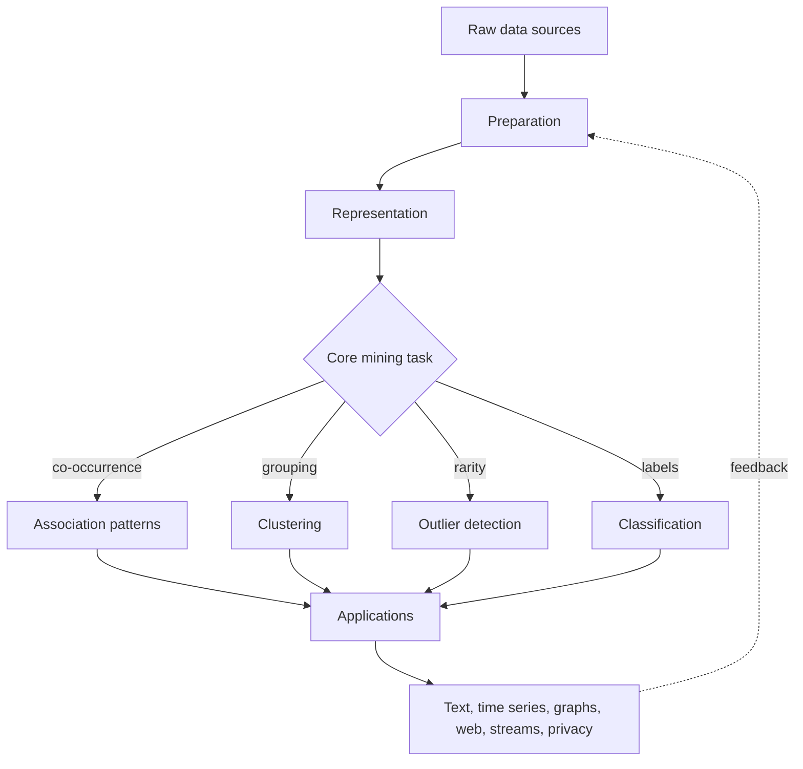

# Data Mining

Data mining is the study of collecting, preparing, modeling, and interpreting data so that large raw data sets yield useful structure. In Charu C. Aggarwal's organization, the subject is built around a practical pipeline and a small number of reusable analytical building blocks: association pattern mining, clustering, outlier detection, and classification. The same building blocks are then adapted to text, time series, discrete sequences, spatial data, graphs, web data, social networks, streams, and privacy-sensitive settings.

These notes are detailed study pages for Aggarwal's *Data Mining: The Textbook*. They emphasize definitions, algorithmic ideas, worked numerical examples, pseudocode, and Python snippets. The goal is not to replace the book's full treatment, but to give a structured wiki path through the concepts that recur across chapters.

## Definitions

**Data mining** is the process of collecting, cleaning, transforming, analyzing, and interpreting data to discover useful patterns, build predictive models, or identify unusual behavior.

A **data object** is the unit of analysis: a row in a table, a document, a transaction, a time series, a graph node, a trajectory, or an entire graph.

A **feature representation** maps raw data into variables or structures that algorithms can consume. The representation may be a dense numeric matrix, sparse term-document matrix, transaction database, sequence database, graph, stream synopsis, or privacy-protected table.

The four recurring analytical building blocks are:

1. **Association pattern mining**, which finds frequently co-occurring items, events, or attributes.
2. **Cluster analysis**, which groups unlabeled objects by similarity.
3. **Outlier analysis**, which ranks or flags unusual objects.
4. **Classification**, which learns predictive models from labeled examples.

The generated chapter pages are:

| Book chapter | Wiki page |
|---:|---|
| 1. An Introduction to Data Mining | [Data Mining Process and Data Types](/cs/data-mining/chapter-01-process-data-types) |
| 2. Data Preparation | [Data Preparation](/cs/data-mining/chapter-02-data-preparation) and [Feature Selection and Dimensionality Reduction](/cs/data-mining/chapter-02-feature-selection-dimensionality-reduction) |
| 3. Similarity and Distances | [Similarity and Distances](/cs/data-mining/chapter-03-similarity-distances) |
| 4. Association Pattern Mining | [Association Pattern Mining](/cs/data-mining/chapter-04-association-pattern-mining) |
| 5. Association Pattern Mining: Advanced Concepts | [Advanced Association Patterns](/cs/data-mining/chapter-05-advanced-association-patterns) |
| 6. Cluster Analysis | [Cluster Analysis](/cs/data-mining/chapter-06-cluster-analysis) |
| 7. Cluster Analysis: Advanced Concepts | [Advanced Clustering Concepts](/cs/data-mining/chapter-07-advanced-clustering) |
| 8. Outlier Analysis | [Outlier Analysis](/cs/data-mining/chapter-08-outlier-analysis) |
| 9. Outlier Analysis: Advanced Concepts | [Advanced Outlier Analysis](/cs/data-mining/chapter-09-advanced-outlier-analysis) |
| 10. Data Classification | [Data Classification](/cs/data-mining/chapter-10-data-classification) |
| 11. Data Classification: Advanced Concepts | [Advanced Classification Concepts](/cs/data-mining/chapter-11-advanced-classification) |
| 12. Mining Data Streams | [Mining Data Streams and Big Data](/cs/data-mining/chapter-12-mining-data-streams) |
| 13. Mining Text Data | [Mining Text Data](/cs/data-mining/chapter-13-mining-text-data) |
| 14. Mining Time Series Data | [Mining Time Series Data](/cs/data-mining/chapter-14-mining-time-series-data) |
| 15. Mining Discrete Sequences | [Mining Discrete Sequences](/cs/data-mining/chapter-15-mining-discrete-sequences) |
| 16. Mining Spatial Data | [Mining Spatial and Trajectory Data](/cs/data-mining/chapter-16-mining-spatial-data) |
| 17. Mining Graph Data | [Mining Graph Data](/cs/data-mining/chapter-17-mining-graph-data) |
| 18. Mining Web Data | [Mining Web Data and Recommenders](/cs/data-mining/chapter-18-mining-web-data) |
| 19. Social Network Analysis | [Social Network Analysis](/cs/data-mining/chapter-19-social-network-analysis) |
| 20. Privacy-Preserving Data Mining | [Privacy-Preserving Data Mining](/cs/data-mining/chapter-20-privacy-preserving-data-mining) |

## Key results

**The mining pipeline is iterative.** Data collection, feature extraction, cleaning, transformation, modeling, and interpretation are not one-way stages. A model can reveal that a feature is malformed, a cleaning rule is too aggressive, or a label definition is inconsistent. Good data mining practice loops back.

**The data type shapes the algorithm.** A Euclidean distance that makes sense for standardized numeric vectors may fail for text, categories, time series, graphs, or trajectories. Much of the book is about adapting a small set of core tasks to many data types.

**Pattern mining, clustering, outlier detection, and classification are reusable components.** Web recommendation can use association patterns and matrix factorization. Fraud detection can use outlier scores and supervised classifiers. Text mining can use clustering, classification, and topic models. Graph mining can use frequent patterns, clustering, and classification after topology-aware feature construction.

**Scalability is not only an implementation detail.** Batch, disk-resident, distributed, and streaming settings create different algorithmic constraints. A method that needs repeated random access to all data may be unsuitable for a stream, even if it is mathematically correct.

**Evaluation depends on the task.** Clustering can be judged by compactness, separation, stability, or external labels. Classification can be judged by accuracy, precision, recall, cost, calibration, or ranking quality. Outlier detection often needs top-$k$ review or delayed labels. Association rules need interest measures beyond raw support and confidence.

## Visual



| Data family | Typical representation | Common mining tasks |
|---|---|---|
| Tabular numeric/categorical | Matrix, one-hot table | Classification, clustering, outliers |
| Transactions | Sets or baskets | Frequent itemsets, association rules |
| Text | Sparse TF-IDF matrix, topics | Search, clustering, classification |
| Time series | Ordered numeric windows | Forecasting, motifs, anomalies |
| Discrete sequences | Ordered symbols | Sequential patterns, HMMs, classification |
| Spatial/trajectory | Coordinates, paths, regions | Spatial clusters, route patterns, local outliers |
| Graphs/social networks | Nodes, edges, attributes | Communities, link prediction, graph classification |
| Streams | Samples, sketches, microclusters | Online counts, drift-aware models, alerts |

## Worked example 1: Choosing a mining task

**Problem.** A site records user sessions:

```text
U1: home -> productA -> cart -> checkout
U2: home -> productB -> productA -> exit
U3: home -> productA -> cart -> exit
```

Choose three different data mining formulations.

**Method.**

1. Association pattern mining:
   - Convert each session into a set of visited pages.
   - U1 becomes \{home, productA, cart, checkout\}.
   - Mine patterns such as \{productA, cart\}.

2. Sequence mining:
   - Preserve order.
   - Mine ordered patterns such as $(home, productA, cart)$.
   - This distinguishes productA before cart from cart before productA.

3. Classification:
   - Label sessions by whether checkout occurred.
   - U1 has label 1; U2 and U3 have label 0.
   - Features may include pages visited, sequence length, time on product pages, or whether cart was reached.

**Checked answer.** The same raw data can support at least three tasks. The correct formulation depends on the question: co-occurrence, ordered navigation, or checkout prediction.

## Worked example 2: Core building blocks on one toy table

**Problem.** Consider four customers:

| customer | age | visits | bought |
|---:|---:|---:|---|
| A | 20 | 2 | no |
| B | 22 | 3 | no |
| C | 55 | 9 | yes |
| D | 57 | 10 | yes |

Show how clustering, classification, and outlier detection would view the table.

**Method.**

1. Clustering:
   - Use features age and visits.
   - A and B are close: age differs by 2 and visits by 1.
   - C and D are close for the same reason.
   - A likely clustering is \{A,B\} and \{C,D\}.

2. Classification:
   - Use bought as the label.
   - A and B are negative; C and D are positive.
   - A simple rule could be: if visits $\ge 9$, predict yes.

3. Outlier detection:
   - With only these four points, no point is extremely isolated.
   - If a new customer E had age 21 and visits 50, E would be unusual because visits is far outside nearby young customers.

4. Association mining:
   - If numeric features are discretized, one might mine patterns such as \{high_visits\} -> \{bought_yes\}.

**Checked answer.** The table does not have one inherent "mining result." Each task asks a different question and may require different preprocessing.

## Code

Pseudocode for selecting a data mining formulation:

```text
INPUT: raw data source S, business or scientific question Q
OUTPUT: mining-ready task definition

identify the object to be predicted, grouped, ranked, or summarized
identify available raw fields and dependency structure
if Q asks for co-occurrence:
    build transactions and mine patterns
else if Q asks for groups:
    define similarity and cluster objects
else if Q asks for unusual cases:
    define normality and score outliers
else if Q asks for prediction:
    define labels, features, and evaluation metrics
validate that the representation preserves the needed information
```

```python
import pandas as pd
from sklearn.cluster import KMeans
from sklearn.tree import DecisionTreeClassifier, export_text

df = pd.DataFrame(
    {
        "customer": ["A", "B", "C", "D"],
        "age": [20, 22, 55, 57],
        "visits": [2, 3, 9, 10],
        "bought": [0, 0, 1, 1],
    }
)

X = df[["age", "visits"]]
clusters = KMeans(n_clusters=2, n_init=10, random_state=0).fit_predict(X)
tree = DecisionTreeClassifier(max_depth=2, random_state=0).fit(X, df["bought"])

print(dict(zip(df["customer"], clusters)))
print(export_text(tree, feature_names=["age", "visits"]))
```

## Common pitfalls

- Treating data mining as only algorithm selection rather than problem formulation plus preparation.
- Using the same representation for every data type.
- Forgetting that association, clustering, outlier detection, and classification answer different questions.
- Evaluating a model with a metric that does not match the cost or scientific goal.
- Ignoring scalability until after choosing an algorithm that cannot run on the available data.
- Treating privacy as an afterthought when data integration has already increased reidentification risk.
- Reading advanced application chapters without first understanding similarity, preparation, and the core building blocks.

## Connections

- [Data Mining Process and Data Types](/cs/data-mining/chapter-01-process-data-types)
- [Data Preparation](/cs/data-mining/chapter-02-data-preparation)
- [Similarity and Distances](/cs/data-mining/chapter-03-similarity-distances)
- [Association Pattern Mining](/cs/data-mining/chapter-04-association-pattern-mining)
- [Cluster Analysis](/cs/data-mining/chapter-06-cluster-analysis)
- [Outlier Analysis](/cs/data-mining/chapter-08-outlier-analysis)
- [Data Classification](/cs/data-mining/chapter-10-data-classification)
- [Mining Data Streams and Big Data](/cs/data-mining/chapter-12-mining-data-streams)
