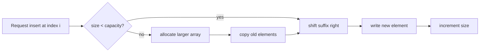

# Arrays and Array Operations

Arrays are the first concrete data structure in many C-based data-structures courses because they expose both the mathematical idea of indexed data and the machine-level idea of contiguous memory. In the source textbook's early chapters, arrays (배열) sit immediately after the discussion of algorithms, abstract data types, pointers, and dynamic allocation. That placement matters: an array is not only a list of values, but also a contract between the programmer, the compiler, and memory.

In C, arrays are fast because address computation is simple. If the base address and element size are known, the address of any element can be found in constant time. The tradeoff is rigidity: fixed-size arrays cannot grow by themselves, insertion may require many shifts, and deleting an element from the middle does not automatically close the gap unless the programmer writes that logic. Dynamic arrays soften the fixed-size limitation by allocating a larger block and copying elements, but the same contiguous-storage model remains underneath.

## Definitions

An **array** is a finite sequence of elements of the same type stored in contiguous memory and accessed by integer indices. In C, an array declared as `int a[10];` contains ten `int` objects indexed from `0` through `9`. The expression `a[i]` is defined as `*(a + i)`, so indexing is pointer arithmetic plus dereferencing.

An **array ADT** can be described independently of C syntax:

- **Objects**: finite sequences $\langle x_0, x_1, \dots, x_{n-1}\rangle$ of elements from a type $T$.
- **Access**: `get(A, i)` returns $x_i$ when $0 \le i \lt  n$.
- **Update**: `set(A, i, value)` replaces $x_i$.
- **Insert**: `insert(A, i, value)` places a new element before current index `i`.
- **Delete**: `delete(A, i)` removes element $x_i$ and shifts later elements left.
- **Search**: `find(A, value)` returns an index or reports failure.

A **static array** has a compile-time or stack-frame size chosen before use. A **dynamically allocated array** uses `malloc`, `calloc`, or `realloc`; its lifetime is controlled manually with `free`. A **dynamic array** or **vector** is an ADT implemented with a dynamically allocated C array, a logical length, and a capacity.

For a one-dimensional array with base address $B$, element size $w$, and zero-based index $i$, the address formula is:

$$
\mathrm{addr}(A[i]) = B + i \cdot w
$$

For a two-dimensional row-major C array `A[rows][cols]`, the logical element $A[i][j]$ is stored at:

$$
\mathrm{addr}(A[i][j]) = B + (i \cdot \mathrm{cols} + j) \cdot w
$$

## Key results

Direct access is the defining strength of arrays. Since the address of `A[i]` is computed from a closed formula, reading or writing a valid index is $O(1)$. Inserting or deleting in the middle is usually $O(n)$ because elements after the operation point must move.

When a dynamic array doubles its capacity whenever it fills, a single insertion may cost $O(n)$ for copying, but a sequence of appends costs $O(1)$ amortized per append. The proof sketch is a charging argument. Each expansion from capacity $m$ to $2m$ copies $m$ elements. Across appending $n$ total elements, the copied counts form a geometric sum:

$$
1 + 2 + 4 + \cdots + 2^k < 2^{k+1} \le 2n
$$

Thus the total copying work is $O(n)$ over $n$ appends, and each append has amortized cost $O(1)$.

Bounds checking is not automatic for raw C arrays. If `i < 0` or `i >= n`, evaluating `A[i]` has undefined behavior. This is one reason the ADT boundary is useful: code outside the array module should call checked functions rather than freely indexing internal storage.

| Operation | Static C array | Dynamic array with capacity | Main cost driver |
|---|---:|---:|---|
| Access by index | $O(1)$ | $O(1)$ | address arithmetic |
| Update by index | $O(1)$ | $O(1)$ | address arithmetic |
| Append when space remains | not general | $O(1)$ | write at `data[size]` |
| Append when full | not general | $O(n)$ worst, $O(1)$ amortized | allocate and copy |
| Insert at front | $O(n)$ | $O(n)$ | shift all elements right |
| Delete from middle | $O(n)$ | $O(n)$ | shift suffix left |
| Linear search | $O(n)$ | $O(n)$ | compare until found |
| Binary search on sorted data | $O(\log n)$ | $O(\log n)$ | halve interval repeatedly |

## Visual

The following memory sketch shows why insertion in the middle is expensive. To insert `99` at index `2`, every element from index `2` onward must move one slot to the right before the new value can be written.

```text
before:
index:   0    1    2    3    4
value:  10   20   30   40   50

shift right from the end:
index:   0    1    2    3    4    5
value:  10   20   30 ->40 ->50

after:
index:   0    1    2    3    4    5
value:  10   20   99   30   40   50
```



## Worked example 1: inserting into a sorted array

Problem: Given the sorted array `[3, 8, 12, 19, 27]` with capacity at least six, insert `15` while preserving sorted order.

Method:

1. Find the insertion index. Compare from the left:
   - `3 < 15`, continue.
   - `8 < 15`, continue.
   - `12 < 15`, continue.
   - `19 > 15`, so `15` belongs at index `3`.
2. Shift elements at indices `3` and above one position right, starting from the current last element:
   - Move `27` from index `4` to index `5`.
   - Move `19` from index `3` to index `4`.
3. Write `15` at index `3`.
4. Increase the logical size from `5` to `6`.

Full trace:

```text
start:  [3, 8, 12, 19, 27, _]
move:   [3, 8, 12, 19, _, 27]
move:   [3, 8, 12, _, 19, 27]
write:  [3, 8, 12, 15, 19, 27]
```

Checked answer: the resulting array is `[3, 8, 12, 15, 19, 27]`. It remains sorted because all elements before index `3` are less than `15`, and all elements after index `3` are greater than `15`. The number of shifted elements is `2`, which equals the old size minus the insertion index: $5 - 3 = 2$.

## Worked example 2: locating an element in row-major storage

Problem: A C array is declared as `int m[4][5];`. Assume the base address of `m[0][0]` is `1000` and `sizeof(int) = 4`. Find the address of `m[2][3]`.

Method:

1. Identify the row count and column count. The array has `4` rows and `5` columns.
2. In row-major order, all elements of row `0` come first, then all elements of row `1`, then row `2`.
3. Compute the linear offset:

$$
\begin{aligned}
\mathrm{offset} &= i \cdot \mathrm{cols} + j \\
&= 2 \cdot 5 + 3 \\
&= 13
\end{aligned}
$$

4. Convert the element offset to a byte offset:

$$
13 \cdot 4 = 52
$$

5. Add the byte offset to the base address:

$$
1000 + 52 = 1052
$$

Checked answer: the address of `m[2][3]` is `1052`. A quick sanity check is to list the rows: row `0` uses offsets `0..4`, row `1` uses `5..9`, and row `2` uses `10..14`. Column `3` in row `2` is offset `13`, matching the formula.

## Code

The following C program implements a small dynamic array of integers with append, insert, delete, and print operations. It uses explicit checks around allocation and index validity because raw C arrays do not protect those boundaries.

```c
#include <stdio.h>
#include <stdlib.h>

typedef struct {
    int *data;
    size_t size;
    size_t capacity;
} IntArray;

static void die(const char *message) {
    fprintf(stderr, "%s\n", message);
    exit(EXIT_FAILURE);
}

static void init(IntArray *a) {
    a->size = 0;
    a->capacity = 4;
    a->data = malloc(a->capacity * sizeof(a->data[0]));
    if (a->data == NULL) die("malloc failed");
}

static void reserve(IntArray *a, size_t needed) {
    if (needed <= a->capacity) return;
    size_t new_capacity = a->capacity;
    while (new_capacity < needed) new_capacity *= 2;
    int *next = realloc(a->data, new_capacity * sizeof(next[0]));
    if (next == NULL) die("realloc failed");
    a->data = next;
    a->capacity = new_capacity;
}

static void append(IntArray *a, int value) {
    reserve(a, a->size + 1);
    a->data[a->size++] = value;
}

static int insert_at(IntArray *a, size_t index, int value) {
    if (index > a->size) return 0;
    reserve(a, a->size + 1);
    for (size_t k = a->size; k > index; --k) {
        a->data[k] = a->data[k - 1];
    }
    a->data[index] = value;
    a->size++;
    return 1;
}

static int delete_at(IntArray *a, size_t index) {
    if (index >= a->size) return 0;
    for (size_t k = index; k + 1 < a->size; ++k) {
        a->data[k] = a->data[k + 1];
    }
    a->size--;
    return 1;
}

static void print_array(const IntArray *a) {
    printf("[");
    for (size_t i = 0; i < a->size; ++i) {
        printf("%s%d", i == 0 ? "" : ", ", a->data[i]);
    }
    printf("]\n");
}

int main(void) {
    IntArray a;
    init(&a);
    append(&a, 3);
    append(&a, 8);
    append(&a, 12);
    append(&a, 19);
    insert_at(&a, 3, 15);
    delete_at(&a, 1);
    print_array(&a);
    free(a.data);
    return 0;
}
```

## Common pitfalls

- Treating capacity as length. `capacity` says how many slots are allocated; `size` says how many slots currently hold valid logical elements.
- Shifting in the wrong direction during insertion. Shift right from the end toward the insertion index; shifting left-to-right overwrites data before it is copied.
- Forgetting that `realloc` can move the array. Always assign the return value to a temporary pointer first so the old pointer is not lost on failure.
- Using `sizeof(pointer)` instead of `sizeof(pointer[0])` when allocating. The first gives the pointer size, not necessarily the element size.
- Assuming C checks bounds. It does not. The ADT functions should check indices before indexing.
- Applying binary search to an unsorted array. Binary search is only correct when the data is ordered under the same comparison used by the search.

## Connections

- [searching algorithms](/cs/data-structures/searching-algorithms)
- [sorting algorithms](/cs/data-structures/sorting-algorithms)
- [stacks](/cs/data-structures/stacks)
- [queues](/cs/data-structures/queues)
- [hashing](/cs/data-structures/hashing)
