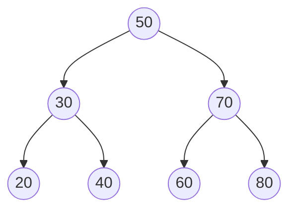

# Binary Search Trees

A binary search tree, or BST (이진 탐색 트리), adds an ordering rule to the binary tree shape. For each node, every key in the left subtree is smaller than the node's key, and every key in the right subtree is larger. This rule turns a tree into a searchable dictionary: each comparison chooses left or right, so the search path can be much shorter than a linear scan.


*Figure: Binary trees make recursive structure and pointer relationships visible. Image: [Wikimedia Commons](https://commons.wikimedia.org/wiki/File:Binary_tree.svg), Derrick Coetzee, public domain.*

The main lesson is conditional. A BST is efficient when its height is small; it is inefficient when insertions create a chain. This is why the source textbook treats basic binary search trees before more advanced search trees. The basic BST explains the invariant and the update cases. Balanced trees then add mechanisms to protect the height.

## Definitions

A **binary search tree** is a binary tree in which every node with key `k` satisfies:

$$
\text{all keys in left subtree} < k < \text{all keys in right subtree}
$$

Some implementations allow duplicates by storing a count in the node or by choosing a consistent side for equal keys. The simplest mathematical definition assumes distinct keys.

A BST ADT usually represents a dictionary:

- **`search(T, key)`**: return the node or associated value with `key`, or report failure.
- **`insert(T, key)`**: add a key while preserving the BST invariant.
- **`delete(T, key)`**: remove a key while preserving the invariant.
- **`min(T)`**: find the smallest key by following left links.
- **`max(T)`**: find the largest key by following right links.
- **`inorder(T)`**: visit keys in sorted order.

BST search is a guided walk from the root. At node `p`:

- If `key == p->key`, search succeeds.
- If `key < p->key`, continue in `p->left`.
- If `key > p->key`, continue in `p->right`.

Deletion has three structural cases:

1. The node is a leaf: remove it directly.
2. The node has one child: replace the node by its child.
3. The node has two children: replace its key by its inorder successor or predecessor, then delete that successor or predecessor from its original position.

## Key results

If the BST height is $h$, search, insert, and delete take $O(h)$ time because each step moves down one level. In the best balanced case, $h = \Theta(\log n)$. In the worst case, $h = n - 1$, and the BST behaves like a linked list.

Inorder traversal of a BST outputs keys in ascending order. Proof sketch: by induction on the tree. The left subtree contains only keys smaller than the root and is printed in sorted order by the induction hypothesis. Then the root is printed. Then the right subtree contains only larger keys and is printed in sorted order. Concatenating these three sorted parts gives a sorted sequence.

The inorder successor of a node with a right subtree is the leftmost node in that right subtree. It is the smallest key greater than the node. The inorder predecessor is symmetric: the rightmost node in the left subtree.

| Operation | Balanced height | Worst chain height | Reason |
|---|---:|---:|---|
| Search | $O(\log n)$ | $O(n)$ | one comparison per level |
| Insert | $O(\log n)$ | $O(n)$ | search path plus new leaf |
| Delete | $O(\log n)$ | $O(n)$ | search plus local restructure |
| Min or max | $O(\log n)$ | $O(n)$ | follow one side |
| Inorder traversal | $O(n)$ | $O(n)$ | visit every node |

The implementation interface should hide node manipulation from callers. If outside code directly changes `left` or `right`, the BST invariant can be destroyed without the tree module knowing. A safer C design exposes functions such as `bst_insert`, `bst_delete`, and `bst_search`, while keeping the node structure private in a `.c` file when possible.

Recursive BST code is short because every subtree is itself a BST. Iterative code avoids deep recursion on badly shaped trees. A sorted insertion sequence such as `1, 2, 3, 4, 5` produces a chain if the tree is not balanced, and recursive operations on a long chain may overflow the call stack. That risk motivates AVL trees, red-black trees, splay trees, and B-trees in more advanced chapters.

Deletion is the operation that most often breaks student implementations. A good way to reason about it is to ask what subtree should replace the deleted node. For zero or one child, the answer is immediate. For two children, the successor or predecessor is chosen because it preserves the global ordering relation.

## Visual



The invariant says each local subtree also forms a valid search tree:

```text
left of 50:   20, 30, 40  all < 50
right of 50:  60, 70, 80  all > 50
inorder:      20, 30, 40, 50, 60, 70, 80
```

## Worked example 1: inserting keys into a BST

Problem: Insert the keys `50, 30, 70, 20, 40, 60, 80` into an initially empty BST.

Method: the first key becomes the root. Each later key follows comparisons until it reaches a missing child position.

1. Insert `50`: tree is empty, so `50` becomes root.
2. Insert `30`: compare with `50`; `30 < 50`, so go left. Left child is empty, insert there.
3. Insert `70`: compare with `50`; `70 > 50`, so go right. Right child is empty, insert there.
4. Insert `20`: `20 < 50`, go left to `30`; `20 < 30`, go left. Insert as left child of `30`.
5. Insert `40`: `40 < 50`, go left to `30`; `40 > 30`, go right. Insert as right child of `30`.
6. Insert `60`: `60 > 50`, go right to `70`; `60 < 70`, go left. Insert as left child of `70`.
7. Insert `80`: `80 > 50`, go right to `70`; `80 > 70`, go right. Insert as right child of `70`.

Checked answer: the final tree matches the visual. Inorder traversal gives `20, 30, 40, 50, 60, 70, 80`, which is the sorted insertion set, so the invariant is consistent.

## Worked example 2: deleting a node with two children

Problem: In the BST from the visual, delete key `50`.

Method: `50` has two children, so replace it with its inorder successor. The successor is the smallest key in the right subtree.

1. Start at the right child of `50`, which is `70`.
2. Follow left links until none remain:
   - `70` has left child `60`.
   - `60` has no left child.
3. The successor is `60`.
4. Copy `60` into the root position, replacing `50`.
5. Delete the original node containing `60`. That node is a leaf, so set `70->left = NULL`.

Final tree:

```text
        60
      /    \
    30      70
   /  \       \
 20   40       80
```

Checked answer: inorder traversal is `20, 30, 40, 60, 70, 80`. The key `50` is gone, all remaining keys are present once, and the left and right subtrees of every node satisfy the BST ordering rule.

## Code

This C program implements insertion, search, deletion, inorder printing, and cleanup for a BST with integer keys.

```c
#include <stdio.h>
#include <stdlib.h>

typedef struct Node {
    int key;
    struct Node *left;
    struct Node *right;
} Node;

static Node *make_node(int key) {
    Node *n = malloc(sizeof(*n));
    if (n == NULL) {
        fprintf(stderr, "malloc failed\n");
        exit(EXIT_FAILURE);
    }
    n->key = key;
    n->left = NULL;
    n->right = NULL;
    return n;
}

static Node *insert(Node *root, int key) {
    if (root == NULL) return make_node(key);
    if (key < root->key) {
        root->left = insert(root->left, key);
    } else if (key > root->key) {
        root->right = insert(root->right, key);
    }
    return root;
}

static Node *find_min(Node *root) {
    while (root != NULL && root->left != NULL) {
        root = root->left;
    }
    return root;
}

static Node *delete_key(Node *root, int key) {
    if (root == NULL) return NULL;

    if (key < root->key) {
        root->left = delete_key(root->left, key);
    } else if (key > root->key) {
        root->right = delete_key(root->right, key);
    } else {
        if (root->left == NULL) {
            Node *right = root->right;
            free(root);
            return right;
        }
        if (root->right == NULL) {
            Node *left = root->left;
            free(root);
            return left;
        }
        Node *succ = find_min(root->right);
        root->key = succ->key;
        root->right = delete_key(root->right, succ->key);
    }
    return root;
}

static int search(const Node *root, int key) {
    while (root != NULL) {
        if (key == root->key) return 1;
        root = key < root->key ? root->left : root->right;
    }
    return 0;
}

static void inorder(const Node *root) {
    if (root == NULL) return;
    inorder(root->left);
    printf("%d ", root->key);
    inorder(root->right);
}

static void destroy(Node *root) {
    if (root == NULL) return;
    destroy(root->left);
    destroy(root->right);
    free(root);
}

int main(void) {
    int keys[] = {50, 30, 70, 20, 40, 60, 80};
    Node *root = NULL;
    for (size_t i = 0; i < sizeof(keys) / sizeof(keys[0]); ++i) {
        root = insert(root, keys[i]);
    }
    printf("has 40? %s\n", search(root, 40) ? "yes" : "no");
    root = delete_key(root, 50);
    inorder(root);
    printf("\n");
    destroy(root);
    return EXIT_SUCCESS;
}
```

## Common pitfalls

- Saying BST operations are always $O(\log n)$. They are $O(h)$; only balanced height gives logarithmic time.
- Breaking the invariant by placing all smaller keys somewhere in the left child only, rather than anywhere in the entire left subtree.
- Mishandling deletion with two children. Copy the successor or predecessor key, then delete that replacement node from its old location.
- Forgetting to return the possibly changed subtree root from recursive insert or delete.
- Assuming duplicate keys are harmless. The implementation needs an explicit duplicate policy.
- Using preorder or postorder when sorted output requires inorder traversal.

## Connections

- [binary trees](/cs/data-structures/binary-trees)
- [searching algorithms](/cs/data-structures/searching-algorithms)
- [sorting algorithms](/cs/data-structures/sorting-algorithms)
- [heaps and priority queues](/cs/data-structures/heaps-priority-queues)
- [hashing](/cs/data-structures/hashing)
