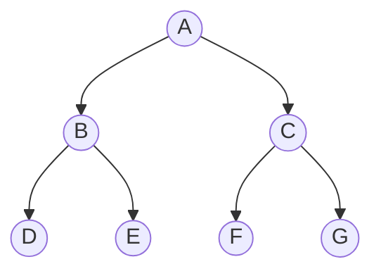

# Binary Trees and Traversals

Trees (트리) organize data hierarchically rather than linearly. A binary tree is the most common starting point because each node has at most two children, usually called left and right. That small branching factor is enough to model expression structure, decision processes, hierarchical indexes, priority queues, and search trees.

In the source textbook's tree chapter, binary trees appear before heaps and binary search trees because both are specialized binary-tree shapes. A heap uses a nearly complete binary tree with an order rule between parents and children. A binary search tree uses an ordering rule between the left subtree, root, and right subtree. Before those special cases make sense, the basic language of root, child, height, level, representation, and traversal must be clear.

## Definitions

A **tree** is a finite set of nodes that is either empty or consists of a distinguished **root** and zero or more disjoint subtrees. In a **binary tree**, each node has at most two subtrees: the left subtree and the right subtree. The left and right positions are distinct, so a node with only a left child is not the same shape as a node with only a right child.

Important terms:

- **Root**: the top node of a nonempty tree.
- **Parent and child**: if a node points to another node below it, the first is the parent and the second is the child.
- **Leaf**: a node with no children.
- **Degree**: number of children of a node.
- **Level** or **depth**: number of edges from the root to the node, with the root at depth `0`.
- **Height**: maximum number of edges on a path from the node down to a leaf. Some texts count nodes instead of edges, so always check the convention.
- **Complete binary tree**: all levels are full except possibly the last, which is filled from left to right.
- **Full binary tree**: every node has either zero or two children.

A binary tree can be represented by linked nodes:

```c
typedef struct Node {
    int key;
    struct Node *left;
    struct Node *right;
} Node;
```

It can also be represented in an array when the shape is complete or nearly complete. With one-based indexing, node `i` has left child `2i`, right child `2i + 1`, and parent `i / 2`. With zero-based indexing, node `i` has left child `2i + 1`, right child `2i + 2`, and parent `(i - 1) / 2`.

## Key results

For any binary tree with $n$ nodes, there are exactly $n - 1$ edges when the tree is nonempty. This follows because every node except the root has exactly one parent edge.

The maximum number of nodes at depth $d$ is $2^d$. Therefore the maximum number of nodes in a binary tree of height $h$ is:

$$
1 + 2 + 4 + \cdots + 2^h = 2^{h+1} - 1
$$

A tree with $n$ nodes can be very shallow or very tall. A complete binary tree has height $\Theta(\log n)$, while a chain-shaped binary tree has height $\Theta(n)$. Many later structures, such as heaps and balanced search trees, enforce shape or balance constraints to avoid the chain case.

The standard traversals are:

- **Preorder**: visit root, traverse left, traverse right.
- **Inorder**: traverse left, visit root, traverse right.
- **Postorder**: traverse left, traverse right, visit root.
- **Level order**: visit nodes by increasing depth, usually using a queue.

| Traversal | Visit order pattern | Typical use |
|---|---|---|
| Preorder | root, left, right | copy tree, prefix expression |
| Inorder | left, root, right | sorted order in a BST |
| Postorder | left, right, root | delete tree, postfix expression |
| Level order | breadth-first by level | shortest edge distance in unweighted tree |

Representation choice depends on shape. Linked nodes are flexible for arbitrary binary trees because missing children are simply `NULL` pointers. Array representation is compact for complete trees, which is why heaps use it. For a sparse tree, array representation can waste large regions: a node deep on the right may require a high index even if most positions before it are empty.

Traversal algorithms also expose the relationship between recursion and auxiliary data structures. Recursive preorder, inorder, and postorder use the C call stack implicitly. Iterative inorder traversal uses an explicit stack of node pointers. Level-order traversal uses a queue because nodes must be processed in first-discovered, first-visited order by depth. These are not separate tricks; they are the same stack and queue ADTs applied to tree control flow.

Tree algorithms are often easiest to verify by induction. The base case is the empty tree. The recursive case assumes the operation works correctly on left and right subtrees, then proves that visiting or combining the root preserves the desired result.

## Visual



For this tree:

```text
preorder:   A B D E C F G
inorder:    D B E A F C G
postorder:  D E B F G C A
level:      A B C D E F G
```

## Worked example 1: computing traversals

Problem: For the tree shown in the visual, compute preorder, inorder, and postorder traversals.

Method: apply each traversal definition recursively.

Preorder:

1. Visit root `A`.
2. Traverse left subtree rooted at `B`.
   - Visit `B`.
   - Traverse left child `D`: visit `D`.
   - Traverse right child `E`: visit `E`.
3. Traverse right subtree rooted at `C`.
   - Visit `C`.
   - Traverse left child `F`: visit `F`.
   - Traverse right child `G`: visit `G`.

Preorder result: `A B D E C F G`.

Inorder:

1. Traverse left subtree of `A`.
   - For `B`, traverse `D`, visit `B`, traverse `E`, giving `D B E`.
2. Visit `A`.
3. Traverse right subtree of `A`.
   - For `C`, traverse `F`, visit `C`, traverse `G`, giving `F C G`.

Inorder result: `D B E A F C G`.

Postorder:

1. Traverse left subtree of `A`: `D E B`.
2. Traverse right subtree of `A`: `F G C`.
3. Visit `A`.

Postorder result: `D E B F G C A`.

Checked answer: each result contains exactly seven nodes, no node repeats, and the root appears first in preorder, middle in this symmetric inorder example, and last in postorder.

## Worked example 2: array positions in a complete binary tree

Problem: Store the complete binary tree with level-order keys `[50, 30, 70, 10, 40, 60, 80]` in a zero-based array. For the node at index `2`, find its parent and children.

Method: use zero-based complete-tree formulas.

1. The array is:

```text
index: 0   1   2   3   4   5   6
key:  50  30  70  10  40  60  80
```

2. Node at index `2` has key `70`.
3. Parent index is:

$$
\left\lfloor \frac{2 - 1}{2} \right\rfloor = 0
$$

So the parent key is `50`.

4. Left child index is:

$$
2 \cdot 2 + 1 = 5
$$

So the left child key is `60`.

5. Right child index is:

$$
2 \cdot 2 + 2 = 6
$$

So the right child key is `80`.

Checked answer: in the level-order tree, `70` is the right child of `50`, and its children are `60` and `80`. The formulas match the diagram and the array.

## Code

This program constructs a small binary tree and prints recursive traversals. The same node representation is the basis for binary search trees, expression trees, and many tree algorithms.

```c
#include <stdio.h>
#include <stdlib.h>

typedef struct Node {
    char key;
    struct Node *left;
    struct Node *right;
} Node;

static Node *node(char key, Node *left, Node *right) {
    Node *n = malloc(sizeof(*n));
    if (n == NULL) {
        fprintf(stderr, "malloc failed\n");
        exit(EXIT_FAILURE);
    }
    n->key = key;
    n->left = left;
    n->right = right;
    return n;
}

static void preorder(const Node *root) {
    if (root == NULL) return;
    printf("%c ", root->key);
    preorder(root->left);
    preorder(root->right);
}

static void inorder(const Node *root) {
    if (root == NULL) return;
    inorder(root->left);
    printf("%c ", root->key);
    inorder(root->right);
}

static void postorder(const Node *root) {
    if (root == NULL) return;
    postorder(root->left);
    postorder(root->right);
    printf("%c ", root->key);
}

static void destroy(Node *root) {
    if (root == NULL) return;
    destroy(root->left);
    destroy(root->right);
    free(root);
}

int main(void) {
    Node *root =
        node('A',
             node('B', node('D', NULL, NULL), node('E', NULL, NULL)),
             node('C', node('F', NULL, NULL), node('G', NULL, NULL)));

    printf("preorder: ");
    preorder(root);
    printf("\ninorder: ");
    inorder(root);
    printf("\npostorder: ");
    postorder(root);
    printf("\n");

    destroy(root);
    return EXIT_SUCCESS;
}
```

## Common pitfalls

- Treating a binary tree as if every node must have two children. "At most two" includes zero or one child.
- Mixing height conventions. Some books count edges, others count nodes; formulas shift by one.
- Assuming inorder traversal is sorted for every binary tree. It is sorted only when the tree also satisfies the binary-search-tree invariant.
- Forgetting the base case `root == NULL` in recursive traversal.
- Using array representation for sparse arbitrary trees. Array slots become wasteful unless the tree is complete or close to complete.
- Freeing a root before freeing its children. Postorder deletion is the natural pattern.

## Connections

- [binary search trees](/cs/data-structures/binary-search-trees)
- [heaps and priority queues](/cs/data-structures/heaps-priority-queues)
- [stacks](/cs/data-structures/stacks)
- [queues](/cs/data-structures/queues)
- [graph traversals](/cs/data-structures/graph-traversals)
