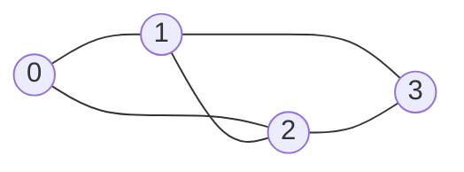

# Graph Representation

Graphs (그래프) model relationships. Vertices represent objects, and edges represent connections between them. The same abstraction can describe roads, prerequisites, network links, social relationships, control flow, and dependency graphs. The representation chosen in C determines the cost of every graph algorithm that follows.


*Figure: Dijkstra's algorithm is a concrete example of graph search becoming a path. Image: [Wikimedia Commons](https://commons.wikimedia.org/wiki/File:Dijkstra_Animation.gif), Ibmua, public domain.*

The source textbook's graph chapter begins with the graph ADT and representations before moving to traversal, components, spanning trees, shortest paths, and activity networks. That order is essential. BFS, DFS, Prim, Kruskal, Dijkstra, and Floyd-Warshall all operate on the same mathematical object, but their running times and code shape depend heavily on whether the graph is stored as an adjacency matrix, adjacency lists, or edge lists.

## Definitions

A **graph** is a pair $G = (V, E)$, where $V$ is a set of vertices and $E$ is a set of edges.

For an **undirected graph**, an edge is an unordered pair $\{u, v\}$. For a **directed graph**, or digraph, an edge is an ordered pair $(u, v)$ from source `u` to destination `v`.

A **weighted graph** associates a cost, distance, capacity, or weight with each edge. An **unweighted graph** may be treated as having weight `1` on every edge for traversal-distance purposes.

Important terms:

- **Adjacent vertices**: two vertices connected by an edge.
- **Degree**: number of incident edges in an undirected graph.
- **Indegree**: number of incoming directed edges.
- **Outdegree**: number of outgoing directed edges.
- **Path**: a sequence of vertices connected by edges.
- **Cycle**: a path that starts and ends at the same vertex without repeating internal vertices.
- **Connected graph**: every pair of vertices has a path between them, for undirected graphs.

Common C representations:

- **Adjacency matrix**: a two-dimensional array `matrix[V][V]`. Entry `matrix[i][j]` records whether edge `i -> j` exists or stores its weight.
- **Adjacency list**: an array of lists. Entry `adj[i]` points to the neighbors of vertex `i`.
- **Edge list**: an array of edge records `(u, v, w)`, useful for algorithms such as Kruskal's MST.

## Key results

An adjacency matrix uses $\Theta(\vert V\vert ^2)$ memory regardless of the number of edges. It answers "is there an edge from `u` to `v`?" in $O(1)$ time. It is often appropriate for dense graphs or algorithms such as Floyd-Warshall that naturally inspect all vertex pairs.

An adjacency list uses $\Theta(\vert V\vert  + \vert E\vert )$ memory. It is usually better for sparse graphs, where $\vert E\vert $ is much smaller than $\vert V\vert ^2$. Iterating over all neighbors of a vertex costs time proportional to that vertex's degree.

For undirected graphs, each edge usually appears twice in adjacency lists: once in `u`'s list and once in `v`'s list. For directed graphs, edge `u -> v` appears only in `u`'s outgoing list unless incoming lists are also maintained.

| Representation | Space | Edge lookup `u,v` | Iterate neighbors of `u` | Best fit |
|---|---:|---:|---:|---|
| Adjacency matrix | $\Theta(V^2)$ | $O(1)$ | $O(V)$ | dense graphs, all-pairs algorithms |
| Adjacency list | $\Theta(V + E)$ | $O(\deg u)$ | $O(\deg u)$ | sparse graphs, traversal |
| Edge list | $\Theta(E)$ | $O(E)$ | $O(E)$ unless indexed | sorting edges, Kruskal |

The matrix representation is often the simplest for classroom traces because every possible pair of vertices has a visible cell. It also makes directed and weighted variants easy to inspect: `matrix[u][v]` can store a boolean, a weight, or a sentinel such as `INF`. The downside is that the representation pays for edges that do not exist. For a graph with one million vertices, a full matrix is usually impossible even if the graph has only a few million actual edges.

Adjacency lists reverse that tradeoff. They store only existing edges, so they are the default for sparse graphs and for algorithms that iterate over outgoing edges. The list node may contain just `to` and `next`, or it may also contain `weight`. Some implementations use dynamic arrays instead of linked lists for each adjacency bucket, improving cache locality and making iteration faster. The ADT idea is the same either way: for a vertex `u`, enumerate all outgoing neighbors.

Edge lists are not convenient for ordinary neighbor queries, but they are excellent when the algorithm processes edges globally. Kruskal's algorithm sorts all edges by weight, so an array of edge records is exactly the needed input. Many real graph libraries keep more than one view of the same graph when different algorithms need different access patterns.

Vertex naming is another representation detail. Algorithms are easiest when vertices are numbered `0..V-1`, because arrays can store colors, distances, parents, and adjacency heads. If input uses strings such as city names, the program usually maps each name to an integer index with a dictionary, runs the graph algorithm on indices, and maps results back to names for output. This mapping layer keeps the core graph code simple.

For weighted graphs, adjacency-list nodes normally store both `to` and `weight`. For unweighted graphs, omitting the weight saves memory. For multigraphs, where two vertices may have more than one edge between them, the representation must allow duplicate adjacency records; a simple matrix cannot distinguish parallel edges unless each cell stores a list or count.

## Visual



Adjacency matrix for the undirected graph:

| vertex | 0 | 1 | 2 | 3 |
|---|---:|---:|---:|---:|
| 0 | 0 | 1 | 1 | 0 |
| 1 | 1 | 0 | 1 | 1 |
| 2 | 1 | 1 | 0 | 1 |
| 3 | 0 | 1 | 1 | 0 |

Adjacency lists:

```text
0: 1 -> 2
1: 0 -> 2 -> 3
2: 0 -> 1 -> 3
3: 1 -> 2
```

## Worked example 1: building an adjacency matrix

Problem: Build an adjacency matrix for an undirected graph with vertices `0, 1, 2, 3` and edges `{0,1}`, `{0,2}`, `{1,3}`.

Method: start with all zeros. For each undirected edge `{u,v}`, set both `matrix[u][v] = 1` and `matrix[v][u] = 1`.

1. Initial matrix:

```text
0 0 0 0
0 0 0 0
0 0 0 0
0 0 0 0
```

2. Add `{0,1}`:

```text
0 1 0 0
1 0 0 0
0 0 0 0
0 0 0 0
```

3. Add `{0,2}`:

```text
0 1 1 0
1 0 0 0
1 0 0 0
0 0 0 0
```

4. Add `{1,3}`:

```text
0 1 1 0
1 0 0 1
1 0 0 0
0 1 0 0
```

Checked answer: the matrix is symmetric because the graph is undirected. Row `0` has two `1`s, so vertex `0` has degree `2`, matching edges `{0,1}` and `{0,2}`.

## Worked example 2: computing degrees from adjacency lists

Problem: Given adjacency lists:

```text
0: 1 -> 2
1: 0 -> 2 -> 3
2: 0 -> 1 -> 3
3: 1 -> 2
```

Compute every vertex degree and the total number of undirected edges.

Method:

1. Count neighbors in each list:
   - Vertex `0`: neighbors `1, 2`, degree `2`.
   - Vertex `1`: neighbors `0, 2, 3`, degree `3`.
   - Vertex `2`: neighbors `0, 1, 3`, degree `3`.
   - Vertex `3`: neighbors `1, 2`, degree `2`.
2. Sum degrees:

$$
2 + 3 + 3 + 2 = 10
$$

3. In an undirected adjacency list, each edge is counted twice, once from each endpoint. Therefore:

$$
|E| = 10 / 2 = 5
$$

Checked answer: the represented edges are `{0,1}`, `{0,2}`, `{1,2}`, `{1,3}`, and `{2,3}`, exactly five edges.

## Code

This program builds an undirected adjacency-list graph and prints each vertex's neighbors. New edges are prepended to each list.

```c
#include <stdio.h>
#include <stdlib.h>

#define V 4

typedef struct EdgeNode {
    int to;
    struct EdgeNode *next;
} EdgeNode;

typedef struct {
    EdgeNode *head[V];
} Graph;

static EdgeNode *make_edge(int to, EdgeNode *next) {
    EdgeNode *e = malloc(sizeof(*e));
    if (e == NULL) {
        fprintf(stderr, "malloc failed\n");
        exit(EXIT_FAILURE);
    }
    e->to = to;
    e->next = next;
    return e;
}

static void init(Graph *g) {
    for (int i = 0; i < V; ++i) {
        g->head[i] = NULL;
    }
}

static void add_undirected_edge(Graph *g, int u, int v) {
    g->head[u] = make_edge(v, g->head[u]);
    g->head[v] = make_edge(u, g->head[v]);
}

static void print_graph(const Graph *g) {
    for (int u = 0; u < V; ++u) {
        printf("%d:", u);
        for (EdgeNode *e = g->head[u]; e != NULL; e = e->next) {
            printf(" %d", e->to);
        }
        printf("\n");
    }
}

static void destroy(Graph *g) {
    for (int u = 0; u < V; ++u) {
        EdgeNode *e = g->head[u];
        while (e != NULL) {
            EdgeNode *next = e->next;
            free(e);
            e = next;
        }
    }
}

int main(void) {
    Graph g;
    init(&g);
    add_undirected_edge(&g, 0, 1);
    add_undirected_edge(&g, 0, 2);
    add_undirected_edge(&g, 1, 2);
    add_undirected_edge(&g, 1, 3);
    add_undirected_edge(&g, 2, 3);
    print_graph(&g);
    destroy(&g);
    return EXIT_SUCCESS;
}
```

## Common pitfalls

- Storing an undirected edge only once in an adjacency list, then expecting traversal from both endpoints to work.
- Forgetting that an adjacency matrix for an undirected graph should be symmetric.
- Using a dense matrix for a huge sparse graph when adjacency lists would use far less memory.
- Assuming neighbor order in an adjacency list is meaningful. It often depends on insertion order.
- Confusing indegree and outdegree in directed graphs.
- Using `0` to mean both "no edge" and a valid zero-weight edge. Weighted matrices need a separate sentinel or boolean presence matrix.

## Connections

- [graph traversals](/cs/data-structures/graph-traversals)
- [minimum spanning trees](/cs/data-structures/minimum-spanning-trees)
- [shortest paths](/cs/data-structures/shortest-paths)
- [linked lists](/cs/data-structures/linked-lists)
- [arrays and array operations](/cs/data-structures/arrays)
